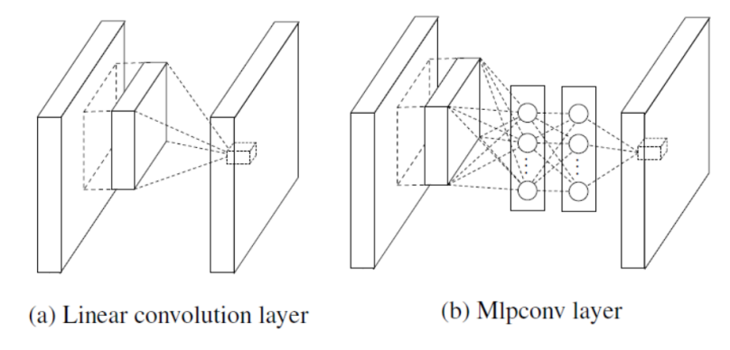
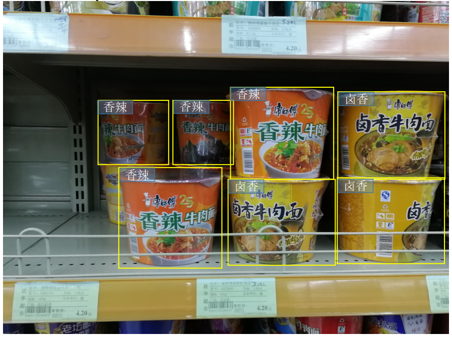

# Machine Learning Assignments

Learn the relative content of Machine Learning.

## 1. Machine Learning Assignment

### 1.1 first assignment

#### 1.1.1 implement AdaBoost

1. completed is 20211022.
2. the choose error rate function is very important, because it direct decides how choose weak classifier. pay a attention, this code doesn't implement adaboost according to original design. but modify loop stop condition that error rate >=0.5. change the stop condition to global minimum error rate. maybe is wrong.

#### 1.1.2. mathematics

1. problem is :

(Mathematics) There are n-dimensional data points and we can stack them into a data matrix: $X={x_i}_{i=1}^n, x_i\in R^{p\times 1}, X\in R^{p\times n}$.

The convariance matrix of $X$ is $C=\frac{1}{n-1}\sum\limits_{i=1}^{n}(x_i-\mu)(x_i-\mu)^T$, where$\mu=\frac{1}{n}\sum\limits_{i=1}^{n}x_i$(actually, it is the mean of the data points).

Based on discussions in our lecture, we know that if $\alpha_1$ is the eigen-vector associated with the largest eigen-value of $C$, the data projections along $\alpha_1$ will have the largest variance.

Now let's consider such an orientation $\alpha_2$. it is orthogonal to $\alpha_1$, the variance of data projections to $\alpha_2$ is the largest one.

Please prove that: $\alpha_2$ actually is the eigen-vector of $C$ associated to $C$'s second largest eigen-value. (We can assume that $\alpha_2$ is a unit vector.)

### 2.1 Second Assignment

#### 2.1.1 mathsmetics

1. In our lecture, we mentioned that for logistic regression, the cost function is :
$$J(\theta)=-\sum \limits_{i=1}^{m} y_i log(h_{\theta}(x_i))+(1-y_i)log(1-h_{\theta}(x_i))$$
Please verify that the gradient of this cost function is:
$$\nabla_{\theta} J(\theta)=\sum \limits_{i=1}^{m}x_i(h_{\theta}(x_i)-y_i)$$

2. In our lectures, we mentioned that matrices that can represent isometries can from a group. Specifically, in 3D space, the set comprising matrices ${M_i}$ is actually a group,  
where,  
$M_i = \begin{bmatrix}
&\boldsymbol{R}_i & \boldsymbol{t}_i \\
&\boldsymbol{0} &\boldsymbol{1}
\end{bmatrix}\in \mathbb{R}, \boldsymbol{R}_i \in \mathbb{R^{3\times 3}}(det(\boldsymbol{R}_i)=1)$ is an orthonormal matrix and $\boldsymbol{t}_i \in \mathbb{R^{3\times 1}}$ is a vector.  
Please prove that the set ${\boldsymbol{M}_i}$ forms a group.  
Hint: You need to prove that $\boldsymbol{M}_i$ satisfies the four properties of a group, i.e., the closure, the associativity, the existence of identity element, and the existence of inverse element for each group element.

### 2.2 Design

1. In our lecture, we mentioned NIN architecture which introduces a "mlpconv" concept. The mlpconv layer maps the input local patch to the output feature vector with a multilayer perceptron(MLP) consisting of multiple fully connected layers with nonlinear activation functions. The following figure compares the linear convolution layer with the MLPconv layer. For more details, you can refer to the paper "M. Liu et al., Network in network, in Proc. ICLR 2014".  
  
Actually, mlpconv can be implemented with convertional convolution layers. So, please spectify the network design to implement the following particular mlpconv layer.  
For a mlpconv layer, suppose that the input feature map is of the size $m \times m \times 32$, the expected output feature map is of the size $m \times m \times 64$, the receptive field is $5 \times 5$; the mlpconv layer has 2 hidden layers, whose node numbers are 16 and 32, respectively.  
How to implement this mlpconv layer with convolutional layers?

### 2.3 Programming

In intelligent retial, one task is to investigate the proportion of each commodity occupying shelves. In the assignment, suppose that you are provided a  surveillance video of a shelf and you need to recognize and locate three specific kind of products, "统一香辣牛肉面","统一老坛酸菜面",and "康师傅香辣牛肉面" in real time. You are recommended to use YoloVX (an object dectection approach) for this task.  
The interface may be similar like this,  
  
The test video is given on the course website. Please show your result to TA.
(Markdown does not support embedded video, so the test video path is :videos/SecondAssignment_2.3_TestVideo.mp4)  

## 3. Translation

add translation section.
|number|title of paper|internet source|local source|correlative field|illustration|
|---|---|---|---|---|---|
|1|neural collaborative filtering|<http://staff.ustc.edu.cn/~hexn/papers/www17-ncf.pdf>|./references/1NeuralCollaborativeFiltering.pdf|recommonder system|English translate into chinese|
|2||||||

## 4. mathematics

you must need to learn knowledge is follows:

1. least square method,
2. Lagrange multiplier method,
3. Taylor formula,
4. Matrix.

## 4. learning book/video

add learning section.
|number|book name|auther|correlative field|illustration|whether or not start|had learned chapter|isCompleted|
|---|---|---|---|---|---|---|---|
|1|机器学习|周志华|machine learning|/|y|2|n|
|2|李宏毅的视频|李宏毅|machine learning|/|n|/|n|
|3|吴恩达的100讲|吴恩达|machine learning|/|y|1|n|
|4|统计学习方法|李航|machine learning and mathematics|/|n|/|n|
|5|线性代数|3Blue1Brown|mathematics|[link](https://space.bilibili.com/88461692/?spm_id_from=333.999.0.0)|y|07|n|
|6|读英文论文和动手deep learning|跟李沐学AI|deep learning|[link](https://space.bilibili.com/1567748478/?spm_id_from=333.999.0.0)|y|[动手深度学习v2]07、[论文精读]ResNet论文逐段精读|n|
|7|Methods for nonlinear least squares|K. Madsen|machine learning|/|y|/|n|
|8|老师的SVD课件|teacher|machine learning|/|y|/|n|
