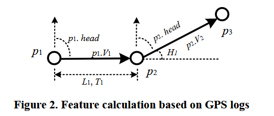

# Understanding Mobility Based on GPS Data

基于GPS数据理解移动性

最重要的是找到了公开的连续移动数据集。

## 摘要

|编号|英语|词性|本文中翻译的中文|理解|
|---|---|---|---|---|
||ubiquitous|adj|无处不在的;似乎无所不在的;十分普遍的||
||critical|adj|批评的;关键的;批判性的;挑剔的;极重要的;至关紧要的;严重的;||
||pervasive|adj|普遍的;遍布的;充斥各处的;弥漫的||
||informative|adj|提供有用信息的;给予知识的||
||enrich|v|充实;使丰富;使饱含(某物);使富有;使富裕||
||sophisticated|adj|复杂的;精密的;先进的;老练的;见多识广的;见过世面的;||
||robust|n|鲁棒性||
||post-processing||后处理||

在计算机系统中认知人类的行为和理解一个用户的移动性是一个有挑战性的问题。作为一种用户行为，用户所采取的出行方式，如步行、驾驶等，可以通过信息性知识丰富用户的移动性，为普适计算系统提供更多的上下文信息。在本文中，我们提出了通过GPS日志的一种基于监督学习来推断用户运动模式的方法。本论文的贡献主要有两个方面：一方面，我们定义了一组精妙的特征，这些特征对交通状况的鲁棒性比其他研究人员使用过的更高。另一方面，我们提出了一种基于图的post-processing算法来进一步提高推断的性能。这个算法以概率的方式考虑了真实世界的常识约束和在地点上的典型用户行为。使用在10个月中65个人的GPS日志，我们通过一组实验来评估我们的方法。因此，在基于变化点的分割方法和基于决策树的推理模型上，新特征使推理精度比以前的结果提高了8%，基于图的后处理进一步提高了4%。

关键词：
GPS、GeoLife、机器学习、人类行为认知、推断交通模式。

ACM分类关键词：
设计方法、分类设计和评估。

|编号|英语|词性|本文中翻译的中文|理解|
|---|---|---|---|---|
||methodology||||
||coarse||||
||stationary||||
||individual||||
||unspoken||||
||autonomously||||
||absorb||||
||||||
||||||

## 简介

在一般的计算中通过传感器数据来理解用户的移动性是一个重要的议题。一种重要的人类行为：人的交通模式，比如步行、驾车和坐公交等，能够赋予其移动性更大的含义，并且为通用计算机系统提供丰富的上下文信息。

在过去的几十年中，粗粒度和细粒度的传感器数据都能够被用于实现位置驱动的活动推断（location-driven activity inference）。一方面，一种相关工作是通过收集可穿戴设备的数据来识别个体活动。尽管识别性能是相对高的，人类努力携带更多的传感器依然是公开的挑战。另一方面，在不增加携带传感器的额外开销的情况下，一些研究人员[5][11]旨在根据粗粒度传感器数据推断个人的运动，比如，Wi-Fi或者GSM的无线信号。**很遗憾，数据的质量并不足够精确，在这些技术中，只有像移动和静止这样的简单运动才能被区分**。

在最近几年，在人的日常生活中，GPS手机和具备GPS功能的PDA成为流行。通过这些设备人脑能够比之前使用基于位置的APP更好的捕捉他们在户外的移动性。因此，有不少项目[6][7][8][10]是通过GPS数据去理解个体户外行为。然而，这些项目的关注点主要是在探测用户的重要位置，在这些位置中预测用户的行为，识别用户在每个位置用户的具体活动。但是，位置只是个体活动的一个部分。理想情况下，我们不仅要预测类似人在移动目的地的点位置的活动，还需要推断用户的行为，比如，在通往这些点位置的路上的交通模式。这种高层次的行为既可以创建新的计算服务，比如自动响应个人的潜在需求，并且支持关于未来行为的更高精确的的预测。

另一个由GPS驱动的普通计算方向是GPS轨迹共享应用。在这类计算服务中[1]，人们会使用具备GPS功能的设备来记录他们旅程中的轨迹，并且在互联网社区中通过GPS路线来分享他们的生活经验。此时，基于交通模式对人们的GPS轨迹进行分类是一个严峻的挑战。通过对每个GPS路线的交通模式的理解，用户能够从其他人的旅行经验中获取丰富的知识。他们不仅能够知道其他人去过哪里还能知道如何抵达这些位置。而且，系统将更有能力区分每个GPS轨迹能力的交通模式。举例而言，系统会给一个打算乘坐巴士的用户推荐一个公交线路，而不会给他推荐一个驾驶线路。

**到这里说明本文设置的目标是：通过GPS轨迹来判断用户的交通方式**。

|编号|英语|词性|本文中翻译的中文|理解|
|---|---|---|---|---|
||handle|n/v|手柄，柄/处理，应付，操纵||
||obtrusive||||
||mentioned above||上述的||

很遗憾，到目前为止，**上文提到的分类任务仍然依赖用户手动标签**。对普遍的计算系统而言，这不是最优的发展方向（这里视乎认为监督学习不适用于这种分类任务，同时认为打标签的动作的成本是非常高的）。而且，基于一个简单规则的分辨方法，比如，基于速度的方法不能够有效处理这个问题，原因如下：**1. 在一段旅行中人们通常会改变他们的交通模式，比如一段GPS轨迹可能包含大于等于两种模式。2. 不同交通模式的速度会受到环境和天气的影响**。基于直觉的，在拥堵的情况下，驾车的速度会比骑行更慢。

在本文中，我们的目标是在监督学习的基础上，对原始的GPS日志数据推断它的交通模式，这几种交通模式包括：驾车、步行、坐巴士和骑自行车。对于一般计算技术认知人类行为和理解用户移动性迈出的一步。同时，这项工作是论文[12]进一步研究。本文贡献列举如下：

1. 我们定义了一组有价值的特征，这些特征使得我们对交通状况的认识有了更好的鲁棒性，并且有助于提高推断的准确度。

2. 我们提出了一种使用概率线索（probabilistic cue）基于图的post-processing方法来进一步提高推理的性能。在这个方法中，我们使用一个基于密度的聚类算法将多个用户的改变点（change points）分组为节点（nodes），并且在用户生成的GPS轨迹的基础上为不同的簇（clusters）之间建立边。然后，可以通过用户的GPS日志中提取在每个边上是不同交通模式的概率分布（这里有一点不明确的是：是不是多个交通模型的概率组成一个向量作为边的属性），以及连续边之间的转移概率（transition）。这些知识同时包含了现实世界的常识约束和基于位置的典型用户行为，因此有希望提高推断的准确率。

本文的其余部分组织如下。首先，我们对相关工作进行了调查。其次，我们介绍了如何从GPS日志推断交通模式。在这里，我们首先概述了我们的方法框架，然后详细描述了该方法的每个步骤。第三，报告了实验设计和相应的结果。最后，得出结论，并对今后的工作进行展望。

## 相关工作
基于多个传感器的解决方案。在论文[4]和[9]中，Parkka等的目标是识别人类活动，比如对于一个人身上的20种可穿戴设备走路和跑动来收集数据。一个用户的身体状况，比如体温、心率和GPS位置等，同时也包括环境湿度和光强度都被用于一个分类模型的输入特征，这个分类模型用于区分用户每天的活动。然而，对于普通用户而言在日常生活中携带额外的传感器会显得奇怪并且复杂。一方面，上述技术和我们工作的主要区别在于：我们仅根据原始GPS数据了解人类活动。因此，它十分有希望部署在人们具备GPS数据的手机中从而不会增加它们穿戴设备的负担。另一方面，部分传感器已经能提供GPS功能，我们的方法有助于提高此类方法的识别性能。

基于coarse-granted传感器数据的解决方案：LOCADIO[5]使用一个隐藏马尔科夫链模型来推断一个使用802.11无线信号设备的活动，**而Timothy等人[11]试图基于GSM信号检测用户的移动性**。有无线电的信号的观测在很多情况下不尽相同，例如时间、空间和无线小区中的用户数等，因此可以从信号中提取的位置相当粗糙。因此，在论文[11]中只包含了对三种简单活动的推断，分别是静止、步行和驾车，并且LOCADIO只能区分两种基本的活动类型，静止和活动的。我们的方法与这项工作的本质区别不仅在于GPS传感器提供的数据具有更高的定位精度，还在于从GPS数据中挖掘空间信息以提高识别性能。鉴于GPS信号会在室内丢失，将上述技术与我们的技术相结合，有望实现更复杂的方法来识别用户活动。

GPS数据驱动挖掘：由于GPS被越来越广泛的使用，基于GPS数据活动的识别已经在过去的几年中受到了广泛关注。这些工作包括提取个人的重要位置[3][7][8]，预测一个人的移动[6][10]和建模一个用户的交通路线[8][10]。**Patterson等[10]使用GPS数据对一个用户的交通模型进行分了。比如“巴士”、“步行”或者“开车”，并且预测他们最可能的路线**。类似地，Liao等[8]的目标在给定个人的GPS数据的情况下，推断个体的交通线路。这些系统首先检测到一个用户的重要位置集合，然后在重要位置中识别类似于购物、吃饭等活动。与我们的方法相比，这项工作有以下几项限制：1. 它需要路网的信息，比如公交汽车站和停车场信息。2. 模型是从一个特定用户的GPS历史数据中学习的，这个模型只能为一个用户服务。因此，它不是一个能应用在广泛计算系统中使用的通用模型。然而，我们通过收集多个用户的原始GPS数据来挖掘知识，这些知识能对个人用户和公共用户的研究做出贡献。更重要的是，我们不需要从其他传感器的数据或者地图信息（例如公交站）来获取额外的信息。

## 推断交通模式

在这一节中，我们首先阐述了关于GPS数据的初步知识，然后对我们模型的框架做出一个概述，分别包含四个依次执行的步骤：分割、特征提取、推断和post-processing。在这里，我们简要的介绍了论文[12]中提出的分割和推断方法，重点描述了我们在特征识别和post-processing方面的工作。

## 预备工作

在介绍我们方法的框架之前，我们阐明以下术语：GPS轨迹、片段和改变点。基本地，如图1所示，一个GPS日志是一个GPS点序列$p_i \in P, \, P={p_1,p_2,\cdots,p_n}$。每个GPS点$p_i$包含经度、维度和时间戳。在在一个二维平面上，**我们可以将这些GPS点顺序的放到轨迹中，并且如果这些连续点的时间间隔超过某个阈值，则可以将轨迹划分为不同的行程（可以明显的感觉到，这篇论文的目的是关于行动中的情况，而且目前研究的对象是长时间停留点的地点的。而且结合本文之前提到的在室内获取不到GPS信号，也就意味着没有GPS数据的地方就是志愿者停留的地方）**。一个改变点定义为人改变他阿门交通模式的地方。举例而言，在图1的右边部分，当一个用户将交通模式从驾车转换为步行，那么就生成了一个改变点。

图2描绘了我们如何从GPS日志中计算特征。假设两个连续的GPS点，比如$p_1$和$p_2$，我们能计算得到空间距离$L_1$和时间间隔$T_1$和他们之间的航向（heading direction）（$p_1 head$）。基准方向是北方（这里理解航向就是和正北方的夹角角度）。
随后，可以通过等式(1)来计算$p_1$的速度。

$$p_1 \cdot V_1=\frac{L_1}{T_1} \tag{1}$$

然后，航向改变，如三个连续点$p_1, p_2 \,and\, p_3$的航向改变$H_1$可以使用等式(2)来进行计算。

$$H_1 = |p_1 \cdot head - p_2 \cdot head| \tag{2}$$

另外，比如加速度、速度的期望等都可以用上述类似的方法进行计算。

|编号|英语|词性|本文中翻译的中文|理解|
|---|---|---|---|---|
||burden||||
||coarse-granted||||
||coarse|adj|粗糙的;粗织的;粗的;大颗粒的;粗鲁无礼的，粗俗的(尤指涉及性的)|它和rough有什么区别？|
||differentiate|v|区分||
||essential||||
||Given the fact||鉴于事实||
||segmentation||||
||depict||||
||acceleration||||

## 我们方法的体系

如图3所示，我们方法的结构包含两个部分：离线学习和在线推断。在离线学习部分，一方面，我们首先基于改变点对GPS轨迹分割成了片段，并且从每个片段提取特征。然后，利用特征和相应的地面真实情况训练在线推理的分类模型。另一方面，使用一个基于密度的聚类算法，我们将多个用户的改变点分组为多个簇，并且在簇上建立一个图（使用的是用户生成的GPS轨迹）。从这些图我们能提取一些位置敏感的知识，比如，在不同边上不同交通模式的概率分布等。这些知识可以作为概率cue来提高post-processing中的推理性能。此外，为了提高计算效率，在检测到的空间知识的基础上建立空间索引。

在在线操作中，当有一个GPS轨迹产生，与离线训练处理类似，我们首先将它分割到片段中，并且提取从每个片段中提取相同的特征值（理解为相同字段的特征）。第二，在上述特征的基础上，生成推断模型将以概率的方式对每个片段的交通模式进行预测。第三，在片段中给定不同交通模式的概率的基础上，通过从训练数据中提取空间知识，并利用空间知识来提高推断的准确度。最后，最大后验概率（posterior probability）对应的交通模式作为最终的结果。

## 分割方法

在论文[12]中提出了使用基于改变点的分割方法，使用该方法我们将一个给定的GPS轨迹分割到多个片段中。这个方法来自于真实世界中的以下几个常识，它的效果已经在论文[12]中得到的验证。1. 通常人们必须停止然后才会改变他们的交通模式。2. 在两种不同的交通模式中，步行是过渡的方式。换而言之，步行片段的起始点和终点有非常高的概率是改变点（是2.中说法的另外一种表达方式）。所以，我们首先取出(retrieve)步行片段，并且通过步行片段将轨迹分割为多个部分。（上述假设有数据支撑吗？感觉与现实环境有点不符，骑自行车的起点和终点也有可能是改变点。这是不是意味着需要对交通模式进行更细致的划分。如果只对三种模式：步行、驾车和公交，那么这个假设大概率是成立的）。

如图4所示情况，我们简要的展示了分割算法的4个步骤。更多相关信息参考论文[12]的第4节。

步骤1：使用一个宽松的速度上限（$V_t$）和加速度上限（$a_t$）最大可能的将步行点和非步行点进行区分。
步骤2：如果由连续行走点或非行走点组成的段的长度小于阈值，则将该段合并到其后向段中。
步骤3：如果片段的长度超过确认阈值，那么这个片段将被视为一个确定片段。否则，它被认为是一个非确定片段。如果连续的非确定片段的数量超过一个确认阈值，这些非确认片段将被合并到一个非步行片段中。
步骤4：每个步行片段的起点和终点都被视为潜在的改变点来区分一段旅程。

## 推断模型

在我们之前的工作中[12]，研究了四种分类模型，包括支持向量机、决策树、贝叶斯网络和条件随机场（conditional random field, CRF）。基于改变点的分段，决策树模型胜过其他模型。最后，在本论文中我们仍然使用该推断模型（这里说的是决策树吗？）。

## 特征定义

在这一小节中，我们定义了3个特征，这些特征是从GPS日志中提取的。并且比我们以前使用的那些特征对交通状况更具鲁棒性。

## 航向改变速率（HCR）

如图5所示，一般而言航向受到道路的约束，无论遇到任何交通状况，人们在驾车或者乘坐巴士时很难灵活的改变航向，如果是步行或者骑行则可以非常容易的改变航向。此外，无论交通状况和天气如何，人们步行或骑自行车不可避免地会无意中绕道到达目的地，尽管他们试图创造一条笔直的路线。

换句话说，不同运输模式的前进方向在受真实路线约束的同时与交通条件无关，差异很大。因此，HCR建模这一原则被定义为等式3。

$$HCP = \frac{|P_c|}{Distance} \tag{3}$$

其中$P_c$表示GPS点的集合，在该集合中，用户改变其航向超过某个阈值（$Hc$），以及$|P_c|$表示除以后$P_c$中的元素数$|P_c|$根据段的距离，HCR可以被视为人们在单位距离内某种程度上改变方向的频率。

停止速率（stop rate, SR）:图6显示了人们采取不同交通方式时的典型速度情况。我们观察到，在相似的距离内，乘坐公共汽车的人停车的次数可能多于开车。从本质上讲，除了在十字路口的红绿灯处等车外，公共汽车还会在公共汽车站上下车。同时，由于许多原因，在路线上步行的人比其他模式更有可能在某处停下来，例如与路人交谈、被周围环境吸引、等待公共汽车等。这些观察结果促使我们定义两个特征来区分各种交通模式；一个是停止率（SR），另一个是速度变化率（VCR）。

SR表示在单位距离内速度在一个确定的阈值之中GPS点的数量。速度阈值为$V_s$，我们能获取一组速度小于$V_s$的GPS点（$P_s$）。然后，我们能通过等式4来计算它。

$$SR=\frac{P_s}{Distance} \tag{4}$$

其中$P_s = {p_i | p_i \in P , \, p_i \cdot V < V_s}$。如图6中所示，显然我们能看出$SR(Walk)>SR(Bus)>SR(Driving)$。

速度改变率（Velocity change rate, VCR）：我们从图6得到的另一个隐藏信息是利用VCR来对不同的交通模式进行分类。首先，我们可以按照等式（5）计算每个GPS点的$VRate$。然后，我们可以得到$VRate$大于某个阈值的GPS点数量的统计信息$V_r$ , 并根据等式（6）计算VCR。

$$
\begin{aligned}
    & p_1 \cdot VRate = \frac{|V_2 - V_1|}{V_1} \tag{5} \\
\end{aligned}
$$
$$
\begin{aligned}
    & VCR = \frac{|P_v|}{Distance} \tag{6}\\
\end{aligned}
$$

其中$P_v={p_i|p_i \in P, \,p_i\cdot VRate > V_r}$。因此，我们可以将VCR理解为单位距离内速度变化百分比高于某个阈值的GPS点的数量。这两个特征清楚地捕捉到了不同运输方式之间的差异，并得到了后续实验结果的支持。

## 空间知识提取

[图7说明了从用户的GPS日志中提取空间知识的四个步骤。知识包括基于变化点的图和图的每一条边上的概率分布。

首先，给定已经打标地面真实情况的GPS日志，我们可以得到的特殊点包括每个GPS轨迹的变化点和起点/终点。然后，使用基于密度的聚类算法将这些特殊点分组为多个节点（簇）。我们倾向于使用基于密度的聚类而不是agglomerative methods（如K-Means），原因在于两个方面。**一种是基于密度的方法，能够检测具有不规则结构的簇**，这些簇可能代表公交车站或停车场。另一个是，它可以帮助我们发现大多数人改变交通方式的热门地点，同时删除代表低访问频率地点的稀疏变化点。

其次，利用多个用户GPS日志中的GPS轨迹，我们可以构建一个无向图，其中节点是上述特殊点的簇，边缘是节点之间的传输。这里，为了简单起见，我们不区分具有相似起点/终点的不同轨迹，即，通过两个图节点的所有轨迹都被视为相似。

第三，我们在图上建立空间索引，以提高访问每个节点和边上信息的效率。

第四，我们可以计算每个边上不同交通方式的概率分布。例如，如图7的第四步所示，$P_{18}$（公交）表示人们在节点1和节点8之间边上乘坐公交的可能性。此外，还可以基于该图计算不同交通模式之间的条件概率。比如：$P_{185}$（Bus|Walk）表示边18和边85之间从步行到公交的转移概率。换句话说，它表示基于观察到的用户从节点1乘坐公交到节点8的情况下，用户从节点5步行到节点8事件的可能性。

由于以下原因，上述知识有望提高推理准确度。1. 它提示人们在不同地方之间的典型运动方式。变化点簇代表了许多人改变交通方式的地点。通常，这些地方可能是公交车站、停车场和火车站等。当我们推断通过这两个节点的其他轨迹时，我们可以将这些节点之间的用户行为作为概率cue。自然地，例如，如果大多数用户在两个节点之间乘坐公交车，我们可以得到这样的建议：两个节点可能是公交车站，它们之间的边可能有很高的概率是公交线路。2. 每条边上的概率意味着现实世界的约束。例如，公交汽车只在公交汽车站搭载乘客，汽车停在停车场，汽车和公交汽车只在街道上行驶，等等。

## 基于图的post-processing

基于图的post-processing算法将初步推理结果和上述空间知识作为输入，目的在于生成改进的预测结果。为了将该算法与文献[12]中的post-processing方法区别开来，我们将前一种算法称为正常后处理。基于图的后处理包括三个部分：正常post-processing、基于先验概率的增强和基于转移概率的增强。

post-processing的参考文献为：Postprocessing in Machine Learning and Data Mining

### post-processing的框架

图8显示了我们设计的基于图的post-processing流程图。当GPS轨迹的推断段出现时，我们首先搜索空间索引，以快速将其顶点与图节点匹配。如果找不到靠近顶点的图节点，则使用正常的post-processing算法来提高推理性能。否则，将使用基于先验概率的增强或基于转移概率的方法。如果作为一种交通给定特征X的段的最大后验概率超过某个阈值$T_1$，我们认为与最大概率对应的交通模式将是正确的推断。随后，我们可以利用该段使用基于转移概率的增强方法修改其相邻段。如果情况与上述假设相反，我们将进一步检查其最大概率是否小于另一阈值$T_2$。如果条件成立，则执行基于先验概率的增强方法。否则，使用正常的post-processing方法。当一个段包含基于先验概率和基于转移概率的增强方法正在处理的条件时，最好使用后者。最后，我们选择概率最大的交通方式作为每个路段的预测结果。

|编号|英语|词性|本文中翻译的中文|理解|
|---|---|---|---|---|
||commonsense||||
||stands for||表示，XX表示为XX||
||hint||||
||||||
||||||
||||||
||||||
||||||
||||||
||||||
||||||
||||||
||||||
||||||
||||||

|编号|英语|词性|本文中翻译的中文|理解|
|---|---|---|---|---|
||||||
||||||
||||||
||||||