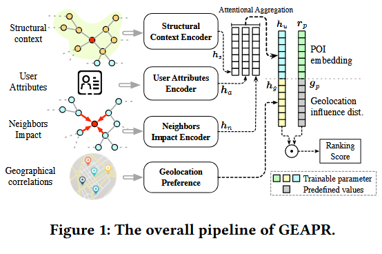
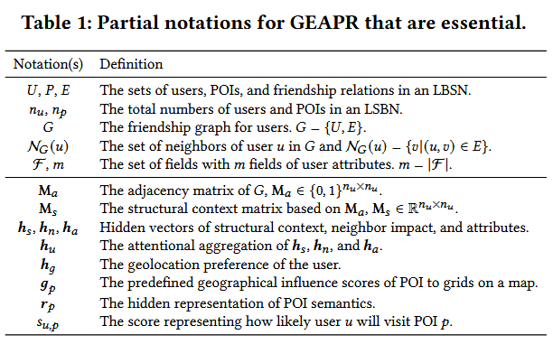

# You Are What and Where You Are:Graph Enhanced Attention Network for Explainable POI Recommendation

你是什么和你在哪里？对于可解释POI推荐的图增强注意力网络

## 概要

在基于位置的社交网络分析用户行为和上下文中的check-in信息中，POI推荐是一个新型的研究领域。对于这个问题，现有的方法中无论是浅层或者深层架构中，有两个主要的缺点。首先，这些方法中个体的属性被很大程度的忽略了。因此，不是不可能，而是很难收集足够的用户属性功能以完全覆盖可能的动机因素。第二，现有绝大多数模型是通过隐性表征而不是显性特征来表示用户或者POI信息。导致，通过不合理的参数来训练模型，从而提供少量有说服力的逻辑来解释：为什么用户喜欢或者不喜欢某个POI，并且是什么原因导致用户访问这个位置。为了克服以上这些缺点，我们提出了GEAPR，一个能以端到端的方式解释POI预测的POI推荐系统。具体的，GEAPR通过聚合不同的特征来学习用户表征，比如结构化内容、邻居影响、用户属性和地理位置影响。GEAPR利用一个三重注意机制来量化每个结果建议的不同因素的影响，并对模型的解释性进行彻底的分析。对现实世界数据集的广泛实验证明了该模型的有效性。**GEAPR被部署并在内部Web服务器上进行测试**。提出了一个示例界面，以展示其在可解释的POI推荐上的应用程序。

关键词

POI推荐；推荐系统；个性化；神经网络。

## 1. 简介

-- 以下使用百度翻译做的翻译，对不通顺的和不符合逻辑的地方进行修改。并且添加理解和备注。

兴趣点（POI）推荐是推荐系统家族中的一个关键组成部分。兴趣点是指在线商业目录或评论论坛的客户感兴趣的位置。此类目录或论坛通常被命名为基于位置的社交网络（LBSN），例如Yelp和Foursquare，因为用户以各种方式相互交互，例如共同评论、共同访问或通过友谊关系直接连接。

POI推荐涵盖了广泛的场景，其中广告项具有显著的空间属性，强烈影响用户决策。恰当的推荐POI回复，准确理解用户口味、POI属性、地理位置及其相关性。从简单到复杂，现有算法都经过精心定制，用于更精确的用户偏好建模、POI分析和用户POI相关性估计。换句话说，POI推荐系统的开发见证了多种数据模式的利用，以实现更令人满意的POI推荐。

尽管如此，我们指出了现有模型的两个普遍缺点：**（1）对POI访问的可解释动机分析不足，（2）缺乏对具有不同背景的用户的属性研究**。

首先，对于动机分析，现有方法的排序函数仅融合了多模态信息，而没有**明确量化或解释哪些模态相对而言比其他模态更重要，哪些相关性较低**（这个好像没有必要）。然而，定量理解check-in的关键原因是有价值的，因为它能够量化地解释用户选择下一个访问点的心态。例如，一些用户总是在朋友check-in或建议的地方check-in，而另一些用户则倾向于访问他们的同龄人喜欢的地方。这种数字动机重要性测量也可以合理地为以下讨论提供明确答案。Tobler的地理第一定律[36]经常被之前的工作[19、44、50]引用，它指出：“一切都与其他事物相关，但近处的事物比远处的事物更相关。”但GeoMF的作者却提出了相反的观点：**用户访问某个POI恰恰意味着她对附近的人冷漠，否则她首先会访问他们[25]**（没有理解这句话的含义）。通过数字动机分析，可以轻松捕获和解释用户check-in的主要原因，即动机，这也有助于LBSN解释其建议。相比之下，现有的方法适应性不足，无法以透明的方式了解不同的动机。相反，**它们只是使用未加权加法[31，52]或特征向量串联[43]来混合中间信息并产生建议**。这些操作很难揭示动机的重要性。这种差异需要一种有效的架构，精心开发，用于解释性动机分析，在不同的动机因素上具有明确的显著性分布。

其次，现有的POI推荐方法在很大程度上忽略了用户属性研究，然而，用户属性研究非常重要。关于基于item的推荐系统的大量文献，例如电影和书籍，**已经证明了用户配置文件、人口统计及其复杂的联合效应在提高推荐准确性方面的潜力**[2、11、13、23、34、41]。在POI建议的背景下，这种可能性也是合理的。例如，年轻人喜欢在不同的地方尝试不同的餐馆，而老年人可能会担心距离。然而，即使是最近基于深度学习的POI推荐模型[31、52、54、55、57]也低估了用户属性信息，尽管深度模型具有更好的融合不同信息模式并捕捉相应重要性的能力。因此，有必要纳入用户属性特征，以全面涵盖可能的动机因素。

为了解决上述两个问题，本文提出了一种用于解释POI推荐的图增强注意网络（GEAPR的缩写），该网络以自适应和可解释的方式推荐POI。GEAPR不仅利用地理和社会信息，还利用用户的个人属性，同时提供建议的端到端理由。具体来说，我们将可能的激励原因分解为四个因素：

为了解决上述两个问题，本文提出了一种用于可解释性POI推荐的图增强注意网络（GEAPR的缩写），该网络以自适应和可解释的方式推荐POI。GEAPR不仅利用地理和社会信息，还利用用户的个人属性，同时提供建议的端到端理由。具体来说，我们将可能的激励原因分解为四个因素：

结构化上下文structural context。check-in可以由社交网络中结构接近度较高的相邻用户发起，因为他们具有相似的社交环境。这种类型的刺激（stimulu）通常被忽略，因为它是潜在的和隐含的。**我们论证并用实验证明，社会结构背景是访问的关键原因**。

邻居影响Neighbor Impact。来自直接邻居（即朋友）的影响是另一个影响兴趣的因素，因为人们可能会信任朋友的建议和他们的朋友以前做过的check-in。以前的工作通过基于MF的方法来描述邻居影响，这些方法无法同时生成可解释性。

用户属性User Attributes。由于用户的年龄、宗教、收入水平等特征，check-in行为也可能是自发的。例如，年轻用户可以选择在没有朋友等外部刺激的情况下，在其他年轻人喜欢的POI check-in。GEAPR推荐以一种新的方式理解check-in行为和属性之间的潜在相关性。基于因式分解机的模型致力于从属性数据中学习。因此，GEAPR利用配备注意机制的因式分解机来学习属性特征。

地理位置影响Geolocation Influence。地理位置对POI推荐有着特别强烈的影响，因为人们对自己身边的餐馆、超市或博物馆等了解的更清楚一些，这是很直观的。在GEAPR中，我们**固定了由曼哈顿距离Manhattan distance参数化的POI影响分布**，并了解用户对每个地理单元的偏好。

总之，GEAPR利用注意力机制来量化每个结果推荐的不同因素的影响，并对模型的可解释性进行彻底分析。一些文献[15]指出，**注意力缺乏作为解释的稳健性**。我们承认这一说法，但认为**可解释性揭示了模型从训练数据的复杂统计数据中捕获的因素的显著性**。此外，据我们所知，生成一个完全人可读（human-readable）的解释作为排名分数的副产品（by-product）在技术上尚不可行，因为即使是用户自己也无法明确地说出激发访问POI的确切原因（确切原因绝大多数情况下应该是明确地，但是每个原因本身可能是随机或者是确切的，并且它们一定是具有周期性的。另外，最重要的是捕捉用户动机的改变是最难的）。

地理位置特征编码与仅关注用户个人动机的其他三个因素解耦。主要的理由是兼容性：虽然GEAPR应用于POI推荐，但只需分离地理定位模块，就可以轻松地将其移植到与地理位置无关的推荐场景中。示例包括电影推荐[53]、问题路由[24]和新朋友推荐等。我们总结了主要贡献：

- 我们提出GEAPR，一种能够以端到端方式解释POI预测的POI推荐器。它特别关注四个因素，即结构上下文、邻居影响、用户属性和地理位置影响，并通过数值量化其影响，作为特征显著性指标。

- GEAPR中考虑了用户属性。据我们所知，这是第一项将属性纳入POI推荐的工作注意力机制通过寻找与其他特征相比对POI推荐更具影响力的重要因素来解决建议的可解释性问题。

- 在Yelp的两个真实数据集上进行了大量实验。实验结果证明了该模型的有效性。GEAPR已在内部web服务器1上部署和测试。测试结果证明了GEAPR的有效性。

## 2. 相关工作

### 2.1 POI推荐

POI推荐是一项热门任务，因为它直接影响POI平台的收入和声誉。关于这一主题的研究成果丰硕[4-6、12、16、18-22、25、27-31、33、35、39、40、43-52、54-57]。我们将其分为传统的POI模型和基于深度学习的POI模型，并通过示例讨论其优缺点。

传统模式。USG[44]是一种基于协同过滤的POI推荐模型。这表明，不仅社会关系，而且地理影响都有助于提高POI推荐的准确性。因此，USG特别关注三个互补因素：用户对POI的偏好、社会影响和地理影响。GeoSoCa[50]深入研究了POI的性质，即考虑了POI的类别。作者认为，类别是关键信息，它影响用户偏好，因为人们对不同类型的POI有不同的偏好。因此，GeoSoCa首先采用**偏差测量来建立个性化的POI流行度**。ASMF和ARMF[19]分别指基于增强均方误差（augmented square error）的MF和基于增强排序误差（augmented ranking error）的MF。尽管误差函数的选择略有不同，但它们都从三个维度关注用户关系，这三个维度通常被定义为“友谊”，即社交朋友、位置朋友和邻居朋友。对用户友谊的强调有力地表明，用户的偏好可以通过人际关系大大改变，并从中有效地学习。

基于深度学习的模型。PACE[43]利用了一种多任务学习架构，该架构同时对用户上下文、POI上下文和用户POI交互进行建模。从技术上讲，它为每个用户和POI分配一个可学习的嵌入向量来捕捉其潜在特征，并使用基于前馈层的深度网络来预测“用户上下文”、“POI上下文”和check-in。SAE-NAD[31]由用于用户POI交互建模的自注意力编码器（SAE）和用于地理上下文建模的邻居感知解码器（NAD）组成。SAE通过自我注意力在多个方面区分用户偏好程度。NAD确保在POI建议中，只有物理上和优先选择附近用户的check-in才能获得更强的权重。APOIR[55]标志着生成对抗网络（GAN）[10]在POI建议中的首次应用。mini-max游戏的共同训练双方是旨在建议最可能的POI check-in的推荐者和将推荐的POI与真实访问区分开来的鉴别器。

与GEAPR的比较。前面提到的所有方法都仔细考虑了用户偏好挖掘和POI分析的类别和地理位置。然而，我们注意到两个主要缺点，值得改进。首先，尽管因子分解机（FM）[34]等推荐模型已经证明了用户属性在提高准确性方面的有用性，但**个人属性长期以来一直被忽视**。现有算法在用户偏好和地理位置建模方面有精细的设计[31，54]，但缺乏用户的潜在属性学习。其次，所有以前的模型，无论是基于深度学习的还是基于MF的，都通过潜在表示来保留用户或POI的信息，而**不明确强调显性因素或信号**。不同的信息源通过简单的操作进行集成，例如加法、级联或多层感知器（MLP）。因此，具有不合理参数的训练模型无法解释用户为什么喜欢或不喜欢某些POI以及真正导致访问的原因。然而，GEAPR能够解决这两个问题，如第3节和第4节所示。

序列POI推荐。**序列或连续**的POI推荐（SPR）模型[16、35、39、48、52、57]是基于位置的推荐与GEAPR等一般POI建议的一个单独分支。它们本质上是不同的使用场景。**一般模型强调一般用户和POI特征的建模，而SPR模型侧重于时间敏感的check-in推荐和时态POI访问行为挖掘**。

### 2.2 注意力机制

注意力机制学习功能，该功能为模型流程（pipeline）中的中间特征生成权重，并处理将被填充到其他内部模块的信息。神经机器翻译的研究人员首先关注源语言和目标语言之间的更好对齐[1]。由于能够识别重要特征和特征交互，注意力机制成为解释机器学习模型“思维”的可靠方式[9]。因此，注意力被视为各种研究场景中“可解释性”的解决方案，包括推荐系统[23、41、47]、图表示学习[38]、计算机视觉[42]等。自然语言处理的最新进展强化了注意力也有利于性能增强的观点[7、8、37]。

## 3. GEAPR模型

### 3.1 总览

|符号|定义|
|---|---|
|$U,P,E$|用户数据集，POI数据，在一个LBSN中的朋友关系。|
|$n_u,n_p$|在一个LSBN中的用户总数和POI点总数。|
|$G$|用户的朋友图$G-\{U,E\}$|
|$\mathcal{N}_G(u)$|在$G$中的用户$u$的邻居集$\mathcal{N}_G(u)-\{v\|(u,v)\in E\}$|
|$\mathcal{F},m$|具有用户属性的$m$字段的字段集。$m - |\mathcal{F}|$|
|$M_a$|$G$的邻接矩阵，$M_a\in \{0,1\}^{n_u \times n_u}$。|
|$M_s$|基于$M_a$上的结构上下文矩阵，$M_s\in \mathbb{R}^{n_u \times n_u}$|
|$h_s,h_n,h_a$|结构上下文、邻居影响和属性的隐性向量。|
|$h_u$|$h_s,h_n,h_a$的注意力聚合。|
|$h_g$|用户的地理位置偏好。|
|$g_p$|在一个地图上，将POI网格化之后预定义的地理影响评分。|
|$r_p$|POI语义的隐性表征。|
|$s_{u,p}$|用户$u$将访问POI位置$p$的可能性，使用评分表征。|

GEAPR的架构如图1所示。表1总结了一些重要的符号。GEAPR的输入包括邻接矩阵$M_a$在LBSN的朋友关系图中，结构上下文$M_s$, 用户的属性F和POI影响分数。

GEAPR使用三种不同的架构，针对用户动机方面的三个因素进行定制。具体来说，使用基于密集神经网络的结构上下文编码器来学习结构上下文，使用基于图神经网络的注意朋友关系编码器来建模邻居影响，并使用基于注意的潜在因子分解机来保存属性交互。

这三个子模块将分别生成三个隐藏特征表示，如下所示：$h_s,h_n,h_a$. 然后，通过注意力聚合[23]策略合并来自三个来源的信息，该**策略能够揭示它们之间的相对显著性。然后将合并的动机表示与地理位置特征结合作为约束，以便从推荐中删除强相关但距离较远的POI**。然后，GEAPR采用图形增强用户嵌入和POI嵌入的点积来生成标量分数$s_{u,p}$表示在未来用户$u$访问POI$p$的可能性。

为了在进行准确推荐的同时保持可靠的可解释性，GEAPR的构建模块侧重于基于注意力的算法。**虽然文献认为注意力缺乏提供符合人类感知的“解释”的潜力，但它仍然揭示了显著性的分布，可以将其视为一种解释形式**。此外，值得注意的是，与通常定义并易于访问的基本事实的任务不同，LBSN或公共数据集中无法对可解释的POI建议进行正式解释，作为基本事实。因此，测量生成的解释的“正确性”是不可行的。

### 3.2 结构化上下文特征

结构上下文试图对某个用户附近的邻居的共性进行建模。直观地说，用户角色和偏好的接近性可以通过几次社交联系传播，从而在网络中形成派系。为了从网络结构中捕捉社会背景，GEAPR利用了重新启动随机行走（Random Walk with Restart, RWR），这是一种广泛用于学习社区邻近性的流行方法[32]。基于用户的RWR表示来学习用户的结构上下文特征。

$\cdots \,\cdots$

### 3.3 邻居影响特征

第二个潜在促进访问的因素是直接的朋友，因为人们可能会自然而然地check-in朋友建议的POI。由于可能自然会检查朋友建议的毒药。因此，我们关注对用户$u$的邻居$\mathcal{N}_G(u)$的影响的理解。图注意力网络（GAT）[38]提供了一种有效的方法来聚集来自直接邻居的信息，并计算注意力以精确定位重要邻居。因此，我们使用基于注意力的图神经网络对邻域影响进行编码。给定用户$u$以及$u$的朋友, $\mathcal{N}_G(u)$, 隐藏的邻居特征$h_n$是

$$h_n = \sigma(\sum \limits_{j \in \mathcal{N}_G(u)} \alpha_{uj} \boldsymbol{W}_n v_j)$$

$\cdots \,\cdots$

### 3.4 属性交互特征

## 论文总结

1. 注意力缺乏作为解释的稳健性。我们承认这一说法，但认为可解释性揭示了模型从训练数据的复杂统计数据中捕获的因素的显著性。
   1. 也就是提取了最需要关注的特征，或者特征的某个部分。
   2. 如何可视化的显示这些特征？
2. 按照本文中的描述：“序列POI推荐。**序列或连续**的POI推荐（SPR）模型[16、35、39、48、52、57]是基于位置的推荐与GEAPR等一般POI建议的一个单独分支。它们本质上是不同的使用场景。**一般模型强调一般用户和POI特征的建模，而SPR模型侧重于时间敏感的check-in推荐和时态POI访问行为挖掘**。”
3. GEAPR对用户不同的动机使用了3种不同的结构。

## 问题

1. 曼哈顿距离Manhattan distance。
2. 几个模型都涉及到对邻居影响的建模。
3. 邻居影响是否真的会影响最终的结果？似乎底层逻辑是居住在相同区域的人有相同的经济实力，真正的决定因素是他们的收入通过地价来体现了。

|编号|英语|词性|本文中翻译的中文|理解|
|---|---|---|---|---|
||persuasive|adj|有说服力的，能使人信服的||
||rationale|n|根本原因，逻辑依据||
||||||
||||||
||||||
||||||
||||||
||||||
||||||
||||||