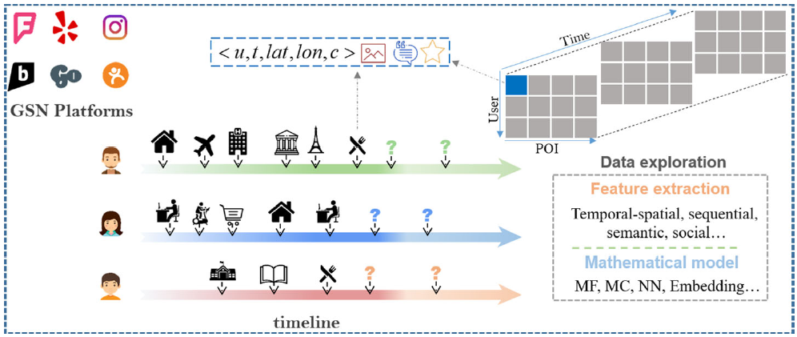

# translate翻译

1. 题目：Survey on user location prediction based on geo-social networking data
基于定理社交网络数据对用户位置预测研究综述
Survey on 表示的是“综述”的意思。
2. 大部分的通过百度翻译完成。

|number|title of paper|internet source|local source|correlative field|illustration|
|---|---|---|---|---|---|
|1|Survey on user location prediction based on geo-social networking data|<https://doi.org/10.1007/s11280-019-00777-8>|/|location prediction|English translate into chinese|

## 需要做的事情

|编号|内容|是否完成|
|---|---|---|
|1|主要数据集下载|是|
|2|下载数据集：尹等人[109]、杨等人[103]和高等人[21]因其高质量的四方数据集而广为认可|否|
|3|对Yelp和Foursquare数据集进行预处理|否|
|4|论文复现：Xie等人[98,99]将基于图的嵌入方法应用于用户下一个位置预测。它们在低维潜在空间中联合编码时间循环效应、地理影响、顺序关系以及语义信息，以统一的方式有效地解决数据稀疏性、冷启动和上下文感知问题|否|
|5|论文复现：Liu等人[52]使用相同的数据集同时对12个经典模型进行了经验评估|否|
|6|论文复现：a等人[55]和Manotumruksa等人[62]进行了广泛的实验，以验证他们提出的嵌入方法的性能，并将其与基于排名的方法以及其他经典方法进行比较|否|
|7|论文复现：考虑到与异构GSNs图相关的固有节点属性，图卷积网络（GCN）作为一种有效的图结构数据学习框架，也可用于描述潜在空间中的用户和位置表示。结合上述新兴技术，注意机制可以非常有效地改进项目推荐的节点嵌入[56,95,97]，这对用户位置预测有很大的启示|否|
|8|论文复现：杨等人[105]考虑了在用户check-in行为的生成中的四个因素，包括用户访问偏好、社会影响、短期顺序上下文和长期顺序上下文。前两个因素由DeepWalk[75]建模，这本质上是一种非线性特征融合方式。后两个连续上下文分别由RNN和GRU捕获，这也是非线性方式。基本上，各种上下文因素的非线性操作在用户位置预测任务中提供了令人鼓舞的性能|否|

## 重点语句

1. 典型的GSN从上到下可分为四层，即社会关系层、物理空间层、时间层和用户数据层，其中社会关系层包含用户之间的在线关系（如跟踪、转发、回复等），物理空间层包含我们物理世界中的所有场馆或兴趣点（POI）1，时间层涉及相应用户活动发生的具体时间，用户数据层涵盖各种用户生成的数据，如文本评论、图像和数字评级。注意，所有类型的此类用户生成的数据都可以与地理标记（例如POI坐标或POI标识符）相关联。
2. 位置推荐是为给定用户推荐一个他/她感兴趣但从未访问过的空间项目列表。
   1. 实际上推荐的是用户可能感兴趣的点。并不是在预测可能的移动位置。
3. 数据的形式是：当使用地理社交网络平台（如Foursquare和Yelp）提供的服务时，用户将生成地理位置的内容，其中每个动作都记录为$<u, l, lat, lon, c>$，表示用户u在时间t访问位置l（由纬度和经度以及类别c标识）。如果提供，还有与此记录相关的图像、文本审查和数字评级。每个用户的历史活动实际上是按时间升序排列的一系列check-in记录，所有用户的活动以$|Users|\times |POIs| \times |Time slots|$的形式构成整个数据集，其中每个元素也对应于上面的操作记录。
4. 给定数据集，可以提取由时空、顺序或社会特征驱动的用户移动模式，然后利用**矩阵分解（MF）或马尔可夫链（MC）等数学工具来拟合数据**。基于所学习的模型，可以预测用户的下次访问位置以及他/她的未来任何时间的访问位置。必要时，我们将在相应章节中使用此示例进行进一步解释。
5. 本文从问题类别、数据来源、特征提取、数学模型和评价指标五个方面进行了阐述。
6. 首先，从预测的时效性的角度而言，我们将这个问题分为两类：下一个用户位置预测问题和任何时间的用户位置预测问题。第二是从预测的粒度而言，我们同样分为两类：粗粒度用户位置预测问题和细粒度用户位置预测问题。下面将对用户位置预测问题的类别进行详细说明。
7. 在GSNs中生成的用户历史check-in数据中隐藏着很强的时间周期性和空间规律性。类似地，在[37、42、44]中，以地理影响或聚集效应为典型特征的空间规律性被广泛用于下一个位置预测。除了时空规律性外，由于GSN用户可能会受到具有相似社会背景（或兴趣和社会地位）的人群的明示或暗示影响，因此也对社会整合（通常称为社会关系）进行了深入研究[5,6,18]。GSN中的帖子是推断用户对不同类型场馆偏好的最有用的信息来源之一。通过常见的社交媒体帖子，特别是带有地理标记的帖子，我们可以描述用户对POI的感受，从而确定他/她对下次访问的偏好。利用这些语义帖子描述用户偏好是用户下一个位置预测的有效方法
8. 但是大多数现有的方法在下一个位置预测中都不适用于任何时间预测场景。
9. 2.1.2需要着重关注。时间索引方案，将时间戳平滑地编码到特定的时间ID中。当给出其中一些方面时，可以利用时间因素和用户兴趣（如文字）作为额外证据，更好地理解用户的意图，然后可以推断出他们在给定时间的访问位置。
10. 它将所有POI分为10类，即“艺术与娱乐”、“学院与大学”、“活动”、“食品”、“夜生活场所”、“户外与娱乐”、“专业与其他场所”、“住宅”、“商店与服务”和“旅游与交通”
11. 这几篇先看看--**而基于小时水平的研究[5,6,98]则被归类为细粒度位置预测**。
12. GSN数据最典型的特征是时空属性。
13. GSN数据的另一个显著特征是由隐式反馈引起的数据不平衡，这意味着我们没有针对用户位置偏好的显式反馈。
14. GSN数据可能是结构化、半结构化或非结构化的，因此，它实际上是异构的，具有稀疏性、空间分布不均匀性、时间间隔不等和层次不明显的特点。
15. 就目前的研究而言，他们主要使用公共API来抓取GSN数据。一些文献[4,107,114,135]介绍了如何使用Foursquare API抓取用户check-in。类似地，Cho等人[12]解释了基于Gowalla和Brightkite API的用户生成数据的获取。此外，研究中使用的一些数据源来自地理社交网站自行发布的数据。例如，Yelp7发布的大规模多模态数据集被广泛用于用户行为预测[60,111,122]。为了促进用户位置预测的研究，越来越多的研究者为社区发布了匿名的GSN数据集。在所有的出版物中，**尹等人[109]、杨等人[103]和高等人[21]因其高质量的四方数据集而广为认可**，这些数据集已广泛应用于位置预测和POI推荐研究。
16. 数据分类（1）地理位置登记数据；（2） 文本审查数据；（3） 图像数据；（4）数值评级数据。对于融合至少两种数据模式的数据源，我们将其称为多模态数据。
17. 地理位置的check-in数据是最典型的数据，因为它提供了有关“谁”、“何时”、“何地”和“什么”的详细信息[114,116]。基本上，check-in通常被定义为三元组（u,v,t），其中我们说用户u在时间t在地点v进行check-in。请注意，GSNs中的场所定义为唯一标识的特定场所（如音乐吧或咖啡馆）。场馆包含三个属性：标识符、地理坐标和语义信息。例如，东京（日本）的电影院可以表示为{4b558a35f964a520eae627e3, [35.673587359609904,139.76270735263824]，艺术与娱乐}，其中4b558a35f964a520eae627e3是标识符，[35.673587359609904,139.76270735263824]是剧院的地理坐标，“艺术与娱乐”属性表示场地的类别或类型。目前，相当一部分相关工作是使用这种地理位置的check-in数据进行的。
18. 文本信息在地理社交网络中无处不在。作为上述地理定位check-in数据的有效补充。
19. 结合位置和图像的现有研究大多将相关区域划分为网格，并预测图像所在的确切网格[49]，或将图像与地标或POI关联[38]
20. 这些将图像与POI关联的工作表明，图像与POI有很强的联系，可以用来描述POI的特性。到目前为止，考虑视觉特征的用户位置预测研究还很少。Wang等人在利用视觉内容增强用户位置预测方面做出了重大贡献[91]。他们采用概率矩阵分解方法，结合深度CNN模型提取的视觉特征，获得用户和POI的向量表示，然后通过向量点积计算用户POI偏好。
21. 从情绪分析的角度来看，较高的评分代表积极的情绪，这表明用户再次访问该场所的概率较高。相反，评分越低表示负面情绪，这意味着用户将来访问这里的可能性越小。
22. Manotumruksa等人[58]通过计算余弦相似性来估计给定用户在候选地点的入住概率。
23. 如果能够整合同一用户的多源数据，可以很好地缓解数据稀疏问题，同时获得更有效的信息。
24. 或缓解单一数据源中的噪音。
25. 充分的研究表明，人的流动性具有很强的时间周期性。
26. 时间周期性特征用混合高斯分布描述。在[20]中，Gao等人进一步扩展了他们以前的研究。基于观察到用户签入行为在一天中的每一小时都具有唯一性，并且每周循环一次，他们提出了一种使用低秩矩阵分解来融合这两种时间特征的预测模型。作为补充，Cao等人[6]分析了不同时间窗口下的预测性能。他们得出的结论是，一方面，最好的表现出现在早上7点到9点之间，因为人们往往有规律的活动，如乘坐公共交通工具，而最差的表现出现在清晨，因为不规则的活动；另一方面，预测精度在工作日保持稳定，但在周末急剧下降，这也是由于用户在周末的不确定活动造成的。Rahimi等人[78]发现，在场馆类型层面上，用户的定期入住行为更为明显。他们选择六个时间特征来训练M5决策树，以评估每个特征对用户下一个位置预测的影响。同样，Assam等人[1]从时间循环效应的角度提取多维特征，预测用户长时间后的访问位置，取得了令人印象深刻的效果。
27. 解决稀疏性的方法：
    1. 为了缓解数据稀疏问题，Li等人[41]将一天中的24小时分为五个时段，即清晨、上午、中午、下午和晚上，以使每个时段的签入次数更加密集，同时提高三阶张量（third-order tensor decomposition）分解的效率。Wang等人[89]采用了类似的方法，但只将时间分为两种模式，即工作日和假日。基本上，由于用户移动模式具有特定的时间规律性，这种特征已经成为用户位置预测的主流。
    2. Lian等人[42,44]将地理影响导致的空间聚类现象纳入加权矩阵分解模型，以处理数据稀疏性问题。
28. 地理第一定律[67]指出，一切事物都与其他事物相关，但近处的事物比远处的事物更相关。
29. 与餐厅相关的POI通常会被附近的用户访问，而与博物馆相关的POI通常会吸引远处的用户。
30. 人类移动中存在的这种顺序关系常常被用作用户位置预测的重要指标[26，105，126]。
31. 目前利用序列影响进行位置预测的研究主要分为两类。（1） 显式特征提取，通常通过直接利用统计过渡模式来实现。[11,69,70]中的研究人员利用顺序影响预测用户下次访问的位置，方法是仅根据每个用户自己的入住位置顺序学习个性化模型。然而，他们提出的方法要求用户拥有100多个check-in位置，以便从中学习顺序模式，这不适用于大多数用户，因为他们最多只有几十个check-in记录。类似地，Feng等人[16]和Zhang等人[120]将序列信息、个人偏好和地理影响集成到个性化排名度量嵌入模型中，以提高预测性能。（2） 隐式特征提取，通常通过将序列关系融合到递归神经网络（RNN）等序列数据建模方法中来实现。Liu等人[51]提出了一种基于RNN的神经网络解决方案，通过顺序方式对用户历史POI访问进行建模。它们在RNN模型的框架下，以循环的方式采用特定于时间的转移矩阵和特定于距离的转移矩阵。杨等人[105]考虑了两个因素，即短期顺序上下文和长期顺序上下文，以反映用户历史轨迹的顺序特征。为此，他们分别使用RNN和GRU模型来捕获用户轨迹中的顺序相关性。
32. 场馆的分类信息对于建模特定的用户偏好非常有用。
33. 文本信息可以分别提供关于用户和POI的补充知识，可用于增强对用户check-in行为的理解[124]。Manotumruksa等人[60]提出了一种新的基于矩阵分解的方法，该方法利用单词嵌入，从用户留下的评论文本内容中有效地建模用户偏好和场馆特征。
34. 集成语义信息可以有效地缓解数据稀疏性，并有助于提高预测性能。
35. 用户之间的社交链接也被广泛用于提高基于位置的服务的质量，因为社交朋友比陌生人更可能在场地上分享共同的兴趣[12、107、136、137]。
    1. 另一些文献[89,110,122]将用户相似性用作正则化项或权重。特别是，Wang等人[89]提出了一种基于社会的规则化技术，假设用户可能会受到他们的朋友的影响，他们对相似场地的评分相似。
    2. Manotumruksa等人[59]进一步将用户的文本评论纳入基于社会的正则化方法。
    3. 尽管社会关系和流动性之间存在着很强的相关性，但仅用友谊来预测流动性还是有局限性的。
36. 矩阵分解是用户位置预测领域的一种流行技术。用户位置预测中矩阵分解的基本目标是将用户位置矩阵分解为两个低秩矩阵，其中每个矩阵分别表示用户或位置的潜在因素。然后通过两个向量的内积来拟合用户对候选位置的偏好。充分的前期工作提出了基于矩阵分解的方法，利用用户的明确反馈（如评级）来模拟他们的偏好，从而有效地预测他们未来的访问位置。
    1. 基于矩阵分解的模型通常很难处理训练数据中的新用户或新位置，换句话说，它们在冷启动场景中不灵活[51]。
37. 由于GSNs中的用户历史轨迹具有明显的序列特征，而马尔可夫链在序列数据建模中具有天然的优势，因此基于马尔可夫链的方法已成为用户位置预测的常用方法
    1. 考虑到n阶马尔可夫链的复杂性随n呈指数增长，以及经验实验表明的一阶链的有效性，因此大多数文献假设下次访问的概率仅取决于当前访问的概率。
    2. 加性马尔可夫链添加先前访问位置的影响，预测用户下次访问位置。他们手动为以前的位置设置衰减率参数，前提是具有最近check-in时间戳的位置通常比具有旧时间戳的位置具有更强的影响。
38. 邻域模型广泛应用于协同过滤。它们可以自然地有效地用于时间和空间上下文的位置预测，并且通常具有可解释的优势。
    1. 邻域模型易于实现，基本上具有良好的可解释性。然而，邻域方法无法对用户顺序签入行为中的底层属性进行建模。
39. 统计学习模型通常将用户位置预测问题抽象为分类问题或回归问题，基于现有的机器学习方法，如logistic回归[12]、决策树[4,70]和随机森林[6]，可以很好地解决这一问题。特别是，Cao等人[6]将位置预测问题简化为二元分类任务，通过该任务，如果给定用户将在给定时间在候选位置报到，他们能够进行分类。由于随机森林模型本质上采用了非线性特征融合，Cao等人还验证了非线性融合多个特征的方法在分类任务中的性能优于线性方法。
    1. 但这些方法通常要求每个用户有足够的签入数据进行模型训练，这是不现实的，因为用户的签入记录通常非常稀少
40. 以分类方式（定性）处理这一问题的基于排名的模型也已成为主流数学模型。我们知道，地理社交网络数据确实是一种隐性反馈，在这种反馈中只能观察到积极样本（如check-in）。通过限制观察到的样本比未观察到的样本具有更大的等级，排名模型在经验上优于传统模型[112,117]。
    1. 作为一种开创性的基于排名的模型，贝叶斯个性化排名（BPR）[79]已被广泛用于生成用户感兴趣的项目的排名列表，方法是利用隐式反馈作为正反馈的实例，同时随机抽样其他项目作为负反馈的实例。Cheng等人[11]首先将传统的BPR模型应用于用户位置评级矩阵，以进行用户位置预测。由于BPR模型在隐式反馈（如用户登记数据）建模方面显示出良好的效果，BPR模型的许多变体相继出现。Yuan等人[117]首次将地理影响纳入原始BPR模型。Manotumruksa等人[61]进一步利用多种类型的附加信息（如社会关系），有效地对负面反馈场所进行抽样，以提高BPR的绩效。
    2. 尽管排名模型有望有效解决用户访问的POI和未访问的POI之间的不平衡问题，即GSN中的数据稀疏问题，但此类数学模型仍然存在局限性。**由于POI对的尺寸通常非常大**，并且学习过程通常经过每一对，因此排名模型的计算成本相对高于其他模型。因此，**模型的可伸缩性并不理想，特别是随着位置和用户的增加**。
41. 语言模型使用的句子可以映射为用户过去的偏好。其次，语言模型的目的和位置预测过程非常相似。语言模型的目的是根据观察到的单词预测单词，这与根据已经访问过的单词预测未来的位置是等价的。
    1. Xie等人[98,99]将基于图的嵌入方法应用于用户下一个位置预测。它们在低维潜在空间中联合编码时间循环效应、地理影响、顺序关系以及语义信息，以统一的方式有效地解决数据稀疏性、冷启动和上下文感知问题。基于知识图嵌入方法，Qian等人[77]不仅获得了图中实体（即用户和场所）的向量表示，还获得了实体之间关系的向量表示，其中实体向量和关系向量在潜在空间中具有不同的维度。类似地，Zhao等人[130]提出了一种用于位置预测的地理-时间顺序嵌入秩（Geo-Triser）模型。Geo-Triser模型本质上是一个统一的框架，结合了时态POI嵌入模型和地理层次的成对偏好排序模型。Feng等人[16]假设潜在空间中POI之间的欧氏距离反映了转移概率，距离越大，转移强度越低。基于这一假设，他们提出使用度量嵌入模型来处理数据稀疏性问题。虽然这是第一个采用度量嵌入进行用户位置预测的工作，但它将用户偏好和顺序转换嵌入到两个不同的空间中，这可能会丢失用户和poi之间的一些潜在关系。涉及GSN嵌入的最新研究由Yang等人完成[106]。他们提出了一种称为LBSN2Vec的超图嵌入方法，从社交关系和check-in活动中学习节点嵌入。通过进一步考虑时间和语义信息，LBSN2Vec实现了对早期工作的改进[132]。
    2. 尽管上述方法在用户位置预测中取得了令人满意的结果，**但它们无法处理空间和时间上下文的连续值**。
    3. 与传统方法相比，递归神经网络（RNN）在序列预测方面表现出了良好的性能，一些研究已经成功地将基于RNN的模型应用于用户位置预测[105，126]。
    4. 合并RNN模型的一种常见策略是将一系列用户POI交互输入到递归模型中，并使用隐藏状态来表示用户的动态偏好。之后，可以通过计算用户的向量表示（即，递归模型的输出）的点积和目标场地的潜在因子来估计用户对候选POI的偏好。许多其他研究建议扩展基于RNN的模型，将观察到的反馈的上下文信息纳入用户位置预测[51,62]。例如，Liu等人[51]将传统RNN中的单个转移矩阵替换为特定于时间的转移矩阵和特定于距离的转移矩阵，以捕获时间间隔和地理距离信息。Manotumruksa等人[62]进一步引入时间门，以基于连续check-in之间的时间间隔来控制先前LSTM单元的隐藏状态的影响，该时间间隔编码用于上下文感知用户位置预测的时间相关性。
    5. 存在的问题：**嵌入模型面临着一定的弱点。在对用户按时间顺序的活动（本质上是连续数据）建模时，现有的嵌入模型不能很好地建模局部时间上下文。同时，如何对动态社会影响和用户不断变化的偏好之间的复杂相互作用进行建模仍然是一项非常重要的任务。除了这些挑战之外，由于嵌入模型中的参数数量通常非常大，并且框架通常无法解决，因此即使采用了随机梯度下降（SGD）优化，计算成本也不可避免地很高**。
42. 我们将现有的评估指标分为三类，即基于预测的指标、基于排名的指标和基于覆盖率的指标。
43. Liu等人[52]使用相同的数据集同时对12个经典模型进行了经验评估。
44. Ma等人[55]和Manotumruksa等人[62]进行了广泛的实验，以验证他们提出的嵌入方法的性能，并将其与基于排名的方法以及其他经典方法进行比较。
45. LBSN2Vec[106]：LBSN2Vec是一种图嵌入模型，它通过保留采样超边的n向节点邻近性来学习用户嵌入和位置嵌入。缺点是它不能区分签入的重要性。即，以相同的权重处理采样序列中的所有位置。
46. 为了进行无偏评估，我们选择了两个真实世界的GSN数据集进行实验，**即Foursquare Tokyo数据集[103]和Yelp USA数据集11**，这两个数据集涵盖不同的地理范围，并且具有不同的样本大小。请注意，选定的Foursquare数据集不包含社会关系，因此我们无法评估LBSN2Vec[106]、LORE[120]和GeoSoCa[122]的预测性能，因为它们都依赖于社会信息。与Foursquare Tokyo数据集相比，Yelp USA数据集具有更全面的属性，能够更好地服务于各种方法的模型学习。对于这两个数据集，我们从每个数据集中删除频率较低的用户和位置，以确保每个用户至少有10个check-in，并且每个位置至少有10个用户访问过。具体来说，我们还筛选出Yelp数据集的社交链接少于2个的用户。所选数据集的统计数据如表6所示。
47. 在所有选择的最先进的模型中，基于嵌入的方法，特别是神经嵌入方法，由于非线性转换和注意机制，提供了相对更好的性能。
48. GeoMF[42]在Yelp数据集上表现良好，但在Foursquare数据集上表现不佳。一个合理的解释是GeoMF模型更适合于稀疏数据集。相比之下，STGRU[51]显示了几乎相反的效果，更适合于更密集的数据集。
49. 杨等人[105]考虑了在用户check-in行为的生成中的四个因素，包括用户访问偏好、社会影响、短期顺序上下文和长期顺序上下文。前两个因素由DeepWalk[75]建模，这本质上是一种非线性特征融合方式。后两个连续上下文分别由RNN和GRU捕获，这也是非线性方式。基本上，各种上下文因素的非线性操作在用户位置预测任务中提供了令人鼓舞的性能。
50. 但仍然迫切需要一种能够解决下一次和任何时间的细粒度位置预测问题的统一模型。
51. 地理社交网络中用户生成的数据实际上是一种隐性反馈，这意味着我们在实践中可能只有正面样本。
52. 一些研究[5,6,19,48,70]在利用传统协同过滤进行用户位置预测时忽略了数据稀缺性，换句话说，这些工作存在数据稀疏问题。
53. 因为每天可能有成千上万的用户和地点加入地理社交网络，特别是在快速发展的国家。访问记录有限的用户和很少用户访问的位置分别称为冷启动用户和冷启动位置。
    1. 由于GSN中存在长尾分布现象，如何利用只有少量check-in的用户，甚至预测新用户的未来访问仍然是一个棘手的挑战
54. 有效的位置预测不仅需要考虑用户兴趣，还需要考虑时空背景，因为用户在不同的时间和地点往往有不同的选择和需求。举个例子，一个年轻人在周六下午和朋友出城时可能有很多活动选择，而不是在周二晚上独自在家看电视。上下文信息（即谁、何时、何地和什么）的重要性已经得到承认，但如何以统一的方式整合各种上下文仍有待探索。
55. 用户兴趣漂移与上下文密切相关。如何有效地发现用户偏好的变化，并对预测进行及时调整，已成为当前用户位置预测的一个关键问题。
56. 不同的位置类型也可以描述用户的行为模式，因为它们具有不同的统计特性。适当的注意机制可以用来解决上述问题。例如，单词注意机制可以选择信息性单词，而邻居注意机制可以通过特定的场馆-场馆关系确定给定场馆的邻居重要性。
57. 考虑到与异构GSNs图相关的固有节点属性，图卷积网络（GCN）作为一种有效的图结构数据学习框架，也可用于描述潜在空间中的用户和位置表示。结合上述新兴技术，注意机制可以非常有效地改进项目推荐的节点嵌入[56,95,97]，这对用户位置预测有很大的启示。

## abstract 摘要

基于智能移动终端的普及和在无线通信、定位技术的发展，地理社交网络（GSNs）组合位置感知和社交服务功能已经越来越普遍。在GSNs中日益增加的用户和位置信息导致信息过载的现象越来越严重。尽管大量的用户生成数据为用户的社交和旅行活动带来了便利，它也对他们的日常生活带来了一定的麻烦。在这种背景下，用户期待着更智能的移动应用程序，从而可以利用位置信息智能地感知周围环境，进一步挖掘GSN中的行为模式，最终为用户提供个性化的基于位置的服务。因此，用户位置预测的研究应运而生，并受到了研究者的广泛和深入关注。通过系统分析用户check-in和评论携带的位置数据，用户位置预测可以挖掘各种用户行为模式和个人偏好，从而确定未来用户的访问位置。用户位置预测的研究方兴未艾，已成为学术界和工业界共同关注的重要课题。本次综述以地理社交网络数据为重点，从问题类别、数据来源、特征提取、数学模型和评估指标等多个方面阐述了用户位置预测的最新进展。此外，还讨论了用户位置预测研究的难点和未来的发展趋势。

## 1 简介

近年来，在线社交网络服务蓬勃发展，各种在线社交网站越来越受到广大用户的关注。在线社交网络（OSN）实际上是离线物理世界的延伸，它允许用户与朋友共享文本、图片或位置，交流想法、经验或兴趣，并参与热点话题的讨论或跟踪事件的发展。所有这些便利使OSN成为人们了解世界的一个新的但不可或缺的平台。随着智能移动终端的普及和定位技术的进步，地理社交网络（Geo-social networks，GSNs）日益流行，它是传统osn的一种演变，同时提供基于位置的服务和在线社交网络服务。GSNs的典型体系结构如图1所示。可以看出，**典型的GSN从上到下可分为四层，即社会关系层、物理空间层、时间层和用户数据层，其中社会关系层包含用户之间的在线关系（如跟踪、转发、回复等），物理空间层包含我们物理世界中的所有场馆或兴趣点（POI）1，时间层涉及相应用户活动发生的具体时间，用户数据层涵盖各种用户生成的数据，如文本评论、图像和数字评级。注意，所有类型的此类用户生成的数据都可以与地理标记（例如POI坐标或POI标识符）相关联**。

虽然GSNs中的海量数据给用户的社交和消费活动带来了便利，但也给用户的日常生活带来了一些麻烦，这通常被称为信息过载。在这种背景下，越来越多的用户期待着更智能的移动应用程序，从而可以使用用户的位置信息更智能地感知周围环境，并最终为他们提供个性化的位置服务。用户位置预测就是在这种情况下产生的，这种实际应用场景已经引起了学术界和工业界的广泛和深入关注。用户位置预测问题的目的是通过系统地分析用户在GSN中生成的地理标记内容，挖掘隐藏在其背后的各种移动模式和个人偏好，从而确定用户未来的访问位置。想象一下，如果我们能够预测用户未来的访问地点，它不仅能为精确的产品营销带来商业价值，还能为可疑人群监控和灾难预警服务，这对个人和更广泛的社会都有巨大的价值。从个人角度来看，准确的位置预测可以为用户提供信息丰富的个性化产品推荐[3,29]。从社会角度来看，这种分析可以准确预测交通堵塞的发生地点，从而有助于城市智能交通[115]。

从实际业务场景的角度来看，通过GSN提供完全个性化的体验需要360度用户配置文件和创建高度详细的用户配置文件需要可靠的数据和正确的技术。位置推荐和位置预测是帮助企业实现这一最终目标的两种方法，即在不同方面为GSN用户提供独特和良好的体验。为了从宏观上区分用户位置预测和用户位置推荐（文献中通常称为POI推荐），我们总结了它们之间的三个基本区别，如下所示。

–首先，用户位置推荐旨在根据提供相关内容的用户行为数据提供个性化的POI。一般来说，这个过程关注用户的下一次访问，更加强调实时性。另一方面，用户位置预测侧重于通过跟踪用户在其所有动作中的轨迹来准确预测用户未来的访问，这可能是提前很久的，而不像用户位置建议那样及时。

–其次，正在考虑的候选位置列表的大小存在差异。基本上，**位置推荐是为给定用户推荐一个他/她感兴趣但从未访问过的空间项目列表**。作为比较，位置预测是在给定时间预测所有可能候选人中的前k个场馆，以便他/她将访问的确切场馆可以在列表中排名最高。也就是说，用户位置预测问题要考虑的候选位置的大小比用户位置推荐问题要大。从这个角度来看，位置推荐可以看作是位置预测的一个特例，因为它们使用的数学方法是互操作的。

–第三，从受益人的角度来看，位置推荐服务于个人用户，是增加消费者和企业之间互动的快速解决方案。相比之下，位置预测直接服务于企业（如餐厅、酒店、商场），这有助于营销人员将其数字营销业务从在线完全转变为离线。

如上所述，基于地理社交网络数据的用户位置预测的实质是深入挖掘隐藏在数据背后的时空特征、序列属性和用户个人偏好，然后，采用基于机器学习的技术或大数据分析方法对多维信息进行整合，从而推断用户未来的访问地点。为了更好地说明本次综述中回顾的用户位置预测问题，我们给出了一个关于上述各个方面的图形示例（如图2所示）。可以看出，当使用地理社交网络平台（如Foursquare和Yelp）提供的服务时，用户将生成地理位置的内容，其中每个动作都记录为$<u, l, lat, lon, c>$，表示用户u在时间t访问位置l（由纬度和经度以及类别c标识）。如果提供，还有与此记录相关的图像、文本审查和数字评级。每个用户的历史活动实际上是按时间升序排列的一系列check-in记录，所有用户的活动以$|Users|\times |POIs| \times |Time slots|$的形式构成整个数据集，其中每个元素也对应于上面的操作记录。给定数据集，可以提取由时空、顺序或社会特征驱动的用户移动模式，然后利用**矩阵分解（MF）或马尔可夫链（MC）等数学工具来拟合数据**。基于所学习的模型，可以预测用户的下次访问位置以及他/她的未来任何时间的访问位置。必要时，我们将在相应章节中使用此示例进行进一步解释。

按照图2所示的示例，我们以GSN数据为重点，回顾了用户位置预测问题的研究进展（尤其是最近三、四年的发展）。**本文从问题类别、数据来源、特征提取、数学模型和评价指标五个方面进行了阐述**。此外，我们还分析了当前研究中存在的主要挑战，并预测了该领域可能的发展趋势。据我们所知，我们是第一个在最新文献的基础上，利用地理社交网络数据组织有关用户位置预测的综述。本文的逻辑结构如图3所示。

由于地理社交网络在几年前是新兴的服务，Bao等人[2]花了大量精力强调了GSN的概念和特征，这已经是该领域的初步工作。作为比较，我们没有像他们那样详细地介绍GSN。应该注意的是，尽管[2]与我们的综述主题相似，但我们的文章与[2]之间仍然存在两个根本性的差异。首先，我们通过查阅新的文献（特别是最近三年的文献）来更新该领域的相关工作，以便尽可能涵盖该研究领域的最新进展。另一方面，[2]并不专门介绍位置预测或位置推荐，而是作为GSN推荐的一部分，与用户/活动/社交媒体推荐并行。相比之下，我们专门对基于地理社交网络数据的用户位置预测进行了综述。同时，[2]着重从推荐系统的角度为用户推荐下一个访问位置，而从预测建模的角度考虑了用户下一个位置预测和任意时间位置预测。最后但并非最不重要的一点是，与[2]相比，我们改进了用于用户位置预测的常用数学模型，并详细解释了每种模型。

在这项综述中，我们的目标是完成一个基于地理社交网络数据的用户位置预测问题的整体图景。在第二节中，我们从不同的角度介绍了用户位置预测的问题类别。在第3节中，我们简要介绍了当前研究中使用的各种类型的GSN数据。在第4节中，探讨了用户位置预测的五种最具指示性的特征。第5节阐述了该领域的主流数学方法。在第6节中，我们描述了常用的评估指标。第7节总结了当前研究的总体分析。本研究课题的主要挑战和发展趋势见第8节。最后，第9节对本文进行了总结。

## 2 问题分类

|编号|英语|中文|理解|
|---|---|---|---|
|1|perspectives|视角|/|
|2|timeliness|时效性|/|
|3|granularity|粒度|/|
|4|coarse-grained|粗粒度|/|
|5|fine-grained|细粒度|/|
|6|inherent drawback|固有内在缺陷|/|
|7|mobility pattern|移动模式|/|
|8|check-in behavior|||
|||||

用户的位置预测问题能按照不同视角被分解到多个类别中。为了让这个问题简单、清晰，我们主要从预测的时效性和预测粒度两个方面来对用户位置预测问题进行说明。**首先，从预测的时效性的角度而言，我们将这个问题分为两类：下一个用户位置预测问题和任何时间的用户位置预测问题。第二是从预测的粒度而言，我们同样分为两类：粗粒度用户位置预测问题和细粒度用户位置预测问题。下面将对用户位置预测问题的类别进行详细说明。**

### 2.1 预测时效性

从预测时效性的角度，我们将用户位置预测问题分为两类（如图2所示）(1)下一个位置预测问题：它的关注点在于给定用户在GSNs中产生的历史数据预测预测用户下一步的去向。(2)任何时间位置预测问题：目标是预测未来用户在特定时间的位置（准确的说是在给定时间距离现在位置有多远）。在实际应用场景中，下一个位置预测更关注预测结果的实时性。基于在GSNs中用户最近历史轨迹，它侧重于在用户发出请求之前预测他们下一个访问的位置，从而帮助广告商向目标用户发布移动广告。相比之下，任何时间位置预测都侧重于从用户的长期轨迹中挖掘用户的移动模式。他能够根据用户的移动模式预测用户在未来某个时间的位置，从而为当局监控感兴趣的用户提供邮箱的方法。目前，关于用户位置预测的研究大多集中在预测一个用户的下一个访问位置，它认为是短期的位置预测。相比之下，任意时间用户位置预测的研究比较少，它被认为是长期位置预测。

#### 2.1.1 下一个位置预测

最早基于地理社交网络数据的用户下一个位置预测研究可以追溯到[107]，尽管他没有[19]、[70]、[108]等具有代表性。Ye等人[107]使用**传统的协同过滤方法计算给定用户对未访问位置的评分**，这确实是预测用户未来访问位置的初步尝试。作为对比，Noulas等人[70]手动选择了一组能够捕获驱动用户check-in行为的因素的功能。Gao等人[19]发现，**利用用户check-in中的时间循环模式可以有效地模拟用户的周期性移动**。在此基础上，提取用户的频繁移动模式以预测下次访问的位置。Zhang等人[124]在更实际的场景中研究用户下一个位置预测问题。通过研究用户在流行的在线餐饮服务平台上生成的各种数据，他们可以预测给定用户下一次将去哪家餐厅就餐。关于用户下一个位置预测问题，足够的文献[45,70,82,83,112]表明，**在GSNs中生成的用户历史check-in数据中隐藏着很强的时间周期性和空间规律性**。位置可预测性与这些特征之间的相关性表明，可以很好地估计用户下次访问的位置。Gao等人[19,20]系统地研究了**时间周期对预测用户下次访问位置的影响**。**类似地，在[37、42、44]中，以地理影响或聚集效应为典型特征的空间规律性被广泛用于下一个位置预测。除了时空规律性外，由于GSN用户可能会受到具有相似社会背景（或兴趣和社会地位）的人群的明示或暗示影响，因此也对社会整合（通常称为社会关系）进行了深入研究[5,6,18]。GSN中的帖子是推断用户对不同类型场馆偏好的最有用的信息来源之一。通过常见的社交媒体帖子，特别是带有地理标记的帖子，我们可以描述用户对POI的感受，从而确定他/她对下次访问的偏好。利用这些语义帖子描述用户偏好是用户下一个位置预测的有效方法**[85,114,116,125]。

#### 2.1.2 任意时间位置预测

与已经引起广泛关注的下一个位置预测相比，预测用户在任何给定时间的未来访问位置受到的关注较少。虽然如果能够实现长期的位置预测，可以为用户启用更高级的基于位置的服务，**但是大多数现有的方法在下一个位置预测中都不适用于任何时间预测场景**。Cho等人在[12]中完成了解决这一问题的第一项工作。给定一周中的某一天（如周二或周五），他们的目标是预测特定用户的地理位置。然而，**可以看出，给定时间的粒度只能精确到一天，这本质上是一个粗略的时间度量**。相比之下，Zhao等人[128]通过考虑细粒度时间信息（例如“2019-01-01 18:30:25”）来研究时间感知用户位置预测问题。他们设计了一个**时间索引方案，将时间戳平滑地编码到特定的时间ID中**，然后将时间ID合并到所提出的模型中，以在候选POI处学习给定用户的评分函数。**Cao等人[5]使用多个特征的线性组合，量化给定用户在候选POI的check-in概率，其中每个特征的权重根据整个数据集学习**。在[6]中，Cao等人进一步提出了一种使用非线性特征组合策略进行任何时间位置预测的分类模型。与这些工作不同的是，**Wong等人[94]没有将特定时间作为输入，而是采用长-短记忆模型（LSTM）和多步递归预测策略来解决长期位置预测问题**。从技术上讲，他们能够持续预测用户下次访问的位置，这是实现长期预测的间接方式。此外，也有一些工作适用于任何时间位置预测。在[110,116]中，贝叶斯图模型可以发现时空主题，并从地理注释消息中识别个人地理区域以及时间感知用户兴趣。**当给出其中一些方面时，可以利用时间因素和用户兴趣（如文字）作为额外证据，更好地理解用户的意图，然后可以推断出他们在给定时间的访问位置**。庞等人[73]从另一个角度解决了这个问题。他们证明，用户的移动性受到社会影响的限制，而社会影响通过其社区的一小部分反映出来。考虑到用户的社区信息，他们提出的方法能够回答他/她是否会在给定时间在某个地方登记入住的问题。

### 2.2 预测粒度

从预测粒度的角度，我们还将用户位置预测问题分为两类，即：（1）粗粒度位置预测问题，只涉及场馆类型[4,46,103,108]或用户将去的区域[32,68,94]的预测；（2）细粒度位置预测问题，旨在预测用户将来将访问的详细地点。对于粗粒度位置预测，我们可以以最流行的GSN平台Foursquare为例。**它将所有POI分为10类，即“艺术与娱乐”、“学院与大学”、“公共场所”、“食品”、“夜生活场所”、“户外与疗养”、“专业与其他场所”、“住宅”、“商店与服务”和“旅游与交通”**。从这个意义上讲，场馆类型的预测可以被视为预测用户的活动主题[45,103]。Kounev等人[35]以相反的方式研究了这个问题。基于对用户在不同时间段的日常活动的统计分析，他们能够预测用户在某个时间段内是否会访问某一特定的场馆类型。

与粗粒度位置预测相比，细粒度位置预测可以精确到POI级别，从而在实际应用中大大提高基于位置的服务质量和用户体验。也有文献采用两步方法进行细粒度用户位置预测。例如，他等人[24]首先在类别级别预测用户偏好，然后根据预测的类别生成POI的排名列表。

如果从时间背景考虑，以一天为时间度量的相关研究[4,32,89,108]也可以被视为粗粒度位置预测，**而基于小时水平的研究[5,6,98]则被归类为细粒度位置预测**。例如，Jiang等人[32]在分析用户的移动模式时，将时间分为工作日和周末。换句话说，他们只能在两种时间模式下进行预测。作为对比，Cao等人[6]基于对用户日间模式移动模式和周模式移动模式的综合分析，预测用户在任何细粒度时间（精确到小时）的未来入住位置。

基于当前的研究，我们直观地总结了有关基于地理社交网络数据的用户位置预测的文献，如图4所示。可以看出，大多数现有研究都致力于解决用户下一个位置预测（见区域III+IV），其中细粒度位置预测的研究更为充分（见区域IV）。相比之下，关于用户任意时间位置预测的文献很少（见区域I+II），大部分相关研究涉及粗粒度位置预测（见区域II）。受地理社交网络数据稀疏性的限制，**对用户任意时间细粒度位置预测的研究非常稀少（见第一区）**，同时，预测性能也需要提高。

## 3 数据源

地理社交网络数据以其方便的访问、丰富的语义和精细的粒度成为研究人员分析和预测用户行为的重要数据源。如[65,96]所示，GSN数据本质上是一种连续的时空轨迹。与传统社交网络数据相比，**GSN数据最典型的特征是时空属性**。此外，它还包含丰富的用户和项目信息，如用户对POI的评论和场馆的文字（或视觉）描述。**GSN数据的另一个显著特征是由隐式反馈引起的数据不平衡，这意味着我们没有针对用户位置偏好的显式反馈**。如图2所示，GSN平台可能包含数以万计的位置，但用户只在其中的少数位置拥有check-in记录，同时，不同用户的check-in数量也存在差异。总体而言，**GSN数据可能是结构化、半结构化或非结构化的，因此，它实际上是异构的，具有稀疏性、空间分布不均匀性、时间间隔不等和层次不明显的特点**。

就目前的研究而言，他们主要使用公共API来抓取GSN数据。一些文献[4,107,114,135]介绍了如何使用Foursquare API抓取用户check-in。类似地，Cho等人[12]解释了基于Gowalla和Brightkite API的用户生成数据的获取。此外，研究中使用的一些数据源来自地理社交网站自行发布的数据。例如，**Yelp7发布的大规模多模态数据集被广泛用于用户行为预测[60,111,122]。为了促进用户位置预测的研究，越来越多的研究者为社区发布了匿名的GSN数据集。在所有的出版物中，尹等人[109]、杨等人[103]和高等人[21]因其高质量的四方数据集而广为认可，这些数据集已广泛应用于位置预测和POI推荐研究**。表1总结了主流GSN数据集及其特征。有关数据集使用的更多详细信息，请参见表5（见第7节）。

表1
|数据源|特征|评价|
|---|---|---|
|Foursquare|地理标记的多模态数据具有丰富的语义，而用户check-in数据非常稀疏。|Foursquare是目前最受欢迎和最具代表性的地理社交网站。它鼓励移动设备用户登录POI并与朋友共享。|
|Gowalla|check-in数据语义丰富，但非常稀疏。|Gowalla是一个地理社交网站，其功能类似于Foursquare。此外，它还鼓励用户分享他们的旅行体验和折扣信息。|
|Brightkite|社会关系更加紧密。|2012年之前，Brightkite曾是一个受欢迎的地理社交网站。它允许用户在不同的POI登录，并向用户推荐兴趣相似的新朋友。然而，由于运营不善，该网站已不再运营。|
|Yelp|地理标记的多模态数据具有丰富的用户评论和评级。|Yelp是一个众包的本地商业评论和社交网站。该网站有专门针对个别场所的网页，如餐厅或酒吧。它的用户社区主要活跃在大城市地区。|
|Flickr|丰富的关于地标或景观的地理定位图像。|Flickr是一个著名的地理社交网站，提供照片共享服务。它允许用户通过对图像进行标记来对图像进行分类。|
|Instagram|丰富的关于建筑物和肖像的地理定位图像。|Instagram是Facebook旗下的照片和视频共享社交网站。它允许用户上传带有特定描述、标签和位置信息的照片和视频。|
|Douban|对线下活动进行丰富的事件式评论。|豆瓣是一个中国社交网络服务网站，允许注册用户记录信息并创建与离线活动相关的内容。|
|Dianping|餐饮业数据涵盖了城市地区的大多数餐馆。|Dianping是中国最大的面向当地企业的众包审查网站，它还提供基于位置的登记服务。它基本上被视为Yelp的中文版本。|

在这项综述中，我们进一步讨论了不同的数据模式在用户位置预测中的作用。为了说明这一点，我们根据数据类型将现有研究中使用的GSN数据分为四类，即：**（1）地理位置登记数据；（2） 文本审查数据；（3） 图像数据；（4）数值评级数据。对于融合至少两种数据模式的数据源，我们将其称为多模态数据。**接下来，将详细阐述不同数据模式在用户位置预测中的作用。此外，由于多功能社交平台的普及，用户往往拥有多个社交网络账户，这导致研究界出现了多源数据融合。下面还将讨论这种异构数据融合的效果。

### 3.1 Geo-located check-in data 地理标注check-in数据

在GSN中的各种用户生成的数据中，**地理位置的check-in数据是最典型的数据，因为它提供了有关“谁”、“何时”、“何地”和“什么”的详细信息[114,116]。基本上，check-in通常被定义为三元组（u,v,t），其中我们说用户u在时间t在地点v进行check-in。请注意，GSNs中的场所定义为唯一标识的特定场所（如音乐吧或咖啡馆）。场馆包含三个属性：标识符、地理坐标和语义信息。例如，东京（日本）的电影院可以表示为{4b558a35f964a520eae627e3, [35.673587359609904,139.76270735263824]，艺术与娱乐}，其中4b558a35f964a520eae627e3是标识符，[35.673587359609904,139.76270735263824]是剧院的地理坐标，“艺术与娱乐”属性表示场地的类别或类型。目前，相当一部分相关工作是使用这种地理位置的check-in数据进行的**。

### 3.2 textual review data文本评价数据

**文本信息在地理社交网络中无处不在。作为上述地理定位check-in数据的有效补充**，它在用户位置预测方面受到了众多研究者的青睐。对于用户本身来说，他们个人描述页面上的文本数据通常可以揭示他们的偏好，因此，利用用户配置文件中的文本已经成为一种可行的用户位置预测方法。Kodama等人[34]首先采用用户配置文件，通过字符串匹配确定其居住地址，然后将其附近的场馆作为其下次访问的候选地点。Zhang等人[124]通过在餐馆评论中加入用户统计数据、评分以及文本描述，研究消费者的就餐偏好。这些正面或负面的意见直接反映了用户对餐厅的好恶，也反映了用户对餐厅类型的偏好。在[110]中，基于用户的文本评论可以反映他们对访问位置的偏好的假设，Yin等人通过对用户发布的文本进行聚类，设计了一个用户主题社区发现模型，然后利用社区成员资格计算候选地点的用户check-in概率。就场地而言，相关的文本描述可以作为元数据来表示其固有特征。一些文献，如[60]利用单词嵌入技术[66]来推断场地的向量空间表示。特别是，Manotumruksa等人[58]通过对场馆描述中出现的每个词求和，获得场馆的分布式表示，并通过对用户历史记录中评级的场馆向量求和，对用户场馆偏好进行建模。类似的工作[7、71、125、133]也可以发现，利用tweet文本作为补充来缓解数据稀疏问题，同时提高预测精度。

### 3.3 Image data图片数据

随着地理社交网络的发展，越来越多的GSN平台现在鼓励用户将POI与图像关联起来。与地理位置check-in和文本相比，图像包含更多的视觉信息，可以更好地反映用户对位置的偏好和POI本身的特征。然而，**结合位置和图像的现有研究大多将相关区域划分为网格，并预测图像所在的确切网格[49]，或将图像与地标或POI关联[38]**。Liu等人[49]设计了一种数据驱动的方法，通过使用视觉内容将Flickr图像映射到地球上的网格中，而Li等人[38]则试图通过使用bag-of-words visual(词袋)内容预测照片拍摄的POI。**这些将图像与POI关联的工作表明，图像与POI有很强的联系，可以用来描述POI的特性。到目前为止，考虑视觉特征的用户位置预测研究还很少**。Wang等人在利用视觉内容增强用户位置预测方面做出了重大贡献[91]。**他们采用概率矩阵分解方法，结合深度CNN模型提取的视觉特征，获得用户和POI的向量表示，然后通过向量点积计算用户POI偏好**。然而，文献[91]在预测用户下次访问位置时忽略了地理影响，因此其预测性能在实际应用场景中不可避免地受到限制。

### 3.4 Numerical rating data数值评级数据

一些地理社交网络（如Yelp）允许用户在访问的场馆中添加数字评分（一般范围为1.0到5.0）。与图像数据类似，数字评分也包含丰富的信息，这有助于用户位置预测。**从情绪分析的角度来看，较高的评分代表积极的情绪，这表明用户再次访问该场所的概率较高。相反，评分越低表示负面情绪，这意味着用户将来访问这里的可能性越小**。在[21]中，讨论了情绪信息对捕获用户check-in行为的潜在影响。基于从Yelp数据集中导出的用户POI评分矩阵，Zhang等人[127]使用语义标记对每个用户的评分偏好进行建模，并将该因素纳入矩阵分解框架，用于下次就诊位置预测。**Manotumruksa等人[58]通过计算余弦相似性来估计给定用户在候选地点的入住概率**。通常，此用户场地偏好仅使用用户档案中的积极评分（评分大于3.0）进行建模。实验结果表明，与使用所有访问过的场馆相比，利用高评分可以提高用户位置预测的准确性。类似地，在[7]中，Chauhan等人假设给定用户的推特也可以被视为预测其访问地点的强指标来源。通过分析情绪的变化趋势，他们能够捕捉用户的意图和情绪，并进一步确定他/她下一步将访问的最可能的地点类型。到目前为止，很少有研究考虑用户位置预测的数值评分。如何有效地整合此类数据以提高预测性能仍有待探索。

### 3.5 multi-modal data多模态数据

现有的研究大多使用最多两种数据模式，这已逐渐达到性能瓶颈，并面临严重的数据稀疏性挑战。联合整合地理位置登记数据、文本、图像和数字评分进行用户位置预测的研究尚未出现。因此，如何充分利用多模态用户数据，方便研究需要进一步探索。

### 3.6 multi-source heterogeneous data多源多类数据

大多数研究仅使用单一数据源（如Foursquare、Gowalla、Yelp等）挖掘用户行为模式。随着多功能异构社交网站的普及，用户在多个社交网络中拥有账户的情况越来越普遍[9]。考虑到用户在不同社交平台上的偏好趋于一致，**如果能够整合同一用户的多源数据，可以很好地缓解数据稀疏问题，同时获得更有效的信息**。目前，越来越多的研究开始挖掘跨不同社交网站的多源数据，以弥补信息的不足，**或缓解单一数据源中的噪音**。例如，在[28,90,109,114,116]中，Foursquare中的check-in数据和Twitter中的每日状态被集成，以增强用户生成内容的可用性。类似地，在[36]中，Tabelog8用户发布的文本评论与Flickr中发布的图像相关联，以填补它们之间的语义鸿沟。尽管多源异构数据在结构和内容上可能具有不同的特征，但它们可能具有一些空间和时间相关性[3]。例如，Foursquare中Twitter和POI的地理标记推文在现实世界中经常重叠[90]，因此这两种类型的数据可以相互补充。Hristova等人[28]引入了一种称为互联地理社会网络模型的新范式，用于解释地方的社会特征。它的定义是将在线社交网络和地点网络结合起来，如果人们访问了某个地点，就将其与之联系起来。[27]中也做了类似的工作，其中Foursquare中的场馆类型信息用于标记Geolife数据，以便新数据进一步包含语义信息，并可用于语义感知的用户位置预测。Jiang等人[31]将Flickr中的图像数据与IgoUgo中的旅行日志相结合。$\text{IgoUgo.com}^9$，并根据视觉内容和文本评论获取用户的出行偏好，然后可以很好地估计用户将要访问的景点。

通过联合考虑多源数据，可以很好地分析多个社交网站的用户属性。在大数据时代，多源数据的协同分析可以有效揭示地理社交网络数据的潜在价值，通过设计更具解释性的模型，进一步提高用户位置预测的性能。

## 4 Feature extraction特征提取

### 4.1 Temporal cyclic effect时间循环影响

**充分的研究表明，人的流动性具有很强的时间周期性**，换言之，check-in模式可能在一天和一周左右循环。引入时间窗口的概念，主要包括日模式和周模式，以模拟用户check-in模式的时间周期[19,20]。Gao等人[19]基于用户check-in行为中的隐式循环模式，提出了一个通用的用户位置预测时间框架。**时间周期性特征用混合高斯分布描述。在[20]中，Gao等人进一步扩展了他们以前的研究。基于观察到用户check-in行为在一天中的每一小时都具有唯一性，并且每周循环一次，他们提出了一种使用低秩矩阵分解来融合这两种时间特征的预测模型。作为补充，Cao等人[6]分析了不同时间窗口下的预测性能。他们得出的结论是，一方面，最好的表现出现在早上7点到9点之间，因为人们往往有规律的活动，如乘坐公共交通工具，而最差的表现出现在清晨，因为不规则的活动；另一方面，预测精度在工作日保持稳定，但在周末急剧下降，这也是由于用户在周末的不确定活动造成的。Rahimi等人[78]发现，在场馆类型层面上，用户的定期入住行为更为明显。他们选择六个时间特征来训练M5决策树，以评估每个特征对用户下一个位置预测的影响。同样，Assam等人[1]从时间循环效应的角度提取多维特征，预测用户长时间后的访问位置，取得了令人印象深刻的效果**。

为了缓解数据稀疏问题，Li等人[41]将一天中的24小时分为五个时段，即清晨、上午、中午、下午和晚上，以使每个时段的check-in次数更加密集，同时提高三阶张量（third-order tensor decomposition）分解的效率。Wang等人[89]采用了类似的方法，但只将时间分为两种模式，即工作日和假日。基本上，由于用户移动模式具有特定的时间规律性，这种特征已经成为用户位置预测的主流。

### 4.2 Geographical influence地理影响

如文献[76,87]所示，用户check-in行为在物理世界中具有集群属性。简言之，每个用户都有一个check-in中心，用户离该中心越近，在那里check-in的概率越高。根据[135,136]，随着地理距离的增加，用户check-in概率呈指数下降。**事实上，地理第一定律[67]指出，一切事物都与其他事物相关，但近处的事物比远处的事物更相关**。因此，我们可以根据用户过去访问的场馆与候选场馆之间的地理相关性来估计用户访问场馆的概率[122、136、137]。一种常见的策略是应用地理潜在因素或主题模型来推导区域或场馆的潜在特征[42、44、110、114、116]。例如，**Lian等人[42,44]将地理影响导致的空间聚类现象纳入加权矩阵分解模型，以处理数据稀疏性问题**。另一种复杂的方法是通过多中心高斯分布[10,26]、幂律分布[113,122,135]或每个用户的个性化非参数分布[43,121]将check-in地点的地理相关性估计为公共距离分布。Yuan等人[117]观察到，与其他遥远且未评级的POI相比，被用户偏好的POI包围的未评级POI可能更吸引用户。基于这一观察结果，他们通过引入地理空间邻近性来增强原始BPR模型[79]，即到访POI的地理邻居比远处POI的评级更高。Zhao等人[129]还得出结论，在用户的空间偏好和POI影响区域中存在一定的层次结构。例如，**与餐厅相关的POI通常会被附近的用户访问，而与博物馆相关的POI通常会吸引远处的用户**。

近两年来，一些研究试图将地理信息整合到RNN体系结构中，用于上下文感知的位置预测。Manotumruksa等人[62]扩展了[138]中提出的TimeGRU框架，以基于两次连续check-in之间的时间间隔和地理距离控制先前RNN单元的隐藏状态的影响。这是首次尝试使用RNN体系结构捕获地理信息。

### 4.3 Sequential relation顺序关系

顺序模式也是存在于用户check-in行为中的一种典型的移动模式。在用户位置预测研究中，顺序关系是指用户在访问场馆va后访问场馆vb的迁移($\text{例如：}v_a \rightarrow v_b$)。这种人类活动的连续性不是随机的。事实上，我们可能下班后去咖啡馆，或者在机场着陆后去酒店。因此，**人类移动中存在的这种顺序关系常常被用作用户位置预测的重要指标[26，105，126]**。目前利用序列影响进行位置预测的研究主要分为两类。（1） 显式特征提取，通常通过直接利用统计过渡模式来实现。[11,69,70]中的研究人员利用顺序影响预测用户下次访问的位置，方法是仅根据每个用户自己的入住位置顺序学习个性化模型。然而，他们提出的方法要求用户拥有100多个check-in位置，以便从中学习顺序模式，这不适用于大多数用户，因为他们最多只有几十个check-in记录。类似地，Feng等人[16]和Zhang等人[120]将序列信息、个人偏好和地理影响集成到个性化排名度量嵌入模型中，以提高预测性能。（2） 隐式特征提取，通常通过将序列关系融合到递归神经网络（RNN）等序列数据建模方法中来实现。Liu等人[51]提出了一种基于RNN的神经网络解决方案，通过顺序方式对用户历史POI访问进行建模。它们在RNN模型的框架下，以循环的方式采用特定于时间的转移矩阵和特定于距离的转移矩阵。杨等人[105]考虑了两个因素，即短期顺序上下文和长期顺序上下文，以反映用户历史轨迹的顺序特征。为此，他们分别使用RNN和GRU模型来捕获用户轨迹中的顺序相关性。

### 4.4 Semantic information语义信息

在本综述中，按照图2中的示例，我们将GSN中的语义信息定义为与场馆、用户发布的文本内容以及能够反映用户情绪的数字评级数据相关的分类信息。（1） 分类信息。场馆类别隐含地表明了用户在那里的活动。例如，用户在电影院登记意味着他/她在那里看电影。因此，**场馆的分类信息对于建模特定的用户偏好非常有用**[127]。Noulas等人[70]和Rahimi等人[78]根据用户对类别的偏好确定用户对POI的偏好。Cao等人[6]计算不同类别的用户check-in频率，作为细粒度位置预测的语义特征。为了对分类相关性进行建模，Zhang等人[122]设计了一种方法，将用户的分类偏差和POI的受欢迎程度结合起来，根据用户历史登记数据估计的受欢迎程度分布，得到相关性得分。（2） 用户发布的文本。许多研究表明，**文本信息可以分别提供关于用户和POI的补充知识，可用于增强对用户check-in行为的理解[124]。Manotumruksa等人[60]提出了一种新的基于矩阵分解的方法，该方法利用单词嵌入，从用户留下的评论文本内容中有效地建模用户偏好和场馆特征**。Shoji等人[85]设计了一种更复杂的方法，通过考虑场馆文本来学习场馆的分布式表示，该方法可用于选择与用户偏好相对应的类似场馆。尹等人[110]采用与POI相关的语义连贯的软聚类词来预测用户未来的入住位置，而张等人[126]则建议通过合并场馆的文本描述来了解用户下次访问的意图。作为一种补充效果，他们还验证了当给定用户只有很少的check-in时，这种与场馆相关的元数据能够很好地解决冷启动问题。（3） 情感极性。提示中通常会嵌入情感信息，以反映用户的入住体验。例如，如果用户留下积极的提示，则相应的check-in更为重要；否则就不是[21]。Manotumruksa等人[58]仅使用用户档案中的积极评级（评级大于3.0）测量用户场地偏好，因为他们发现积极评级比中性或消极评级具有更大的预测能力。

通常，**集成语义信息可以有效地缓解数据稀疏性，并有助于提高预测性能**。然而，现有的研究大多只考虑类别信息或文本内容，情感极性和等级的影响仍有待探讨。

### 4.5 Social information社交信息

社交关系是地理社交网络中固有的重要属性，已成为协同过滤应用程序的基本特征。**用户之间的社交链接也被广泛用于提高基于位置的服务的质量，因为社交朋友比陌生人更可能在场地上分享共同的兴趣[12、107、136、137]**。Gao等人[18–20]系统地研究了社交链接在用户下次访问位置预测中的预测能力。一些文献[5,6,28,70]将用户的相似性无缝地集成到基于用户的协同过滤技术中，而**另一些文献[89,110,122]将用户相似性用作正则化项或权重。特别是，Wang等人[89]提出了一种基于社会的规则化技术，假设用户可能会受到他们的朋友的影响，他们对相似场地的评分相似**。Zhang等人[122]通过将朋友的入住频率或评分汇总到POI，并将其转换为相关性分数，利用用户之间的社会相关性。Yin等人[110]建议利用社会关系挖掘GSN中隐藏的用户主题社区。他们认为不同社区的用户对场馆的访问偏好不同。通过用户主题社区缩小候选场馆集的规模，可以有效提高用户下一步位置预测的效率和准确性。Sun等人[86]认为，每次用户决定访问哪个位置时，他/她不会平等地接受所有社交邻居的意见。相反，他/她会自发地选择那些对他/她有直接影响的信息丰富的朋友。**Manotumruksa等人[59]进一步将用户的文本评论纳入基于社会的正则化方法**中，这样社会信息和评论都可以用于降低所提出的基于矩阵分解的预测模型的复杂性。与上述从用户层面探讨社会关系的研究不同，Hristova等人[28]首次从位置层面研究了城市社会多样性如何影响用户入住行为，这使得人们能够从一个新的角度来看待场所在现实世界中的社会角色。

**尽管社会关系和流动性之间存在着很强的相关性，但仅用友谊来预测流动性还是有局限性的**。[12]指出，社会关系只能解释GSN中多达30%的人类活动。[69、106、107]也得出了类似的结论。

## 5. 数学的方法

### 5.1 基于矩阵分解的模型

**矩阵分解是用户位置预测领域的一种流行技术。用户位置预测中矩阵分解的基本目标是将用户位置矩阵分解为两个低秩矩阵，其中每个矩阵分别表示用户或位置的潜在因素。然后通过两个向量的内积来拟合用户对候选位置的偏好。充分的前期工作提出了基于矩阵分解的方法，利用用户的明确反馈（如评级）来模拟他们的偏好，从而有效地预测他们未来的访问位置**。特别是，Lian等人[42]从二维核密度估计的角度捕获了空间聚类现象，并将空间聚类现象无缝地纳入加权矩阵分解框架。这样，用户对POI的偏好被建模为向量空间中它们之间的内积。在此研究基础上，Lian等人[44]进一步提出了一个可扩展且灵活的联合地理建模和基于隐式反馈的矩阵分解框架。Manotumruksa等人[59,60]充分利用用户文本评论，提出了一种新的基于矩阵分解的方法，以联合建模用户偏好和场地特征。在文献[128]中，研究人员将地理影响量化为用户场馆入住概率，然后应用矩阵分解模型获得用户和场馆的向量表示。Lian等人[50]基于早期的一项工作，其中设想了地理贝叶斯非负矩阵分解（Geo BNMF）[48]，进一步开发了地理PFM框架，以捕捉地理因素对用户check-in行为的影响，并有效地建模用户移动模式，当用户check-in数据发生倾斜时，这证明更有效。矩阵分解模型在联合建模多个实体时也被证明是有效的。Zhao等人[129]联合对用户内容偏好矩阵、用户空间偏好矩阵和POI特征矩阵进行矩阵分解，以捕获用户和POI影响中的层次结构，从而实现细粒度的用户位置预测。

近年来，研究人员将矩阵分解模型扩展到各种场景。在这些扩展中，[41,100,103]中的三阶张量分解模型和[119]中的跨区域矩阵分解模型具有代表性。基于矩阵分解的模型曾经是最先进的用户位置预测方法，因为它们可以获得最佳的预测精度。然而，**基于矩阵分解的模型通常很难处理训练数据中的新用户或新位置，换句话说，它们在冷启动场景中不灵活[51]**。

### 5.2 基于马尔科夫链的模型

**由于GSNs中的用户历史轨迹具有明显的序列特征，而马尔可夫链在序列数据建模中具有天然的优势，因此基于马尔可夫链的方法已成为用户位置预测的常用方法**。原则上，基于马尔可夫链的模型旨在根据用户过去的连续行为预测其下一个行为。在这些方法中，建立了一个估计的转移矩阵来表示基于过去行为的行为概率，并使用马尔可夫链框架来模拟POI之间的顺序影响[11,43,120]。**考虑到n阶马尔可夫链的复杂性随n呈指数增长，以及经验实验表明的一阶链的有效性，因此大多数文献假设下次访问的概率仅取决于当前访问的概率**[16，108，112]。特别是，Cheng等人[11]利用一阶马尔可夫链的顺序影响，该链只考虑用户访问序列中的最后一个位置。然而，在现实中，用户check-in行为可能不仅依赖于最新的位置，还依赖于用户访问的较早位置。Zhang等人[120]通过使用**加性马尔可夫链添加先前访问位置的影响，预测用户下次访问位置。他们手动为以前的位置设置衰减率参数，前提是具有最近check-in时间戳的位置通常比具有旧时间戳的位置具有更强的影响**。Ye等人[108]提出了一个框架，该框架使用混合隐马尔可夫模型预测下次访问时的用户活动类别，并根据估计的类别分布预测最可能的位置。Lian等人[43]结合马尔可夫链和人类流动规律进行了一项更为复杂的研究。他们无缝地将移动规律性和马尔可夫模型结合到用于位置预测的隐马尔可夫模型框架中，在该框架中，他们假设check-in地点为隐藏状态，其他信息为观察值。

作为传统马尔可夫链的扩展，因子分解个性化马尔可夫链（FPMC）[80]结合一般马尔可夫链模型，已成功应用于用户位置预测[8]。然而，FPMC假设所有的顺序行为都是线性组合的，这确实是各因素之间的一个很强的独立假设[88]。此外，FPMC不能用于建模多个组件之间的关系。例如，给定$a\rightarrow b$和$b \rightarrow c$、 过渡$a \rightarrow c$由于a和c都与b有密切的关系，直觉上认为c是存在的。然而，由于强独立假设，FPMC无法捕捉到这种转变。

### 5.3 Neighborhood model邻居模型

**邻域模型广泛应用于协同过滤。它们可以自然地有效地用于时间和空间上下文的位置预测，并且通常具有可解释的优势**。一个常见的假设是，具有类似check-in行为的用户通常具有类似的偏好，并且这些用户倾向于在相同类型的其他场馆check-in[83100119]。在[55、58、98、106、126]中，在获得用户和POI的向量表示后，计算给定用户和所有候选POI之间的余弦相似性，并进一步按降序排序，然后将列表中的前n项作为最终预测结果。类似地，Wang等人[91]通过联合考虑与用户和POI相关联的视觉内容来获得用户和POI向量，然后计算用户和候选POI之间的余弦相似性作为排名基础。[16,54]中的研究人员还考虑了社交关系对用户下次访问地点的影响，并将更高的权重分配给更接近的候选地点。

总之，邻域模型易于实现，基本上具有良好的可解释性。然而，**邻域方法无法对用户顺序check-in行为中的底层属性进行建模**。因此，它们通常与其他模型结合使用。

### 5.4 Statistical learning model统计学习模型

**统计学习模型通常将用户位置预测问题抽象为分类问题或回归问题，基于现有的机器学习方法，如logistic回归[12]、决策树[4,70]和随机森林[6]，可以很好地解决这一问题。特别是，Cao等人[6]将位置预测问题简化为二元分类任务，通过该任务，如果给定用户将在给定时间在候选位置报到，他们能够进行分类。由于随机森林模型本质上采用了非线性特征融合，Cao等人还验证了非线性融合多个特征的方法在分类任务中的性能优于线性方法**。传统的频繁itemset挖掘技术，如Apriori算法，也可用于用户位置预测[68]。除上述传统模型外，由于可变概率分布的估计实际上是对可见数据进行采样，因此概率生成模型（如LDA及其变体[92、110、114、116]）也可以分组到此类数学模型中。

值得注意的是，尽管统计学习模型的实现相对简单，**但这些方法通常要求每个用户有足够的check-in数据进行模型训练，这是不现实的，因为用户的check-in记录通常非常稀少**。除此之外，这类模型通常从用户移动数据或相应的社交网络中选择一组hand-crafted features的功能。这样一个手动特征工程过程通常不仅需要领域专家的繁琐工作，而且表现出较少的通用性[22,106]。

### 5.5 Ranking model评级模型

传统的模型，如矩阵分解模型和统计学习模型，通常采用逐点的方法估计用户对候选位置的偏好，以回归（定量）的方式解决用户位置预测问题。近年来，**以分类方式（定性）处理这一问题的基于排名的模型也已成为主流数学模型。我们知道，地理社交网络数据确实是一种隐性反馈，在这种反馈中只能观察到积极样本（如check-in）。通过限制观察到的样本比未观察到的样本具有更大的等级，排名模型在经验上优于传统模型[112,117]**。

基本上，当用于用户位置预测时，基于排名的模型的目标是获得一个成对的排名损失函数，以便最大限度地区分访问位置集和未访问位置集。**作为一种开创性的基于排名的模型，贝叶斯个性化排名（BPR）[79]已被广泛用于生成用户感兴趣的项目的排名列表，方法是利用隐式反馈作为正反馈的实例，同时随机抽样其他项目作为负反馈的实例。Cheng等人[11]首先将传统的BPR模型应用于用户位置评级矩阵，以进行用户位置预测。由于BPR模型在隐式反馈（如用户登记数据）建模方面显示出良好的效果，BPR模型的许多变体相继出现。Yuan等人[117]首次将地理影响纳入原始BPR模型。Manotumruksa等人[61]进一步利用多种类型的附加信息（如社会关系），有效地对负面反馈场所进行抽样，以提高BPR的绩效**。由于原始BPR模型忽略了观测实例之间的排序，他等人[24]建议对场馆类别列表进行排序，而不是对场馆对进行排序，以进一步探索观测实例的顺序。除了BPR及其变体外，还提出了许多其他基于排名的模型，**以帮助缓解GSN中的数据稀疏问题**。Feng等人[16]使用POI对作为训练数据，并估计成对排名，以适合POI转换的排名$(\text{例如：}v_i \rightarrow v_j)$，因此观察到的跃迁排名高于未观察到的跃迁。Long等人[54]进一步利用社会关系，并提出了一个社会个性化排名模型，以更好地描述POI转换。Li等人[37]引入加权成对排序方案，对不同访问频率的POI进行排序。此外，由于本研究将排序模型与矩阵分解模型相结合，因此它们可以结合不同类型的上下文信息，因此可以通过POI与每个上下文变量之间的成对交互分数之和来计算POI的预测分数。类似的作品也可以在[128130]中找到。

**尽管排名模型有望有效解决用户访问的POI和未访问的POI之间的不平衡问题，即GSN中的数据稀疏问题，但此类数学模型仍然存在局限性。由于POI对的尺寸通常非常大，并且学习过程通常经过每一对，因此排名模型的计算成本相对高于其他模型。因此，模型的可伸缩性并不理想，特别是随着位置和用户的增加**。

### 5.6 Embedding model嵌入式模型

近年来，嵌入技术，特别是单词嵌入技术，如Word2Vec[66]和Glove[74]，已被证明能够有效地捕捉项目（例如句子中的单词）如何相互作用的语言规律。受最近自然语言处理和文本挖掘中单词嵌入成功的启发，许多研究试图将此类语言模型应用于推断位置嵌入，即**GSN中位置的向量空间表示**[58,60]。Xu等人[102]和Ozsoy等人[72]采用流行的Word2Vec技术的Skip-gram模型，通过将采样序列中的每个地点视为一个单词来学习低维向量空间中的位置嵌入。这种动机可以从两个方面来解释。首先，如果我们把过去的check-in记录看作是由一个位置列表组成的文档，这些位置可以自然地等同于出现在语言模型语料库中的单词。这样，**语言模型使用的句子可以映射为用户过去的偏好。其次，语言模型的目的和位置预测过程非常相似。语言模型的目的是根据观察到的单词预测单词，这与根据已经访问过的单词预测未来的位置是等价的**。

在低维欧几里德空间中嵌入项目主要用于可视化和探索性数据分析[57]，但最近它在用户位置预测中越来越流行。在一般意义上，基于嵌入的模型旨在将信息实体投影到低维向量空间。至于地理社交网络，有两种关键类型的实体需要考虑，即用户和地点。从形式上讲，这个任务是对于每个用户u学习$v_u \in \boldsymbol{R}^d$，并且对于每个位置l学习$v_l \in \boldsymbol{R}^d$，其中d是嵌入维度的大小[22,40,75]。**Xie等人[98,99]将基于图的嵌入方法应用于用户下一个位置预测。它们在低维潜在空间中联合编码时间循环效应、地理影响、顺序关系以及语义信息，以统一的方式有效地解决数据稀疏性、冷启动和上下文感知问题。基于知识图嵌入方法，Qian等人[77]不仅获得了图中实体（即用户和场所）的向量表示，还获得了实体之间关系的向量表示，其中实体向量和关系向量在潜在空间中具有不同的维度。类似地，Zhao等人[130]提出了一种用于位置预测的地理-时间顺序嵌入秩（Geo-Triser）模型。Geo-Triser模型本质上是一个统一的框架，结合了时态POI嵌入模型和地理层次的成对偏好排序模型。Feng等人[16]假设潜在空间中POI之间的欧氏距离反映了转移概率，距离越大，转移强度越低。基于这一假设，他们提出使用度量嵌入模型来处理数据稀疏性问题。虽然这是第一个采用度量嵌入进行用户位置预测的工作，但它将用户偏好和顺序转换嵌入到两个不同的空间中，这可能会丢失用户和poi之间的一些潜在关系。涉及GSN嵌入的最新研究由Yang等人完成[106]。他们提出了一种称为LBSN2Vec的超图嵌入方法，从社交关系和check-in活动中学习节点嵌入。通过进一步考虑时间和语义信息，LBSN2Vec实现了对早期工作的改进[132]**。

尽管上述方法在用户位置预测中取得了令人满意的结果，**但它们无法处理空间和时间上下文的连续值。与传统方法相比，递归神经网络（RNN）在序列预测方面表现出了良好的性能，一些研究已经成功地将基于RNN的模型应用于用户位置预测[105，126]**。合并RNN模型的一种常见策略是将一系列用户POI交互输入到递归模型中，并使用隐藏状态来表示用户的动态偏好。之后，可以通过计算用户的向量表示（即，递归模型的输出）的点积和目标场地的潜在因子来估计用户对候选POI的偏好。许多其他研究建议扩展基于RNN的模型，将观察到的反馈的上下文信息纳入用户位置预测[51,62]。例如，Liu等人[51]将传统RNN中的单个转移矩阵替换为特定于时间的转移矩阵和特定于距离的转移矩阵，以捕获时间间隔和地理距离信息。Manotumruksa等人[62]进一步引入时间门，以基于连续check-in之间的时间间隔来控制先前LSTM单元的隐藏状态的影响，该时间间隔编码用于上下文感知用户位置预测的时间相关性。

嵌入模型的流行与表征学习密不可分，表征学习是学术界和工业界的前沿和热点领域。在GSN中嵌入实体方面，设计通用灵活的嵌入框架已成为一种明显的发展趋势。其动机与实际应用密切相关。首先，在稠密的低维向量空间中嵌入用户有望捕获用户的固有特征，这些特征可用于许多预测任务。例如，**Zhong等人[134]通过将用户嵌入设置为特征来预测移动用户的人口统计。另一方面，位置嵌入是评估场馆之间关系的基础，这直接服务于商业场景，如商店选址**。

然而，嵌入模型面临着一定的弱点。在对用户按时间顺序的活动（本质上是连续数据）建模时，现有的嵌入模型不能很好地建模局部时间上下文。同时，如何对动态社会影响和用户不断变化的偏好之间的复杂相互作用进行建模仍然是一项非常重要的任务。除了这些挑战之外，由于嵌入模型中的参数数量通常非常大，并且框架通常无法解决，因此即使采用了随机梯度下降（SGD）优化，计算成本也不可避免地很高。

## 6 Evaluation metrics评价指标

在本节中，我们回顾了相关文献中采用的主流评估指标。我们知道，对于实验验证，GSN数据集通常根据时间戳分为训练集和测试集，其中训练数据集用于拟合模型参数，而测试数据集用于评估。对于测试数据集的性能评估，我们通常采用信息检索领域常用的评估指标。[52133]中的研究人员全面概述了该领域中使用的评估指标。与以前的文献不同，根据不同的评估视角，**我们将现有的评估指标分为三类，即基于预测的指标、基于排名的指标和基于覆盖率的指标**。在下文中，我们将详细阐述这些指标。

### 6.1 Predicting based metrics基于预测的评价

当将用户位置预测问题作为一个经典的信息检索任务来考虑时，我们可以使用基于预测的评估指标，如精确度、召回率、F-度量、准确度(Acc@N)和平均精度(MAP@N)，其中F-measure确实是精度和召回率的调和平均值。表2说明了每个指标的计算和备注。

### 6.2 Ranking based metrics基于排名的评价

一些研究对每个候选位置的用户check-in概率进行排序以产生最终结果，因此他们通常使用基于排名的评估指标来衡量位置预测性能。主要的排名为基础的指标包括平均百分位数排名（APR），标准化折扣累计增益（NDCG）和平均倒数排名（MRR）。应该指出的是MAP@N第6.1节中的指标也可以被视为基于排名的指标，因为它对排名列表中的基本事实的位置很敏感。各指标的计算和备注见表3。

### 6.3 Coverage based metrics基于覆盖率的评价

覆盖率可以用两个评估指标来解释：（1）命中率，它测量至少得到一个真实预测结果的用户的比率；（2） 用户覆盖率，它测量得到任何预测结果的用户的比率，不管是否相关。各指标的计算和备注见表4。除了上述评估指标外，在用户位置预测评估中还使用了一些不太常见的指标，如错误距离（ED）[12，121]和等错误率（EER）[4]。直观地说，不同的评估指标在不同的情况下具有各自的实用性，这意味着随着应用场景的变化，可能会衍生出一些新的指标。

表2
|评估|计算方法|要求|描述|
|---|---|---|---|
|准确率|$Precision = \frac{TP}{(TP+FP)}$|越高越好|$TP$表示真正例数量，FP表示假正例数量，因此Precision|
|召回率|$Recall = \frac{TP}{(TP+FN)}$|越高越好||
|F-measure|$F-measure = \frac{(\beta ^2 +1)\times P \times R}{\beta ^2 \times P + R}$|越高越好||
|Acc@N|$Acc@N = \frac{\sum \limits^{L}_{i=1} \# hit_i @ N}{\|L\|}$|越高越好||
|MAP@N|$MAP@N = \frac{\sum \limits^{L}_{i=1}A P_i}{\|L\|}$|越高越好||
|||||
|MAP@N|$P = \frac{}{}$|||

表3
|评估|计算方法|要求|描述|
|---|---|---|---|
|||||
|MAP@N|$P = \frac{}{}$|||

## 7 Literature summary文献综述

表4
|评估|计算方法|要求|描述|
|---|---|---|---|
|||||
|MAP@N|$P = \frac{}{}$|||

在这一部分中，通过总结基于地理社会网络数据的用户位置预测的相关工作，我们在表5中对现有文献进行了全面的理论分析。为了使其在逻辑上与上述章节保持一致，对于每一篇文献，我们从六个领域进行阐述，包括要解决的相应位置预测问题、预测粒度、数据源、涉及的特征、数学模型和评估指标。为了简洁起见，我们使用Next和anytime分别表示下一个位置预测和任意时间位置预测。对于预测粒度，我们使用POI、区域或类别来表示文献所针对的粒度。必须注意的是，在实际研究中，各种数学模型之间的差距并不明显，不同的模型可以结合使用。例如，在[5,6,70]中使用了统计学习模型和邻域模型；矩阵分解模型与[24,37,39,130]中的排名模型和[42,44]中的邻域模型一起应用。实证讨论由于我们在表5中收集了足够的文献，并且解释了每项研究的主要理论贡献，因此有必要以实证的方式分析现有的用户位置预测研究。基本上，即使对于同一个模型，其预测性能也会随着不同的数据集或不同的数据稀疏性而变化。此外，许多模型可以利用相同类型的上下文信息，或者以类似的方式捕获用户偏好。为了确定哪种模型在特定环境下最合适，**Liu等人[52]使用相同的数据集同时对12个经典模型进行了经验评估**。然而，许多新出现的嵌入方法的实验性能并未得到评估。作为补充，**Ma等人[55]和Manotumruksa等人[62]进行了广泛的实验，以验证他们提出的嵌入方法的性能，并将其与基于排名的方法以及其他经典方法进行比较**。

为了定量比较不同模型的预测性能，同时简化比较过程，我们对用户下次访问位置预测任务进行了实证分析，即，根据用户的历史入住记录，我们旨在预测他/她下一步将去哪里。为了确保比较客观且符合当前主流，我们从嵌入方法中选择了五份出版物，从矩阵分解方法中选择了两份，从其他数学方法中各选择了一份。所选文献以及我们的评论如下所示。在所有方法中，三种最新的嵌入模型（即SAE-NAD[55]、CARA[62]和LBSN2Vec[106]）是基于从各自的Github页面获得的代码实现的，10而其他嵌入模型是基于[52]实现的。

### 神经嵌入方法

–SAE-NAD[55]：SAE-NAD分别使用自我关注编码器（SAE）和邻居感知解码器（NAD）联合建模POI重要性和地理影响。其基本思想是直接捕获到访POI和未到访POI之间的地理影响，并自动为到访POI分配不同的权重。

–CARA[62]：CARA使用两种选通机制来控制访问POI的影响和两次连续check-in之间的时间间隔的影响。它通常比SAE-NAD差的原因可能是它没有考虑访问POI对未访问POI的影响。

10[Code of SAE-NAD is available at](https://github.com/allenjack/SAE-NAD);
[Code of CARA is available at](https://github.com/feay1234/CARA);
[Code of LBSN2Vec is available at](https://github.com/eXascaleInfolab/LBSN2Vec)

表5
|编号|问题分类|粒度|数据源|涉及的特征|数学方法|评价指标|
|---|---|---|---|---|---|---|
||||||||
||||||||
||||||||
||||||||
||||||||
||||||||
||||||||
||||||||
||||||||
||||||||

–LBSN2Vec[106]：LBSN2Vec是一种图嵌入模型，它通过保留采样超边的n向节点邻近性来学习用户嵌入和位置嵌入。缺点是它不能区分check-in的重要性。即，以相同的权重处理采样序列中的所有位置。

–PACE[104]：PACE通过从标记和未标记数据中绘制的上下文图来模拟用户偏好。与SAE-NAD不同，PACE没有明确建模用户对未访问位置的可达性。

–STGRU[51]：STGRU是一个时空循环模型，包含了转换上下文。其局限性在于，该模型仅利用了转换模式，并且时间选通机制不够灵活，无法容纳不同类型的上下文。

### 矩阵分解方法

–Rank GeoFM[37]：Rank GeoFM是一种基于排名的矩阵分解模型，可了解用户对POI的偏好排名。与传统的MF模型一样，它利用内积预测用户对poi的偏好，不能充分捕捉用户与地点之间的非线性交互。此外，当用户POI矩阵密度降低时，其预测精度也急剧下降。

–GeoMF[42]：GeoMF通过建模用户的活动区域和地理空间上的影响传播来整合地理影响。尽管该模型忽略了社会关系和序列关系，但对于稀疏数据，它的性能优于秩GeoFM。

### 评级方法

–GeoBPR[117]：GeoBPR是原始BPR模型的扩展，该模型结合了地理影响，对远离先前访问的负面场馆进行抽样。同样，该模型仅利用地理影响。

### 马尔科夫链方法

–LORE[120]：LORE除了考虑地理和社会影响外，还考虑了顺序关系，但它不像Rank GeoFM那样直接模拟用户偏好。相反，它采用2dKDE来估计POI的访问概率。基本上，LORE对活跃用户是有效的，因为这些用户有足够的check-in。

### 统计学习方法

–GeoSoCa[122]：GeoSoCa包含三种类型的上下文，即地理、社会和语义信息（场馆类别）。与LORE一样，它也使用2dKDE进行地理建模，并估计社交朋友的登录和用户分类频率的幂律分布。事实上，GeoSoCa不需要培训，因为我们可以根据数据直接获得拟合模型。

表6
|数据集|地理范围|用户数量|位置数量|check-in数量|稠密度Density|
|---|---|---|---|---|---|
|Yelp|USA|25,412|14,994|740,564|0.14%|
|Foursquare|Tokyo|2,274|2,865|333,184|1.2%|

**为了进行无偏评估，我们选择了两个真实世界的GSN数据集进行实验，即Foursquare Tokyo数据集[103]和Yelp USA数据集11，这两个数据集涵盖不同的地理范围，并且具有不同的样本大小。请注意，选定的Foursquare数据集不包含社会关系，因此我们无法评估LBSN2Vec[106]、LORE[120]和GeoSoCa[122]的预测性能，因为它们都依赖于社会信息。与Foursquare Tokyo数据集相比，Yelp USA数据集具有更全面的属性，能够更好地服务于各种方法的模型学习。对于这两个数据集，我们从每个数据集中删除频率较低的用户和位置，以确保每个用户至少有10个check-in，并且每个位置至少有10个用户访问过。具体来说，我们还筛选出Yelp数据集的社交链接少于2个的用户。所选数据集的统计数据如表6所示。**

[11Yelp dataset challenge round 12,](https://www.yelp.com/dataset/challenge), access date: January 2019.

对于实现，我们采用了一种简单的方法，即使用每个用户按时间顺序排列的前80%记录进行培训，而使用后20%的记录进行测试。我们不包括验证数据，因为我们直接使用每个模型的相应文件中指示的建议最佳参数。根据第6节详细阐述的各种评估指标，我们从不同方面选择两个指标来评估绩效，即：Acc@10，评估预测任务的准确性；还有APR，它衡量未来入住地点的排名。对于每个度量，通过平均所有测试实例来获得最终结果。基于[52,55,62]和实验结果，我们根据经验确定了每个模型的相对等级，并将其总结在表7和表8中。

总的来说，**在所有选择的最先进的模型中，基于嵌入的方法，特别是神经嵌入方法，由于非线性转换和注意机制，提供了相对更好的性能**。虽然我们可以定量衡量各种模型的预测能力，甚至根据预测性能对模型进行定性排序，但这些模型之间的数值差异确实很小。具体来说，以Yelp数据集上的结果为例，任何神经嵌入模型和矩阵分解模型之间的性能差距都非常小，但它们都优于马尔可夫链模型（LORE[120]）和统计学习模型（GeoSoCa[122]），具有明显的优势。我们还观察到，对于每个模型，是否使用Acc@10或APR，Foursquare数据集上的度量值明显高于基于Yelp数据集的度量值。这可能是因为Foursquare数据只涵盖单个城市的用户登记记录，而Yelp数据涵盖了整个美国的用户记录，而美国的地理范围更广。由于两个数据集中每个用户的check-in次数相差不大，Yelp用户的活动范围不可避免地大于Foursquare用户，这导致Yelp用户的可预测性较低。最后但并非最不重要的是，我们注意到两个数据集之间特定模型的预测性能不同。例如，**GeoMF[42]在Yelp数据集上表现良好，但在Foursquare数据集上表现不佳。一个合理的解释是GeoMF模型更适合于稀疏数据集。相比之下，STGRU[51]显示了几乎相反的效果，更适合于更密集的数据集**。

一般来说，不同模型的预测性能在不同的实验设置下有所不同（例如，对于不同类型的用户或在不同的数据稀疏性下）。为了确定哪种模型在特定环境下最合适，在未来的工作中应进行更详细和深入的实证分析。

**定性讨论**早期研究通常通过线性融合策略结合不同的背景因素，即将因素建模为权重系数或附加约束。通常，基于矩阵分解的方法通过线性组合用户和位置潜在向量，应用内积预测用户对候选位置的偏好，这可能会限制位置预测的性能[25,55]。近年来，随着深度学习技术在自然语言处理中的广泛应用，越来越多的文献尝试使用非线性特征融合策略来模拟用户check-in行为。作为一个例子，**杨等人[105]考虑了在用户check-in行为的生成中的四个因素，包括用户访问偏好、社会影响、短期顺序上下文和长期顺序上下文。前两个因素由DeepWalk[75]建模，这本质上是一种非线性特征融合方式。后两个连续上下文分别由RNN和GRU捕获，这也是非线性方式。基本上，各种上下文因素的非线性操作在用户位置预测任务中提供了令人鼓舞的性能**。

尽管近年来基于地理社交网络数据的用户位置预测研究取得了丰硕的成果，**但仍然迫切需要一种能够解决下一次和任何时间的细粒度位置预测问题的统一模型**。大多数相关研究都是关于用户下次访问位置的预测，而只有少数文献关注用户任意时间位置的预测。尽管存在一些工作（如[4,35,70]）可用于任何时间-位置预测，但这些工作仅涉及浅层用户移动性特征，如时间周期性，而忽略了驱动用户访问位置的许多深层因素（例如，用户兴趣的漂移）。此外，大多数文献倾向于从用户层面而非位置层面设计预测模型，这可能会忽略位置在描述用户隐藏兴趣方面的作用。

## 8 Challenges and developmental trends挑战和发展趋势

### challenges 挑战

由于地理社交网络数据的独特性，当前的研究通常面临以下挑战。

–隐性反馈。**地理社交网络中用户生成的数据实际上是一种隐性反馈，这意味着我们在实践中可能只有正面样本**。然而，用户在某些位置上的不可见记录并不一定意味着他/她不喜欢这些位置，可能是用户不知道该位置。这给从内隐数据学习带来了挑战，因为负样本和缺失的正样本可能混合在一起。令人鼓舞的是，基于排名的模型，如[23,24,61,117]和自加权方案[30,55]以及负抽样[15,30]已被设计用于区分到访和未到访的地点，这可以有效地从此类隐式反馈中建模用户偏好。

–数据稀疏性。与用户在线行为预测任务（如电影评级预测或广告点击预测）不同，当且仅当用户访问某些地方并在那里检查时，才会生成用户位置预测的数据源，因此成本比在线评级电影更高。即使用户访问某个场馆，出于隐私或安全考虑，他通常也不会报到。这些事实使得GSN中用户生成的数据比他们生成的电影评级数据少得多。需要指出的是，用户场馆登记矩阵的密度通常小于0.03%，这与Netflix数据的1.2%相比非常小[13,42]。**一些研究[5,6,19,48,70]在利用传统协同过滤进行用户位置预测时忽略了数据稀缺性，换句话说，这些工作存在数据稀疏问题**。

–冷启动问题。冷启动是这一领域的一个关键问题，**因为每天可能有成千上万的用户和地点加入地理社交网络，特别是在快速发展的国家。访问记录有限的用户和很少用户访问的位置分别称为冷启动用户和冷启动位置**。由于这些用户和地点之间缺乏互动，传统模型（如基于协作的方法）表现不佳。虽然一些研究，如[98，109]可以通过做出特定的调整来缓解冷启动问题，但这仍然是未来工作中的一个棘手问题。**由于GSN中存在长尾分布现象，如何利用只有少量check-in的用户，甚至预测新用户的未来访问仍然是一个棘手的挑战**。

–语境意识。**有效的位置预测不仅需要考虑用户兴趣，还需要考虑时空背景，因为用户在不同的时间和地点往往有不同的选择和需求**。举个例子，一个年轻人在周六下午和朋友出城时可能有很多活动选择，而不是在周二晚上独自在家看电视。上下文信息（即谁、何时、何地和什么）的重要性已经得到承认，但如何以统一的方式整合各种上下文仍有待探索。

–兴趣漂移。当时间和地点发生变化时，用户的兴趣也会发生变化，即用户在不同地区旅行时，往往会有不同的兴趣。例如，尽管用户对足球不感兴趣，但当他/她在马德里（西班牙）旅行时，他/她有很大的机会参观最成功的足球俱乐部皇家马德里足球俱乐部，因为它确实是一个里程碑。准确捕捉这一变化已被证明具有商业价值，因为它表明了访问和购买意图。事实上，**用户兴趣漂移与上下文密切相关。如何有效地发现用户偏好的变化，并对预测进行及时调整，已成为当前用户位置预测的一个关键问题**。

除了上述困难，GSN中的用户隐私保护逐渐成为一个主要问题。在大数据时代，即使将GSNs用户的敏感信息从数据集中抹去，也无法完全消除数据中存在的各种社会关联[14]。随着GSN数据量和类型的增长，全面的数据分析可能会增加用户隐私泄露的风险。例如，考虑到用户在Foursquare中的历史check-in记录，我们可能会发现他/她更喜欢在类似的时空背景下check-in，例如，他/她倾向于早上在a区check-in，中午在B区check-in，晚上在A区，周末在C区（请参考图2中的第二个用户作为示例）。考虑到该上下文，可以推断用户的家庭地址在区域A，工作地点在区域B，并且通过分析区域C的POI类型和消费水平，可以进一步推断该用户的个人偏好和经济状况，从而导致更多私人个人信息的泄漏。虽然相关研究强调用户隐私安全，但实际应用中迫切需要用户活动记录。显然，用户隐私保护已经成为用户位置预测中的一个难点，因此如何在保护用户隐私的前提下预测用户未来的访问位置是一个重要的研究方向。

### 8.2 trends趋势

第一，**如上所述，还没有出现一个能够以细粒度预测两种场景的统一模型**。因此，未来的研究方向之一是构思一个考虑这两个问题的预测框架。此外，由于大多数文献从用户层面而非位置层面设计预测模型，因此可以利用位置属性建立新的位置预测框架，以确保相同类型的位置以及地理位置接近或经常被用户连续访问的位置在嵌入空间中更近。这样，还可以使用用户的历史访问记录和时间衰减方式来获得时间感知用户偏好。如果用户最近访问了某个位置，则该位置会变得更重要，因此会被赋予更高的权重。一旦获得用户偏好，就可以对两种场景进行位置预测。根据这一想法，Xu等人[102]首次开发了一个统一的模型，以同时预测用户下次和任何时间的访问位置，尽管他们提出的策略只是将单词嵌入与学习到的地点向量连接起来。

第二，基于多模态数据（或来自多个社交平台的数据）的用户位置预测也成为该领域的一个趋势。**显然，与从一个特定平台收集的信息相比，我们可以在跨平台识别和链接用户帐户后获得更全面的用户信息。通过这种方式，用户发布的带有地理标签的签到、图像、文本和评级可以集成在一起，实现互补**。基于图像的视觉特征以及基于文本和评分的情感特征可以与传统的用户定位矩阵相结合，实现多模态数据的融合。如果候选位置满足用户的视觉偏好（或经常受到用户的赞扬），则还可以为用户分配更高的访问概率，以提高模型的可解释性。

第三，由于注意机制在各种机器学习任务（如神经翻译）中表现出了良好的效果，它有望提高位置预测任务的性能。以往的工作主要是从规范化的词包向量中学习位置隐藏表示，忽略了不同的词在描述用户历史轨迹中某个位置的重要性。将信息词与其他具有同等重要性的正常词一起处理可能会导致用户不完全理解。此外，在为用户对位置的偏好建模时，不同类型的数据（如文本、图像和评级）应具有不同的权重。同时，**不同的位置类型也可以描述用户的行为模式，因为它们具有不同的统计特性。适当的注意机制可以用来解决上述问题。例如，单词注意机制可以选择信息性单词，而邻居注意机制可以通过特定的场馆-场馆关系确定给定场馆的邻居重要性**。

第四，异构信息网络（HIN）嵌入，特别是基于元路径上下文的HIN嵌入技术[15,30,84]因其在异构数据建模方面的灵活性而日益受到关注。由于地理社会网络本质上是异构的，可以提取各种语义元路径，因此将基于元路径上下文的HIN嵌入应用于GSN中的位置嵌入将是一种很有希望的尝试。此外，**考虑到与异构GSNs图相关的固有节点属性，图卷积网络（GCN）作为一种有效的图结构数据学习框架，也可用于描述潜在空间中的用户和位置表示。结合上述新兴技术，注意机制可以非常有效地改进项目推荐的节点嵌入[56,95,97]，这对用户位置预测有很大的启示**。

最后但并非最不重要的是，仍然有与用户位置预测密切相关的开放主题需要进一步研究。例如，Feng等人[17]的一项初步研究试图预测在接下来的几个小时内会去某家餐厅的潜在消费者。除了本例之外，预测用户何时会再次访问某个地方以及用户将与谁约会也是典型而重要的实际问题。

## 9 结论

地理社交网络数据量的不断增加使得探索用户移动的内在模式成为可能，这有助于预测用户未来将访问的位置。此应用场景对个人和更广泛的社会都有价值。用户位置预测的目的是通过系统分析GSN中的地理标记内容，挖掘隐藏在其背后的各种移动模式和个人偏好，确定用户未来的访问位置。基于近年来用户位置预测的研究进展，从问题类别、数据来源、特征提取、数学模型和评价指标等方面进行了全面综述。此外，我们还分析了当前研究面临的主要挑战，并预测了该领域可能的发展趋势。我们相信，随着大数据分析处理技术的进步，本课题的研究前景将更加广阔。

这项工作由中国国家自然科学基金资助，第61772133号，第6147208A号，第61402104号。江苏省重点工程BE2018706。江苏省计算机网络技术重点实验室、江苏省网络与信息安全重点实验室（批准号：BM2003201）、教育部计算机网络与信息集成重点实验室（批准号：93K-9）。此外，中国奖学金理事会（CSC）在帅旭访问Go亭亭（德国）大学期间提供了财政支持。王志孝的部分资助来自教育部青年基金（编号：16YJCZH109）。