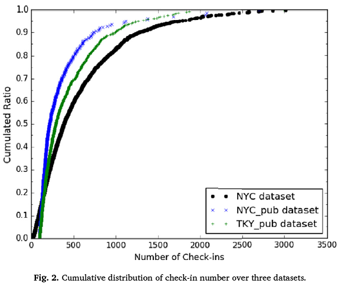

# Speed Reading 速读

1. 题目：Effective fine-grained location prediction based on user check-in pattern in LBSNs
基于上下文感知和注意的数据增强的POI推荐

   |number|title of paper|internet source|local source|correlative field|illustration|
   |---|---|---|---|---|---|
   |1|Learning Graph-based POI Embedding for Location-based Recommendation|<https://sci-hub.ee/10.1016/j.jnca.2018.02.007>|/|location prediction|distll|

2. 这篇论文可以复现。说得非常具体而言有操作性。

## 问题

1. 在贡献中，训练了两个不同的模型来分类一个给定的用户是否在给定的时间下载一个候选位置check-in。为什么需要训练两个模型？

## 需要进一步了解的

1. [Hawkes process（霍克斯过程）](https://dreamhomes.top/posts/202106241018/)。简单定义：自/互激励过程（self/mutual-exciting process），亦称为霍克斯过程（Hawkes processes，以1971年提出者Hawkes教授姓氏命名），主要思想：发生的历史事件对于未来事件的发生有激励作用（正向作用），并且假设历史事件对未来的影响是单调指数递减的，然后以累加的形式进行叠加。
   1. 之前的做法是：对机器学习和其他学科来说，有趣的自然现象包括时间作为分析的中心维度。那么，一项关键任务就是捕捉和理解时间线上的统计关系。处理时态数据的主力模型是在时间序列分析下收集的。**这类模型通常将时间划分为大小相等的桶，并将数量与模型操作的每个桶相关联。这就是离散时间形式主义**，出现在许多机器学习中常见的模型中，比如卡尔曼滤波器和隐马尔可夫模型，正如计量经济学和预测学中常见的模型，如ARIMA或指数平滑法。[不好的参考，看看前面的对于其他做法的分析](https://blog.csdn.net/fs1341825137/article/details/116951405)
2. 单独特征的提取方式需要进一步细化。

## 简介

1. GPS数据很稠密，但是没有语义信息。而且暴露了隐私。
2. user call records通过用户通话记录中获取位置信息。但是这种数据的精度有问题，也就是无法区分两个非常近的位置。
3. check-in数据更精确，而且有相关的一些信息。使用check-in信息可以保证解这个问题的普遍性。
4. 目前的局限性（没有具体到哪一种方法和数据来源）是：无法预测如果用户移动距离很远的情况。
5. 考虑time periodicity, global popularity and personal preference时间周期性，全球流行度和个人偏好的情况下，**实质目标是：预测用户在它们曾经访问过的地点在未来check-in的概率**。
6. 步骤：
   1. 首先通过时间周期性，全球流行度和个人偏好的历史数据来提炼用户的签到模式。
   2. 综合所有因素到一个监督评分模型和一个分类模型中，分别从两个不同的角度解决这个问题。
   3. 并在真实数据上进行验证。达到了0.866的准确率和0.777的F1。
7. 主要贡献
   1. 对12个单独特征的预测能力。
   2. 时间周期和个人偏好在所有特征中的影响力最大。
   3. 将所有特征结合到同一个监督评分模型中，以评估给定用户在给定时间内访问候选地点的可能性。
   4. 通过随机梯度下降算法，设法设法推断出评分模型的参数。
   5. **将预测问题简化为二分类任务。这里有个特别的：训练了两个不同的模型来分类一个给定的用户是否在给定的时间下载一个候选位置check-in。为什么需要训练两个模型**？

## 2. 相关工作

1. 预测远期的签到地点predicting far future check-in location
2. 使用[Hawkes process（霍克斯过程）](https://dreamhomes.top/posts/202106241018/)**来描述check-in动态，这样未来发生的特定事件的可能性就可以通过过去的事件来衡量**。参考文献：Cho, Y.-S., Ver Steeg, G., Galstyan, A., 2014. Where and why users” check in”. In: AAAI,pp. 269–275.
3. check-in有时就会表现出突发性。

## 3. 问题的定义

1. 研究背景定义了3个层次：社会层、空间层和时间层。
2. 两个目标问题：
   1. 问题1：给定一个精确到小时的时间t，对于所有$L_i$的地点进行排名，以便$u_i$在时间t将访问的确切地点的排名列表中被排在最前面。
   2. 问题2：给定一个时间t和一个特定的地点v，判断$u_i$是否会在时间t和位置v上check-in。
   3. 这两个问题定义了细粒度位置预测问题的不同方面。
      1. **前一个定义的侧重点在于对所有可能候选地点进行排序，因此可以被视为一个排序问题。通过评分模型来解决这个问题**。
      2. **第二个问题强调的是决定一个给定地点是否会被访问，因此可以被视为一个分类问题。通过分类模型来解决这个问题**。
      3. 两个模型的组合可以提高预测性能。
3. 如图2所示是**需要注意的是数据集中check-in次数多的用户的占比非常低，这种用户的分布符合幂律分布**。这3个数据集中大部分的用户的check-in数量小于500次，check-in次数超过1000词的用户比例非常低。

   ||
   |:--:|
   |Fig 2|

4. 这篇论文之所以使用3个数据集是因为有一个数据集是东京数据集。由于东京数据集中用户的偏好和纽约数据集的用户偏好肯定不同，从而证明数据不会过渡拟合到一个偏好的数据集上。
5. 充分的研究表明，人类活动具有很强的时间周期性。
6. 目前的时间周期性模式有两种
   1. 天模式，将1天分为24个小时，形成24个事件窗口。
   2. 周模式，将一周分为168个小时。
   3. 对两种模式的分布特点给出了相关推理。

   ||
   |:--:|
   |Fig 4|
7. 用户的签到行为在空间上有一个聚类属性。也就是说每个用户存在一个check-in中心。越接近中心，那个地方签到的概率就越高。发现中心的方法的参考文献：Gao, H., Tang, J., Liu, H., 2012. Exploring social-historical ties on location-based social networks. In: Proceedings of the 6th International AAAI Conference on Weblogs and Social Media, pp. 114–121.。
8. 在dual-logarithm coordinate system双对数坐标系中绘制纽约用户的位移分布。**总体趋势是：check-in地点距离check-in center的距离小于100km时，分布呈现幂律分布；但是当距离大约100km时，没有找到明显的模式**。
   ||
   |:--:|
   |Fig5|
   同时可以看到，几乎80%的位移发生在check-in中心10公里以内，这表明用户更喜欢访问附近的场所。（这部分可能在为后面的特征提取做准备）。
9. 定义的特征如下：
   1. 时间周期性。分为了天模式和周模式。天按小时分为了24个时段，周按小时分为了168个时段。
   2. 受欢迎程度。首先定义距离，通过确定**位移分布曲线**来确定候选地点的全局特征变量：$v_{candidate}$。定义$dist(v_{i}, v_{j})$表示两点之间的距离。
      $$Distance=\left\{
      \begin{matrix}
      & 0.5708*dist(v_{candidate}, center)^{-1.4979} \text{, } & 0km<dist(v_{candidate}, center)<20km\\
      & 6.2696*dist(v_{candidate}, center)^{-2.3833} \text{, } & 20km \leqslant dist(v_{candidate}, center)<100km \\
      & 0 \text{, } & dist(v_{candidate}, center)\geqslant 100km
      \end{matrix}\right.$$
      然后再定义地点和不同类别的受欢迎程度。
   3. 个人偏好，定义了两个偏好值。同时也定义了朋友对用户的影响。用户之间的相似度和朋友的check-in记录被同时考虑。check-in之间的友谊特征计算如下。
      $$Friendship = \sum\limits_{u' \in F_{u}}[weight_{u'}*P(C_{u'}=v_{candidate})] \tag{9}$$
      $weight_{u'}$是衡量一个朋友对用户u的check-in的影响。这项工作中，$weight_{u'}$是通过u和u'之间的相似性来决定的。通过他们共同check-in地点的Jaccard coefficient（Jaccard系数）来计算。友谊数据只能用于NYC数据集。
10. 单个特征的预测。对于给定用户和给定精确度在小时级别的时间。通过地点集合L来进行排名。通过计算出每个地点的数值来对它进行排名。按照递减的顺序来对|L|进行排名，用$rank(k)$表示候选地点中前k的排名。衡量指标是两个：
    1. Average Percentile Rank(平均百分数排名):$PR = \frac{|L|-rank(k)}{|L|}$。
    2. Accuracy@N:$Accuracy@N=\frac{#hit@N}{|L|}$测试集中对于特定地点的点击次数。排位在top-N的时候才认为预测成功。该指标可以解释为成功预测占总预测的比例。
11. 时间特征中以周为周期的特征是影响力最大的特征。
    |![在3个数据集中对于不同预测列表大小N每个独立特征对应的Accuracy@N的值](../pictures/EffectiveFine-grainedLocationPredictionBasedonUserCheck-inPatterninLBSNs_Fig6.png "在3个数据集中对于不同预测列表大小N每个独立特征对应的Accuracy@N的值"|
    |:--:|
    |Fig 6|

## 6. 有监督的评分模型和参数推断（parameter inference）

1. 这是对问题1给出了特定时间特定用户访问候选地点的概率。使用随机梯度下降来优化目标函数，从而推断参数。
2. 总体思路：先计算所有独立特征的评分；然后对所有独立特征的评分进行加权平均；最后使用top-k的方法排序取前面的地点作为预测结果。
   1. 其中对第二步中加权评分的权重可以进行训练。
   2. 这个中间重点在于如何设置正样本和负样本，本文的操作方式如下：
      1. 通过计算在特定时间的特定地点得到一个正样本$s_i^1$。
      2. **从一个用户$u_i$在那个时刻没有选择的所有check-in地点中随机选择一个地点作为负样本$s_i^0$。（也就是对所有没有选择的地点中随机选择一个作为负样本）。（这里是不是有问题？因为只是从所有没有选择的之中选择一个成为了负样本）**。
      3. 基于签入记录的划分，我们可以构造训练样本集R，其中每个训练样本是一个元组$<s^1_i，s^0_i>$，其中两个元素是从同一用户获得的。
   3. 然后可以通过最大似然估计（MLE）来作为推断加权的权重。目标是确保在$<s^1_i，s^0_i>$中$s^1_i$始终大于$s^0_i$，这可以准确表达为最大化后验概率（which can be formulated as maximizing the posterior probability）。（之后的计算过程要再详细研究）。
   4. 由于训练样本的数量太大（在纽约市的数据集有约300万），完整优化是不现实的。模型训练的终止条件设置为随机梯度下降过程中的最大迭代次数。（**这是不是意味着有改进空间？**）

## 7. 有监督的分类模型

1. 这个问题定义为经典的二分类模型。
2. 首先是将数据划分为训练集和测试集。
3. 按照8:1:1的比例把数据集划分为D1,D2,D3三个部分。**注意以下所有的操作只给定了用户，需要注意的是并不给定特定时间**。
   1. 训练集
      1. 对于用户$u_i$在D1中的每个check-in记录，如果在D2中他有一个相应的check-in地点（在D2中的相同地点），我们将通过计算m个特征值获取一个正样本，并给这个样本赋值正标签+1（+1和-1表示的是正负样本）。
      2. 然后我们对于$u_i$其他所有在D2中没有访问的check-in记录定义为负样本，并给这些样本赋值为父标签-1。
      3. 需要注意，负样本的选择必须在用户$u_i$的候选地点列表中（也就是说定义了一个样本空间，是不是可以理解为在数据集中$u_i$所有访问的地点作为样本空间。而不是将所有POI地点作为样本空间）。
      4. 所有D1中产生
   2. 测试集

