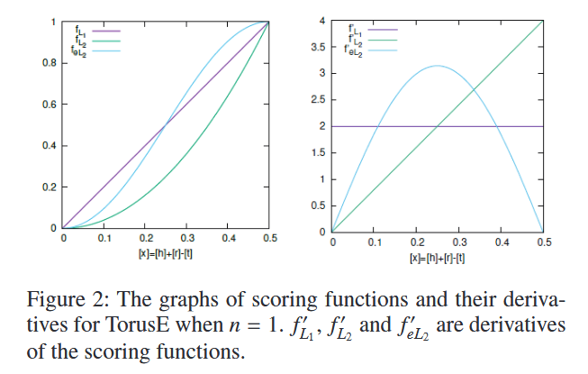
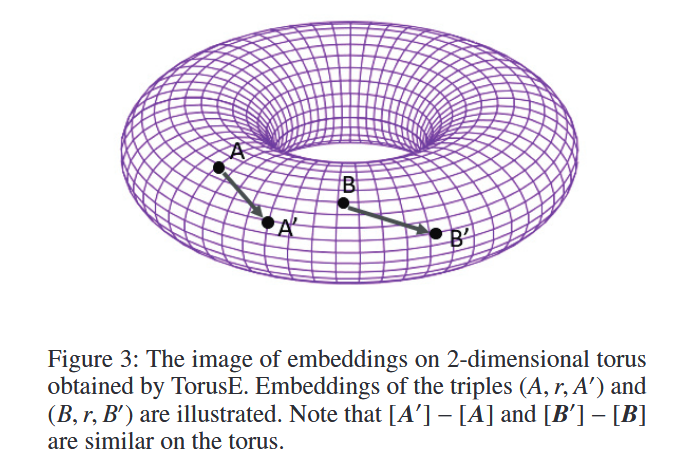

# TorusE: Knowledge Graph Embedding on a Lie Group Translation

## 摘要

|编号|英语|词性|本文中翻译的中文|理解|
|---|---|---|---|---|
||principle|n|道德原则;行为准则;规范;法则;原则;原理|/|
||sphere|n|球体；球形|/|
||fulfill|v|履行，执行，贯彻；实现，完成|/|
||adversely|adv|不利地;反而;反对地|/|
||diverge|vi|发散|偏离;分歧;岔开;分叉;相异;背离;违背|
||novel|adj|新颖的;与众不同的;珍奇的|做名词时是长篇小说的意思。|
||torus|n|圆环体|/|
||scalable|adj|可扩展的|/|
||inference|n|推理|/|
||hence|adv|因此|/|
||triple|n|三元组|这里是知识图谱中的特指。一般翻译为三倍。|
||outerform|v|胜过|/|

知识图谱对于很多人工智能任务来说都是有用的。尽管，知识图谱经常缺失事实。为了填充图，开发了知识图谱嵌入模型。在一个知识图谱中，知识图谱嵌入模型将实体和关系映射为到一个向量空间，并且通过对候选三元组的评分来预测位置的三元组。在我们所知的范围内，对于知识图谱嵌入的完成，TransE是第一个基于翻译（translation-based model）的模型，并且它是简单、有效。它采用了实体嵌入之间的差别来表示它们关系的原理。这个原理看起来非常简单，但是它能够有效的捕捉一个知识图谱的规则。尽管TransE存在正则化的问题。TransE强制将实体嵌入到一个嵌入向量空间的球体上。这种正则扭曲了嵌入，使得它们难以实现上面提到的原理。这种正在对link prediction的精确度也有不利影响。在其他方面，正则很重要，因为实体嵌入在没有正则化的情况下会因为负采样而发散（diverge）。本文提出了一个新颖的嵌入模型，TorusE，来解决正在问题。TransE的原理能被定义在任何李群上。为了避免正则化，嵌入空间可以选择一个紧李群（compact Lie groups）环面（a torus）。在我们所知范围内，TorusE是第一个将对象嵌入到真实或者复杂向量空间之外的模型，并且本论文第一次正式的讨论了TransE的正则化问题。我们的方法在标准的link prediction task中胜过了包括TransE、DistMult、ComplEx、在内的所有达到SOTA的方法。我们展示了TorusE在一个大尺寸的知识图谱上的可扩展性，并且展示了TorusE比最初的TransE更快。

## 1. 简介

知识图谱是一种在一个计算机能够轻松处理情况下描述真实世界的方法之一。比如YAGO、DBpedia和Freebase等知识图谱已经被用于很多任务中，比如问答、内容标记、事实检查和知识推理。尽管一些知识图谱包含百万级别的实体和十亿几倍的事实，他们依然可能不完整并且确实很多事实。因此，知识图谱需要开发一个能够自动补全知识图谱的系统。

|编号|英语|词性|本文中翻译的中文|理解|
|---|---|---|---|---|
||strongly|adv|强烈地，坚决地 ; 大力地 ; 浓烈地|这里翻译为密切地非常合适|
||conflict|n/v|冲突;争执;争论;(军事)冲突;战斗;抵触;矛盾;不一致/(两种思想、信仰、说法等)冲突，抵触|conflict with与...冲突|

在一个知识图谱中，事实被存储在一个有向图中。每个顶点（node）表示在真实世界中的一个实体，每一条边标识实体之间的关系。一个事实通过一个三元组（triple）$(h,r,t)$来表示，其中$h,t$是实体，$r$表示从$h$指向$t$的关系。有一些关系是密切的关系。举例而言，关系$HasNationality$和关系$CityOfBirth$是有关的。因此，如果在知识图谱中三元组（$DonaldJohnTramp, HasNationality, U.S.$）没有存储，而（$DonaldJohnTramp, CityOfBirth, NewYorkCity$）三元组存在其中，知识图谱创建之能够非常容易的预测出$HasNationality$关系，这是因为绝大多数在纽约出生的人拥有美国国籍。很多模型已经能够预测位置的三元组，并且能够通过link prediction任务预测缺失的$h$或者$t$来补充知识图谱。

对于link prediction任务而言，TransE是最早基于翻译的模型，由Bordes等人在2013年提出，因为它简单而且有效，因此它非常有名。如果已经通过训练数据将三元组$(h,r,t)$存储在了知识图谱中；那么TransE通过$\boldsymbol{h}+\boldsymbol{r}=\boldsymbol{t}$的原理来将三元组和关系嵌入在一个真实的向量空间上，其中$\boldsymbol{h}$、$\boldsymbol{r}$和$\boldsymbol{t}$分别是$h, r, t$的嵌入表征。虽然它非常的简答，但是这个这个原理能够非常有效的捕捉知识图谱中的结构。已经提出很多TransE的扩展版本。它们包括TransH(Wang et al. 2014)、TransG(Xiao, Huang, and Zhu 2016)和pTransE(Lin et al. 2015a)。另一方面，近期提出了多种双线性模型，比如DistMult(Yang et al. 2014)、HolE(Nickel, Rosasco, and Poggio 2016)和ComplEx(Trouillon et al. 2016)；它们都在link prediction task中的$HITS@\it{1}$上达到了高的准确度。TransE不能在$HITS@\it{1}$上产生比较好的结果，但是TransE能够在$HITS@\it{10}$上和双线性模型一争高下。我们发现产生TransE这种结果的原因是因为它的正则化。在嵌入向量空间中。TransE强制将实体嵌入到了一个球面上。它与TransE的原理相冲突（**这里理解为TransE将实体嵌入到球面上，但是TransE的原理是线性的**）并且扭曲了TransE获得的嵌入表征。这样使得TransE对link predictions的准确度产生不利影响，而TransE又非常需要它，因为嵌入在没有它的情况下会无限发散（diverge unlimitedly）。

本文，我们提出了一种模型通过将实体和关系嵌入到另一个嵌入空间（一个圆环，a torus）中的同时不需要任何正则化，但是和TransE有一样的原理。嵌入空间在TransE的策略下运行需要几个特征。该策略下的模型实际上能在李群的数学对象上很好的定义。通过选在一个紧致李群作为嵌入空间，嵌入不会无限制的发散（diverge unlimitedly）并且不再需要正则化（regularization is no longer required）。因此，对于嵌入空间我们选择一个环，一种紧致的李群，并提出了一个新颖的模型，TorusE。这个方法允许使用TransE相同原理更准确的学习嵌入表征，并且胜过所有可供选择的link prediction task方法。而且，TorusE可以很好的扩展到大规模的知识图谱上，因为相比于其他的方法它的复杂性是最低的，并且我们展示了TorusE比TransE更快，因为TorusE不需要在计算正则化了。

本文其余部分安排如下：在第二节，我们阐述了link prediction task的相关工作。在第三节，我们简要的介绍了最初的基于翻译的方法-TransE，并且涉及正则化的缺陷。然后，分析了从一个嵌入空间找另外一个嵌入空间所需要的条件（这句话感觉翻译得有点问题，附上原文：the conditions required for an embedding space are analyzed to find another embedding space）。在第四节，我们提出通过将一个空间改变为一个环从而获得嵌入表征的方法。这种方法客服了TransE中的正则化缺陷。在第五节，我们展示了我们做的实验，这个实验是将我们的方法和基准数据集的基准结果进行了比较。在第六节，我们总结了本论文。

## 2. 相关工作

通过link prediction task多种模型都提出了对知识图谱的补全。这些模型大致能分为3类：基于翻译的模型、双线性模型和基于神经网络模型。首先我们描述符号以方便下面的讨论。$h$、$r$和$t$分布表示为一个头实体（a head entity）、关系和一个尾实体（a tail entity）。加粗的字母$\boldsymbol{h}$、$\boldsymbol{r}$和$\boldsymbol{t}$分别表示$h$、$r$和$t$在嵌入空间$\mathbb{R}^n$的嵌入表征。$E$和$R$分别表示为一组实体和关系。

|编号|英语|词性|本文中翻译的中文|理解|
|---|---|---|---|---|
||suitable|adj|合适的|/|
||project|v|投影|这里做动词用|
||yield|v|出产(作物);产生(收益、效益等);提供;屈服;让步;放弃;缴出|/|
||restrict|vt|(以法规)限制;限定(数量、范围等);束缚;妨碍;阻碍;约束|这里用“约束”来翻译比较合适|
||eliminate|v|排除;清除;消除;(比赛中)淘汰;消灭，干掉(尤指敌人或对手)|/|
||redundancy|n|冗余;多余;(因劳动力过剩而造成的)裁员，解雇;累赘|/|
||conjugate|adj|共轭的|/|
||adequately|adv|充分地；足够地；适当地|/|
||distinguish|v|区分|/|

### 2.1 基于翻译的模型

TransE是第一个基于翻译的模型。它因为有效性和简洁性而备受关注。TransE受到了skip-gram模型（Mikolov et al. 2013a; 2013b）的启发，其中，单词嵌入的差异常被表示为它们的关系。因此，TransE使用$\boldsymbol{h}+\boldsymbol{r}=\boldsymbol{t}$原理。这原理能够有效地捕捉第一阶（first-order）规则，比如“$\forall e_1,e_2 \in E, \, (e_1,r_1,e_2) \rightarrow (e_1,r_2,e_2)$”、“$\forall e_1,e_2 \in E, \, (e_1,r_1,e_2) \rightarrow (e_2,r_2,e_1)$”和“$\forall e_1,e_2 \in E, \{\exists e_3 \in E,(e_1,r_1,e_3) \wedge (e_3,r_2,e_2)\}\rightarrow (e_2,r_3,e_1)$”。第一个是通过优化嵌入捕获的，以便$\boldsymbol{r}_1=\boldsymbol{r}_2$保持不变；第二个通过优化嵌入捕获的，以便$\boldsymbol{r}_1=-\boldsymbol{r}_2$保持不变；并且第三个通过优化嵌入捕获的，以便$\boldsymbol{r}_1 + \boldsymbol{r}_3 = \boldsymbol{r}_2$保持不变（这一段没有翻译好，附上原文：The first one is captured by optimizing embeddings so that r1 = r2 holds,the second one is captured by optimizing embeddings so that r1 = −r2 holds, and the third one is captured by optimizing embeddings so that r1 + r3 = r2 holds）。很多研究人员指出：该原理不适合表现$1-N,N-1 \;\text{and }\; N-N$关系。已经开发了一些TransE的扩展模型来解决这些问题。

TransH（Wang et al. 2014）将实体投影到对应于他们之间关系的超平面（hyperplane）上。投影（projection）通过选在嵌入表征的成分来表示他们之间的关系使得模型变得更具灵活性。TransR（Lin et al. 2015b）对每个关系都有一个矩阵，并且实体都通过线性转换（linear transformation）来实现映射，线性转换将矩阵相乘以计算三元组的分数（score）。TransR被认为是广义的TransH
，因为投影就是一种线性转换。这些模型相比于TransE都具有表达能力上的优势，但是，与此同时，它们很容易变得过拟合。

TransE能够在其他方面得到扩展。在TransG（Xiao, Huang, and Zhu 2016）中，在一个知识图谱中的关系能拥有多重含义，因此，通过多个向量来表示一个关系。PTransE(Lin et al. 2015a)将实体之间的关系路径考虑在内，以计算三元组的得分。关系路径由路径中每个关系的总和来表示。

### 2.2 双线性模型

近期，双线性模型在link prediction方面取得了很好的结果。RESCAL（Nickel,Tresp, and Kriegel 2011）是第一个双线性模型。每个关系通过一个$n \times n$的矩阵来表示，并且三元组$(h,r,t)$的分数通过一个双线性映射来计算，该映射对应关系r的矩阵和它的参数$\boldsymbol{h}$、$\boldsymbol{t}$。因此，RESCAL也是最广义的双线性模型。

通过约束双线性函数提出了多个RESCAL扩展模型。DistMult（Yang et al.2014）将表示关系的矩阵限制为对角矩阵。DistMult是的模型容易被训练并且消除了冗余（eliminates the redundancy）。尽管，它也存在$(h,r,t)$和$(t,r,n)$分数一样的问题。为了解决这个问题，ComplEx（Trouillon et al. 2016）使用复数代替实数，并且，在计算双线性映射之前采用尾实体嵌入表征的共轭嵌入。三元组的分数是双线性映射输出的复数的实数部分。

双线性模型相比于基于翻译的模型有很多冗余，并且更容易过拟合。因此，嵌入空间被限制在了一个低维空间中。这也可能导致其在大规模知识图谱上使用时产生问题，大规模的知识图谱是指包含大量实体的知识图谱。因为，需要高维空间来嵌入实体，因为只有高维空间才能充分的区分这些嵌入的实体。

### 2.3 基于神经网络的模型

基于神经网络的模型类似于神经网络的结构，它有很多层和一个激活函数。神经张量网络（neural tensor network, NTN）（Socher et al. 2013）有一个标准的线性神经网络结构和一个双线性张量结构。它可以认为是一个广义的RESCAL。通过每一个关系来训练网络的权重。EP-MLP（Dong et al.2014）是一个NTN的简化版本。

基于神经网络的模型是三类模型中最具表现力的模型，因为它们有大量的参数。因此，它们可能捕获很多类型的关系，但是，与此同时，它们也最容易对训练数据过拟合。

## 3. TransE和它的缺陷

|编号|英语|词性|本文中翻译的中文|理解|
|---|---|---|---|---|
||simplify|vt|简化;使简易|/|
||trivial|adj|不重要的;琐碎的;微不足道的|/|
||magnitude|n|巨大;重大;重要性;星等;星的亮度;震级|这里翻译为大小|
||that is|/|也就是说，即|/|
||conflict|v/n|冲突/矛盾|/|
||satisfy|v|满足(要求、需要等);使满意;向…证实;使确信|/|

在本节中，我们将阐述TransE的细节，并且展示它的正则化缺陷。在本文的后半部分，我们提出一个和TransE相似策略的新颖的模型来克服以上缺陷。

TransE算法包含以下三个主要部分：

1. 原理：当$\Delta \text{是一组真实的三元组时}, if\;(h,r,t) \in \Delta, \text{保持} \boldsymbol{h}+\boldsymbol{r}=\boldsymbol{t} \text{不变}$TransE学习嵌入表征。为了测量有多少个三元组嵌入遵循该原理，使用了一个记分函数$\it{f}$。通常$\boldsymbol{h}+\boldsymbol{r}-\boldsymbol{t}$的$L_1$范数或者$L_2$范数的平方记为$\it{f}(h,r,t)$。在这种情况下$\it{f}(h,r,t)=0$意味着$\boldsymbol{h}+\boldsymbol{r}=\boldsymbol{t}$能一直保持（holds completely）。
2. 负采样：如果只有原理，那么TransE只是学习到了一个trivial的解决方案，这个解决方案中所有的实体嵌入都是相同的并且所有的关系嵌入都是0。因此，负采样是必须的。通常一个知识图谱只包含正向三元组（也就是正样本），因此TransE通过随机修改每个真实三元组的后或者尾实体来生成一个负三元组（负样本）。这被称为负采样。TransE学习嵌入表征使得$\it{f}(h',r,t,)$变大，$\text{if}(h',r,t')\in \Delta_{h,r,t}',\text{其中}(h,r,t)\in \Delta \;\text{并且}\; \Delta_{h,r,t}'=\{(h',r,t)|h'\in E, h' \not =h\}\cup \{(h,r,t')|t'\in E, t'\not= t\}$。
3. 正则化：为了不让嵌入表征无限制的分散，正则化是必须的。TransE使用归一化（normalization）作为正则（regularization）。将实体的嵌入表征归一化，以便它们的大小（magnitude）在学习step中变为1。也就是说，对于每个实体$e\in E,\boldsymbol{e}\in S^{n-1}\subset \mathbb{R}^n ,\, \text{其中}S^{n-1}\text{是一个维度为n-1}的球$。

TransE使用[margin loss](https://zhuanlan.zhihu.com/p/101143469)。目标函数定义如下：
$$\mathcal{L}=\sum\limits_{(h,r,t)\in \Delta}\sum\limits_{(h',r,t')\in \Delta_{(h,r,t)}'}[\gamma + \it{f}(h,r,t)-\it{f}(h',r,t')]_+ \tag{1}$$
其中$[x]_+$表示x的正向部分，并且$\gamma>0$是一个margin超参数。TransE通过随机梯度下降来训练。

如果实体和关系都被键入到一个真实的向量空间中，三个部分都是必要的。尽管原理和正则化在训练期间是互相矛盾的，因此对于每个$e\in E \text{并且}r \in R, \, \boldsymbol{e}+\boldsymbol{R} \notin S^{n-1}$几乎一直保持不变。因此，在大多数环境下，很少实现原理$\boldsymbol{h}+\boldsymbol{r}=\boldsymbol{t}$，如图1所示。,(B,r,B')$和$(C,r,C')$保持不变")
在图中，它假设$(A,r,A'),(B,r,B')$和$(C,r,C')$保持不变。点表示实体的嵌入，箭头表示$r$的嵌入。得到$(A,r,A')$的嵌入，使它们完全遵循这一原理。尽管，$\boldsymbol{B}+\boldsymbol{r}$和$\boldsymbol{C}+\boldsymbol{r}$在球的外面，$\boldsymbol{B}'$和$\boldsymbol{C}'$在球上正则化。

正则化扭曲了嵌入表征，并且它们不满足原理。因此，它很难更准确的预测新的三元组。

## 4. TorusE

|编号|英语|词性|本文中翻译的中文|理解|
|---|---|---|---|---|
||bounded|adj|有界的，有限的|/|
||differentiability|n|可微性;可微分性|/|
||differentiable|adj|可微分的|/|
||summation|n|总和|这个对应的性质没搞清楚。|
||subtraction|n|减法|/|
||operation|n|操作，运算|这里翻译为运算最合适。|
||definability|n|可定义性|/|
||multiplication|n|乘法|/|
||inversion|n|求逆|/|
||it is also known|/|众所周知|/|

在本节中，我们的目标是：当和TransE使用相同的原理时，如何改变嵌入空间来解决正则化问题。我们首先认为对于一个向量空间需要加限制条件。然后，李群是一个候选的嵌入空间。最后，我们提出一个新模型TorusE，Toruse将不使用任何正则化来嵌入实体和关系到一个环上。这个环是一个紧致的李群。

### 4.1 对于嵌入空间所需要的条件

为了避免图1中所示的正则化的问题，我们需要从$\mathbb{R}^n$中修改嵌入空间，它是由一个开放的流形到一个[紧致空间](https://baike.baidu.com/item/%E7%B4%A7%E7%A9%BA%E9%97%B4/18916580)中，因为任何实值连续函数在紧致空间中都是有界的。它意味着嵌入绝不会无限制的分散，因为评分函数也是有界的。这允许我们去避免正则化和解决在训练期间原理和正则化之间的冲突。按照TransE的嵌入策略，需要一些嵌入空间的条件。我们将这些条件列表如下：

1. 可微性：通过梯度下降来训练模型，使得目标函数需要能够被微分。因此，一个嵌入空间必须是一个可微的流形。
2. 可计算性：需要在一个嵌入空间上定义原理。这样做，一个嵌入空间必须具备比如summation和subtraction类似的运算。因此，嵌入空间必须是阿贝尔群，并且群运算必须是可微的。
3. 评分函数的可定义性：为了在训练模型时构造一个目标函数，评分函数必须要能在其上定义。

如果空间满足上述是哪个条件，并且它是紧致的，我们可以将其作为嵌入空间，并且解决TransE的正则化缺陷。实际上，在TransE的策略中，阿贝尔李群满足所有嵌入空间所要求的条件。我们将在下一阶阐述李群。

### 4.2 李群

李群的理论基础是由Sophus Lie建立的。李群在物理和数学中扮演着多种角色，它定义如下：

定义1：李群是一个群，它是一个有限维光滑的流形，其中乘法和求逆的群运算都是光滑的映射。

当乘法运算满足交换律时，李群也被称为阿贝尔李群。对于一个阿贝尔李群，我们分别用$x+y,x-y\text{和}-x$粉笔表示$\mu(x,y),\,\mu(x,y^{-1})\text{和}x^{-1}$，其中$\mu$是群运算。

由定义可知，阿贝尔李群满足可微性和可计算性。众所周知，在任何流形中都可以定义距离函数$d$。由定义可知，评分函数$\it{f}(h,r,t)=d(h,r,t)$，阿贝尔李群也满足可定义性。作为TransE嵌入空间的实向量空间是阿贝尔李群的一个实例，因为它是以以普通向量加法作为群运算的流形和阿贝尔群。TransE还将距离函数用作从向量空间的范数派生的评分函数。然而，TransE需要正则化，因为实向量空间不是紧致的。

### 4.3 环

我们表明对于基于翻译策略，任意一个阿贝尔李群能被作为嵌入空间。我们介绍环，一个紧致的阿贝尔李群，并且在环上定义距离函数。一个环的定义如下：

定义2：一个n维环$T^n$是一个[商空间](https://zhuanlan.zhihu.com/p/350169265)，$\mathbb{R}^n/\sim=\{[\boldsymbol{x}]|\boldsymbol{x}\in \mathbb{R}^n\}=\{\{\boldsymbol{y}\in\mathbb{R}^n|\boldsymbol{y}~\boldsymbol{x}\}|\boldsymbol{x} \in \mathbb{R}^n\}$，其中$\sim$是等价关系，并且如果$\boldsymbol{y}\sim \boldsymbol{x}$，当且仅当$\boldsymbol{y}-\boldsymbol{x} \in \mathbb{Z}^n$。

通过自然投影（the natural projection）$\pi:\mathbb{R}^n \rightarrow \it{T}^n, \, x \mapsto [x]$从向量空间导出了圆环的拓扑和微分结构。记为$g:\it{T}^n \rightarrow \it{S}^n \subset \mathbb{C}^n,[x] \mapsto exp(2\pi i x)$是一个微分同胚，并且$\it{T}^n$是$\underbrace{S^1 \times S^1 \times \cdots \times S^1}_{n}$的微分同胚。群操作来源于原向量空间：$\mu([x],[y])=[x]+[y]\triangleq [x+y]$。环是具有以上结构和群操作的紧凑阿贝尔李群。我们以三种方式定义距离函数：

1. $d_{L_1}$：在$\it{T}^n$上的距离函数$d_{L_1}$是通过定义$d_{L_1}([x],[y])=min_{(x',y')\in [x] \times [y]}||x' -y'||_1$，由原向量空间的$L_1$范数导出的。
2. $d_{L_2}$：在$\it{T}^n$上的距离函数$d_{L_2}$是通过定义$d_{L_2}([x],[y])=min_{(x',y')\in [x] \times [y]}||x' -y'||_2$，由原向量空间的$L_2$范数导出的。
3. $d_{eL_2}$：通过$g$，$\it{T}^n$能被嵌入在$\mathbb{C}^n$上。在$\it{T}^n$上的距离函数$d_{eL_2}$是通过定义$d_{eL_2}([x],[y])=||g([x])-g([y])||_2$，由$\mathbb{C}^n$上的$L_2$范数导出的。

在下面章节中，我们模型的评分函数将用到上面三种距离函数。

### 4.4 ToruseE

|编号|英语|词性|本文中翻译的中文|理解|
|---|---|---|---|---|
||if and only if|/|当且仅当|/|
||derive|v|得到;获得;取得;(使)起源;(使)产生|/|
||derived from|/|来源于|/|
||diffeomorphism|n|微分同型/**微分同胚**|[微分同形的理解](https://zhuanlan.zhihu.com/p/33760941)]。目前完全没有概念。是在几何拓扑学中微分流形的一个概念。在学术专有名词查询中称其为微分同胚。|
||derivative|n|导数|本意是：派生词; 衍生字 ;派生物;衍生物|
||vanishing point|n|灭点或者合点点或者消失点|还不确定其含义。|
||corresponding diagonal matrix|/|对应的对角矩阵|/|
||hence|adv|因此|/|
||fractional|||/|
||hold|/|保持|这里主要有两种含义：一种是保持不变，用作动词；还有一种是使得...成立，也应该是动词或者形容词 表示一种成立的状态。|
||obtain|V|获得、得到|/|

TransE假设实体和关系的嵌入在$\mathbb{R}^n$。如果对于TransE，$(h,r,t)$一直不变，嵌入必须满足原则$\boldsymbol{h}+\boldsymbol{r}=\boldsymbol{t}$；另外，$\boldsymbol{h}+\boldsymbol{r}$必须远离$\boldsymbol{t}$。我们提出的模型，TorusE也满足以下原则，但是嵌入空间从一个向量空间变为了一个环。为了阐明这个策略，我们利用上节中描述的三个距离函数来定义评分函数：

1. $\it{f}_{L_1}$：我们定义评分函数$\it{f}_{L_1}(h,r,t)$为$2d_{L_1}([\boldsymbol{h},\boldsymbol{r},\boldsymbol{t}])$。
2. $\it{f}_{L_2}$：我们定义评分函数$\it{f}_{L_2}(h,r,t)$为$4d_{L_2}^2([\boldsymbol{h},\boldsymbol{r},\boldsymbol{t}])$。
3. $\it{f}_{eL_2}$：我们定义评分函数$\it{f}_{eL_2}(h,r,t)$为$\frac{2d_{eL_2}^2([\boldsymbol{h},\boldsymbol{r},\boldsymbol{t}])}{4}$。

这些评分函数都做了归一化处理，使得它们的最大值为$n$。。虽然$\it{f}_{L_1}$、$\it{f}_{L_2}$和$\it{f}_{eL_2}$的导数差别很大，但是它们看起来还是比较类似的。$\it{f}'_{L_1}$是一个常数，$\it{f}_{L_2}'$在$x=0$时有一个vanishing point，$\it{f}_{eL_2}$在$x=0\, and \, x=0.5$时有两个vanishing point。以上通过梯度下降学习影响了获得的嵌入（翻译得有点不通顺。附上原文These affect the obtained embeddings through gradient descent learning）。

对于TorusE而言，每个在$e \in E$中的实体和在$r \in E$中的关系都通过$[e] \in \it{T}^n \, and \, [r]\in \it{T}^n$来分别表示。因此，原则重写为以下形式：

$$[\boldsymbol{h}] + [\boldsymbol{r}] = [\boldsymbol{t}] \tag{2}$$

并且通过将下面的目标函数最小化来获得嵌入：

$$\mathcal{L}=\sum\limits_{(h,r,t)\in \Delta}\sum\limits_{(h',r,t')\in \Delta_{(h,r,t)}'}[\gamma + \it{f}_d(h,r,t)-\it{f}_d(h',r,t')]_+ \tag{3}$$

其中，$[x]_+$表示x的正向部分，并且$\gamma>0$是一个margin超参数，并且$\it{f}_d \in \{\it{f}_{L_1},\it{f}_{L_2},\it{f}_{eL_2}\}$。TorusE不需要任何正则化，因此也不需要任何计算正则化的时间，因此，TorusE的可扩展性要优于TransE。。

评分函数和相关模型的复杂度详见表1。

表1：使用三元组$(h,r,t)$的相关工作中使用的评分函数、参数和复杂度。
|模型|评分函数|参数|时间复杂度$O_{time}$|空间复杂度$O_{space}$|
|---|---|---|---|---|
|TransE|$\|\|\boldsymbol{h}+\boldsymbol{r}-\boldsymbol{t}\|\|_i$|$\boldsymbol{h},\boldsymbol{r},\boldsymbol{t} \in \mathbb{R}^n$|$O(n)$|$O(n)$|
|TransH|$\|\|(\boldsymbol{h}-\boldsymbol{w}_r^T\boldsymbol{h}\boldsymbol{w}_r)+\boldsymbol{r}-(\boldsymbol{t}-\boldsymbol{w}_r^T\boldsymbol{t}\boldsymbol{w}_r)\|\|_i$|$\boldsymbol{h},\boldsymbol{r},\boldsymbol{t}, \boldsymbol{w}_r \in \mathbb{R}^n$|$O(n)$|$O(n)$|
|TransR|$\|\|\boldsymbol{W}_r\boldsymbol{h}+\boldsymbol{r}-\boldsymbol{W}_r\boldsymbol{t}\|\|_i$|$\boldsymbol{h},\boldsymbol{t}\in \mathbb{R}^n ,\boldsymbol{r} \in \mathbb{R}^k, \boldsymbol{W}_r\in \mathbb{R}^{k \times n}$|$O(kn)$|$O(kn)$|
|RESCAL|$\boldsymbol{h}^T\boldsymbol{W}_r\boldsymbol{t}$|$\boldsymbol{h},\boldsymbol{t}\in \mathbb{R}^n,\boldsymbol{W}_r \in \mathbb{R}^{n \times n}$|$O(n^2)$|$O(n^2)$|
|DistMult|$\boldsymbol{h}^T diag(\boldsymbol{r})\boldsymbol{t}$|$\boldsymbol{h},\boldsymbol{r},\boldsymbol{t} \in \mathbb{R}^n$|$O(n)$|$O(n)$|
|ComplEx|$Re(\boldsymbol{h}^T diag(\boldsymbol{r})\overline{\boldsymbol{t}})$|$\boldsymbol{h},\boldsymbol{r},\boldsymbol{t} \in \mathbb{C}^n$|$O(n)$|$O(n)$|
|NTN|$\boldsymbol{u}_r^T \tanh(\boldsymbol{h}^T \boldsymbol{W}_r^{[1:k]} \boldsymbol{t} + \boldsymbol{V}_{r,h} \boldsymbol{h} + \boldsymbol{V}_{r,t} \boldsymbol{t} + \boldsymbol{b}_r)$|$\boldsymbol{h},\boldsymbol{t}\in \mathbb{R}^n,\boldsymbol{u}_r, \boldsymbol{b}_r \in \mathbb{R}^k, \boldsymbol{W}_r^{[1:k]} \in \mathbb{R}^{k \times n \times n}, \boldsymbol{V}_{r,h}, \boldsymbol{V}_{r,t} \in \mathbb{R}^{k \times n}$|$O(kn^2)$|$O(kn^2)$|
|TorusE|$min_{(x,y)\in([\boldsymbol{h}] + [\boldsymbol{r}] )\times [\boldsymbol{t}]}\|\|\boldsymbol{x}-\boldsymbol{y}\|\|_i$|$\boldsymbol{[h]},\boldsymbol{[r]},\boldsymbol{[t]} \in \mathbb{T}^n$|$O(n)$|$O(n)$|

尽管ComplEx是一个双线性模型，TorusE是一个基于翻译的模型，它们之间非常相似。通过$g$将$\boldsymbol{[h]},\boldsymbol{[r]}\, and \,\boldsymbol{[t]}$映射到$\mathbb{C}^n$上，并且将$g([r])$识别为对应的对角矩阵，使得$-2\it{f}_{eL_2}(h,r,t)+1=\it{f}_{ComplEx}(h,r,t)$成立。训练双线性模型以最大化三元组的分数，而训练基于翻译的模型以最小化三元组的分数为目标。因此，带有$\it{f}_{eL_2}$的ToruE可以认为是在$\it{T}^n \subset \mathbb{C}^n$上的受到更多限制和更少冗余的ComplEx。

注意TransE的一些扩展，诸如TransG和pTransE，通过将嵌入空间从一个真实的向量空间变为一个环而直接应用于TorusE。

**一个环的计算技术**
每个嵌入都通过环上的一个点$[x]$来表示。注意，$x$它是一个n维的向量，并且在一个计算机上我们使用它来表示环的一个点。通过取一个向量的分数部分（a fractional part of a vector），我们可以使得环上的一个点与嵌入向量变成一对一的关系，因此我们可以计算评分函数。例如，我们展示了$d_{L_1}$的计算过程。设$\pi_{frac}:\mathbb{R} \rightarrow[0,1)$是取小数部分的函数。然后，举例使用下列公式计算：$d_{L_1}([\boldsymbol{x}],[\boldsymbol{y}])=\sum\limits_{i=1}^{n} min(|\pi_{frac}(x_i)-\pi_{frac}(y_i)|, 1-|\pi_{frac}(x_i)-\pi_{frac}(y_i)|)$。例如，设$\boldsymbol{x}=3.01 ,\, \boldsymbol{y}=0.99,\, \boldsymbol{x},\boldsymbol{y}\in \mathbb{R}^1$。然后$|\pi_{frac}(x_i)-\pi_{frac}(y_i)|=0.98,\, and \, 1-|\pi_{frac}(x_i)-\pi_{frac}(y_i)|=0.02$成立。因此，我们得到$d_{L_1}([x],[y])=0.02$。其他的距离函数通过类似的方法来计算。

## 5. 实验

我们通过2个角度来评估TorusE。其中一个是它的可伸缩性；另一个是对于link predicion任务中的精度。

### 5.1 数据集

实验包含两个基准数据集：WN18和FB15K（Bordes et al.2013）。这两个数据集分别来自真实的知识图谱中：WordNet（Miller 1995）和Freebase（Bollacker et al. 2008）。很多研究者使用这两个数据集来评估知识图谱完成的模型。数据集的详细信息见表2。

表2：数据集统计信息
|数据集|#Ent|#Rel|#Train|#Valid|#Test|
|---|---|---|---|---|---|
|WN18|40,943|18|141,442|5,000|5,000|
|FB15K|14,951|1,345|483,142|50,000|59,071|

|编号|英语|词性|本文中翻译的中文|理解|
|---|---|---|---|---|
||benchmark|n/vt|基准/检测（用基准问题测试）|/|
|||||/|
|||||/|
|||||/|
|||||/|
|||||/|
|||||/|
|||||/|
|||||/|
|||||/|
