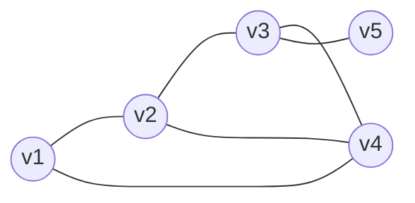
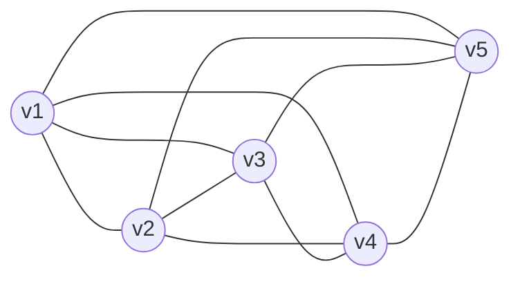
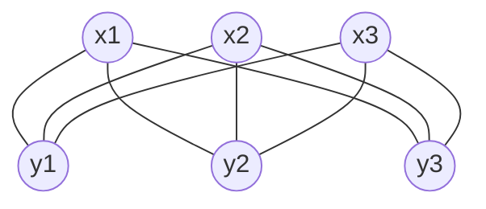

# 图论

## 1.1 基本性质

### 基本定义

|编号|定义名称|英文名称|记号|定义具体内容|直接依赖|举例|
|---|---|---|---|---|---|---|
||图|graph|$G(V, E)$|简单图G(V, E)由集合V和它的二元子集族E构成，其中V称为顶点集，E称为边集。V中的元素称为顶点。E中的元素称为边。|/|/|
|定义1|简单图|simple graph|$$|不包含多重边和环的图称为简单图。大多数情况下都只研究简单图。|图|$G(V, E),\,V=\{1,2,3,4,5\},\,E=\{(1,2),(2,3),(3,4),(4,1),(2,4),(3,5)\}$|
|2|图G的阶|order|$$|V所包含顶点的数目|图|/|
|3|图G的大小|size|$$|E所包含的边的数目|图|/|
||顶点之间或者边之间是邻接的|adjacent|$$|$v_1$和$v_2$有公共的边称为邻接，或者边和边之间有公共的顶点也称为是邻接的。描述顶点之间或者边之间的的关系，也就是同类之间的关系。|图|/|
||顶点和边之间关联|incident|$$|$v_1, v_2$和e之间是连接的。描述顶点和边之间的关系。也就是顶点是边的端点。描述的是不同类之间的关系。|图|/|
||多重图|multi graph|$$|若G允许顶点之间连接多条边|图|/|
||重边/平行边|multi edges/parallel edges|$$|起点和终点相同的两条边称为平行边。|多重图|/|
||重数||$m(v_1, v_2)$|连接$v_1, v_2$之间边的数目|多重图|/|
||一般图||$$|G还允许环（顶点自邻接）|图|/|
|特殊图类|||||||
||零图|null graph|$$|没有顶点的图。顶点都没有也谈不上有边了。一般是用于证明里面。用于证明两个图一模一样时，两个图之间的差为零图就可以说明两个图一样。定义的一个抽象的概念。|图|/|
||空图|empty graph|$$|有顶点但是没有边的图|图|/|
||平凡图|trivail graph|$$|只有一个顶点的图。也就是阶数为1的图，边的数量不确定，也就是有可能有很多条边，而且由于只有一个顶点，所以这些边都是环。|图|/|
||完全图|complete graph|n阶完全图记为$K_n$|任何一对顶点之间都有边连接的**简单图**。和空图是相对的概念。因为是简单图所以不包含重边和环。n阶完全图中边的数量为$\frac{n(n-1)}{2}$。|简单图|/|
||**二部图**|bipartite graph|$$|顶点集可以分为两个部分，每一条边的端点分别来自于两个部分。|/|/|
||完全二部图|complete bipartite graph|两个部分分别包含$m,n$个顶点的**完全**二部图记为：$K_{m,n}$。它也是**简单图**。|顶点集可以分为两个部分，每一条边的端点分别来自于两个部分，而且顶点之间都有边相连。边的数量为$m \times n$。|二部图，简单图|/|
||平面图|planar graph|$$|能在平面上画出，使其任意两条边仅在顶点处相交的图。也就是画出的边不能在二维平面中有交叉。|/|$K_4$是平面图，$K_5$不是平面图。|
||有向图|digraph, directed graph|$$|每条边都有方向的图，连接两顶点间不同方向的两条边不是重边。第13章网络中会涉及这个概念。无向图英语为undirected graph|/|/|
||赋权图||$$|图中的每一条边都赋予了相应权重。|/|/|
||||$$|||/|

1. 定义1：图G(V, E)由集合V和它的二元子集族E构成，其中V称为顶点集，E称为边集。V中的元素称为顶点。E中的元素称为边。
   1. V所包含顶点的数目叫做图G的阶（order）。E所包含的边的数目一般称为图G的大小（size）。
   2. $v_1$和$v_2$有公共的边称为邻接，或者边和边之间有公共的顶点也称为是邻接的。描述顶点之间或者边之间的的关系，也就是同类之间的关系。，而$v_1, v_2$和e称为关联的。（视频中PPT没有描述清楚，而是听老师口述作为准确的描述）。
   3. 若G允许顶点之间连接多条边，则称其为多重图，连接$v_1, v_2$之间边的数目称为重数，记为$m(v_1, v_2)$。若G还允许环（顶点自邻接），称其为一般图。
   4. 举例：简单图$G(V, E),\,V={1,2,3,4,5},\,E=\{(1,2),(2,3),(3,4),(4,1),(2,4),(3,5)\}$注意E的集合里面是没有顺序关系的。(1,2)写成(2,1)也可以；$E=\{(1,2),(2,3),(3,4),(4,1),(2,4),(3,5)\}$写成$E=\{(3,5),(2,4),(1,2),(3,4),(4,1),(2,3)\}$都是可以的。

简单图$K_3$



完全图$K_5$



完全二部图$K_{3,3}$



### 图的表示

设G的顶点集合为$\{v_1,v_2,\cdots,v_n\}$，边集为$\{e_1,e_2,\cdots,e_m\}$。

1. 关联矩阵（incidence matrix）：多重图G的关联矩阵$I(G)=(m_{ij})$为一个$n \times m$（注意这里m和n的顺序没有写反）型$0-1$矩阵，其中$m_{ij}=1$当且仅当$v_i$与$e_j$关联。特别地，若$e_j$是$v_i$上的环，则$m_{ij}=2$。
   1. 缺点：占用空间比较大。原因是边多的时候矩阵会变得很大。
2. 邻接矩阵（adjacency matrix）：图G的邻接矩阵$A(G=(a_{ij})$为一个n阶方阵，其中$a_{ij}的取值为$v_i$和$v_j$之间的边数，特别的，$a_{ii}$为顶点$v_i$处环的个数的两倍，如果是简单图，那么为0。
   1. 优点
      1. 占用空间比较小。因为一般是边比顶点多。
      2. 是一个方阵。
      3. 是一个对称阵。因此可以进步减少占用的空间，只用保持一半即可。
3. 图的画法：最好不要三点一线，如果三点一线了会导致边重合。尽量避免边相交。
4. 图的矩阵表示举例

   图$\boldsymbol{G}$:

   ```mermaid
      graph LR;
      v1((v1))
      v2((v2))
      v3((v3))
      v4((v4))
      v5((v5))
      v1--e1---v2
      v1--e2---v1
      v2--e3---v3
      v3--e4---v4
      v4--e5---v3
      v4--e6---v2
      v4--e7---v1
      v4--e8---v5
   ```

   关联矩阵$\boldsymbol{I}$表示：
   ||e1|e2|e3|e4|e5|e6|e7|e8|
   |---|---|---|---|---|---|---|---|---|
   |v1|1|2|0|0|0|0|1|0|
   |v2|1|0|1|0|0|1|0|0|
   |v3|0|0|1|1|1|0|0|0|
   |v4|0|0|0|1|1|1|1|1|
   |v5|0|0|0|0|0|0|0|1|

   邻接矩阵$\boldsymbol{A}$表示：
   ||v1|v2|v3|v4|v5|
   |---|---|---|---|---|---|
   |v1|2|1|0|1|0|
   |v2|1|0|1|1|0|
   |v3|0|1|0|2|0|
   |v4|1|1|2|0|1|
   |v5|0|0|0|1|0|

5. 如果是简单图那么关联矩阵和邻接矩阵各自有什么特点？
   1. 关联矩阵
      1. 不会出现值为2的元素。
      2. **没有两列是一样的**。如果是一样的说明这两个顶点连接的边是一样的，那么就存在重边，也就是多重图了。
   2. 邻接矩阵
      1. 不会出现值为2的元素。
      2. 主对角线元素全为0。
      3. 元素值均为0或者1实对称阵。
      4. 是对称矩阵（也就意味着是方阵）。
      5. 因为是实对称阵，**它的特征值全为实数**。
      6. **对角线元素之和称为迹。也就是说邻接矩阵特征之和为0**。

### 图的度（顶点的度数）

#### 定义2（度序列）

在一般图$\boldsymbol{G}$中，与顶点v相关联的边的数量称为顶点v的度，记为$deg(v)$。特别的，v上的每一个环对v的度的贡献为2。将$\boldsymbol{G}$中所有顶点的度数按递减循序排列所得的序列
$$
(d_1,d_2,\cdots,d_n),\, d_1 \geqslant d_2 \geqslant \cdots \geqslant d_n \geqslant 0
$$
称为$\boldsymbol{G}$的度序列。

#### 定理1（握手定理）

设$\boldsymbol{G}$为一般图，则其所有点的度数之和$d_1+d_2+\cdots +d_n$是一个偶数，故其奇度数点的个数必为偶数。

原因：顶点的度数之和等于边数乘以2（环也算一条边）。也就是说，每一条边对度数的贡献是2，因为它会对边的两个顶点都贡献1次。所以顶点的度数之和必定是偶数。

作用：给定一个度序列是否能够画出一张图。如果度序列元素之和是奇数，那么这个图不存在。、

另外，给定一个度序列元素之和为偶数，是否一定可以画出一张图？需要分情况进行讨论。一般图肯定可以画出来。简单图就不一定能画出来，那就还需要其他条件。举例：如果一个长度为5(也就是5个顶点)的度序列的第一个元素是7；那么一定不是简单图。因为5个顶点的简单图的顶点度数的最大值是4。

满足什么条件的度序列能够画出一张简单图？<https://blog.csdn.net/ylsoi/article/details/85561975>

Havel–Hakimi algorithm
该算法那可以判断，并且可以构造这样的序列和图的邻接矩阵。

当前仅当序列$\{d\}$降序排序之后，将$d_1$后面$d_1$个数减去1，并将$d_1$从序列中移除。之后形成新的序列中没有负数，且新的序列可以构成简单无向图。

这是一个递归的方法，利用这个方法递归地判断，最后一定以出现负数或者全零序列结束。这个算法的时间复杂度为$\Theta(n^2)$。同时可以使用这个方法来构造邻接矩阵。

#### 定义3

|编号|定义名称|英文名称|记号|定义具体内容|直接依赖|举例|
|---|---|---|---|---|---|---|
||途径|walk|$$|||/|
||迹|trail|$$|||/|
||路径|path|$$|||/|
||||$$|||/|
