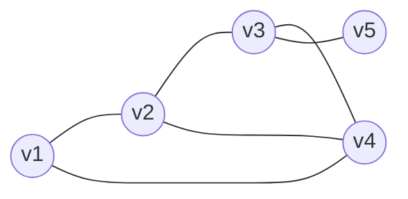

# 图论

## 1.1 基本性质

|编号|定义名称|英文名称|记号|定义具体内容|直接依赖|举例|
|---|---|---|---|---|---|---|
||图|graph|$G(V, E)$|简单图G(V, E)由集合V和它的二元子集族E构成，其中V称为顶点集，E称为边集。V中的元素称为顶点。E中的元素称为边。|/|/|
|定义1|简单图|simple graph|$$|不包含多重边和环的图称为简单图。大多数情况下都只研究简单图。|图|$G(V, E),\,V={1,2,3,4,5},\,E=\{(1,2),(2,3),(3,4),(4,1),(2,4),(3,5)\}$|
|2|图G的阶|order|$$|V所包含顶点的数目|图|/|
|3|图G的大小|size|$$|E所包含的边的数目|图|/|
||顶点之间或者边之间是邻接的|adjacent|$$|$v_1$和$v_2$有公共的边称为邻接，或者边和边之间有公共的顶点也称为是邻接的。描述顶点之间或者边之间的的关系，也就是同类之间的关系。|图|/|
||顶点和边之间关联|incident|$$|$v_1, v_2$和e之间是连接的。描述顶点和边之间的关系。也就是顶点是边的端点。描述的是不同类之间的关系。|图|/|
||多重图|multi graph|$$|若G允许顶点之间连接多条边|图|/|
||重数||$m(v_1, v_2)$|连接$v_1, v_2$之间边的数目|多重图|/|
||一般图||$$|G还允许环（顶点自邻接）|图|/|
|特殊图类|||||||
||零图|null graph|$$|没有顶点的图。顶点都没有也谈不上有边了。一般是用于证明里面。用于证明两个图一模一样时，两个图之间的差为零图就可以说明两个图一样。定义的一个抽象的概念。|图|/|
||空图|empty graph|$$|有顶点但是没有边的图|图|/|
||平凡图|trivail graph|$$|只有一个顶点的图。也就是阶数为1的图，边的数量不确定，也就是有可能有很多条边，而且由于只有一个顶点，所以这些边都是环。|图|/|
||完全图|complete graph|n阶完全图记为$K_n$|任何一对顶点之间都有边连接的**简单图**。和空图是相对的概念。因为是简单图所以不包含重边和环。n阶完全图中边的数量为$\frac{n(n-1)}{2}$。|简单图|/|
||**二部图**|bipartite graph|$$|顶点集可以分为两个部分，每一条边的端点分别来自于两个部分。|/|/|
||完全二部图|complete bipartite graph|两个部分分别包含$m,n$个顶点的**完全**二部图记为：$K_{m,n}$||二部图|/|
||平面图||$$|||/|
||有向图||$$|||/|
||赋权图||$$|||/|
||||$$|||/|
||||$$|||/|
||||$$|||/|
||||$$|||/|
||||$$|||/|
||||$$|||/|

1. 定义1：图G(V, E)由集合V和它的二元子集族E构成，其中V称为顶点集，E称为边集。V中的元素称为顶点。E中的元素称为边。
   1. V所包含顶点的数目叫做图G的阶（order）。E所包含的边的数目一般称为图G的大小（size）。
   2. $v_1$和$v_2$有公共的边称为邻接，或者边和边之间有公共的顶点也称为是邻接的。描述顶点之间或者边之间的的关系，也就是同类之间的关系。，而$v_1, v_2$和e称为关联的。（视频中PPT没有描述清楚，而是听老师口述作为准确的描述）。
   3. 若G允许顶点之间连接多条边，则称其为多重图，连接$v_1, v_2$之间边的数目称为重数，记为$m(v_1, v_2)$。若G还允许环（顶点自邻接），称其为一般图。
   4. 举例：简单图$G(V, E),\,V={1,2,3,4,5},\,E=\{(1,2),(2,3),(3,4),(4,1),(2,4),(3,5)\}$注意E的集合里面是没有顺序关系的。(1,2)写成(2,1)也可以；$E=\{(1,2),(2,3),(3,4),(4,1),(2,4),(3,5)\}$写成$E=\{(3,5),(2,4),(1,2),(3,4),(4,1),(2,3)\}$都是可以的。

## 帕斯卡三角形

1. 性质：每行之和为$2^n$
2. 帕斯卡矩阵可逆，因为它的行列式为1.
3. 它的逆：

## 二项式定理

1. $(x+y)^n = \sum\limits_{k=0}^n C_n^k x^k y^{n-k}$
2. 证明方法：
   1. 组合分析法：思路：由$(x+y)$选择k个x，那么就剩n-k了y，那么就可以确定$x^k y^{n-k}$之前的系数了。
   2. 归纳法。
3. 代数学二项式定理
   1. $(1+x)^n = \sum\limits_{k=0}^n C_n^k x^k$
   2. 和泰勒展开非常像。
4. $1C_n^1 + 2C_n^2 + \cdots +nC_n^n = n\cdot 2^{n-1}$
   1. 对 $(1+x)^n = \sum\limits_{k=0}^n C_n^k x^k$两边求导
   2. 然后将x=1带入即可证明。
   3. 组合意义：在n个人中选择k个人做做主席团，然后从k个人中选一个做主席。两种解释：一种是先选主席，再选委员；第二种是先选委员，再从委员中选主席。
5. 范德蒙等式$\sum\limits_{k=0}^n (C_n^k)^2 = C_{2n}^n$
6. $\sum\limits_{i=0}^r C_m^i C_{r-i}^n = C_{m+n}^r$
   1. 组合分析证明：左边表示的从m+n个中选r个.右边表示先从m个中选i个，从n个中选择r-i个，然后i再从0取值到r。
7. 非降路径法：证明组合恒等式的效果非常好。
   1. 需要理解的地方：终点坐标的确定。
   2. 按照什么方式进行分类来确定等号复杂一边的意义。
   3. 适用场景是等号一边非常简单。
8. 二项式系数的单峰性：二项式系数的大小在中间的时候最大，而且两边是对称的。
   1. 关系就是一个集合。
   2. 偏序集基本概念
   3. Sperner定理
      1. 最大链
      2. 反链