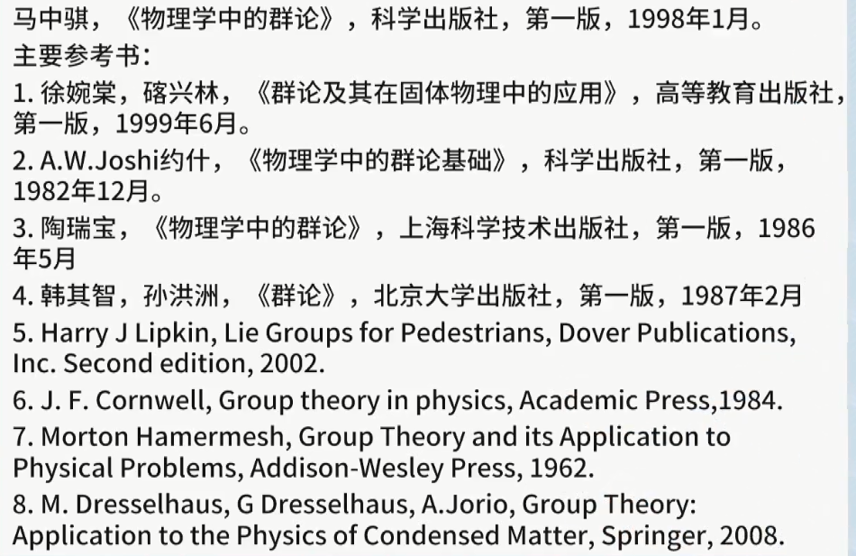

# 群论

1. 参考
   1. 视频<https://www.bilibili.com/video/BV1Ds411G7c4?p=1>
   2. 重点视频<https://www.bilibili.com/video/BV1MJ411E7ZG?p=1>
2. 现代数学的鲜明特征是研究具有各种代数运算的集合，称呼其为代数系统。
3. 群的定义看起来非常简单，但是满足这些条件之后的集合会具有很多神奇的性质。\
群的作用是由于研究一元高次方程的公式解的时候发展出来的。同时在研究物理中的对称性中促进了群论的发展。

## 研究群的目的

研究群的结构。

把群分成多个集合，然后研究如何分拆成多个小的集合，这些集合与集合之间的性质、集合之间元素的关系、集合中元素的关系等。

## 1 群论的定义

1. 群的定义由6个部分组成。
   1. 首先2点：1. 要求是非空集合（集合中的元素互异）；2. 需要一个二元代数运算（**一定要定义一个运算，在群论里面将这种运算统称为“乘法”。实际上不一定是在普通认为的乘法。这一点非常重要**）。
   2. 其次需要满足4条性质：
      1. closure封闭性；也就是说经过计算之后的元素仍然处于集合之中。
      2. associativity结合律（除法是不满足结合律的）；$x*y*z = x*(y*z),\; \forall x,y,x \in S)$。
      3. identity element有唯一单位元（这里的单位元是对集合中所有元素而言的，所有的元素共同有一个唯一单位元，这里要注意和逆元的定义相比较）。单位元的定义是和定义的二元运算直接相关的。有唯一且不说，单位元的定义是$\text{if e is identity element.}\, x * e = x$
      4. inverse element有逆元（这里的逆元是对于集合中每个元素而言的，每个元素各有各的唯一逆元）。逆元是通过定义的二元代数运算来定义的。逆元可以是自己。**逆元也属于群中的元素**。
   3. 举例：
      1. 实数集$\mathbb{R}$，运算定义为加法，单位元是0，逆元定义为$a^{-1} = -a$。那么这是一个群。
      2. 整数$\mathbb{Z}$，运算定义为加法，单位元是0，逆元定义为$-a$。这是一个群。这是一个无限群。而且还满足交换律，这是一个无限阿贝尔群。
      3. 同样是实数集$\mathbb{R}$，运算定义为数乘，单元为是1，逆元定义为倒数。这就不构成一个群。原因是，0没有逆元。
      4. 在2的基础上，如果定义一个没有0的实数集$\mathbb{R}$，那么是满足称为群的条件的。
2. 群中元素的个数定义为群的阶。记为$|G|$。
3. D3群。
4. 置换群。
5. 阿贝尔群，在群满足群的定义之后，如果还能够满足交换律，那么就称这种群为交换群，也称为阿贝尔群。
6. 群中的集合可以是我们通常认为的数，更可以是一种"操作"。
7. 如何方便的观察群的性质方法：乘法表（multipy function table）。也就是将两两元素之间的运算通过一张表来表示出来，通过观察表的形状来观察群的性质。
8. 重排定理Rearrangement Theorem。这个定理有点神奇，只要满足群定义的都会满足这个定理。它的证明过程是：1. 先证明一次计算中所有元素都有；2. 再通过反证法证明每个元素只出现了一次。
   1. 可以通过重排定理来推断每个元素之间运算之后的结果。
   2. 证明
      $$
      \begin{aligned}
         & \text{set had a group }\,G=\{g_1,g_2,\cdots,g_n\} \\
         & g_iG=G'=\{g_ig_1,g_ig_2,\cdots,g_ig_i,\cdots,g_ig_n\}\\
         & \because \text{因为群具有封闭性并且G和G'中的元素都两两互异，}|G|=|G'|=n. \\
         & \therefore G = g_iG = G'
      \end{aligned}
      $$
   3. 在群的表示方法之一，通过表来表示群时，因为重排定理，所以表中的**每一行、每一列**中群所有元素都会唯一的出现一次。
   4. 使用重排定理来推理群的结构。三阶群只有一种结构，四阶群可以通过重排定理来推断有2种结构。
9. 4阶群的2种结构
   1. 四边形的旋转。$G=<a|a^4=e>$
   2. 时空反演群。$G=<p,t|p^2=e,t^2=e,(pt)^2=e>$
10. 群的分类：有限群、无限群、置换群、对称群、李群、阿贝尔群、非阿贝尔群。

群论相关的参考书：

1. 李代数的作用就是说明了将李群中的一个矩阵可以映射到一个向量上，而且是唯一映射到一个向量上。也就是说李群中的矩阵可以和向量一一对应。
   - 对于矩阵进行求导的时候，矩阵是不容易求导的（不容易求驻点，而且没有很好的数学工具来求）。所以直观的思维就是将矩阵变为一个一维的向量来对其求驻点。李代数就完成了这个工作。

## 2. 群的表示

1. 群的线性表示
   1. 线性无关、维数
   2. 线性空间的基向量。
   3. 同态映射：是一种多对一的表示，无法做逆操作。
   4. 同构映射：群G和群L之间的任何操作可以一一对应，那么称为忠实表示。
   5. 一个群原则上可以有无限多的表示。
2. 群的矩阵表示
3. 群有两种展示方式：1. 乘法表的形式来展示；2. 通过生成元来展示。
   1. 乘法表。直观，对于有限群使用这种展示方法可以很好的观察群的结构。
   2. 生成元。对于无限群使用只能使用这种方式来展示了。
      1. 生成元的定义：群中所有元素都可以通过群中某一个或者有限的几个元素的多次乘法来展示，那么这一个或者几个元素称为该群的生成元。如果是多个生成元，那么这些生成元可以称为生成元组。
      2. 举例：
         1. 三阶群：$e=a^3, b=a^2, G=<a|a^3=e>$

## 群的分拆

使用等价关系来拆分群。

1. 等价关系的定义：
   1. 自反性。$A\sim A$。
   2. 传递性。$A \sim B, \, B \sim C, \Rightarrow A \sim C$。
      1. 反例：同学关系，A和B是同学，B和C是同学，但不能得出A和C是同学。
      2. 正例：大于关系，$A > B, \, B > C, \Rightarrow A > C$
   3. 对称性。$A \sim B, \, B \sim A$。
      1. 反例：大于关系$A > B \nRightarrow B >A$
      2. 正例：同学关系是具有对称性的。A和B是同学，能得出B和A也是同学。
   4. 举例。可以用等价关系来分拆集合。
      1. 正例：国籍关系就是人之间的一种等价关系。
2. 对群进行分拆时的等价关系。
   1. 共轭
      1. 定义：$A \sim B ,\,\text{A和B共轭} \Rightarrow \exists g \in G, gBg^{-1} = A$
      2. 证明
         $$
         \begin{aligned}
            & \text{自反性：由共轭的定义可以直接退出这一条} gAg^{-1} = A \\
            & \text{传递性：} A \sim B, \, B \sim C \Rightarrow A = g_1Bg_1^{-1}, \, B = g_2Cg_2^{-1} \Rightarrow A = g_1(g_2Cg_2^{-1})g_1^{-1} = (g_1g_2)C(g_1g_2)^{-1} \\
            & \text{对称性：} A \sim B \Rightarrow A = gBg^{-1} \Rightarrow g^{-1}Ag = g^{-1}gBg^{-1}g = B
         \end{aligned}
         $$
   2. 可以将群分为多个共轭类。
      1. 单位元自己是单独的一个共轭类。单位元的共轭等于它自己。
      2. 阿贝尔群的所有元素都自成为一个单独的共轭类。因为阿贝尔群满足交换律，所以$gAg^{-1}=Agg^{-1}=A$。也就是说阿贝尔群中元素的共轭等于它自己。

## 子群和陪集

1. 定义：在一个群G下的一个集合H也是群，那么称H为G的一个子群。$H \subset G$。
2. 平凡子群：显然，单位元构成的子群是G的一个子群。群G也是自己的一个子群。这两种群称为群G的平凡子群。**一般不研究平凡子群，都是研究不平凡子群**。
3. 研究的问题：$H \subseteq G,\,h_i \in H, \,g_i \notin H,\, g_i \in G. \; \text{求} g_iH \overset{?}{\Rightarrow} ?,\, \text{也就是求}g_i\text{与H计算之后和H、G之间的关系是什么样的}.$
   1. 证明
      $$
      \begin{aligned}
         & \text{可以不失一般性的假设}g_i \notin H,\, g_i \in G,\, \text{设}g_iH=H \\
         & g_i h_j = h_k \\
         & g_i = h_k h_i^{-1} \\
         & h_k h_i^{-1} \in H \text{与题设}g_i \notin H\text{矛盾。} \\
      \end{aligned}
      $$
4. 陪集的定义：通过1中的证明，可以说明$g_iH \in G ,\, g_iH \neq H$。也就是说不属于H但是属于G的一个群元素与H相乘之后得到的子群H'的群元素与H完全不重合，而且H'是G中的一个集合（注意这里没有说是G的一个子群）。称H'是H的一个陪集。
   1. 陪集中的元素是互异的。
   2. 陪集中元素的个数和子群中元素的个数相同。
   3. $g_i \in G ,\, g_j \in G,\, g_i \neq g_j \Rightarrow g_iH \text{和} g_jH\text{之间有可能相等，也有可能不相等。同时它们之间可能存在交集}$。

## 群的研究目标和作用

1. 现代数学的鲜明特征是研究具有各种代数运算的集合，称呼其为代数系统。
2. 从我们熟悉的集合开始，推出群的概念。
3. 设$S$是一个集合，令$S\times S \coloneqq\{(a,b)|a,b \in S\}$，称为$S$和自己的笛卡尔积。
4. 称$S\times S$到$S$上的一个映射（也就是$S\times S$的结果还是在集合$S$中）称为$S$上的一个**二元代数运算**。这里是为后面定义群的二元代数运算做铺垫。

|背景|名称|运算|运算法则|相关概念|
|---|---|---|---|---|
|$\mathbb{Z}$整数集|$\color{red}{环，Ring}\;\it{R}$|加法、乘法、减法（实际上是加上元素的逆元）|||$a-b\coloneqq a+(-b)$，无法定义除法，因为$\frac{2}{3}$不属于整数集。|
||||||
||||||
||||||

### 域的定义

|背景|名称|运算|运算法则|相关概念|
|---|---|---|---|---|
|$\mathbb{Z}_7$|$\color{red}{域，Field}\;\it{F}$|加法 乘法|有单位元，满足交换律，且每个非零元素都有可逆元||

### 群的定义

|背景|名称|运算|运算法则|相关概念|
|---|---|---|---|---|
|||乘法（称其为乘法的一种运算或者操作）|1. 结合律 2. 有单位元 3. 每个元素有逆元|如果满足交换律，那么称这种群为交换群，或者阿贝尔群|
||||||
||||||

研究群的第一种途径就是研究群$\mathbb{G}$的各种子群。