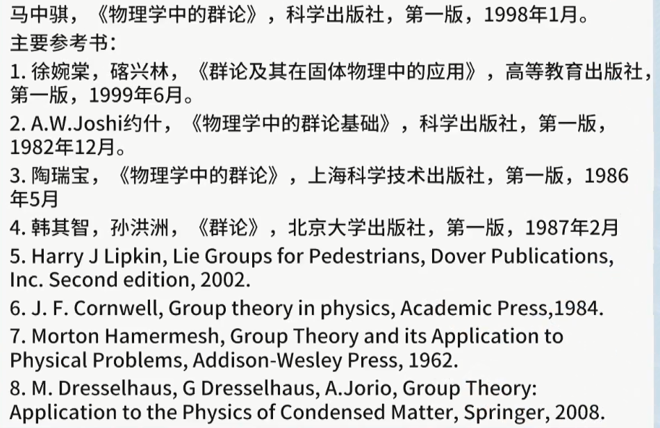
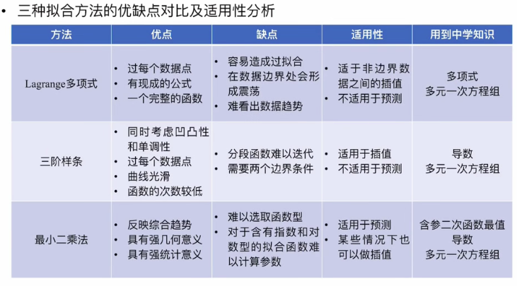

# Knowledge of Mathematics

You are every single day.

## 1. 线性代数

在机器学习中10个常用公式：

1. $\vec{a}, \vec{x} \in \mathbb{R^{n\times 1}}, then \frac{d\vec{a}^T\vec{x}}{d\vec{x}}=\vec{a}, \frac{d\vec{x}^T\vec{a}}{d\vec{x}}=\vec{a}$
2. $\vec{x} \in \mathbb{R^{n\times 1}}, then \frac{d\vec{x}^T \vec{x}}{d\vec{x}}=2\vec{x}$
3. $\vec{x} \in \mathbb{R^{n\times 1}}, \boldsymbol{y}(\vec{x}) \in \mathbb{R^{m\times 1}}, then \frac{d\boldsymbol{y}^{T}(\vec{x})}{d\vec{x}} = (\frac{d\boldsymbol{y}(\vec{x})}{d\vec{x}^T})^T$
4. $\boldsymbol{A} \in \mathbb{R^{m\times n}}, \vec{x} \in\mathbb{R^{n\times 1}}, then \frac{d\boldsymbol{A}\vec{x}}{d\vec{x}^T}=\boldsymbol{A}$
5. $\boldsymbol{A} \in \mathbb{R^{m\times n}}, \vec{x} \in\mathbb{R^{n\times 1}}, then \frac{d\vec{x}^T\boldsymbol{A}^T}{d\vec{x}}=\boldsymbol{A}^T$
6. $\boldsymbol{A} \in \mathbb{R^{n\times n}} \text{，A是方阵}, \vec{x} \in\mathbb{R^{n\times 1}}, then \frac{d\vec{x}^T\boldsymbol{A}\vec{x}}{d\vec{x}}=(\boldsymbol{A} + \boldsymbol{A}^T)\vec{x}$
7. $\boldsymbol{x} \in \mathbb{R^{m\times n}}, \vec{a} \in \mathbb{R^{m\times 1}}, \vec{b} \in \mathbb{R^{n\times 1}}, then \frac{d\vec{a}^T\boldsymbol{x}\vec{b}}{d\vec{x}}=\vec{a} \vec{b}^T$
8. $\boldsymbol{x} \in \mathbb{R^{n\times m}} \text{注意这里是n}\times \text{m维度。而不是前面的m}\times \text{n维度}, \vec{a} \in \mathbb{R^{m\times 1}}, \vec{b} \in \mathbb{R^{n\times 1}}, then \frac{d\vec{a}^T\boldsymbol{x}^T\vec{b}}{d\vec{x}}=\vec{b}\vec{a}^T$
9. $\boldsymbol{X} \in \mathbb{R^{m\times n}}, \boldsymbol{B} \in \mathbb{R^{n\times m}}, then \frac{d(tr\boldsymbol{X}\boldsymbol{B})}{d\boldsymbol{X}}=\boldsymbol{B}^T$
10. $\boldsymbol{X} \in \mathbb{R^{m\times n}}, \boldsymbol{X} \text{是可逆的。} then \frac{d|\boldsymbol{X}|}{d\boldsymbol{X}}=|\boldsymbol{X}|(\boldsymbol{X}^{-1})^T$

### 1.1 行列式

### 1.1.1 需要注意的关键点

1. 行列式是方阵。
2. 在二维空间中，行列式是计算的的是面积；在三维空间中，行列式计算的就是体积。

### 1.1.2 主要方法

1. 行列式的计算是通过行与行（或者列与列）之间的加减法来完成化简的。主要利用的是10. 11. 12. 13.对应的定义和性质。
2. 行列式等于其主对角线上分块行列式之积。

### 1.1.3 定义、性质

1. 把n个不同的元素排列为一列，叫做这n个元素的全排列（也简称排列）。
2. 定义标准次序之后，当某一个元素的先后次序与标准次序不同的时候它就构成一个逆序。
3. 一个排列中所有逆序的总数叫做这个排列的逆序数。定义逆序数就是为了计算行列式中的项前面的符号做准备的。
4. 逆序数为奇数的排列叫做奇排列，逆序数为偶数的排列叫做偶排列。
5. 定理1 一个排列中的任意两个元素对换，排列改变奇偶性。
6. 推论 奇排列对换成标准排列的对换次数为奇数，偶排列对换成标准排列的对换次数为偶数。
7. 定义2 设有$n^2$个数，排列成$n$行$n$列的数表  
    $$
    \begin{matrix}
    a_{11} & a_{12} & \cdots & a_{1n} \\
    a_{21} & a_{22} & \cdots & a_{2n} \\
    \vdots & \vdots & \ddots & \vdots \\
    a_{n1} & a_{n2} & \cdots & a_{nn}
    \end{matrix}
    $$
    做出表中位于不同行不同列的n个数的乘积，并冠以符号$(-1)^t$，得到形如  
    $$(-1)^t a_{1p_1}a_{2p_2}\cdots a_{np_n} \tag{7}$$
    其实就是看下标的逆序数来决定前面的该项前面的符号。一共有两个下标。先固定i的下标，然后确定j的逆序数，这个逆序数就是t。
    的项，其中$p_1p_2\cdots p_n$为自然数$1,2,\cdots ,n$的一个排列，t为这个排列的逆序数。由于这项的排列共有$n!$个，因而形如$(7)$ 式的项共有$n!$项，所有这$n!$项的代数和为  
    $$\sum (-1)^ta_{1p_1}a_{2p_2}\cdots a_{np_n}$$
    成为n阶行列式，记作  
    $$
    D=\begin{vmatrix}
    a_{11} & a_{12} & \cdots & a_{1n} \\
    a_{21} & a_{22} & \cdots & a_{2n} \\
    \vdots & \vdots & \ddots & \vdots \\
    a_{n1} & a_{n2} & \cdots & a_{nn}
    \end{vmatrix}
    $$  
    简记作$det(a_{ij})$，其中数$a_{ij}$为行列式D的$(i,j)$元。

8. 主对角线以下或者以上的元素都为0的杭历史叫做上或者下三角形行列式，特别是处理对角线元素之外全为0的杭历史叫做对角行列式。
9. 性质1 $D=D^T$。行列式与他的转置行列式相等。
10. 性质2 对换行列式的两行或者两列，行列式变号。
11. 推论 如果行列式两行或者两列完全相同，则此行列式等于0。
12. 性质3 行李额是的某一行或者列中所有的元素都乘以同一个数k，等于用数k乘以此行列式。
13. 推论 行列式中某一行或者列的所有元素的公因子可以提到行列式记号的外面。
    $$
    D=\begin{vmatrix}
    a_{11} & a_{12} & \cdots & a_{1n} \\
    \vdots & \vdots & \ddots & \vdots \\
    ka_{i1} & ka_{i2} & \cdots & ka_{in} \\
    \vdots & \vdots & \ddots & \vdots \\
    a_{n1} & a_{n2} & \cdots & a_{nn}
    \end{vmatrix}=kD=k\begin{vmatrix}
    a_{11} & a_{12} & \cdots & a_{1n} \\
    \vdots & \vdots & \ddots & \vdots \\
    a_{i1} & a_{i2} & \cdots & a_{in} \\
    \vdots & \vdots & \ddots & \vdots \\
    a_{n1} & a_{n2} & \cdots & a_{nn}
    \end{vmatrix}
    $$
14. 行列式中如果有两行或者列元素成比例，则此行列式等于0。
15. 做行列式的某一行或者列的元素都是两数之和，例如第i行的元素都是两数之和：  
    $$
    D=\begin{vmatrix}
    a_{11} & a_{12} & \cdots & a_{1n} \\
    \vdots & \vdots & \ddots & \vdots \\
    a_{i1}+a^{'}_{i1} & a_{i2}+a^{'}_{i2} & \cdots & a_{in}+a^{'}_{in} \\
    \vdots & \vdots & \ddots & \vdots \\
    a_{n1} & a_{n2} & \cdots & a_{nn}
    \end{vmatrix}\\
    \text{则D等于下列两个行列式之和：}\\
    D=\begin{vmatrix}
    a_{11} & a_{12} & \cdots & a_{1n} \\
    \vdots & \vdots & \ddots & \vdots \\
    a_{i1}+a^{'}_{i1} & a_{i2}+a^{'}_{i2} & \cdots & a_{in}+a^{'}_{in} \\
    \vdots & \vdots & \ddots & \vdots \\
    a_{n1} & a_{n2} & \cdots & a_{nn}
    \end{vmatrix}\\
    =\begin{vmatrix}
    a_{11} & a_{12} & \cdots & a_{1n} \\
    \vdots & \vdots & \ddots & \vdots \\
    a_{i1} & a_{i2} & \cdots & a_{in} \\
    \vdots & \vdots & \ddots & \vdots \\
    a_{n1} & a_{n2} & \cdots & a_{nn}
    \end{vmatrix} + \begin{vmatrix}
    a_{11} & a_{12} & \cdots & a_{1n} \\
    \vdots & \vdots & \ddots & \vdots \\
    a^{'}_{i1} & a^{'}_{i2} & \cdots & a^{'}_{in} \\
    \vdots & \vdots & \ddots & \vdots \\
    a_{n1} & a_{n2} & \cdots & a_{nn}
    \end{vmatrix}
    $$  
16. 性质6 把行列式的某一行或者列的各个元素乘以同一数然后加到玲一行或者列对应的元素上去，行列式的值不变。
17. 在n阶行列式中，把$(i,j)$元$a_{ij}$所在的第i行和第j列划去后，留下来的n-1阶行列式叫做$(i,j)$元$a_{ij}$的余子式，记作$M_{ij}$；记
    $$A_{ij}=(-1)^{i+j}M_{ij}$$
    $A_{ij}$叫做$(i,j)$元$a_{ij}$的代数余子式。
18. 一个n阶行列式，如果其中第i行所有元素除$(i,j)$元$a_{ij}$外都为0，那么这个行列式等于$a_{ij}$与它的代数余子式的乘积，即
    $$D=a_{ij}A_{ij}=a_{ij}(-1)^{i+j}M_{ij}$$
19. 定理2 行列式等于它的任一行（列）的各元素与其对应的代数余子式乘积之和，即
    $$D=a_{i1}A_{i1}+a_{i2}A_{i2}+\cdots +a_{in}A_{in}, (i=1,2,\cdots , n)$$
    或
    $$D=a_{1j}A_{1j}+a_{2j}A_{2j}+\cdots +a_{nj}A_{nj}, (j=1,2,\cdots , n).$$

### 1.1.4 需要记住的特例

1. $D=\begin{vmatrix}
      &   &   & a_{1n} \\
    0 &   & a_{2,n-1} & a_{2n} \\
      & \vdots & \vdots & \vdots \\
    a_{n1} & \cdots & a_{n,n-1} & a_{nn}
    \end{vmatrix}=(-1)^{\frac {1}{2} n(n-1)} a_{1n} a_{2,n-1}\cdots a_{n1}=(-1)^{\frac {n(n-1)}{2}} \prod \limits_{i=1,j=n}^{n,1} a_{ij}$
2. $D=\begin{vmatrix}
      &   &   & \lambda_{1} \\
      &   & \lambda_{2} &   \\
      & \vdots &   &   \\
    \lambda_{n} &   &   &  
    \end{vmatrix}=(-1)^{\frac {n(n-1)}{2}}\lambda_{1}\lambda_{2}\cdots \lambda_{n}=(-1)^{\frac {n(n-1)}{2}} \prod \limits_{i=1}^n \lambda_i$
3. 1和2的主要思想是通过行之间的交换行列式变号这个性质来完成计算的。
4. $$\text{设}
    D=\begin{vmatrix}
    a_{11} & \cdots & a_{1k} &   &   &   \\
    \vdots &   & \vdots &   & 0 &   \\
    a_{k1} & \cdots & a_{kk} &   &   &   \\
    c_{11} & \cdots & c_{1k} & b_{11} & \cdots & b_{1n}\\
    \vdots &   & \vdots & \vdots &  & \vdots\\
    c_{n1} & \cdots & c_{nk} & b_{n1} & \cdots & b_{nn}
    \end{vmatrix}, \\
    D_1=det(a_{ij})=\begin{vmatrix}
      a_{11} & \cdots & a_{1k} \\
      \vdots &   & \vdots \\
      a_{k1} & \cdots & a_{kk}
    \end{vmatrix}, D_2=det(b_{ij})=\begin{vmatrix}
      b_{11} & \cdots & b_{1n} \\
      \vdots &   & \vdots \\
      b_{n1} & \cdots & b_{nn}
    \end{vmatrix}. \\
    \text{则：}D=D_1 D_2$$
    这个是矩阵分块的思路。注意矩阵一定是方阵。
5. $$D_{2n}=\begin{vmatrix}
    a &  &  &  &  &b \\
      & \ddots &  & &\vdots & \\
      &  & a & b &  &  \\
      &  & c & d &  &  \\
      & \vdots &  & &\ddots & \\
    c &  &  &  &  &d
   \end{vmatrix}=(ad-bc)^n$$
   通过4中的思路，通过行与行的交换变成很多2*2的小块之后再进行计算。
6. 范德蒙德（Vandermonder）行列式
   $$D=$$

## 2. 群论

群论相关的参考书：

1. 李代数的作用就是说明了将李群中的一个矩阵可以映射到一个向量上，而且是唯一映射到一个向量上。也就是说李群中的矩阵可以和向量一一对应。
   - 对于矩阵进行求导的时候，矩阵是不容易求导的（不容易求驻点，而且没有很好的数学工具来求）。所以直观的思维就是将矩阵变为一个一维的向量来对其求驻点。李代数就完成了这个工作。

## 3. 最小二乘法

### 3.1 最小二乘法的局限性

1. 函数形式的选取。在选取的时候如何设置函数的参数。
   1. 设置有些参数是可以化简的，这样只是导致了增加解方程的个数，但实际上并没有起到好的效果。这个时候就需要仔细研究函数的形式。
2. 超越方程组的求解。如果拟合函数不是多项式函数，也不是线性函数，超越方程组是很难解的。
   1. [神经网络和最小二乘是等价的](https://www.bilibili.com/video/BV1q741177US?from=search&seid=966740903727178826&spm_id_from=333.337.0.0)。这个视频的29:37处说出了这句话。神经网络的本质就是最小二乘法。
   2. 首先神经网络使用阶梯函数解决了函数型的选取。用很多的阶梯函数（也就是激活函数）来拟合曲线。每个阶梯函数一般都会产生3个参数：1. 什么时候上升或者下降；2. 从多少开始变化； 3. 到多少变化结束。视频的31:00开始说这个问题。
   3. 如果分的非常细，也就是用非常多的阶梯函数去拟合，那么就会产生参数爆炸。通过增加参数的代价来解决了如何选取函数形式的问题。
   4. 用梯度下降的方法去求取超越方差组的数值解。三种拟合方法。该图来源于[数学建模之数据拟合（3）：最小二乘法@遇见数学](https://www.bilibili.com/video/BV1q741177US?from=search&seid=966740903727178826&spm_id_from=333.337.0.0)。

### 3.2 线性最小二乘法

1. 假设在二维平面上有3个坐标点$\{x_1, y_1\}, \{x_2, y_2\}, \{x_3, y_3\}$，期望使用一个条直线去拟合。
2. 这条直线或者线性关系设为：
   $$y=ax+b \tag{1}$$
3. 评估拟合的情况需要使用评估函数，直观的评估函数的为$L(a,b)=|y_1-f(x_1)| +|y_2-f(x_2)| +|y_3-f(x_3)|$。但是存在绝对值的函数不容易使用数学工具计算（**只能使用零点分区间发来计算含有绝对值的函数。同时含有绝对值的函数不是光滑的，存在尖点；也就是说无法对其求导，所以需要变化这个评估函数**）。所以将评估函数修改
   $$L(a,b)=(y_1-f(x_1))^2 +(y_2-f(x_2))^2 +(y_3-f(x_3))^2 \tag{2} $$
   $$L(a,b)= \sum \limits_{i=1}^{n}(y_i-f(x_i))^2, \text{n为样本个数} \tag{3}$$
   **二次幂函数是光滑的，可以求高阶导数来判断它的性质**。
   1. 注意(2)中的$\boldsymbol{x}, \boldsymbol{y}$都是已有的已知量，未知量是$a,b$，$a,b$也是自变量。
4. 然后对公式(3)中所有的自变量（这里的自变量是a和b）求偏导数，并且使得偏导数为0的解即为最小值解。偏导数为0的点就是驻点。
5. 对于非线性的函数可以将函数进行线性化之后再使用最小二乘法来处理。
6. 最小二乘法的几何意义就是寻找n维空间上点的距离最小。

### 3.3 非线性最小二乘法

#### 3.3.1 参考

1. [高斯牛顿法讲解和代码实现](https://www.bilibili.com/video/BV1zE41177WB?from=search&seid=13608592245711698094&spm_id_from=333.337.0.0)
2. [牛顿法](https://www.bilibili.com/video/BV1JT4y1c7wS/?spm_id_from=autoNext)还没有看。

#### 3.3.2 基础知识

1. 雅可比矩阵 Jacobian Matrix
   1. 雅可比矩阵的定义。
   $$\begin{aligned}
       & \text{设}\boldsymbol{x}:[x_1, x_2, \cdots, x_n],\boldsymbol{f}:[f_1(\boldsymbol{x}),f_2(\boldsymbol{x}),\cdots,f_m(\boldsymbol{x})],\\
       & \text{雅可比矩阵是}\boldsymbol{f}对\boldsymbol{x}\text{求一阶导数，形势如下：}\\
       & \boldsymbol{J}=[\frac{\partial{\boldsymbol{f}}}{\partial{x_1}}, \frac{\partial{\boldsymbol{f}}}{\partial{x_2}},\cdots,\frac{\partial{\boldsymbol{f}}}{\partial{x_n}}]\\
       & = \begin{vmatrix}
           \frac{\partial{f_1}}{\partial{x_1}} & \cdots &\frac{\partial{f_1}}{\partial{x_n}}\\
           \frac{\partial{f_2}}{\partial{x_1}} & \cdots &\frac{\partial{f_2}}{\partial{x_n}}\\
           \vdots & \ddots &\vdots \\
           \frac{\partial{f_m}}{\partial{x_1}} & \cdots &\frac{\partial{f_m}}{\partial{x_n}}\\
       \end{vmatrix}_{m\times n}\\
   \end{aligned}$$
   2. 泰勒展开在$\boldsymbol{x_0}$处的一阶近似：$\boldsymbol{f}(\boldsymbol{x})=\boldsymbol{f}(\boldsymbol{x_0})+\boldsymbol{J}(\boldsymbol{x}-\boldsymbol{x_0})+o(||\boldsymbol{x}-\boldsymbol{x_0}||)$。
   3. 海森矩阵就是梯度的雅可比矩阵：$\boldsymbol{H}(\boldsymbol{f}(\boldsymbol{x}))=\boldsymbol{J}(\nabla\boldsymbol{f}(\boldsymbol{x}))$。