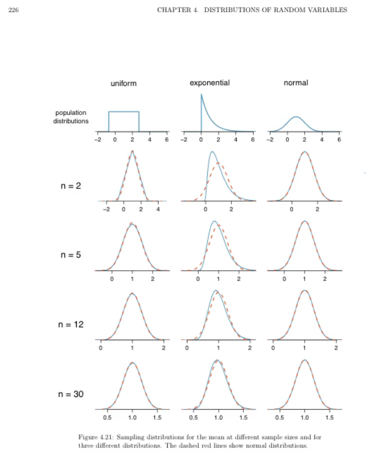

# 概率

## 概率和统计的区别

1. 参考
   1. 文字参考<https://blog.csdn.net/u011508640/article/details/72815981>
   2. 视频参考<https://www.bilibili.com/video/BV1Y64y1Q7hi?spm_id_from=333.337.search-card.all.click>。这个视频会把最大似然估计说清楚。在下面的最大似然估计章节中会详细说明。
2. 说明：**概率是已知模型和参数，推数据。统计是已知数据，推模型和参数**。
   - 在现实世界中有很多种情况，一种情况是我们知道模型了，需要对可能出现的结果来进行预测。另一种情况，我们只有数据，大概能猜出来模型是什么样子的，但是模型的具体参数并不知道。我们就需要用一种方法来估计模型的参数。
   - 概率研究的问题是，已知一个模型和参数，怎么去预测这个模型产生的结果的特性（例如均值，方差，协方差等等）。 举个例子，我想研究怎么养猪（模型是猪），我选好了想养的品种、喂养方式、猪棚的设计等等（选择参数），我想知道我养出来的猪大概能有多肥，肉质怎么样（预测结果）。
   - 统计研究的问题则相反。统计是，有一堆数据，要利用这堆数据去预测模型和参数。仍以猪为例。现在我买到了一堆肉，通过观察和判断，我确定这是猪肉（这就确定了模型。在实际研究中，也是通过观察数据推测模型是／像高斯分布的、指数分布的、拉普拉斯分布的等等），然后，可以进一步研究，判定这猪的品种、这是圈养猪还是跑山猪还是网易猪，等等（推测模型参数）。

## 几个重要知识点

1. 常用统计变量
   1. 样本均值：$E(X) = \overline{X} = \frac{1}{n} \sum \limits_{i=1}^{n}x_i$
   2. 样本方差
      1. 概率密度函数：$D(X) = S^2 = \frac{1}{n-1} \sum \limits_{i=1}^{n}(x_i - \overline{X})^2 = \frac{1}{n-1} \sum \limits_{i=1}^{n}(x_i^2 - n\overline{X})$
      2. 含义：**与均值的偏离程度**。
      3. 之所以除以的是(n-1)是因为要做方差的极大似然估计。具体的含义以后再说明。
   3. 标准差
      1. 概率密度函数：$\sqrt{D(X)}=\sqrt{\frac{1}{n-1} \sum \limits_{i=1}^{n}(x_i - \overline{X})^2}$
      2. 实际就是将方差开了根号。也就是说从也是表示与均值的偏离程度。
2. 常见概率分布
   1. 均匀分布
      1. 概率密度函数：$f(x)=\frac{1}{b-a},\, a<x<b$
      2. 含义：在a到b的范围能，概率一样。
   2. 正态分布（高斯分布）
      1. 概率密度函数：$f(x) = \frac{1}{\sqrt{2 \pi}\sigma} exp(-\frac{(x-\mu)^2}{2\sigma^2})$
      2. 其中参数的含义：$\mu$表示的是均值的位置，$\sigma$表示的是样本方差。
      3. 在说$\sigma$的时候，表示的含义都是在$\mu \pm \sigma$的范围内样本所占的比重。也就是表示对应在的均值左右一个方差的范围内样本数量占样本空间数量的比例。以此类推，可以求$\mu \pm 2\sigma$的范围内样本所占的比重。
   3. 指数分布
      1. 概率密度函数：$\begin{cases} \lambda e^{-\lambda x}, & \text {x} \geqslant 0 \\ 0, & \text{x<0} \end{cases}$
3. 重要概率公式。
   1. 注意事件和随机变量的关系。事件是通过随机变量在样本空间中的取值来定义的。从另外一个角度上来说随机变量就代替的事件的含义，因为随机变量的取值有时候在公式中略写了。
   2. 联合概率（join probability）
      1. 定义$P(A=a,B=b)$，在样本空间$\Omega$下，事件A=a和事件B=b同时发生的概率。
      2. $P(A=a,B=b)\leqslant P(A=a),\,P(A=a,B=b)\leqslant P(B=b)$。解释事件A=a和事件B=b同时必定需要A=a发生，B=b也必须发生；因此事件A=a和事件B=b同时发生的概率不可能大于事件A=a或者事件B=b单独发生的概率。
   3. 条件概率（conditional probability）。条件概率是通过联合概率来定义的。联合概率的定义提供了一个比率：$0 \leqslant \frac{P(A=a,B=b)}{P(A)} \leqslant 1$。这样定义了条件概率。
      1. $P(B|A)=\frac{P(AB)}{P(A)}$
      2. $P(B|A)$在A发生情况下B发生的概率。$P(AB)$表示A和B同时发生的概率。$P(A)$独立发生的概率。
   4. 全概率公式
      1. $P(B)=P(B|A_1)P(A_1) + P(B|A_2)P(A_2) + \cdots + P(B|A_n)P(A_n) = \sum\limits_{i=1}^n(P(B|A_i)P(A_i))$
      2. 含义：也就是将B发生的概率分为了多种情况。每种情况（$A_i$）与B的交集的全集就是B。。全概率公式表示的
   5. 贝叶斯公式
      1. $P(A_i|B)=\frac{P(A_i)P(B|A_i)}{\sum\limits_{j=1}^n(P(B|A_j)P(A_j))} \overset{\text{分母用全概率公式}}{=} \frac{P(A_i)P(B|A_i)}{P(B)} \overset{\text{分子用条件概率公式}}{=} \frac{P(A_i B)}{P(B)}\overset{\text{事件两两相互独立}}{=} P(A_i),\quad i=1,2,\cdots, n.$
      2. 含义：已知每个条件（每个条件本身是一个事件）本身发生的概率，并且B事件真的发生，然后求属于哪一类？
      3. 举例，看第二个例子：
         1. 。**这个例子要说清楚**！通过天气、湿度、风级来判断是否适合去打球。一共14条数据，其中5条是不适合打球，9条适合打球。在不知道天气、湿度、风级3个信息的情况下，能打球的的概率是$\frac{9}{14}$，这个概率就是先验概率。然后知道3个信息的情况下再计算是否能打球的概率，这就是后验概率。[重要-参考讲解视频](https://www.bilibili.com/video/BV1a4411B7B4?spm_id_from=333.337.search-card.all.click)
         2. **这个例子说得非常形象**：我们假设响警报的目的就是想说汽车被砸了。把A计作“汽车被砸了”，B计作“警报响了”，带进贝叶斯公式里看。我们想求等式左边发生$A|B$的概率，这是在说警报响了，汽车也确实被砸了。汽车被砸**引起（trigger）**警报响，即$B|A$。但是，也有可能是汽车被小孩子皮球踢了一下、被行人碰了一下等其他原因（统统计作$\sim A$），其他原因引起汽车警报响了，即$B|\sim A$。那么，现在突然听见警报响了，这时汽车已经被砸了的概率是多少呢（这即是说，警报响这个证据有了，多大把握能相信它确实是在报警说汽车被砸了）？想一想，应当这样来计算。用警报响起、汽车也被砸了这事件的数量，除以响警报事件的数量。进一步展开，即警报响起、汽车也被砸了的事件的数量，除以警报响起、汽车被砸了的事件数量加上警报响起、汽车没被砸的事件数量。
      4. 这个实质是先验概率和后验概率的问题。贝叶斯公式是通过先验概率求后验概率。
      5. 贝叶斯公式是乘法公式的转换。如果现在多条件变为只有一个条件，那么贝叶斯公式就是乘法公式。$P(B)=P(B|A)P(A)=P(A|B)P(B),\quad P(B|A)=\frac{P(AB)}{P(A)},\quad P(A|B)=\frac{P(AB)}{P(B)}, \quad P(B|A)+P(\overline{B}|A)=1$
4. 事件独立。当多个事件之间是独立的有以下性质：
   1. 事件相互独立时以下四个命题等价：
      1. 事件A与B相互独立，用数学符号表示为：$A \bot B$；
      2. 事件A与$\overline{B}$相互独立；
      3. 事件$\overline{A}$与B相互独立；
      4. 事件$\overline{A}$与$\overline{B}$相互独立；
   2. $P(A_1A_2\cdots A_n)=\prod \limits_{i=1}^n P(A_i)=\prod \limits_{i=1}^n p_i$
      1. 含义：$\color{red}{各个独立事件之间交集发生的概率等于各个独立事件发生概率之积}$。这一点非常重要！
   3. 互不相容（互斥）说的是样本之间，互相独立说的是样本发生的概率之间。**A和B相互独立，不能说明A和B之间是否共有样本点**。
      1. 这里需要注意的是互斥和独立之间的区别。**互斥应该是说两个事件之间的样本完全没有交集。而两个时间独立他们的样本可能有交集**。
      2. **互斥是用样本的角度来描述两个事件。独立是从概率的角度来描述两个事件**。
5. 引入随机变量的目的：用于表示事件中对应的对应取到的样本，这样方便对事件进行分析。

## example

### 联合概率、条件概率、贝叶斯定理的应用

XXXX

<!-- 以下是按照课本里面的顺序的梳理 -->
## 基本概念

1. 排列：从n个不同元素中，任取m($m \leqslant n$,m与n均为自然数,下同）个**不同的元素**按照一定的顺序排成一列，叫做从n个不同元素中取出m个元素的一个排列；从n个不同元素中取出m($m \leqslant n$）个元素的所有排列的个数，叫做从n个不同元素中取出m个元素的排列数，用符号$A(n,m)$或$A_n^m$表示。其中定义$0!=1$。
   $$A_n^m=n(n-1)(n-2)\cdots(n-m+1)=\frac{n!}{(n-m)!}$$
    从n个不同元素中全部取出的排列称为全排列，其排列的种数记为：
    $$A_n=n(n-1)(n-2)\cdots1=n!$$

2. 组合：从n个不同元素中，任取m($m \leqslant n$）个元素并成一组，叫做从n个**不同元素**中取出m个元素的一个组合；从n个不同元素中取出m($m \leqslant n$）个元素的所有组合的个数，叫做从n个不同元素中取出m个元素的组合数。用符号 C(n,m) 表示。
   $$\begin{aligned}
      &C_n^m=\frac{A_n^m}{m!}=\frac{n!}{m!(n-m)!}\\
      &C_n^m=C_n^{n-m}\\
      &C_n^m=C_{n-1}^m+C_{n-1}^{m-1}
      &\text{其中}n\geq m
   \end{aligned}
   $$

## 1 随机事件和概率

### 1.1 随机试验和随机事件概念

1. 随机事件：满足以下3个条件称为随机试验：
   1. 可在相同的条件下重复进行；
   2. 每次试验的结果不止一个；
   3. 试验之前不能确定哪一个结果会发生，但所有的结果是明确可知的。
2. 样本空间：随机试验的所有可能结果所组成的集合称为样本空间，常记为$\Omega$，$\Omega$中的元素称为样本点。
3. 随机事件：样本空间的子集，即试验结果称为随机事件，称为事件。
4. 基本事件：一个样本点组成的单点集，称为基本事件。
5. 必然事件：$\Omega$每次试验中一定发生的事件。
6. 不可能事件：$\varnothing$每次试验中一定不发生的事件。

#### 事件的关系及其运算

1. 事件的包含：弱事件A发生必然导致事件B发生，则称事件B包含A（或A包含于B），记为$B\supset A$。
2. 事件相等：若$A\supset B$且$B\supset A$，则称事件A与B相等，记为A=B。
3. 事件A和B的和（并）：$A\cup B$或者A+B表示事件A与B至少有一个发生。也就是表示A和B的并集。
   1. $\bigcup \limits_{k=1}^{n}A_k$表示n个事件$A_1,A_2,\cdots,A_n$至少有一个发生。
   2. $\bigcup \limits_{k=1}^{\infty}A_k$表示$A_1,A_2,\cdots,A_k,\cdots$至少一个发生。
   3. $A\subset A \cup B, B\subset A \cup B.$
   4. $A\cap(A \cup B)=A, B \cap (A \cup B)=B.$
   5. $A \cup A = A$
4. 事件$A\cap B=\{\omega: \omega \in A \text{且}\omega \in B\}$称为事件A与事件B的积事件（或交事件）。
5. 差事件：事件$A-B=\{\omega: \omega \in A \text{且}]\omega \notin B\}$称为事件A与事件B的差事件。而且差事件可以表示为：$A-B = A\cap \overline{B}=A\overline{B}$。
6. **互不相容**也称为互斥：如果$A \cap B =\varnothing$，那么称为事件A与事件B互不相容（或互斥）。它的含义是：事件A与事件B在1次试验后不会同时发生。如果一组事件（可以由无限个事件组成）中任意两个时间都互不相容，那么称这组事件**两两互不相容**。
   1. 这里需要注意的是互斥和独立之间的区别。**互斥应该是说两个事件之间的样本完全没有交集。而两个时间独立他们的样本可能有交集**。
   2. **互斥是用样本的角度来描述两个事件。独立是从概率的角度来描述两个事件**。
7. 集合论中的运算规律：
   1. 交换律：$A \cup B = B \cup A, A \cap B = B \cap A$
   2. 结合律：$A \cup (B \cup C) = (A \cup B) \cup C, A \cap (B \cap C) = (A \cap B) \cap C$
   3. 分配率：$A \cup (B \cap C) = (A \cup B)\cap (A \cup C), A \cap (B \cup C) = (A \cap B)\cup (A \cap C)$
   4. 摩根法则：$\overline{A \cup B}=\overline{A}\cap \overline{B}, \overline{A\cap B}=\overline{A} \cup \overline{B}$
8. 其他计算规律
   1. $AB \cap A\overline{B} = \varnothing$
   2. $AB \cup A\overline{B} = A$
   3. $ABC \cap AB\overline{C} = \varnothing$
   4. $ABC \cup AB\overline{C} = AB$
   5. $P(AB)=P(A) + P(B) - P(A\cup B)$。自己手工画一个概率图就可以清晰的得到这个公式的结果。说明的是$P(A) + P(B)$将包含了$P(A \cap B)$部分两次，所以减去$P(A\cup B)$时将$P(A \cap B)$减去了一次。

#### 概率的定义

1. 概率的定义。设随机实验E的样本空间为$\Omega$，则称满足下列条件的事情集上的函数$P()$为概率：
   1. 对于任意事件A，$P(A)\geq 0$（非负性）；
   2. 对于必然事件$\Omega, P(\Omega)=1$（规范性）；
   3. 设$A_1,A_2,\cdots,A_n,\cdots$为**两两互不相容**的事件，即$A_iA_j=\varnothing(i\not ={j},i,j=1,2,\cdots)$则$P(\bigcup \limits_{k=1}^{\infty}A_k)=\sum \limits_{k=1}^{\infty}P(A_k)$（可加性）。
2. 重要性质
   1. $P(\varnothing)=0$。
   2. 有限可加性：$P(A_1 \cup \cdots \cup A_n)=P(a_1) + \cdots + P(A_n)$。
   3. 对于任意一个事件A，$P(\overline{A}) = 1 - P(A)$。
   4. 当事件A,B满足$A \subset B$时，$P(B-A) = P(B) - P(A), P(A)\leqslant P(B)$。
   5. 对于任意事件A，$P(A)\leqslant 1$。
   6. **加法公式**，这也是相容性条件：对于任意两个事件A和B：$P(A \cup B) = P(A) + P(B) - P(AB)$。

#### 重要概型

1. 古典概型：如果随机试验E满足下面条件即称为古典概型：
   1. 试验的样本空间$\Omega$的元素只有有限个。
   2. 样本空间中每个元素，即基本事件发生的可能性相同，则称此试验为古典概型。对于古典概型，事件A的概率有下列计算公式：
   $$P(A)=\frac{A\text{中基本事件数}}{\Omega\text{中基本事件总数}}$$
2. 几何概型：如果随机试验E的样本空间$\Omega$为欧氏空间中的一个区域，且每个样本点的出现具有等可能性，则称此试验为几何概型。对于几何概型，事件A的概率有下列计算公式：
   $$P(A)=\frac{A的度量(长度,面积,体积)}{\Omega 的度量(长度,面积,体积)}$$
3. **贝努利(Bernoulli)概型**：如果试验E的结果只有两个：$A\text{与}\overline{A}$，则称此试验为贝努利概型（试验）。若贝努利试验独立重复n次，则称为n重贝努利概型，简称贝努利概型，若$P(A)=p$，则n次试验中时间A发生k次的概率为：
   $$P_n(k)=C_n^kp^k(1-p)^{n-k},k=0,1,\cdots,n$$

#### 条件概率和事件的独立性

1. 条件概率
   设A,B是两个事件，且P(A)>0，称
   $$P(B|A)=\frac{P(AB)}{P(A)}, \text{其中}AB=A\cap B$$
   为在事件A发生的条件下事件B发生的条件概率。

## 2 随机变量及其分布

1. 联合概率
   1. 概率分布或者概率函数（两个是一个东西），一般由两种表示方式：一个是式子的方式，另一个是表格的形式。
   2. 联合概率函数或者分布（就是多维变量的情况下的概率分布或概率函数）也是由两种表示方式：一个是式子的方式，另一个是表格的形式。常用表格的形式表示。这样更直观。这个多维变量可能是多个事件。
2. 边缘概率
   1. 就是在联合概率分布中对应的对行或者对列求或者得到的对应的概率分布。
   2. 可以通过联合概率函数来求对应变量的边缘概率函数。但是不能通过对应变量的边缘概率函数来求联合概率函数。
   3. 概率分布相同，并不能说两个随机变量相同（两个事件是两个不同的事件，但是它们的概率分布相同）。
   4. 在通过边缘概率分布求解联合概率分布的时候，注意只有在独立的事件之间求并集的时候才能使用可加性。
3. 书籍变量的独立性与条件分布
   1. 独立的条件是联合概率等于独立事件概率的乘积。
   2. 也就是联合概率等于边缘概率的乘积。一般由放回的抽样都是独立事件。不放回的一般都不是独立事件。
   3. 条件概率是通过边缘概率和联合概率来定义的。通过联合概率的值除以对应条件的边缘概率值。

## 3 随机变量的数字特征

1. 分布函数满足积分的可加性。
2. 指数分布常用于优质产品的寿命。
3. 指数分布具备无后效性。
4. 连续型随机变量表示变量范围的等号可有可无，离散型的有就是有，没有就是没有。
5. 误差可以通过正态分布来刻画。
6. **任意的正态分布都可以转化为标准正态分布**。
   1. 正态分布是关于$\mu$对称。
   2. 正态分布密度函数在$x = \mu$处取得最大值，$f(\mu) = \frac{1}{\sqrt{2\pi}\sigma}$。
   3. 当$|x|\rightarrow \infty$时，有$f(x)\rightarrow 0$。也就是说在$x = \mu$处取得最大值，向两边单调递减。

### 3.1 期望

期望实际上反映的是随机变量的平均取值。

1. 数学期望（掌握常用概型的数学期望，会推导）
   1. 离散型的随机变量的数学期望
      1. 要求级数绝对收敛。
      2. $E(X)=\sum\limits_{k=0}^{n}xf(x)dx$
   2. 连续型的随机变量的数学期望
      1. 要求积分绝对收敛
      2. $E(X)=\int_{-\infty}^{+\infty}xf(x)dx$
   3. 需要掌握的知识点
      1. 定义
      2. 6个常用的分布的数学期望
      3. 性质
2. 泊松分布的期望
   $$
      \text{泊松分布的密度函数：}P(x=k)=\frac{\lambda^k}{k!}e^{-\lambda}\, , k=0,1,2,\cdots \\
      E(P)=\sum\limits_{k=0}^{n} {xf(x)} {\rm d}x=\sum\limits_{k=0}^{n} (k\frac{\lambda^k}{k!}e^{-\lambda})\\
      =e^{-\lambda}\sum\limits_{k=0}^{n}\frac{\lambda^k}{(k-1)!}\\
      = e^{-\lambda}\sum\limits_{k=1}^{n}\frac{\lambda^{k-1}}{(k-1)!} \text{这里k的取值范围从0开始修改为了从1开始，可以理解为做了换元}\\
      \because e^x = 1+x+\frac{x^2}{2!} + \frac{x^3}{3!} +\cdots +\frac{x^n}{n!}+C =\sum\limits_{i=0}^{n}\frac{x^i}{i!}\\
      \therefore = e^{-\lambda}\lambda e^{\lambda}\\
      = \lambda
      $$
   在取值范围上的奇函数的积分是等于0的。

3. 期望的性质，$k,l,c$都是常数。
   1. $E(c)=c$
   2. $E(kX + c)=kE(X)+c$
   3. $E(kX + lY)=kE(X)+lE(Y)$
   4. $\text{X,Y相互独立时}E(XY)=E(X)E(Y)$
   5. 没有这条性质：$E(g(x))=g(E(X))$

### 3.2 方差

1. 方差与标准方差。在很多情况下希望衡量随机变量$X$与期望之间的偏差，这是通过方差来量化的。
2. 含义：方差反映随机变量的取值相对于它的期望的平均偏离程度
3. 在工程技术中广泛地使用标准差，**因为它与随机变量本身有相同的量纲**，但在理论推导中，使用方差较方便。
    1. 定义：方差$D(X)=E\{[X-E(X)]^2\}$，标准差$\sqrt{D(X)}$。
    2. 本质上是随机变量$g(X)=[X-E(X)]^2$的期望。
    3. 计算上更多的使用的公式是$D(X)=E(X^2)-[E(X)]^2$。当E(X)=0时，$D(X)=E(X^2)$。
4. 方差性质，设k和c都是常数。
   1. $D(c)=0$；反之，如果某个随机变量X的方差为0，那么$P(X=c)=1$，其中$c=E(X)$。
   2. $D(kX+c)=k^2D(X)$
   3. $D(X\pm Y)=D(X)+D(Y) \pm 2E\{[X-E(X)][Y-E(Y)]\}=D(X)+D(Y) \pm 2cov(X,Y)$
   4. 当X与Y相互独立时，$D(X\pm Y)=D(X)+D(Y)$
5. 其他数字特征
   1. 定义：$X_* = X-E(X)$，称$X_*$为X的中心化随机变量。
   2. 定义：$X^*=\frac{X-E(X)}{\sqrt{D(X)}}$，称$X^*$为X的标准化随机变量。$X^*$是一个无量纲的随机变量。

### 3.3 协方差

1. 含义：对于一个二维随机变量(X,Y)，期望与方差只是反映了X、Y各自的平均取值与各自相对于其均值的偏离程度，没有反映出X与Y之间的相互联系。
2. 定义：$cov(X, Y)\coloneqq E\{[X-E(X)][Y-E(Y)]\}$为X与Y之间的协方差。
3. 性质
   1. $cov(X, X)=D(X)$
   2. $cov(X, Y)=E(XY)-E(X)E(Y)$
   3. $cov(X, Y)=cov(Y, X)$
   4. $cov(X, c)=0$
   5. $cov(kX, lY)=klcov(X, Y)$
   6. $cov(\sum\limits_{i=1}^m X_i, \sum\limits_{j=1}^n Y_j)=\sum\limits_{i=1}^m \sum\limits_{j=1}^n cov(X_i, Y_j)$
      1. 有三个元素的表达$cov(X_1+X_2+X_3, Y_1+Y_2+Y_3)=cov(X_1,Y_1) + cov(X_1,Y_2) + cov(X_1,Y_3) + cov(X_2,Y_1) + cov(X_2,Y_2) + cov(X_2,Y_3) + cov(X_3,Y_1) + cov(X_3,Y_2) + cov(X_3,Y_3)$
   7. $cov(X+Y, X-Y)=D(X)-D(Y)$。有性质6展开可以证明。

### 3.4 相关系数

1. 含义：用于反应两个随机变量之间的线性关系和线性关系的程度。协方差是把X,Y分别中心化后的$E(X_* Y_*)$，它的值受X与Y量纲大小的影响。为了消除这一影响，我们采用把X，Y标准化后的$E(X^*Y^*)$作为反映X与Y之间相互联系的数字特征。
2. 定义：设$(X,Y)$是一个随机变量，当$D(X)>0, D(Y)>0$时，称$E(X^*Y^*)$为X与Y的相关系数，记作$\rho (X,Y)$。$\rho (X,Y)\coloneqq E[\frac{X-E(X)}{\sqrt{D(X)}}\frac{Y-E(Y)}{\sqrt{D(Y)}}]=\frac{cov(X,Y)}{\sqrt{D(X)D(Y)}}$。
3. 在相关系数的定义之下，$D(X \pm Y) = D(X)+D(Y) \pm 2\rho (X,Y) \sqrt{D(X)D(Y)}$。
4. 性质。当$D(X)>0, D(Y)>0$时
   1. $\rho (X,Y)=\rho (Y,X)$
   2. $|\rho (X,Y)| \leqslant 1$
   3. $|\rho (X,Y)| = 1$的充分必要条件是：存在不为0的常数k与常数c，使得$P(Y=kX+c)=1$。
5. 当$|\rho (X,Y)| = \pm 1$时，X与Y之间以概率1成立线性关系。
6. 相关和独立之间的关系
   1. 相关只用于表明X与Y之间是否存在线性关系。
   2. 独立是从全局上描述X与Y之间的关系。
   3. 独立作为条件式更为强一些。
   4. 独立$\Rightarrow$不相关，相关$\Rightarrow$不独立。
7. 如果二维随机变量$(X,Y)\backsim N(\mu_1, \mu_2, \sigma_1^2 \sigma_2^2, \rho) \bigvee (X,Y)\backsim B(1,1,p_1,p_2)$（服从二维正态分布或服从二维试验1次的二项式分布），那么X与Y相互独立等价于X与Y不相关。
   1. 二维正态分布可以推出X和Y的边缘分布满足一维正态分布。
   2. 两个一维正态分布不能推出两者的结合满足二维正态分布。
8. 如果X和Y相互独立$\Rightarrow$
   1. $E(XY)=E(X)E(Y)$
   2. $D(X+Y) = D(X)+D(Y)$
   3. $cov(X,Y)=0$
   4. $\rho(X,Y)=0$
   5. 而且1,2,3,4等价。但是1、2、3、4不能反推X和Y独立。
9. X与Y独立$\Rightarrow$ $X^2$与$Y^2$独立。反之不成立。另外，与上面结论无关的一条公式：$E(X^2)=D(X)+(E(X))^2$。

## 4 大数定理和中心极限定理

大数定理描述了事件发生频率的稳定性。

### 参考

1. [重要参考，说得非常清晰](https://www.bilibili.com/video/BV14r4y1T7EN?spm_id_from=333.337.search-card.all.click)

### 说明

1. 林德伯格-列维中心极限定理
   设$X_1,X_2,\cdots$为独立同分布的随机变量序列，$E(X_i)=\mu,D(X_i)=\sigma^2,i=1,2,3\cdots$则对任意实数$x$，有
   $$
   \begin{aligned}
   & \lim_{n\rightarrow \infty}[\frac{\sum\limits_{i=1}^n X_i - n\mu}{\sqrt{n}\sigma} \leqslant x]=\Phi (x) =\frac{1}{\sqrt{2\pi}}\int_{-\infty}^x {x^2} \,{e^{-\frac{t^2}{2}} d}t\\
   & \Phi (x) \text{是满足}\sim \mathcal{N}(0,1)\text{的高斯分布。}\\
   \end{aligned}
   $$

2. Central Limit Theorem推导
   $$
   \begin{aligned}
   & \text{the problem is 想知道学校学生的平均身高。}\\
   & \text{采用的方法是对所有的学生进行抽样。一共抽取100组学生，每组30位学生。这就意味着}n=30\\
   & \text{这个时候关心的是100组抽样分别得到的100组身高均值服从什么分布。（这也回答了这一组均值的中心、形状、分散度的情况）。得到的一组均值为：}\\
   & \overline{X}_1, \overline{X}_2, \overline{X}_3,\cdots, \overline{X}_{100}\\
   & \text{直觉上可以知道这一组均值的形状是非常紧凑的，都非常集中的集中在真实身高均值的附近。这组均值的集中度相对高，分散度相对小。}\\
   & \text{假设真实数据的均值为175cm，那么这组100个均值的最小值可能是169cm，最大值可能是179cm。}\\
   & \text{真实数据的最小值可能是145cm，最大值可能是195cm。真实数据相对分散。}\\
   & \text{这100个均值是服从正态分布的。}\overline{X} \sim \mathcal{N}(\mu,(\frac{\sigma}{\sqrt{n}})^2)\\
   & \text{中心极限定理的思想：**无论原始数据服从什么分布**，只要每次取的样本量足够大（n一般大于等于30），那么取的**样本的均值**近似的服从正态分布。}\\
   \end{aligned}
   $$
   \
   也就是说当$n\leqslant 30$时，均值的分布就已经非常接近正态分布。如图所示population distributions含义是总体的分布。uniform表示均匀分布，exponential表示指数分布，normal正态分布。当$n=2$的时候，均匀分布和指数分布的均值分布还与正态分布差别比较大。当n逐渐增大时，均值的分布越来越接近正态分布。当$n= 30$时均值的分布已经和正态分布非常接近了。这也说明了为什么正态分布是所有分布中最重要的一种分布形式。后面置信区间和假设检验都是基于正态分布和中心极限定理上的。
   $$
   \begin{aligned}
   & \overline{X} \sim \mathcal{N}(\mu,(\frac{\sigma}{\sqrt{n}})^2)\\
   & \text{set }\, Z=\frac{\overline{X}-\mu}{\frac{\sigma}{\sqrt{n}}}\sim \mathcal{N}(0,1)\\
   & P(z<x)\approx \Phi (x)\\
   & \Rightarrow P(\frac{\overline{X}-\mu}{\frac{\sigma}{\sqrt{n}}}<x)\approx \Phi (x)\\
   & \because \frac{\overline{X}-\mu}{\frac{\sigma}{\sqrt{n}}} <x\\
   & \text{分子分母同时乘以}n.\\
   & \Rightarrow \frac{n\overline{X}-n\mu}{\sqrt{n}\sigma}<x\\
   & \because \overline{X} = \frac{\sum\limits_{i=1}^n x_i}{n} \\
   & n \overline{X} = \sum\limits_{i=1}^n x_i\\
   & \therefore \frac{\sum\limits_{i=1}^n x_i -n\mu}{\sqrt{n}\sigma} <x\\
   & \Rightarrow P(\frac{\sum\limits_{i=1}^n x_i -n\mu}{\sqrt{n}\sigma} <x) \approx \Phi (x)\\
   & \Rightarrow \lim_{n\rightarrow \infty}P(\frac{\sum\limits_{i=1}^n x_i -n\mu}{\sqrt{n}\sigma} <x)= \Phi (x), \text{注意约等于换成等于了。}\\
   & \text{Completed.}\\
   \end{aligned}
   $$

## 5 数理统计的基本概念

## 6 参数估计

1. 极大似然估计是一种参数估计问题。
2. 估计分为：
   1. 非参数估计。通过样本对样本空间的分布进行估计。也就是估计样本空间的整体概率密度分布函数或者分布的形式。这不是本章的重点。
   2. 参数估计。可以认为是非参数估计的进一步工作。参数估计就是在已经概率分布的情况下，对分布函数的未知参数进行估计。参数估计分为：
      1. 点估计：用于相对准确的估计未知参数的值。
      2. 区间估计：用于估计未知参数的范围。
3. 参数点估计的两种方法。**注意：两种方法估计的结果有可能是不相同的。一般认为极大似然估计的效果比矩估计的效果要好一些**。
   1. 矩估计。矩估计的基本思想是“替换”，即用样本原点矩替换相应的总体$X$的原点矩。
      1. 定义：设$(X_1,X_2,\cdots,X_n)$是取自总体$X$的一个样本，记为$\alpha_k \coloneqq E(X^k),k=1,2,\cdots$。如果未知参数$\theta=\phi(\alpha_1,\alpha_2,\cdots,\alpha_m)$，那么称估计量$\hat{\theta}=\phi(A_1,A_2,\cdots,A_m)$为$\theta$的矩估计。
   2. 极大似然估计。极大似然估计是在求似然函数的最大值。极大似然估计是在联合概率的情况下定义的。原因在于：在一次连续抽样的过程中，这些样本同时出现的概率是这些样本的联合概率。由此得出似然函数的定义（大写$X_i$和小写$x_i$的区别在于：$X_i$代表的是样本的变量，$x_i$表示的是$X_i$对应的值）：设$(X_1,X_2,\cdots,X_n)$是取自总体$X$的一个样本，X的密度函数（或者概率函数）为$\it{f}(x; \theta),\theta \in \Theta$，其中$\theta$是总体参数，$\Theta$是参数空间。这里我们用$\it{f}(x; \theta)$代替常用的$\it{f}(x)$是为了强调总体分布的类型已知，但总体参数$\theta$未知（其实就是样本值已知，但是不知道样本分布函数对应的参数值。之前统计是通过参数求样本的值，现在是通过样本求参数的值）。称自变量为$\theta$，定义域为$\Theta$的非负函数。
      $$
      L(\theta) = L(\theta;x_1,x_2,\cdots,x_n) \coloneqq \prod \limits_{i=1}^n \it{f}(x_i; \theta), \theta \in \Theta
      $$
      为似然函数。注意，因为$x_1,x_2,\cdots,x_n$是已知的。所以，似然函数也可以简单地记为$L(\theta)$。注意似然函数是人为定义的。
   3. 计算举例
   4. 几种重要分布的矩估计
      1. $X\sim B(1,p)$

## 7 假设检验

## 8 回归分析与方差分析

## 9 其他模型

### 高斯混合模型

[参考视频](https://www.bilibili.com/video/BV13b411w7Xj?p=2&spm_id_from=pageDriver)

1. 从几何角度来看，它是多个高斯分布通过加权平均叠加而成的。形式化的表示如下公式：$p(x)=\sum\limits_{k=1}^{K} \alpha_k N(x|\mu_k,\sum_k), \sum\limits_{k=1}^K \alpha_k =1$。其中$\alpha_k$表示多个高斯的加权值，在这个公式里面还不知道这个值是多少。$N(x|\mu_k,\sum_k)$表示特定高斯分布的参数：期望和方差。
   1. 对高斯混合模型有两种视角来说明，一种是几何角度来解释；另一种是通过混合模型的角度来解释。
2. 对应于一个特定样本点，不能简单的说这个样本属于那个高斯分布。正确且准确的说法是：该样本属于某个高斯分布的概率是多少，同时属于另一个高斯分布的概率是多少。
3. 直接对GMM使用MLE（Maximum Likelihood Estimate， 极大似然估计）
4. 似然和概率的区别：简单来讲，似然与概率分别是针对不同内容的估计和近似。概率(密度)表达给定$\theta$下样本随机向量$\boldsymbol{X}=\boldsymbol{x}$的可能性，而似然表达了给定样本$\boldsymbol{X}=\boldsymbol{x}$下参数$\boldsymbol{\theta}=\boldsymbol{\theta}_1$(相对于另外的参数取值$\boldsymbol{\theta}_2$)为真实值的可能性.换言之, 似然函数的形式是$\boldsymbol{L}(\theta | x)$,其中"|"代表的是条件概率或者条件分布,因此似然函数是在"已知"样本随机变量$\boldsymbol{X}=\boldsymbol{x}$的情况下,估计参数空间中的参数$\theta$的值. 因此似然函数是关于参数$\theta$的函数,即给定样本随机变量$\boldsymbol{x}$后,估计能够使$\boldsymbol{X}$的取值成为$\boldsymbol{x}$的参数$\theta$的可能性; 而概率密度函数的定义形式是$f(x|\theta)$, 即概率密度函数是在"已知"$\theta$的情况下,去估计样本随机变量$\boldsymbol{x}$出现的可能性。**似然估计能够使$\boldsymbol{X}$的取值成为$\boldsymbol{x}$的参数$\theta$的可能性**[参考](https://blog.csdn.net/songyu0120/article/details/85059149)。

### 最大似然估计 Maximum Likilihood Estimation

1. 一句话总结：概率是已知模型和参数，推数据。统计是已知数据，推模型和参数。最大似然估计就是在估计模型的参数。也就是说**最大似然估计是已知模型和样本，来估计模型的参数**。
2. 参考
   1. 文字参考
      1. [直接的说明](https://zhuanlan.zhihu.com/p/26614750)
      2. [比较了概率和统计的区别，同时也说了最大似然估计的概念](https://blog.csdn.net/u011508640/article/details/72815981)。
   2. 视频讲解的例子参考<https://www.bilibili.com/video/BV1Hb4y1m7rE?spm_id_from=333.337.search-card.all.click>。

3. 离散值的例子：

   设一个袋子里有非常多的小球（样本数量：非常大。也就忽略的放回抽样和不放回抽样），**极大似然估计中采样需满足一个重要的假设，就是所有的采样都是独立同分布的**。其中有两种样本，一种是白球，定义为样本1；一种是红球，定义为样本2。两种样本数量的比值如下表所示，其中$\theta$是未知的：

   |X|样本1|样本2|
   |---|---|---|
   |P|$\theta$|$1-\theta$|

   如何判断袋子中小球的分布呢？自然就想到的抽样的方式来对袋子中的小球的分布进行判断。现在假设从袋子中按照顺序抽出了5个小球，分别是1、1、2、1、2。那么它们的抽样情况如下表所示：

   |抽样结构（按顺序）|1|1|2|1|2|
   |---|---|---|---|---|---|
   |抽出该样本的概率|$\theta$|$\theta$|$1-\theta$|$\theta$|$1-\theta$|

   抽出这个顺序样本的概率为$L(\theta)=\theta\theta (1-\theta)\theta(1-\theta)=\theta^3(1-\theta)^2$，定义$L(\theta)$为似然函数。抽出这组样本的概率显然是会随着$\theta$的变化而变化。随着$\theta$的变化$L(\theta)$有无数种值，然后按照“存在即合理”的思想，直接认为应该让$L(\theta)$最大的$\theta$为被选择的分布（实际上这个地方还是没有理解清楚其中的逻辑，但是先这样使用）。<https://zhuanlan.zhihu.com/p/26614750>中给出的说明是一个反问句式：“那么既然事情已经发生了，为什么不让这个出现的结果的可能性最大呢？这也就是最大似然估计的核心”。\

   这里进行说明为什么需要求最大。在视频<https://www.bilibili.com/video/BV1Y64y1Q7hi?spm_id_from=333.337.search-card.all.click>中的8:30开始说明这个问题。

   描述性的说明，这个描述对于理解非常重要：
   1. 在抛硬币的例子中，每次抛硬币事件的分布如下：
      |X|正面|反面|
      |---|---|---|
      |P|$\theta$|$1-\theta$|
   2. 如果抛了10次，得到的10次结果为：7次正面，3次反面。
   3. 因为只有2个样本，我们猜测模型是二项分布也就是(0-1)分布模型。这个时候就希望能将$\theta$的值估计出来。
   4. 这里需要强调的一点：
      一种分布A如下：

      |X|正面|反面|
      |---|---|---|
      |P|0.1|0.9|

      一种分布B如下：

      |X|正面|反面|
      |---|---|---|
      |P|0.7|0.3|

      一种分布C如下：

      |X|正面|反面|
      |---|---|---|
      |P|0.8|0.2|

      在实际抛的过程中都是有可能出现7次正面，3次反面的情况的。只不过它们出现这种情况的概率不同而已。这个过程就是在某种模型的情况下求某次事件的条件概率。
   5. 这个时候就需要通过已知的抽样结果：7次正面，3次反面。**来估计具有最大似然（这里表述为似然，而不是概率了。因为是从统计结果分析模型参数了。这里可以理解为可能性最大的结果。同样一个过程从模型到结果称为概率，从结果到模型称为似然）出现这种抽样结果的分布是什么样的**。这就是为什么叫**最大**似然估计的原因。
   6. 最后的结果我们就直接认为是符合上述抽样结果的分布！注意，不能认为最大似然估计得出的模型参数就是真实的参数。因为模型对应的真实参数是没有办法确定的。只能估计其可能性最大值。当知道某种模型产生的结果然后去反推概率模型时，往往就会用到最大似然估计。这也是机器学习最重要的理论基础之一。

   前提，MLP可以通过添加更多的层数来拟合任意概率模型的曲线。
   推导过程如下：

   $$
   \begin{equation}
   \begin{aligned}
   & C_i\text{表示的是事件，}\theta\text{表示的是概率模型的参数，这里代指概率模型。}\\
   & P(C_1,C_2, \cdots, C_n |\theta)\\
   & y_i\text{表示的是标签，}\hat{y}_i\text{表示的是预测值，}\boldsymbol{W}, \boldsymbol{b}\text{表示的是MLP的参数，这里代指神经网络模型。}\\
   & P(y_1,y_2, \cdots, y_n |\boldsymbol{W}, \boldsymbol{b})\\
   & = \prod \limits_{i=1}^n P(y_i|\boldsymbol{W}, \boldsymbol{b})\\
   & P(y_i|\boldsymbol{W}, \boldsymbol{b})\text{表示在神经网络模型下，和标签对应的结果的概率分别是多少。当这个似然值最大的时候，就可以认定该模型和真实数据对应的模型是最接近的（甚至“武断”的认为就是一样的）。}\\
   & = \prod \limits_{i=1}^n P(y_i|\hat{y}_i)\\
   & \text{如果是一个二分类模型，那么就多次的二项分布（也就是0-1分布），也就是符合伯努利分布。}\\
   & \because \text{伯努利分布为：} x_i \in \{0, 1\};
      f(x)=p^x (1-p)^x = \begin{matrix}
      & p, x=1 \\
      & 1-p, x=0
      \end{matrix}\\
   & \therefore \prod \limits_{i=1}^n P(y_i|\hat{y}_i) = \prod \limits_{i=1}^n \hat{y}_i^{y_i}(1-\hat{y}_i)^{1-y_i} \\
   & \text{对等式求对数。}\\
   & \log(\prod \limits_{i=1}^n \hat{y}_i^{y_i}(1-\hat{y}_i)^{1-y_i})\\
   & = \sum\limits_{i=1}^n \log(\hat{y}_i^{y_i}(1-\hat{y}_i)^{1-y_i})\\
   & = \sum\limits_{i=1}^n (y_i\log(\hat{y}_i) + (1-y_i)\dot\log(1-\hat{y}_i))\\
   & \text{目的是求上式的最大值：}max(\sum\limits_{i=1}^n (y_i\log(\hat{y}_i) + (1-y_i)\dot\log(1-\hat{y}_i)))\\
   & \text{一般习惯求最小值，所以上式变为：}min-(\sum\limits_{i=1}^n (y_i\log(\hat{y}_i) + (1-y_i)\dot\log(1-\hat{y}_i)))\\
   & \text{Completed.}
   \end{aligned}
   \end{equation}
   $$

   下面是求$L(\theta)=\theta^3(1-\theta)^2$最大极值点的具体步骤：

      1. 由于$\theta^3(1-\theta)^2$直接求导不好处理，所以先将公式两边同时求$\ln$;
      2. 等式两边同时求对数。对数函数有个性质，一方面可以将连乘转化为加减；另一方面对数函数不会改变原函数的单调性的(不会改变原函数中点的相对大小)，因为以e为底的对数函数是单增的。等式变为$\ln L(\theta) = \ln (\theta^3(1-\theta)^2) = 3\ln\theta + 2 \ln (1-\theta)$
      3. 对$\theta$求导数。$\frac{d\ln L(\theta)}{d\theta} = \frac{3}{\theta} - \frac{2}{1-\theta}$
      4. 求极值点，令$\frac{d\ln L(\theta)}{d\theta} = \frac{3}{\theta} - \frac{2}{1-\theta} = 0$。求得极值点为$\hat{\theta} = \frac{3}{5}$。
4. 连续值的例子：

   $X \sim U(0, a), \; \text{a is unknow.} \\ f(x)=\begin{cases} \frac{1}{a}, & \text{if a} \in (0,a) \\ 0, & \text{if a is others} \end{cases}$。抽取n个样本点，对应的事件分别是$\{X_1,X_2,\cdots,X_n\}$，事件对应的样本点分别是$\{x_1, x_2, \cdots ,x_n\}$，对应每个样本点的概率密度为$f(x_1), f(x_2), \cdots ,f(x_n)$。那么$\{X_1,X_2,\cdots,X_n\}$的联合概率密度（联合概率就是多个事件同时发生时的概率）为$L(a) =f(x_1)f(x_2)\cdots f(x_n) = \frac{1}{a}\frac{1}{a}\cdots \frac{1}{a}=\frac{1}{a^n}$。
   这里需要注意，不能再使用离散值时的例子了。因为先取对数$\ln L(a) = -n\ln a$，然后再求导$\frac{d\ln L(a)}{da}=\frac{-n}{a}$，然后令$\frac{d\ln L(a)}{da}=\frac{-n}{a} = 0$的条件是$a \rightarrow +\infty$。这显然是不合适的。\
   所以这里采用了另外一种方法。为了使得$L(a)=\frac{1}{a^n}$取得最大值，就需要a尽可能的小。此时也就需要分析a的取值范围。因为a是一组已经抽样出来的点，而且a是在$\{x_1, x_2, \cdots ,x_n\}$中的一个值。$\{x_1, x_2, \cdots ,x_n\}$是已经存在的抽样样本，也就是已经是事实了。所以a只能取$max\{x_1, x_2, \cdots ,x_n\}$，这样就可以使得“已经是事实”的事件成立（如果取得值小于$x_n$，那么$x_n$是如何取得的呢？）。所以$\hat{a}=max\{x_1, x_2, \cdots ,x_n\}$。
