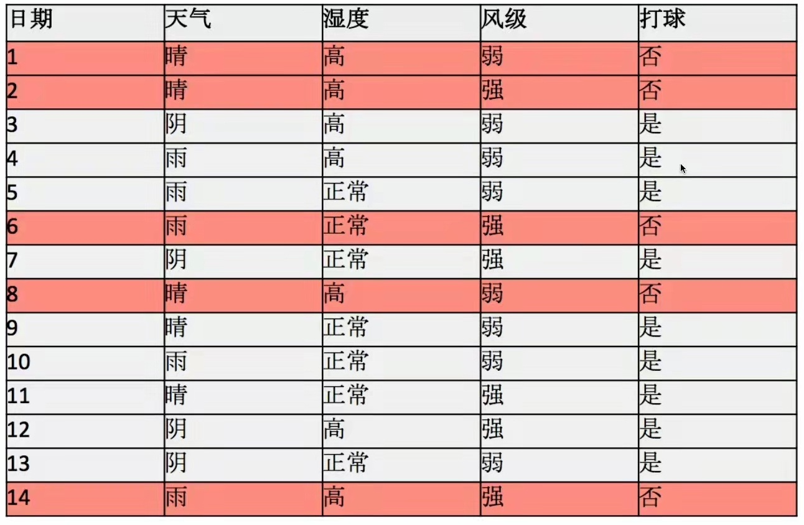

# 概率

## 几个重要知识点

1. 常用统计变量
   1. 样本均值：$E(X) = \overline{X} = \frac{1}{n} \sum \limits_{i=1}^{n}x_i$
   2. 样本方差
      1. 概率密度函数：$D(X) = S^2 = \frac{1}{n-1} \sum \limits_{i=1}^{n}(x_i - \overline{X})^2 = \frac{1}{n-1} \sum \limits_{i=1}^{n}(x_i^2 - n\overline{X})$
      2. 含义：**与均值的偏离程度**。
      3. 之所以除以的是(n-1)是因为要做方差的极大似然估计。具体的含义以后再说明。
   3. 标准差
      1. 概率密度函数：$\sqrt{D(X)}=\sqrt{\frac{1}{n-1} \sum \limits_{i=1}^{n}(x_i - \overline{X})^2}$
      2. 实际就是将方差开了根号。也就是说从也是表示与均值的偏离程度。
2. 常见概率分布
   1. 均匀分布
      1. 概率密度函数：$f(x)=\frac{1}{b-a},\, a<x<b$
      2. 含义：在a到b的范围能，概率一样。
   2. 正态分布（高斯分布）
      1. 概率密度函数：$f(x) = \frac{1}{\sqrt{2 \pi}\sigma} exp(-\frac{(x-\mu)^2}{2\sigma^2})$
      2. 其中参数的含义：$\mu$表示的是均值的位置，$\sigma$表示的是样本方差。
      3. 在说$\sigma$的时候，表示的含义都是在$\mu \pm \sigma$的范围内样本所占的比重。也就是表示对应在的均值左右一个方差的范围内样本数量占样本空间数量的比例。以此类推，可以求$\mu \pm 2\sigma$的范围内样本所占的比重。
   3. 指数分布
      1. 概率密度函数：$\begin{cases} \lambda e^{-\lambda x}, & \text {x} \geqslant 0 \\ 0, & \text{x<0} \end{cases}$
3. 重要概率公式。
   1. 注意事件和随机变量的关系。事件是通过随机变量在样本空间中的取值来定义的。从另外一个角度上来说随机变量就代替的事件的含义，因为随机变量的取值有时候在公式中略写了。
   2. 联合概率（join probability）
      1. 定义$P(A=a,B=b)$，在样本空间$\Omega$下，事件A=a和事件B=b同时发生的概率。
      2. $P(A=a,B=b)\leqslant P(A=a),\,P(A=a,B=b)\leqslant P(B=b)$。解释事件A=a和事件B=b同时必定需要A=a发生，B=b也必须发生；因此事件A=a和事件B=b同时发生的概率不可能大于事件A=a或者事件B=b单独发生的概率。
   3. 条件概率（conditional probability）。条件概率是通过联合概率来定义的。联合概率的定义提供了一个比率：$0 \leqslant \frac{P(A=a,B=b)}{P(A)} \leqslant 1$。这样定义了条件概率。
      1. $P(B|A)=\frac{P(AB)}{P(A)}$
      2. $P(B|A)$在A发生情况下B发生的概率。$P(AB)$表示A和B同时发生的概率。$P(A)$独立发生的概率。
   4. 全概率公式
      1. $P(B)=P(B|A_1)P(A_1) + P(B|A_2)P(A_2) + \cdots + P(B|A_n)P(A_n) = \sum\limits_{i=1}^n(P(B|A_i)P(A_i))$
      2. 含义：也就是将B发生的概率分为了多种情况。每种情况（$A_i$）与B的交集的全集就是B。。全概率公式表示的
   5. 贝叶斯公式
      1. $P(A_i|B)=\frac{P(A_i)P(B|A_i)}{\sum\limits_{j=1}^n(P(B|A_j)P(A_j))} \overset{\text{分母用全概率公式}}{=} \frac{P(A_i)P(B|A_i)}{P(B)} \overset{\text{分子用条件概率公式}}{=} \frac{P(A_i B)}{P(B)}\overset{\text{事件两两相互独立}}{=} P(A_i),\quad i=1,2,\cdots, n.$
      2. 含义：已知每个条件（每个条件本身是一个事件）本身发生的概率，并且B事件真的发生，然后求属于哪一类？
      3. 举例：。**这个例子要说清楚**！通过天气、湿度、风级来判断是否适合去打球。一共14条数据，其中5条是不适合打球，9条适合打球。在不知道天气、湿度、风级3个信息的情况下，能打球的的概率是$\frac{9}{14}$，这个概率就是先验概率。然后知道3个信息的情况下再计算是否能打球的概率，这就是后验概率。[重要-参考讲解视频](https://www.bilibili.com/video/BV1a4411B7B4?spm_id_from=333.337.search-card.all.click)
      4. 这个实质是先验概率和后验概率的问题。贝叶斯公式是通过先验概率求后验概率。
      5. 贝叶斯公式是乘法公式的转换。如果现在多条件变为只有一个条件，那么贝叶斯公式就是乘法公式。$P(B)=P(B|A)P(A)=P(A|B)P(B),\quad P(B|A)=\frac{P(AB)}{P(A)},\quad P(A|B)=\frac{P(AB)}{P(B)}, \quad P(B|A)+P(\overline{B}|A)=1$
4. 事件独立。当多个事件之间是独立的有以下性质：
   1. 事件相互独立时以下四个命题等价：
      1. 事件A与B相互独立，用数学符号表示为：$A \bot B$；
      2. 事件A与$\overline{B}$相互独立；
      3. 事件$\overline{A}$与B相互独立；
      4. 事件$\overline{A}$与$\overline{B}$相互独立；
   2. $P(A_1A_2\cdots A_n)=\prod \limits_{i=1}^n P(A_i)=\prod \limits_{i=1}^n p_i$
      1. 含义：$\color{red}{各个独立事件之间交集发生的概率等于各个独立事件发生概率之积}$。这一点非常重要！
   3. 互不相容（互斥）说的是样本之间，互相独立说的是样本发生的概率之间。**A和B相互独立，不能说明A和B之间是否共有样本点**。
      1. 这里需要注意的是互斥和独立之间的区别。**互斥应该是说两个事件之间的样本完全没有交集。而两个时间独立他们的样本可能有交集**。
      2. **互斥是用样本的角度来描述两个事件。独立是从概率的角度来描述两个事件**。
5. 引入随机变量的目的：用于表示事件中对应的对应取到的样本，这样方便对事件进行分析。

<!-- 以下是按照课本里面的顺序的梳理 -->
## 基本概念

1. 排列：从n个不同元素中，任取m($m \leqslant n$,m与n均为自然数,下同）个**不同的元素**按照一定的顺序排成一列，叫做从n个不同元素中取出m个元素的一个排列；从n个不同元素中取出m($m \leqslant n$）个元素的所有排列的个数，叫做从n个不同元素中取出m个元素的排列数，用符号$A(n,m)$或$A_n^m$表示。其中定义$0!=1$。
   $$A_n^m=n(n-1)(n-2)\cdots(n-m+1)=\frac{n!}{(n-m)!}$$
    从n个不同元素中全部取出的排列称为全排列，其排列的种数记为：
    $$A_n=n(n-1)(n-2)\cdots1=n!$$

2. 组合：从n个不同元素中，任取m($m \leqslant n$）个元素并成一组，叫做从n个**不同元素**中取出m个元素的一个组合；从n个不同元素中取出m($m \leqslant n$）个元素的所有组合的个数，叫做从n个不同元素中取出m个元素的组合数。用符号 C(n,m) 表示。
   $$\begin{aligned}
      &C_n^m=\frac{A_n^m}{m!}=\frac{n!}{m!(n-m)!}\\
      &C_n^m=C_n^{n-m}\\
      &C_n^m=C_{n-1}^m+C_{n-1}^{m-1}
      &\text{其中}n\geq m
   \end{aligned}
   $$

## 1 随机事件和概率

### 1.1 随机试验和随机事件概念

1. 随机事件：满足以下3个条件称为随机试验：
   1. 可在相同的条件下重复进行；
   2. 每次试验的结果不止一个；
   3. 试验之前不能确定哪一个结果会发生，但所有的结果是明确可知的。
2. 样本空间：随机试验的所有可能结果所组成的集合称为样本空间，常记为$\Omega$，$\Omega$中的元素称为样本点。
3. 随机事件：样本空间的子集，即试验结果称为随机事件，称为事件。
4. 基本事件：一个样本点组成的单点集，称为基本事件。
5. 必然事件：$\Omega$每次试验中一定发生的事件。
6. 不可能事件：$\varnothing$每次试验中一定不发生的事件。

#### 事件的关系及其运算

1. 事件的包含：弱事件A发生必然导致事件B发生，则称事件B包含A（或A包含于B），记为$B\supset A$。
2. 事件相等：若$A\supset B$且$B\supset A$，则称事件A与B相等，记为A=B。
3. 事件A和B的和（并）：$A\cup B$或者A+B表示事件A与B至少有一个发生。也就是表示A和B的并集。
   1. $\bigcup \limits_{k=1}^{n}A_k$表示n个事件$A_1,A_2,\cdots,A_n$至少有一个发生。
   2. $\bigcup \limits_{k=1}^{\infty}A_k$表示$A_1,A_2,\cdots,A_k,\cdots$至少一个发生。
   3. $A\subset A \cup B, B\subset A \cup B.$
   4. $A\cap(A \cup B)=A, B \cap (A \cup B)=B.$
   5. $A \cup A = A$
4. 事件$A\cap B=\{\omega: \omega \in A \text{且}\omega \in B\}$称为事件A与事件B的积事件（或交事件）。
5. 差事件：事件$A-B=\{\omega: \omega \in A \text{且}]\omega \notin B\}$称为事件A与事件B的差事件。而且差事件可以表示为：$A-B = A\cap \overline{B}=A\overline{B}$。
6. **互不相容**也称为互斥：如果$A \cap B =\varnothing$，那么称为事件A与事件B互不相容（或互斥）。它的含义是：事件A与事件B在1次试验后不会同时发生。如果一组事件（可以由无限个事件组成）中任意两个时间都互不相容，那么称这组事件**两两互不相容**。
   1. 这里需要注意的是互斥和独立之间的区别。**互斥应该是说两个事件之间的样本完全没有交集。而两个时间独立他们的样本可能有交集**。
   2. **互斥是用样本的角度来描述两个事件。独立是从概率的角度来描述两个事件**。
7. 集合论中的运算规律：
   1. 交换律：$A \cup B = B \cup A, A \cap B = B \cap A$
   2. 结合律：$A \cup (B \cup C) = (A \cup B) \cup C, A \cap (B \cap C) = (A \cap B) \cap C$
   3. 分配率：$A \cup (B \cap C) = (A \cup B)\cap (A \cup C), A \cap (B \cup C) = (A \cap B)\cup (A \cap C)$
   4. 摩根法则：$\overline{A \cup B}=\overline{A}\cap \overline{B}, \overline{A\cap B}=\overline{A} \cup \overline{B}$
8. 其他计算规律
   1. $AB \cap A\overline{B} = \varnothing$
   2. $AB \cup A\overline{B} = A$
   3. $ABC \cap AB\overline{C} = \varnothing$
   4. $ABC \cup AB\overline{C} = AB$
   5. $P(AB)=P(A) + P(B) - P(A\cup B)$。自己手工画一个概率图就可以清晰的得到这个公式的结果。说明的是$P(A) + P(B)$将包含了$P(A \cap B)$部分两次，所以减去$P(A\cup B)$时将$P(A \cap B)$减去了一次。

#### 概率的定义

1. 概率的定义。设随机实验E的样本空间为$\Omega$，则称满足下列条件的事情集上的函数$P()$为概率：
   1. 对于任意事件A，$P(A)\geq 0$（非负性）；
   2. 对于必然事件$\Omega, P(\Omega)=1$（规范性）；
   3. 设$A_1,A_2,\cdots,A_n,\cdots$为**两两互不相容**的事件，即$A_iA_j=\varnothing(i\not ={j},i,j=1,2,\cdots)$则$P(\bigcup \limits_{k=1}^{\infty}A_k)=\sum \limits_{k=1}^{\infty}P(A_k)$（可加性）。
2. 重要性质
   1. $P(\varnothing)=0$。
   2. 有限可加性：$P(A_1 \cup \cdots \cup A_n)=P(a_1) + \cdots + P(A_n)$。
   3. 对于任意一个事件A，$P(\overline{A}) = 1 - P(A)$。
   4. 当事件A,B满足$A \subset B$时，$P(B-A) = P(B) - P(A), P(A)\leqslant P(B)$。
   5. 对于任意事件A，$P(A)\leqslant 1$。
   6. **加法公式**，这也是相容性条件：对于任意两个事件A和B：$P(A \cup B) = P(A) + P(B) - P(AB)$。

#### 重要概型

1. 古典概型：如果随机试验E满足下面条件即称为古典概型：
   1. 试验的样本空间$\Omega$的元素只有有限个。
   2. 样本空间中每个元素，即基本事件发生的可能性相同，则称此试验为古典概型。对于古典概型，事件A的概率有下列计算公式：
   $$P(A)=\frac{A\text{中基本事件数}}{\Omega\text{中基本事件总数}}$$
2. 几何概型：如果随机试验E的样本空间$\Omega$为欧氏空间中的一个区域，且每个样本点的出现具有等可能性，则称此试验为几何概型。对于几何概型，事件A的概率有下列计算公式：
   $$P(A)=\frac{A的度量(长度,面积,体积)}{\Omega 的度量(长度,面积,体积)}$$
3. **贝努利(Bernoulli)概型**：如果试验E的结果只有两个：$A\text{与}\overline{A}$，则称此试验为贝努利概型（试验）。若贝努利试验独立重复n次，则称为n重贝努利概型，简称贝努利概型，若$P(A)=p$，则n次试验中时间A发生k次的概率为：
   $$P_n(k)=C_n^kp^k(1-p)^{n-k},k=0,1,\cdots,n$$

#### 条件概率和事件的独立性

1. 条件概率
   设A,B是两个事件，且P(A)>0，称
   $$P(B|A)=\frac{P(AB)}{P(A)}, \text{其中}AB=A\cap B$$
   为在事件A发生的条件下事件B发生的条件概率。

## 2 随机变量及其分布

1. 联合概率
   1. 概率分布或者概率函数（两个是一个东西），一般由两种表示方式：一个是式子的方式，另一个是表格的形式。
   2. 联合概率函数或者分布（就是多维变量的情况下的概率分布或概率函数）也是由两种表示方式：一个是式子的方式，另一个是表格的形式。常用表格的形式表示。这样更直观。这个多维变量可能是多个事件。
2. 边缘概率
   1. 就是在联合概率分布中对应的对行或者对列求或者得到的对应的概率分布。
   2. 可以通过联合概率函数来求对应变量的边缘概率函数。但是不能通过对应变量的边缘概率函数来求联合概率函数。
   3. 概率分布相同，并不能说两个随机变量相同（两个事件是两个不同的事件，但是它们的概率分布相同）。
   4. 在通过边缘概率分布求解联合概率分布的时候，注意只有在独立的事件之间求并集的时候才能使用可加性。
3. 书籍变量的独立性与条件分布
   1. 独立的条件是联合概率等于独立事件概率的乘积。
   2. 也就是联合概率等于边缘概率的乘积。一般由放回的抽样都是独立事件。不放回的一般都不是独立事件。
   3. 条件概率是通过边缘概率和联合概率来定义的。通过联合概率的值除以对应条件的边缘概率值。

## 3 随机变量的数字特征

1. 分布函数满足积分的可加性。
2. 指数分布常用于优质产品的寿命。
3. 指数分布具备无后效性。
4. 连续型随机变量表示变量范围的等号可有可无，离散型的有就是有，没有就是没有。
5. 误差可以通过正态分布来刻画。
6. **任意的正态分布都可以转化为标准正态分布**。
   1. 正态分布是关于$\mu$对称。
   2. 正态分布密度函数在$x = \mu$处取得最大值，$f(\mu) = \frac{1}{\sqrt{2\pi}\sigma}$。
   3. 当$|x|\rightarrow \infty$时，有$f(x)\rightarrow 0$。也就是说在$x = \mu$处取得最大值，向两边单调递减。
7. 数学期望（掌握常用概型的数学期望，会推导）
   1. 离散型的随机变量的数学期望
      1. 要求级数绝对收敛。
      2. $E(X)=\sum\limits_{k=0}^{n}xf(x)dx$
   2. 连续型的随机变量的数学期望
      1. 要求积分绝对收敛
      2. $E(X)=\int_{-\infty}^{+\infty}xf(x)dx$
   3. 需要掌握的知识点
      1. 定义
      2. 6个常用的分布的数学期望
      3. 性质
8. 泊松分布的期望
   $$
      \text{泊松分布的密度函数：}P(x=k)=\frac{\lambda^k}{k!}e^{-\lambda}\, , k=0,1,2,\cdots \\
      E(P)=\sum\limits_{k=0}^{n} {xf(x)} {\rm d}x=\sum\limits_{k=0}^{n} (k\frac{\lambda^k}{k!}e^{-\lambda})\\
      =e^{-\lambda}\sum\limits_{k=0}^{n}\frac{\lambda^k}{(k-1)!}\\
      = e^{-\lambda}\sum\limits_{k=1}^{n}\frac{\lambda^{k-1}}{(k-1)!} \text{这里k的取值范围从0开始修改为了从1开始，可以理解为做了换元}\\
      \because e^x = 1+x+\frac{x^2}{2!} + \frac{x^3}{3!} +\cdots +\frac{x^n}{n!}+C =\sum\limits_{i=0}^{n}\frac{x^i}{i!}\\
      \therefore = e^{-\lambda}\lambda e^{\lambda}\\
      = \lambda
      $$
   在取值范围上的奇函数的积分是等于0的。

9. 期望的性质，$k,l,c$都是常数。
   1. $E(c)=c$
   2. $E(kX + c)=kE(X)+c$
   3. $E(kX + lY)=kE(X)+lE(Y)$
   4. $\text{X,Y相互独立时}E(XY)=E(X)E(Y)$
   5. $E(g(x))=g(E(X))$

## 4 大数定理和中心极限定理

## 5 数理统计的基本概念

## 6 参数估计

## 7 假设检验

## 8 回归分析与方差分析

## 9 其他模型

### 高斯混合模型

[参考视频](https://www.bilibili.com/video/BV13b411w7Xj?p=2&spm_id_from=pageDriver)

1. 从几何角度来看，它是多个高斯分布通过加权平均叠加而成的。形式化的表示如下公式：$p(x)=\sum\limits_{k=1}^{K} \alpha_k N(x|\mu_k,\sum_k), \sum\limits_{k=1}^K \alpha_k =1$。其中$\alpha_k$表示多个高斯的加权值，在这个公式里面还不知道这个值是多少。$N(x|\mu_k,\sum_k)$表示特定高斯分布的参数：期望和方差。
   1. 对高斯混合模型有两种视角来说明，一种是几何角度来解释；另一种是通过混合模型的角度来解释。
2. 对应于一个特定样本点，不能简单的说这个样本属于那个高斯分布。正确且准确的说法是：该样本属于某个高斯分布的概率是多少，同时属于另一个高斯分布的概率是多少。
3. 直接对GMM使用MLE（Maximum Likelihood Estimate， 极大似然估计）
4. 似然和概率的区别：简单来讲，似然与概率分别是针对不同内容的估计和近似。概率(密度)表达给定$\theta$下样本随机向量$\boldsymbol{X}=\boldsymbol{x}$的可能性，而似然表达了给定样本$\boldsymbol{X}=\boldsymbol{x}$下参数$\boldsymbol{\theta}=\boldsymbol{\theta}_1$(相对于另外的参数取值$\boldsymbol{\theta}_2$)为真实值的可能性.换言之, 似然函数的形式是$\boldsymbol{L}(\theta | x)$,其中"|"代表的是条件概率或者条件分布,因此似然函数是在"已知"样本随机变量$\boldsymbol{X}=\boldsymbol{x}$的情况下,估计参数空间中的参数$\theta$的值. 因此似然函数是关于参数$\theta$的函数,即给定样本随机变量$\boldsymbol{x}$后,估计能够使$\boldsymbol{X}$的取值成为$\boldsymbol{x}$的参数$\theta$的可能性; 而概率密度函数的定义形式是$f(x|\theta)$, 即概率密度函数是在"已知"$\theta$的情况下,去估计样本随机变量$\boldsymbol{x}$出现的可能性。**似然估计能够使$\boldsymbol{X}$的取值成为$\boldsymbol{x}$的参数$\theta$的可能性**[参考](https://blog.csdn.net/songyu0120/article/details/85059149)。

