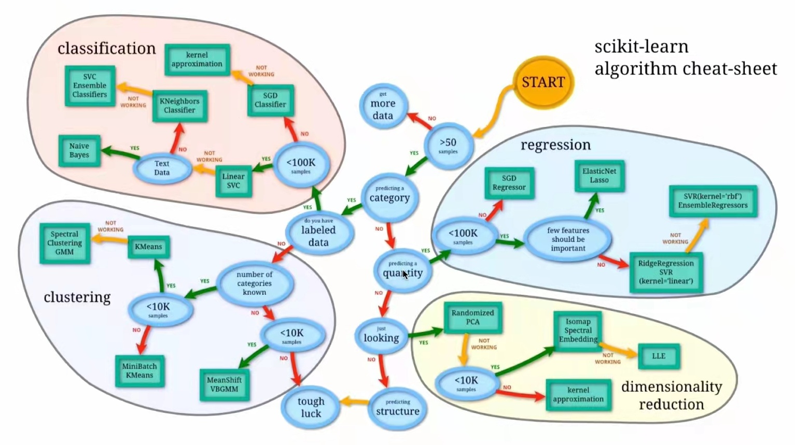
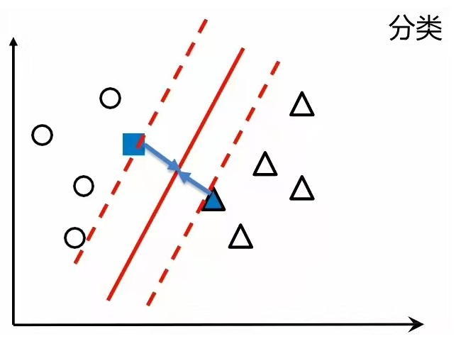
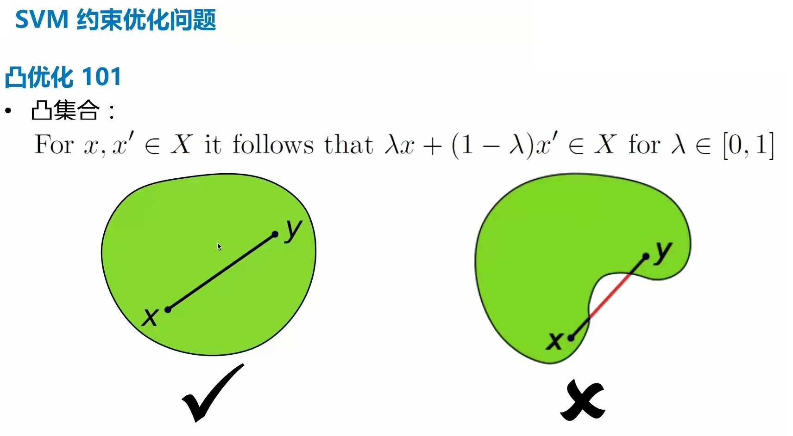
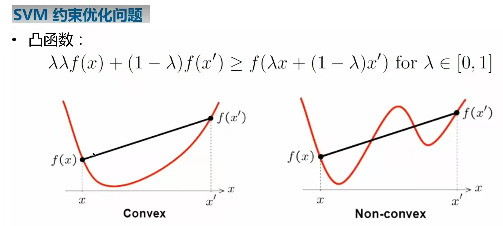
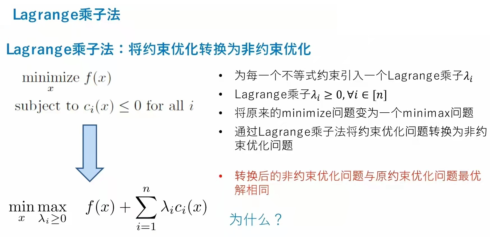
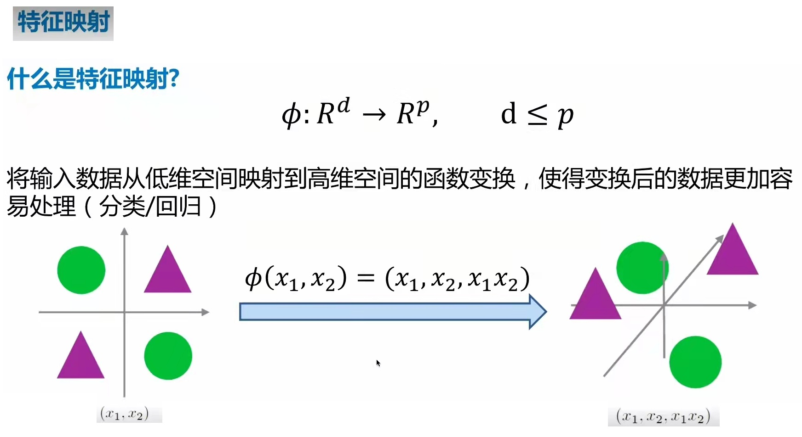
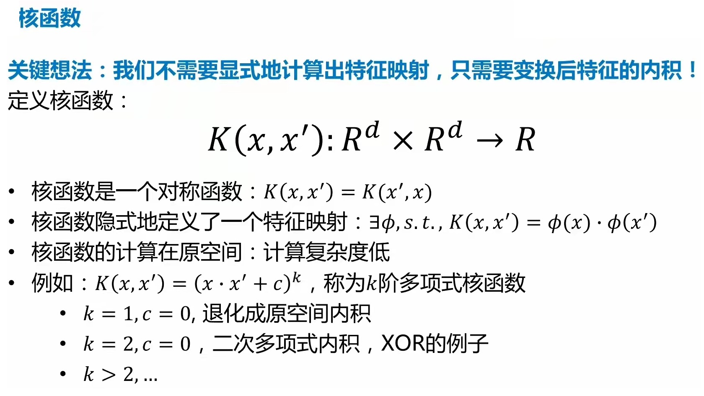

# 机器学习

一些基本概念。只做参考。可以快速的过一遍。
这门课内容是按照周志华《机器学习》来讲的。

1. 所有没有理解的地方通过~~XXX~~进行了表示。

## 1. 机器学习概述

1. 概念：机器学习研究的是计算机怎样模拟人类的学习行为，以获得新的知识或技能，并重新组织已有的知识结构使之不断改善自身。就是计算机从数据中学习出规律和模式，以应用在新数据上做预测的任务。
2. 能解决的问题：聚类、分类、回归、强化学习。（实际上就是两类：分类和回归，分别对应离散值和连续值）。聚类是无监督学习，挖掘数据的关联关系。强化学习主要用于互动环境中。
3. 机器学习分类：
   1. 监督学习，特征和标签。
   2. 无监督学习，关联规则。
   3. 强化学习，从环境到行为映射的学习。
4. 工作阶段：数据预处理（特征抽取，幅度缩放，特征选择，降维，采样），模型学习（模型选择，交叉验证，结果评估，超参选择，模型训练），模型评估，新样本预测（机器学习实用阶段）。
5. 评估指标：错误率低，准确率高。
6. 数据采样的方法：
   1. 留出法：保持数据分布一致，多次重复划分，测试集不能太大和太小。
   2. k折交叉验证。
   3. 自助采样法。对样本进行有放回重复采样，取到的数据作为训练集，没有取到的数据作为测试集。
7. 度量标准：
   1. 性能度量：衡量模型泛化能力的数值评价标准。回归问题常采用的是均方误差。
   2. 分类问题常用的性能度量：错误率和精度。
      1. 错误率：分类错误的样本数除以总数。
      2. 精度：分类准确的样本数除以总数。
      3. 混淆矩阵：二分类混淆矩阵。查准率和查全率。
      4. $F_1$值和$F_{\beta}$。
      5. ROC和AUC，曲线是ROC，曲线下的面积就是AUC。
      6. 回归问题的度量标准：
         1. 平均绝对误差(Mean Absolute Error)$\text{MAE}=\frac{1}{n} \sum\limits_{i=1}^{n}|f_i -y_i|$。
         2. 均方误差(Mean Square Error)$\text{MSE}=\frac{1}{n} \sum\limits_{i=1}^{n}(f_i -y_i)^2$。
         3. 方根误差(Root Mean Square Error)$\text{RMSE}=\sqrt{\text{MSE}}$。
         4. R平方$r^2=1-\frac{SS_{res}}{SS_{tot}}=1-\frac{\sum(y_i-f_i)^2}{\sum(y_i-\overline{y})^2}$。
   3. 机器学习的目标：找到具有泛化能力的“好模型”（这句话不准确，泛化能力强的情况下，大概率其他性能就会下降，实际上是对应不同任务性能就会有所倾斜。应该是综合能力好的模型）。
8. 机器学习算法一览：
   1. 非监督算法：
      1. 对于连续值（continuous）：聚类和降维算法（Clustering and Dimensionality Reduction）。具体包含：SVD，PCA，K-Means。
      2. 对于离散值（分类值，categorical）。
         1. 关联分析（association analysis），具体包含Apriori和FP-Growth。
         2. 马尔科夫链（Hidden markov model）。
   2. 监督算法：
      1. 对于连续值：回归（）决策树，随机森林。
      2. 对于离散值（分类值，categorical）。
         1. 分类具体包含：KNN，Trees，Logistic Regression，Naive-Bayes，SVM。
9. 一般选择模型的流程：

    ```mermaid
    graph TD
        A[start]-->B{数据量是否少于50}
        B-->|no|C[补充数据]
        B-->|yes|D{分类还是回归问题要求输出的是连续值还是离散值}
        D-->|分类|E{数据中是否含有标签数据}
        D-->|分类|F{数据中是否含有标签数据}
        E-->|有标签监督|G[classification分类问题]
        E-->|没有标签无监督|H[clustering聚类问题]
        F-->|有标签|I[regression回归问题]
        F-->|没有标签|J[dimenisonality reduction降维问题]
    ```

10. 不同的算法对相同的问题有不同的处理方法。不同的算法带来的决策边界是不一样的。 回归问题有不同的拟合方式。

## 2. 线性回归和逻辑回归

1. 线性模型（linear model）。特点：简单、基本、可解释性好。通过样本属性的线性组合来进行。
   1. 分类：通过一条线来将两类数据分开。
   2. 回归，通过一条线对所有数据进行拟合。
2. 损失函数loss function。
3. 通过损失函数就将回归问题转换为了优化问题。即为对凸函数求极值。
4. 梯度下降法来求凸函数的极值。梯度是决定迭代的方向。迭代的步长通过其他方法来决定。对于一元函数的损失函数计算方法$\theta_1 = \theta_1-\alpha \frac{dJ(\theta_1)}{d\theta_1}$，其中步长通过$\alpha$决定，方向由$\frac{dJ(\theta_1)}{d\theta_1}$决定。
   1. 梯度就是损失函数的切线方向。
   2. 超参数$\alpha$决定步长。
   3. 每次都需要更新$\theta$，最终找到最优$\theta$。
5. $\alpha$也称为学习率，不能太小也不能太大。
6. 欠拟合和过拟合。欠拟合好解决，过拟合不好解决。
   1. 欠拟合：模型没有很好的捕捉到数据特征，不能很好的拟合数据。
   2. 过拟合：把样本中的一些噪声特性也学习了下来，泛化能力差。
7. 减小过拟合的方法：正则化。通过正则化添加参数“惩罚”，控制参数幅度限制参数搜索空间，减小过拟合风险。原始的损失函数是：$J(\theta)=\frac{1}{2m} \sum \limits_{i=1}^{m}(h_{\theta}(x^{(i)})-y^{(i)})^2$修改为了$J(\theta)=\frac{1}{2m} [\sum \limits_{i=1}^{m}(h_{\theta}(x^{(i)})-y^{(i)})^2 + \lambda \sum \limits_{i=1}^{m}\theta_i^2]$。将模型的参数添加到了损失函数中，期望模型的参数越小越好。
   1. 一般而言是参数越少那
   2. 么模型的复杂度就越低，通过将参数设置为0就可以降低模型的复杂度。
   3. 从数学的角度而言：
   4. 为什么$l_1$正则化具有稀疏性？为什么$l_1$可以进行特征选择？[详细说明](../ReadPapers/8Regularization.md)
   5. $l_1$和$l_2$之间的区别？
8. 广义线性模型，比如$lny=\boldsymbol{w}^T \boldsymbol{x}+b$，这样就得到了对数线性回归。
9. 逻辑回归：
   1. 线性回归与逻辑回归的关系。在逻辑回归中并不会去拟合样本的分布，而是确定决策边界。包括线性决策边界和非线性决策边界。这里需要说到的是sigmod函数作为非线性函数来对线性值进行映射。
      1. 线性的对应的就是的直线函数。
      2. 非线性的对应的就是各种非直线的函数，比如圆形、抛物线等等。
   2. 逻辑回归的决策边界。
   3. 逻辑回归损失函数。
      1. 损失函数不能再使用均方差损失（MSE），这样可能导致出现局部最优解（local cost minimum）。而实际上是期望求得全局最优解（global cost minimum）的。因为在局部最优解的时候梯度已经为0了（也就是说对应的损失函数不是凸函数）。
      2. 使用的损失函数是对数损失/二元交叉熵损失（~~最大似然到对数损失，这个位置不清楚~~）
         $$
         Cost(h_{\theta}(x),y) = \left\{
         \begin{aligned}
         & -log(h_{\theta}(x)) \text{, if y=1}\\
         & -log(1-h_{\theta}(x)) \text{, if y=0}
         \end{aligned}
         \right.
         $$
      3. 损失函数与正则化。依旧存在过拟合问题，决策边界可能抖动得很厉害。(下面的公式可能有问题。)
         $$
         \begin{aligned}
         &\text{损失函数：} \\
         &J(\theta)=\frac{1}{m} \sum\limits_{i=1}^{m}Cost(h_{\theta}(x_i),y_i)\\
         &=-\frac{1}{m} [\sum\limits_{i=1}^{m}y_i logh_{\theta}(x_i)+(1-y_i)log(1-h_{\theta}(x_i))]\\
         &\text{添加正则化项之后的损失函数：}\\
         &J(\theta)=-\frac{1}{m} [\sum\limits_{i=1}^{m}y_i logh_{\theta}(x_i)+(1-y_i)log(1-h_{\theta}(x_i))] + \frac{\lambda}{2m}\sum\limits_{j=1}^{m}\theta_j^2\\
         & \text{使用梯度下降的方法来求最小值：}\\
         & \theta_j=\theta_j-\alpha\frac{\partial J(\theta)}{\partial \theta_j}
         \end{aligned}\\
         $$
         同样是使用梯度下降的方法来求最小值。
   4. 从二分类到多分类。有两种思路，这两种思路共同特点就是将多分类问题转换为二分类问题来解决。
      1. 思路1：将每个类别和除该类别之外的认为是两类，然后分类。针对所有类别逐一做二分类。
      2. 思路2：~~显然没有说清楚（理解好像是对每两个类别之间做一个分类器，也就是两两分类）~~。
10. 工程应用经验
    1. 逻辑回归和其他模型。
       1. 逻辑回归的特点：
          1. LR能以概率的形式输出结果，而非0，1判定。
          2. LR的可解释性强，可控度高。
          3. 训练快，特征工程（feature engineering）之后效果很好。
          4. 因为结果是概率，可以做排序模型。
          5. 添加特征非常简单。
       2. 应用
          1. CTR预估和推荐系统的learning to rank各种分类场景。
          2. 很多搜索引擎厂的公告CTR预估基线版是LR。
          3. 电商搜索排序/广告CTR预估基线版是LR。
          4. 新闻APP的推荐和排序基线也是LR。
    2. 样本处理。
       1. 样本特征处理：离散化后用独热向量编码（one-hot encoding）处理成0，1值。LR训练连续值，注意做幅度缩放（scaling，不同特征的取值需要在同一个范围之内）。
       2. 处理大样本量：事实spark或者MLib，试试采样（注意是否需要分层采样）。
       3. 注意样本平衡：对样本分布敏感（不能使得不同类别的样本的分布不均匀）。通过欠采样和过采样来处理不同的样本数量。另外也可以修改损失函数给不同的样本以不同的权重来解决样本不平衡问题。
    3. 工具包和库。
       1. 常用python库sklearn。
       2. python绘图库

         ```Python
         from mpl_toolkits.mplot3d import axes3d
         from sklean.preprocessing import PolynomialFeatures
         poly = PloyomialFeatures(6) #引入多项式特征，用于将二维数据映射到高维空间。
         ```

    4. 正则化系数太大或者太小会出现的情况，分别对决策边界产生的影响。**正则化牺牲了模型的精度提高了泛化性能**。
       1. lambda=0 就是没有正则化，这样的话就会过拟合。
       2. lambda=1 这是正常值。
       3. lambda=100 正则化项太激进，导致基本没有拟合出决策边界。

## 3. 决策树模型概述

1. 决策树模型概述。
   1. 决策树Decision Tree model是一个模拟人类决策过程思想的模型。通过多个条件逐一筛选的对象的过程模拟。
   2. 模型特点：简单、逻辑清晰、可解释性非常好。
   3. 决策树基于树结构进行决策。
      1. 每个内部节点对应于某个属性上的测试。
      2. 每个分支对应于该测试的一种可能结果（即该属性的某个取值）。
      3. 每个叶节点对应于一个预测结果。
   4. 学习过程。通过对训练两边额分析来确定“划分属性”（即内部节点所对应的属性。）
   5. 预测过程：将测试示例从根节点开始，沿着划分属性所构成的“判定测试序列”下行，知道叶节点。
   6. 主流算法：CLS、ID3、C4.5、CART、RF(随机森林，最强到的决策树算法)。
2. 决策树模型分类。
3. 算法流程与最优属性选择方法。
   1. 决策树基本流程。
      1. 总体流程成为“分而治之（divide and conquer）”。
      2. 自根至叶的递归过程。
      3. 在每个中间节点寻找一个“划分”（split or test）属性。
      4. 三种停止条件。
         1. 当前节点包含的样本全属于同一类别，无需划分。
         2. 当前属性集为空，或是所有样本在所有属性上取值相同，无法划分。
         3. 当前节点包含的样本集合为空，不能划分。
   2. 最佳属性选择方法。**决策树算法中最核心的一点在于如何选择最佳属性**。
      1. 通过信息增益和信息增益率来选在最佳属性。
         1. **通过信息增益的大小来选择根节点。这个地方需要看周志华《机器学习》4.2.1中的例子来详细理解**。
         2. 定义决策树的过程就是：**首先寻找最佳属性进行划分；第二然后在划分好的集合中继续寻找最佳属性进行划分，直到能把所有的样本能够区分出来**。
         3. 信息增益存在的问题：对可取值数目较多的属性有所偏好。这个时候采用信息增益率作为信息增益的替代。
         4. 启发式（选在属性的方法）：**先从候选划分属性中找出信息增益高于平均水平的，再从中选取增益率最高的**。
      2. 通过基尼指数（gini index）来选择最佳属性，常用语CART中。
         1. 基尼指数定义：$Gini(D)=\sum\limits_{k=1}^{|y|}\sum\limits_{k'\neq k}p_kp_{k'}=1-\sum\limits_{k=1}^{|y|}p_k^2$。
         2. 反映的是从D中随机抽取两个样例，其类别标记不一致的概率。Gini(D)越小，数据集D的确定性（注意这里是确定性）越高。属性a的基尼指数：$Gini\_index(D,a)=\sum\limits_{v=1}^{|V|}\frac{|D_v|}{D}Gini(D_v)$
         3. **在选择属性集合中，选取那个是划分后基尼指数最小的属性**。
   3. 熵与信息论视角。
      1. 信息熵(information entropy，~~这个部分还需要加强理解~~)。$Ent(D)=-\sum\limits_{k=1}^{|y|}p_k lnp_k$
      2. 信息增益(information gain)。$Gain(D,a) = Ent(D)-\sum\limits_{v=1}^{V}\frac{|D_v|}{D}Ent(|D_v|)$。其中$Ent(D)$是划分前的增益，$\sum\limits_{v=1}^{V}\frac{|D_v|}{D}Ent(|D_v|)$是划分后的增益。$\frac{|D_v|}{D}$第v个分支的权重，样本越多越重要。
      3. 信息增益率。$Gain\_ratio(D,a)=\frac{Gain(D,a)}{IV(a)},\text{ 其中}IV(a)=-\sum\limits_{v=1}^{V}\frac{|D_v|}{D}ln\frac{|D_v|}{D}$，属性a的可能取值数目越多（即V越大），则IV(a)的值通常就越大。
      4. 从信息论的视角和机器学习的视角对（XX）进行对比:
         |信息论的视角|机器学习的视角|
         |---|---|
         |接受信号|特征|
         |信源|标签|
         |平均互信息|特征有效性分析|
         |最大熵模型|极大似然估计|
         |交叉熵|逻辑回归损失函数|
4. 剪枝与控制过拟合。
   1. 剪枝和过拟合操作。
      1. 定义：为了尽可能的正确分类训练样本，有可能造成分支过多，造成过拟合。**剪枝：通过主动去掉一些分支来降低过拟合的风险**。
      2. 基本策略：预剪枝(pre-pruning)：提前终止某些分支的生长。后剪枝（post-pruning）:生成一颗完整树之后，再回头来剪枝。
      3. 剪枝的基本原则：剪枝过程中需要评估剪枝前后决策树的优劣。一般使用留出法来进行评估。
      4. 操作步骤：比如采用后剪枝。
         1. 首先通过训练集生成完整的决策树。
         2. 通过验证集对每个节点之后的精度进行计算。
         3. 从底部开始向顶部进行剪枝。比较每个节点剪枝前后的精度，如果节点剪枝前后的精度下降，那么剪枝；如果升高了或者保持不变那么保留节点。
   2. 预剪枝过程与示例。
      1. 在决策树生成的过程中，基于信息增益准则，在划分节点时，若该节点的划分没有提高其在验证集上的准确率，则不进行划分。
   3. 后剪枝与示例。
   4. 预剪枝和后剪枝的对比：
      1. 时间开销：预剪枝训练时间开销降低，测试时间开销降低。后剪枝训练时间开销增加，测试时间开销降低。
      2. 过拟合风险：预剪枝过拟合凤冈县降低，欠拟合风险增加。后剪枝过拟合风险降低，欠拟合风险基本保持不变。
      3. 泛化性能：后剪枝通常由于预剪枝。
5. 数据案例讲解。

   ```python
   import pandas as pd
   # import数据预处理和特征工程的库。
   import sklearn import preprocessing
   # import决策树的库。
   from sklearn import tree

   # ......

   pandas.get_dummies(feature)
   # 用于将数据特征中的不同类型转换为数值型的类型。
   # 比如将白色人种、黄色人种、黑色人种、棕色人种，通过上面的函数转化为0,1,2,3这种形式。
   clf = tree.DecisionTreeClassifier(criterion='entropy', max_depth=4)
   # 这个函数有两个参数，第一个参数决定用什么来做分类属性；第二个参数设置决策树的最大深度是多少。
   clf = clf.fit(features.values, label.values)

   # ......

   import pydotplus # 用于查看决策树的结构。
   from IPython.display import display, Image
   # ......
   # 说明这里是做了一个对人的收入是否超过5万元的预测。所以在class_names=['<=50K', '>50K']这个参数的时候填写的类别的名称就是这个。
   dot_data = tree.export_graphviz(clf,
                                    out_file=None,
                                    feature_names=features.colums,
                                    class_names=['<=50K', '>50K'],
                                    filled=True,
                                    rounded=True)
   graph = pydotplus.graph_from_dot_data(dot_data) #用来查看决策树的结构
   display(Image(graph.create_png()))
   ```

## 4. 分类回归数和随机森林

1. 连续值和缺省值的处理
   1. 连续值的处理（这里是对于树模型而言的）。**核心思想是连续属性离散化**。常见的做法是二分法(bi-partition)。也就是在连续值之中找一个点，将其划分为2个部分。每个部分对应一种类型。（~~原话是：n个属性值可以形成n-1个候选划分，当做离散值来处理。这个确实没有理解~~）
   2. 缺失值（missing）的处理。方法之一：仅使用无缺失值来判断样例的优劣。（~~这里出现了一种情况：某些特征上的样本会**同时**出现在多个分支上，而且按照例子进入多个分支上的样本的权重之和还为1。这个地方课程没有说清楚。~~）
   3. 从树到规则的建立。一棵决策树对应于一个“规则集”，每个从根节点到叶节点的分支路径对应于一条规则。可以理解为多个if-else语句的合集。所以决策树的可解释性非常好。而且可以进一步提高泛化能力。
2. 回归树模型及构建方法
   1. 之前说的树结构都是用来做分类的。树结构也可以做回归。**回归树本质上是对空间的划分。也就是将特征空间切分成了不相交的子区域，每个区域预估成该区域样本的均值**。
   2. 回归树和决策树操作步骤上是类似的。不同的地方在于使用RSS来代替了信息熵。$RSS=\sum\limits_{j=1}^{J}\sum\limits_{i\in R_j}(y_i-\widetilde{y}_{R_j})^2$。RSS的计算方法是自顶向下的贪婪式的递归方案。RSS最小化和探索的过程计算量非常巨大。一般采用探索式的递归二分来尝试解决这个问题。
   3. 可以通过正则化项来进行过拟合控制。
3. bagging和随机森林
   1. bootstraping。bootstraping来自于成语“pull up by your own bootstrap”，意思是依靠你自己的资源，称为自助法。它是一种有放回的抽样方法。它是非参数同济中一种重要的估计统计量方差进而进行区间估计的统计方法。bootstrap是现代统计学较为流行的一种统计方法，在小样本时效果很好。通过方差的估计可以构造置信区间等，其运用范围得到进一步延伸。其核心思想和基本步骤如下：
      1. 采用重抽样技术从原始样本中抽取一定数量（自己给定）的样本，此过程允许重复抽样。
      2. 根据抽出的样本计算给定的统计量T。
      3. 重复上述N次（一般大于1000），得到N个统计量T。
      4. 计算上述N个统计量T的样本方差，得到统计量的方差。
   2. bagging。bagging是bootstrap aggregating的缩写。使用了bootstraping的思想。bagging降低了过拟合风险，提高了泛化能力。

      ```mermaid
      graph LR
         A[m个样本训练集]-->B[m个样本采样集1]
         A-->C[m个样本采样集2]
         A-.->SL1[......]
         A-->D[m个样本采样集T]
         B-->E[学习器1]
         C-->F[学习器2]
         SL1-.->SL2[......]
         D-->G[学习器T]
         E-->H[集成学习器]
         F-->H
         SL2-.->H
         G-->H
      ```

      输入样本集$D=\{(x_1,y_1),(x_2,y_2),\cdots,(x_m,y_m)\}$，步骤如下：
         1. 对于$t=1,2,\cdots,T$:
            1. 对训练集进行第t次随机采样，共采集m次，得到包含m个样本的采样集$D_m$。
            2. 用采样集$D_m$训练第t个基学习器$G_t(x)$
         2. 分类场景，则T个学习器投出最多票数的类别为最终类别。回归场景，T个学习器得到的回归结果进行算术平均得到的值为最终的模型输出。
   3. 随机森林（Random Forest）。是一种基于树模型的bagging的优化版本。核心思想依旧是bagging，但是做了一些独特的改进。RF使用CART决策树作为基学习器。对于样本集$D=\{(x_1,y_1),(x_2,y_2),\cdots,(x_m,y_m)\}$，具体的过程如下：
      1. 对于$t=1,2,\cdots,T$:
         1. 对训练集进行第t次随机采样，共采集m次，得到包含m个样本的采样集$D_m$。
         2. 用采样集$D_m$训练第m个决策树模型$G_m(x)$，**在训练决策树模型的节点的时候，在节点上所有的样本特征中选择一部分样本特征，在这些随机选择的部分样本特征中选择一个最优的特征来做决策树的左右子树划分**。
      2. 分类场景，则T个基模型（决策树）投出最多票数的类别为最终类别。回归场景，T个基模型（回归树）得到的回归结果进行算术平均得到的值为最终的模型输出。
4. 数据案例讲解
   1. 第一个示例

      ```python
      # 这个例子的代码是完整的。
      import pandas as pd
      import sklearn import preprocessing
      import sklearn.ensemble import RandomForestRegressor
      from sklearn.datasets import load_boston

      boston_house = load_boston()

      boston_feature_name = boston_house.feature_name
      # 房屋的属性。
      boston_feature = boston_house.data
      # 房屋的价格。
      boston_target = boston_house.target

      # 显示数据集的相关信息
      print(boston_house.DESCR)
      
      help(RandomForestRegressor)
      # n_estimators表示本RF有几棵树，也就是树的数量。输入整数类型。可选参数。default = 10。。
      # criterion本RF的优化目标是什么？也就是选择什么样的损失函数。输入字符串类型。可选参数。default = "mse"。

      rgs = RandomForestRegressor(n_estimators=15)
      rgs = rgs.fit(boston_features, boston_target)

      # 进行预测。
      rgs.predict(boston_features)
      ```

   2. 第二个示例，对连续值特征的数据进行分类（基于决策树）。对鸢（yuan1）尾花进行分类。通过鸢尾花的4个连续值属性来预测花属于哪一类。花的类别一共有3类。

      ```python
      import pandas as pd
      import sklearn import preprocessing
      import sklearn.ensemble import tree
      from sklearn.datasets import load_iris

      iris = load_iris()

      iris_feature_name = iris.feature_names
      iris_features = iris.data
      iris_target_name = iris_target_names
      iris_target = iris.target

      # 构建决策树分类器。
      clf = tree.DecisionTreeClassifier(max_depth=4)
      clf = clf.fit(iris_features, iris_target)

      import pydotplus # 用于查看决策树的结构。
      from IPython.display import display, Image

      dot_data = tree.export_graphviz(clf,
                                    out_file=None,
                                    feature_names=iris_feature_name,
                                    class_names=iris_target_name,
                                    filled=True,
                                    rounded=True)
      graph = pydotplus.graph_from_dot_data(dot_data) #用来查看决策树的结构
      display(Image(graph.create_png()))

      ```

## 5. 支持向量机

一般而言，机器学习算法分类有以下几个指标：

1. 分类问题/回归问题。
2. 有监督/无监督。
3. 线性模型/非线性模型。
4. 特征离散/特征连续。
5. 凸优化/非凸优化。

具体内容：

1. 二分类线性可分支持向量机
   1. 线性模型
      1. 定义：支持向量机（support vector machine, SVM）。
      2. 基本形式：有监督二分类线性分类模型。
      3. 扩展形式：
         1. 有监督二分类非线性分类模型。
         2. 有监督多分类（线性/非线性）分类模型。
         3. 有监督线性回归模型（support vector regression, SVR）
         4. 基于核函数的SVM/SVR。
   2. 最大间隔分类器。SVM和线性模型的区别。线性模型和SVM具体形式上都是通过一条线来对数据进行分类。那么形式上它们之间有什么区别呢？**其中核心思路就是：如何选择一条最合适的线来把这些数据分开？具体实现：最大间隔分类器，也就是说要求分类器距离数据最远。**。
      1. 离数据最远的线性分类器最安全。
      2. 离数据最远的线性分类器最容易泛化。
      3. SVM模型式线性模型的一种。
      4. 支持向量的定义：**第一，分类器与最远的线性分类器平行；第二，该分类器穿过了具体最远线性分类器最近的数据。那么就称这些数据为支持向量**。
   3. SVM与逻辑回归的对比
      ||预测函数|损失函数|正则项|优化目标|
      |---|---|---|---|---|
      |逻辑回归|其预测函数之一是sigmod函数，实际输出的是一个概率。|其损失函数之一是最大似然函数/交叉熵损失函数。|正则项之一是$L_2$正则|损失函数和正则项的组合。凸优化，梯度下降。|
      |SVM|预测函数是$y=sgn(w^Tx)$。输出的不是概率，而是+1或者-1，代表分类。实际上就是一种特殊的非线性函数。预测数出和$w^tx$的绝对值大小无关，之和$w^tx$的符号有关。$w^tx$几何意义：正比于x到平面的有向距离。|优化函数：$l(x,y)=\frac{1}{n}\sum\limits_{i=1}^{n}max\{0,1-y_iw^Tx_i\}+\frac{\lambda}{2}\|w\|_2^2$。模型的要求：1. 模型形式：线性模型；2. 损失函数：Hinge损失函数； |正则项；$L_2$正则防止过拟合，最大化分类间隔。|凸优化，SMO算法。|

      ||逻辑回归|支持向量机|
      |---|---|---|
      |模型|二分类概率线性模型|二分类决策线性模型|
      |正则化|$L_2$正则化|$L_2$正则化|
      |损失函数|Logistic损失函数|Hinge损失函数|
      |原始优化问题|凸优化，梯度下降|凸优化，SMO算法|
2. 二分类线性不可分支持向量机
   1. 线性支持向量机的几何解释。
      1. 如何刻画/描述数据到分类器的间隔。$x_i$到直线$y=w^Tx$的距离是$\frac{|w^Tx|}{|w|_2}$。$y=w^Tx$在数据集上的间隔$min_i\frac{|w^Tx|}{|w|_2}$。注意到$\frac{|w^Tx|}{|w|_2}$关于w是齐次的，所以可以找到一个w，使得$min_i|w^Tx|=1$。
      2. 优化目标函数：如果所有点都被正确分类，那么：$y_iw^Tx_i\leqslant 1, \forall i \in [n]$。最大分类间隔$max\frac{1}{|w|_2} \Leftrightarrow min|w|_2^2$。非约束优化形式：$min\text{ }l(x,y)=\frac{1}{n}\sum\limits_{i=1}^{n}max\{0,1-y_iw^Tx_i\}+\frac{\lambda}{2}|w|_2^2$。两种形式等价。
   2. 松弛变量。
      1. **为了将这种方式引入到非线性的情况下（也就是说因为一条直线无法把两类数据分开，就需要一条曲线来将两个数据分开）**。这个时候就引入了松弛变量$\epsilon_i$。**$\epsilon_i$的作用就是允许数据在线性分类器$\epsilon_i$距离内不被正确的分类**。
      2. 几何意义：允许线性不可分的点到分类器的距离小于0。约束条件也就是$y_iw^Tx_i\leqslant 1-\epsilon_i, \epsilon_i \leqslant 0, \forall i \in [n]$。
   3. 线性不可分支持向量机。
      1. 线性可分与线性不可分是统一形式的。
      2. 在第一点的基础上，SVM是数据自适应的。
      3. 本质是一个凸优化问题，~~二次规划~~（二次规划还没有理解）。
      4. 可以转换为二次规划一般形式求解，也可以使用梯度下降法求解。
3. 多分类支持向量机。主要的思路是如何将一个多分类问题转化为二分类问题。
   1. one vs one方法。
      1. 思路：所有类别两两之间都建立分类器（是任意两个类别之间）。就是如果有n个类别，那么就需要建立$\frac{n(n-1)}{2}$个分类器。
      2. 优点：适用性广，LibSVM默认的实现方法。对于所有二类分类器都可以使用，概率/非概率分类器均可。
      3. 缺点：训练时计算复杂度为$O(k^2)$，测试时的计算复杂度为$O(k^2)$。也就是计算复杂度高。
   2. one vs all方法。
      1. 思路：任意一个类别相对其他所有其他类别之间建立分类器。如果有n个类别，那么就需要家里n个分类器。每个分类器专门来预测对应类别的分数。每次需要使用全部的分类器。
      2. 优点：计算复杂度低。训练时计算复杂度为$O(k)$，测试时的计算复杂度为$O(k)$。
      3. 缺点：适用性有限，多使用于概率分类器，例如逻辑回归需求中。
4. SVM工具包介绍。
   1. LibSVM，目前使用最广泛的。提供了命令行使用接口。对所有语言均有接口。是一个比较高效的实现。
   2. SVMLight，是C++实现的。基于SVM的结构预测和半监督的SVM，支持SVM排序的学习算法。
   3. Scikit-learn，python实现的、轻量级的、接口简单的库。支持线性、非线性、回归和分类数据需求。
5. SVM对偶形式
   1. SVM的对偶形式
      1. SVM约束优化问题。线性SVM的原问题（Primal Problem）是：目标是一个关于w的二次函数：$min\text{ }\frac{1}{2}|w|_2^2$，约束是关于w的线性函数：$s.t. \text{ }y_iw^Tx_i \leqslant 1, \forall i \in [n]$。核心是二次凸优化问题（Quadratic Programming）。光滑优化函数。局部最优值即全局最优值。
         1. 凸集合，用描述化的语言表述为：**对于集合中任意两点的连线依然在集合内部**。 
         2. 凸函数，用描述化的语言表述为：**定义域中任意两点连线组成的线段都在这两点的函数曲线（面）上方**。
      2. Lagrange乘子法。。这个部分需要进一步的了解一下。
      3. SVM的对偶形式
   2. 核函数以及核技巧
      1. 特征映射（这是非常重要的一个技巧）。**将输入数据从低维空间映射到高维空间的函数变换，使得变换后的数据更加容易（使用一个线性的关系）进行处理（分类/回归）**。 
      2. 如何定义特征变换？**因为显式的定义特征变换显然会增加计算的复杂度**。比如原本是1000维的特征，通过一个二项式变换之后有了500,000个特征。为了解决这个问题引入了核函数，**其核心目的在于：我们不需要显式的计算特征映射，只关心的是变化后的特征的内积**。
   3. 非线性支持向量机
   4. 支持向量回归
