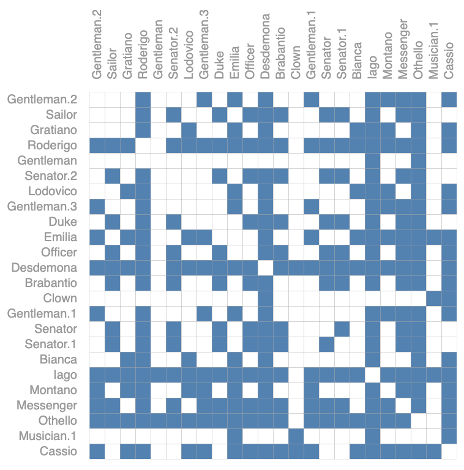

# 读GNN博客

1. 参考
   1. [A Gentle Introdution to Graph Neural Network](https://distill.pub/2021/gnn-intro/)
   2. [简单粗暴说明GNN](https://www.bilibili.com/video/BV1Tf4y1i7Go?spm_id_from=333.337.search-card.all.click)
   3. [A Gentle Introdution to Graph Neural Network解读](https://www.bilibili.com/video/BV1iT4y1d7zP?spm_id_from=333.337.search-card.all.click)

2. GNN的本质：**GNN就是一种提取特征的方法**。
3. GNN的流程：
   1. 聚合：将某个节点的所有邻居的信息进行提取之后，对节点本身的特征进行补充。$ANodeNeigborInfo = \alpha \times BNode_{feature} + \beta \times CNode_{feature} + \gamma \times DNode_{feature}$
   2. 更新：$A_{feature} = \sigma [W (A_{feature} + \mu \times ANodeNeigborInfo)], \sigma \text{是激活函数。}W\text{是需要训练的参数。}$
   3. 循环。多层的意义在于一个节点可以包含更远节点的信息。
4. 提取了节点特征之后可以做的应用：
   1. 可以对节点进行分类。
   2. 可以做关联预测。将两个节点的特征进行拼接之后再去做分类。有连接的节点就是正样本，没有连接的节点就是负样本。

## 1. 重要知识点

1. 文本是一个序列，图片是一个矩阵。
2. 本篇博客主要说明了将神经网络应用于图数据结构的处理。
3. 目的：
   1. 用NN去处理图数据结构需要那些模块？
   2. 背后的思维逻辑是什么样子的。
4. 图的结构：
   1. 图是分层的。
   2. 上层节点是有下层对应节点及对应节点的直接邻居计算而来的。
   3. 这意味着只要图足够深，它顶部的节点是可以处理一个大范围的结构信息的。这也是图神经网络如何利用图的结构化来处理信息的思维。
5. 本博客的主要研究内容或者提供的结论的四个点：
   1. 什么样的数据能够表示为1张图。
   2. 图与别的数据有什么不同的地方？
   3. 构建一个GNN的模块是什么样子的？
   4. 提供一个playground让大家机会去试验。
6. 什么是图：用于表示实体之间的关系。实体通过顶点（node）表示，关系通过边（edge）表示。另外一个U用于表示整个图的属性。不仅仅关注图的架构，更关注图中包含的信息，这些信息就是图和图元素的attribute。
7. node的attribute可以通过一条向量来表示（embedding）。edge也可以用另外一条向量来表示，边向量的长度可以和顶点的长度不一样。Global的信息也可以用一条向量来表示。核心问题是：
   1. 如何将我们想要的信息表示成这些向量；
   2. 以及这些向量是否能够通过数据来学到。
8. 图分为两种：
   1. 有向图
   2. 无向图
9. 如何将数据表示成为图。
   1. 如何将图片表示成一张图。
       1. 如果像素直接是邻居关系，那么就将这对像素之间连一条边。包含上下左右以及对角线上的邻居。
       2. 邻接矩阵，如果矩阵元素值为1，表示两个元素之间是有边的。也就是说两者相邻。没有边的表示两个元素不相邻。也就是两个像素直接不是邻居。这个矩阵是一个比较大的、稀疏的矩阵。这个边是无向边。
   2. 如何将一个文本表示成图。文本实际上是一条序列。
      1. 可以将其中的每个词表示为1个顶点。
      2. 一个词和下一个词之间可以通过一条有向边来连接。特别来说这个表示为了有向的路。
   3. 分子图如何表示成图。
      1. 每个原子可以表示成一个点。
      2. 每两个原子连接在一起可以表示为一条边。
   4. 社交网络
      1. 每个人作为一个顶点。
      2. 每个的关系作为边。
   5. 引用图。
      1. 每篇文章作为一个顶点。
      2. 每篇文章之间的引用关系作为一条有向边。
10. 可以在图上定义什么样的问题，主要是三大类的问题：
    1. graph-level：给你一张图，然后对图进行分类。比如说将所有图中含有2个环的图选出来。
    2. node-level：比如判断图中所有点的类型，图中点和另外一些点的关系。
    3. edge-level：在已知顶点的情况下，去预测或者判断顶点之间的关系。
11. 将机器学习应用到图上面会碰到的挑战。
    1. 图包含4种信息：nodes, edges, global-context and connectivity。前面三个可以用向量来表示。
    2. 可以用邻接矩阵来表示connectivity。但是会存在一下几种问题：
       1. 邻接矩阵可能非常大。类似于Wikipedia数据集，这个邻接矩阵是非常大的。
       2. 这个邻接矩阵是一个稀疏矩阵，想高效的计算稀疏矩阵是一个非常难的事情。想要将稀疏矩阵应用在GPU上是一个特别难的问题。
       3. **邻接矩阵将任何行或者列的顺序进行交换是不会影响邻接矩阵表达的含义的**。如图所示：这两张邻接矩阵表达的关系实际上是一样的，只是把行和列的顺序进行了交换，虽然在视觉上说这两张图看起来不一样，但实际上它们都代表的是同一张图。也就意味着，在使用NN之后对这两张图处理的结果应该是相同的。
12. 为了同时满足存储高效和排序不影响结果这两个约束（也就是解决11.2.2和11.2.3中提出的问题），可以使用下面这种存储方法：
    1. 每个顶点用一个向量表示。多个向量组合成一个矩阵。
    2. 每条边也用一个向量来表示。通过边组合成为一个矩阵。
    3. 全局信息也可以用一个向量来表示。
    4. Adjacency List邻接列表。列表的长度和边数一致。其中的第i项表示的是第i条边连接的是哪两个节点。
13. 通过这12中的方法可以看到在存储上只把有连接的边和所有的属性存储了下来。通过的可以把边的顺序任意打乱，只需要将Adjacency List的对应顺序修改即可。同样的道理也可以将所有顶点的顺序打乱，只需要将邻接列表的元素进行相应的更新即可。这样就达到了存储高效的，同时也是顺序无关的。
14. 如何用神经网络来处理12中列出的数据形式。
    1. 定义：**GNN是对图上所有的属性（node, edges, global-context）进行了一个可以优化的变换。而且这种变化是可以保持图的对称信息的。所谓对称信息是：把这些顶点或者边重新排序之后处理的结果是不会变的。**
    2. 使用message passing neural network，信息传递的神经网络（也可以用别的方式来描述它）的框架。
    3. GNN的输入是一个图，输出也是一个图。
    4. GNN会对顶点、边、全局的属性attribute向量进行变换，但是GNN不会改变图的连通性信息。
15. 最简单的一个GNN：
    1. 对于顶点向量、边向量、全局向量（当然也可以是矩阵）分别构造一个MLP。
    2. 该MLP的输入大小和输出大小是一样的。
    3. 1中定义的3个MLP就组成了GNN的一个层。然后输出就作为图的更新。输出的结果的属性都是被更新过的，但是图的结构是没有变化的。
    4. 每个MLP是对每一个向量是独立发挥作用，MLP都不会考虑连接信息，所以不论如何变换顺序都不会结构性的结果。
    5. 将满足这些要求的MLP叠加在一起构造一个比较深一点的GNN。
16. 最后一层的输出如何得到我们希望的预测值。最简单的情况：例如对顶点的信息进行2分类预测：通过所有顶点的属性矩阵，通过**一个**全连接层，最后加一个输出维度为2的全连接层，然后再加一个softmax就可以得到我们的输出了。如果是n类就使用n类全连接层，如果是做回归，那么就是单值输出即可。所有的顶点共享一个全连接层。同理，所有的边也共享一个全连接层，全局信息也是使用一个全连接层。
17. 假设如果没有顶点属性的情况下，如何对顶点进行预测。这个时候会使用pooling（在GNN中翻译为汇聚层）的技术来处理这种问题。（这里假设顶点、边、全局向量的维度一样的情况下。如果不一样的情况下做一些投影来解决这个问题）。
    1. 将与顶点相关的边的向量拿出来。
    2. 将全局的向量拿出来。
    3. 将1和2中所有的向量都加起来，得到一个代表该顶点的向量。
    4. 然后在使用全连接层做输出。
18. 在没有边的属性时，同样的可以将该边相连的2个顶点的向量汇聚起来，同时也可以加上全局向量，最后得到这个边的向量。然后进入边向量的输出层。也就是所有的边共享一个输出层，从而得到边的输出。
19. 假设没有全局的向量，只有顶点的向量。通过将所有的顶点的向量加起来，得到一个全局的向量，然后进入全局的输出层，从而得到一个全局的输出。
20. 总结，最简单的GNN的形式如下：
    1. 输入是一个图。
    2. 进入一系列的GNN层。每个层都有3个MLP，对应三种不同的属性。
    3. 得到一个保持图结构的输出，但是里面的属性都发生的变化。
    4. 对应于要对那个属性进行预测，就添加一些合适的输出层。
    5. 如果确实信息，那么就加入合适的汇聚层就可以完成我们期望的预测了。
21. **20中结构有非常大的局限性，最重要的是没有使用到图的结构信息。**没有将结构信息合理的更新到属性里面去。为了解决这个问题使用到的技术是信息传递（Passing Messages）
    1. 将指定顶点和指定顶点相连的邻居顶点的信息都加起来得到一个向量；
    2. 然后将这个向量通过MLP得到更新的向量。
22. 21中定义的操作和卷积操作的对比。如果这个输入的图结构表示的是一张图片，那么这个卷积操作的要求的是卷积核中的权重都是一样的。
23. 通过顶点学习边的信息。如果顶点和边的向量维度不一样，可以做一次投影来解决这个问题。
    1. 通过边连接的顶点，汇聚一次边的信息。
       1. Node The Edge Learning
    2. 然后可以通过与指定顶点连接的边的信息进行一次汇聚，再与原顶点的信息进行相加得到新的顶点信息。
    3. 在进入到各自的MLP中得出输出。
    4. 同样的也可以将与指定顶点的边相连的信息回去给指定顶点。
       1. Edge The Node Learning
    5. 然后在在更新之后的顶点信息再汇聚给边。
       1. 1和4中两种方法会导致不一样的结果。
    6. 也可以使用交替更新的策略。
       1. Weave Layer
       2. 使用weave layer之后，无论是更新了顶点或者是边，暂时别加，然后再传递一次。这样就使得两边的信息就都有了。
24. 为什么需要全局信息。
    1. 存在的问题：因为每次都是只看自己的邻居，如果图真的比较大，而且连接没有那么紧密的时候，会导致一个消息从一个点传递到很远的一个点需要走很长的步才行。
    2. 解决方法：加入了一个master node或者叫做context vector的概念。**这个点是一个虚拟点，这个点可以和所有的顶点相连而且还和所有的边相连（是的，和所有的边相连）。**它是一个抽象的概念。
    3. 所以在对顶点汇聚给边的时候，也会将U汇聚进来。同样的，将边汇聚给顶点的时候也会将U汇聚进来。在更新U的时候会把所有的顶点和边的信息都汇聚过来，然后再做更新。
    4. 通过1-3就学到了大量的向量，而且在早期就进行了大量的消息传递。
25. 所以在更新的时候可以把和被更新实体相关的信息都拿过来，然后再进行预测。
26. GNN playground主要展示了各种超参数对精度的影响。（GNN对超参数比较敏感）：
    1. 可以看到node, edge, global的向量维度都是相对大一点好（在这篇distill中，node的向量维度是在12-50之间变换，edge的维度是在5-20之间变换，global的维度是在25-100之间变化。另外可以看到的维度的情况是$dim_{global}>dim_{node}>dim_{edge}$的情况）。但是整体而言也不是很明显，这些参数的方差太大了。
    2. GNN的层数调高一点比较好，同时也要把其他的参数调的够好才行。
    3. 聚合的操作类型对精度基本上是没有影响的。（这里面的操作类型包括：max、mean、sum操作。）
    4. 传递信息非常重要。传递的信息类型和信息越多，可以越高的提高精度。
27. 相关技术：
    1. 顶点直接有多种边Multigraph。比如既包含有向边又包含无向边。
    2. 图是分层的。不同的图结构会导致在神经网络做信息汇聚的时候产生一定的影响。
    3. 采样的方法Sampling Graphs。使用采样的原因：如果图有很多层的时候，就算每一层只看它的1近邻，通过多层的消息传递，所以最后一层的顶点可以看到一个很大的图。假设该图的连通性足够的话，这个图的顶点可能看到的是整个图的信息。在计算梯度的时候，需要将forward中所有的中间变量存下来。如果最后一个顶点需要看整个图的话，意味着对它进行梯度计算的时候，需要将整个图的中间结果都存储下来。这样可能导致计算可能是无法承受的。所以需要对图进行采样。将一个大的多层的图每次采样一个小图出来，在这个小图上进行信息汇聚。这样在计算梯度的时候只用将这一小部分的中间结果存储下来即可。一般而言的四种采样方法。具体使用那种采样方式需要结合图的具体结构来做选择：
       1. 随机选择多个顶点(Random node sampling)，然后将它们的邻居全部找出来。做计算的时候只在这个子图上做计算。通过每次采样点的数量，就可以避免这个图不会特别大。使得内存是可以存下来的。
       2. 随机游走（Random walk sampling），从某个顶点开始，沿着一条边走到下一个顶点，沿着整个图随机走。可以规定随机走多少步。这样就可以得到一个子图。
       3. Random walk with neighborhood随机走额定步数，然后选择路过顶点的1近邻做为一个子图。
       4. diffusion sampling。随机选一个点，然后将它的1近邻、2近邻、3近邻，然后往前走k步，以这个点对图做一个宽度遍历。然后选择为子图。
    4. batching。这个问题和sampling直接相关。从性能上考虑，不希望从从每一个顶点做逐步逐步更新，这样子每一步计算量太小不利于并行。希望向别的神经网络一样，可以将这些小样本作为一个小批量，这样子对一个大的矩阵或者一个tensor做运算，每个顶点的邻居个数是不一样的，如何将这个顶点和它的邻居通过规则合并成一个张量，这是一个有挑战性的问题。
28. inductive biases。任何一个机器学习和神经网络都有一些假设在里面。如果不对这个世界做假设的话，那么什么东西都是学习不出来的（比如欧式几何的基石5个公理等）。卷积神经网络做的假设是空间变化的不变性。循环神经网络假设的时序的延续性。对于GNN做出的假设是：**保持了图的对称性preserve graph symmetries (permutation invariance).（交换顶点的顺序，GNN对图的作用都是保持不变的。）**
29. 比较不同汇聚之间的操作（comparing aggregation operation）。在26.3中所述的三种操作都不是很理想。汇聚操作按照老师里面说到的作用是：需要区分不同来源值的结构；而不是通过aggregation之后的值还是一样的。如图所示。明显max aggregation无法区分区分图中所示的情况，同样可以构造出sum aggregation操作无法区分的情况。所以在26.3中可以看到聚合操作对精度没有影响。所以在实践中要具体来看那种聚合操作更好。
30. GCN(graph convolution network,就是之前说到的带了汇聚的图神经网络)作为一个子图函数的近似。如果有ke层的，每一层都是看顶点的1近邻的话，那么就等价于有k层3*3的卷积。如果是这样的话，每一个最后的顶点它看到的是一个子图，这个子图的大小是k（最远的顶点距离指定顶点的距离是k，因为经过一层就会向前看一步）。每个顶点都是看以自己为中心往前走k步子图的信息的汇聚。GCN就可以认为是有n个同样的子图。这一段老师认为没有讲明白。这里暂时没有理解清楚。
31. Edges and the graph dual可以把点和边做对偶。如果学过图论的话，可以将点变成边，边变成点，同时它们的邻接关系保持不变。
32. Graph convolutions as matrix multiplications的关系也是整个图神经网络得到一个比较高效的实现的一个关键点所在。在图上做卷积或者在图上做random walk，等价于把邻接矩阵拿出来做一个矩阵的乘法（整个地方没有理解说的是什么意思）。这里提到了page rank，page rank做的就是拿出一个邻接矩阵和一个向量不断的做乘法。
33. graph attention network。卷积中卷积核的权重和位置是相关的，而在GNN中是需要aggregation对位置是不敏感的，因为顶点的邻居的顺序是可以打乱的，而且顶点的邻居数量不是确定的。所以做类似于卷积的有位置的加权和是不合适的。也就是要求加权和对位置不敏感。有一种做法就是可以使用注意力机制的做法。也就是做权重取决于顶点向量之间的关系，就不再说权重与位置有关，而是顶点向量之间做点乘，再在上面做一个softmax。在使用attention之后就可以给每一个顶点一个权重，再按权重加起来就得到了一个graph attention network。（这个地方还需要再理解一下）。
34. 图的可解释性graph explanations and attributions。在图上训练了一个模型之后，需要看这个模型到底学到的是什么？可以把子图抓取出来看到底学到了那些东西。
35. generative modelling，我们当前的图神经网络是不改变图的结构的，如果我们向生成图出来，那么如何对图的top结构进行有效的建模的算法。

--END--

## 2. 问题

### 文档问题

1. 如何将一张图片表示为一个tensor？实际如何操作？
2. 图长距离信息的传递过程这里没有理解。在视频的35:00的时候说到了这个问题，对应的是1.22中所说与卷积类比的内容。不能确定是在输出层的多层MLP中的元素可以看到之前的所有顶点的信息，还是多个图层之后可以，后面图层的顶点可以看到前面图的顶点信息。按照视频里面的说法好像是后一种，但是这个时候还没有说明实现的情况。只说明了前面一种的情况。
   1. 这里应该是图有很多层。
3. 这里面有一个地方没有说清楚，多层图的GNN是如何运作的。
4. 有没有一个练手的、简单的GNN项目可以做？
5. 是不是说aggregation是一个研究方向？

### DataFunTalk中听到的问题

1. 游走模型？
2. 同构图扩展到异构图？
3. RDF模型、RDFS模型。

### 知识图谱的多步推理

1. 将query映射到一个隐藏空间中（这个空间包含了知识图的所有信息），然后做最近邻搜索就可以找到答案。
2. 如何在隐空间中如何进行计算操作，这是一个比较有意思的点。
   1. 之所以要定义计算操作，就是在便于后面做推理。
3. Query2Box embedding将query映射到高维隐藏空间中长方体中。
   1. 其他的映射方法：1. SMORE。2. 还有将query映射到一个球上面的一段弧。
4. 设计逻辑或的计算式非常难的。逻辑或会导致维度爆炸。
   1. 解决方法将逻辑或放到最后再处理。
5. 缺陷：无法设计逻辑非这种计算。
   1. 因为如果
6. 将知识图谱上的点和边映射为BetaE的结构上，从而可以处理逻辑非的计算。
7. 使用的数据集FB15k,FB15k-237,NELL995。这些数据集是什么还不清楚。
8. 与图大小无关的计算方法SMORE。

### DRKG药物重定位知识图谱

1. 将这个问题定义为对图的补全。
2. GNN关键点是收集节点邻居的信息然后再做推论。消息传递。
   1. edge-wise消息函数
   2. node-wise更新函数、累和函数。
   3. 上述函数都可以定制化。从而由不同的场景来达到不同的效果。
3. 为什么编写图神经网络比较难？
   1. 消息传递计算是一种细粒度的计算。

## 3. 对图神经网络的总结

1. 基本上所有的数据都可以表示成为一个图。
2. 在图上做优化是非常难的，因为它是一个稀疏的架构。它的每个结构都是一个动态的结构。
3. 如何有效的在GPU\CPU上进行并行计算式是一个非常难的事情。
4. GNN对超参数是非常敏感的。整个网络架构是什么样子？如何对它进行采样？以及如何进行优化，其实都是非常敏感的。基于2、3、4中所述的原因图神经网络的门槛比较高。
