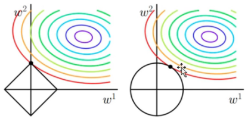

# Regularization 过拟合正则化

## 为什么要正则化

一般会碰到3个问题：

1. 如何防止模型的过拟合？
2. 正则化为什么能防止过拟合？如何从数学的角度来描述一下正则化。
3. 什么$L_1$正则化具有稀疏性？为什么$L_1$可以进行特征选择？

另外还会问到：$L_1$和$L_2$之间的区别？

## 参考

1. [重要参考之一，这个视频有点没有说清楚。](https://www.bilibili.com/video/BV1aE411L7sj?p=3)解释的时候有点没有理清楚。
2. [过拟合正则化，这个视频讲解的更清晰](https://www.bilibili.com/video/av975800390?from=search&seid=16912057637198590118&spm_id_from=333.337.0.0)
3. [4种角度理解正则化](https://www.bilibili.com/video/BV1Z44y147xA?spm_id_from=333.337.search-card.all.click)

## 定义

1. 定义：凡是可以减少泛化误差，而不是减少训练误差的方法都可以称作正则化方法。也就是凡是可以减少过拟合的方法都可以叫做正则化方法。

   这里主要是针对参数的正则化，在神经网络里面是针对权重$w$的正则化。

   也就是说在神经网络里面Dropout正则化就是针对权重的正则化。

2. **范数：就是把空间中两个点的距离的概念进行了扩充**。也就是有多种定义方式来定义空间中两个点的距离。权重$\boldsymbol{w}$可以理解为高维向量；也可以理解为高维空间中的一个点。
   1. 这个点到原点的距离如果是欧式距离的话那么就是$L_2$范数，记为$||w||_2$。具体的计算就是用高维的勾股定理得到的。把$L_2$相同的点连起来的话，组成的是一个圆形。
   2. $L_1$范数，计算方式是对坐标值直接取绝对值然后相加作为距离，记为$||w||_1$。把$L_1$相同的点连起来的话，组成的是一个正方形。这个正方形的中心是在原点上。
   3. $L_p$范数，p的取值范围为$0\leqslant p \leqslant 1 \text{ or } 2\leqslant p \leqslant \infty$。只有在$L_p$范数中的P大于等于1的时候构成的集合才是凸集。（在讲到拉格朗日对偶问题的时候）凸集是有一个非常好的特性的，如果对应的是一个凸函数的话，对应的可执行域是一个凸集的话（取值范围内）是一个对应的就是一个凸优化问题。凸优化问题就是一个简单问题。$L_1$和$L_2$正则化就是在利用它们的凸集特性。

## 详述

1. 为了防止过拟合问题？采用的方法之一就是添加正则项。
2. $L_1:||\omega||_1 = |\omega_1| + |\omega_2| + \cdots + |\omega_n|$
3. $L_2:||\omega||_2 = \sqrt{\omega_1^2 + \omega_2^2 + \cdots + \omega_n^2}$
4. 模型的复杂度和参数向量有关。参数越多模型越复杂，参数越少模型越简单。基于此，使得某些参数趋向于或者等于0，那么就降低了模型的复杂度。
5. 由于$L_1$具有稀疏性，使得某些参数等于0了。相当于进行了特征选择过程。
6. [经验风险和结构风险](https://blog.csdn.net/jieming2002/article/details/79229832)：
   1. 经验风险：模型关于训练数据集的平均损失称为经验风险。度量平均意义下模型预测效果的好坏。$L(\omega)=\frac{1}{n} \sum \limits_{i=1}^{n}(f(x_{i})-y_{i})^2$
   2. 结构风险：结构风险是在经验风险的基础上加上表示模型复杂度的正则项（罚项）。$L(\omega)=\frac{1}{n} [\sum \limits_{i=1}^{n}(f(x_{i})-y_{i})^2 + \lambda \sum \limits_{i=1}^{n}\omega_i^2]$
7. 经验风险最小值，以平方损失函数为例，由经验风险最小化变为结构风险最小化。为什么说加上正则化之后就可以防止过拟合呢（也就是说对损失函数进行了约束呢）？
   1. $L(\omega)=\frac{1}{n} [\sum \limits_{i=1}^{n}(f(x_{i})-y_{i})^2 + \lambda \sum \limits_{i=1}^{n}\omega_i^2]$。为了使得结构风险最小化，就需要对上面的式子求偏导数。正则化求最优化时的操作步骤：$\frac{\partial L(\omega)}{\partial \omega_i}=0 (i=1,2,3,\cdots ,n) \\
   \frac{\partial L(\omega)}{\partial \lambda_i}=0 (i=1,2,3,\cdots ,n)$
   当两个偏导等于0的时候，就可以使得$L(\omega)$取得最小值。此时假设$\omega$和$\lambda$的取值分别为：$\omega^*, \lambda^*$
   2. 抛开正则化不谈，只针对降低模型复杂度问题而言。为了使得模型不太复杂，希望$\omega$受到一定的约束。那么就可以让$\omega_1^2 + \omega_2^2 + \cdots + \omega_n^2  \leq m$。如果在二维平面上，那么$\omega_1^2 + \omega_2^2 \leq m$就是一个圆形。这就要求$\omega$的取值只能在圆形范围内取值。如果选择$L_1$，那么在二维空间中$|\omega_1| + |\omega_2| \leq m$表示的是一个正方形。这样模型的复杂度就受到的约束。那么问题就转化为了一个有不等式约束的最优化问题。形式化的表达为：$min L(\omega)=\frac{1}{n} \sum \limits_{i=1}^{n}(f(x_{i})-y_{i})^2 \\
   s.t. ||\omega||_2^2 \leqslant m$就转化为了有不等式约束的最优化问题。
   3. 为了解决2中的不等式约束的最优化问题，使用KKT给出的判断条件来判断最优解的必要条件。
   4. 通过KKT条件作为结论。KKT的结论为:
      $$
      \left\{
      \begin{aligned}
      & min f(x) \\
      & s.t. g_j(x)\leqslant 0(j=1,2,\cdots,m) \\
      & h_k(x)=0(k=1,2,\cdots,l)
      \end{aligned}
      \right.
      $$
      KKT条件给出了判断，是否为最优解的必要条件，即解空间必然满足以下公式：
      $$
      \left\{
      \begin{aligned}
      &\frac{\partial f}{\partial x_i} + \sum \limits_{j=1}^{m}\mu_j\frac{\partial g_j}{\partial x_i} + \sum \limits_{k=1}^{l}\lambda_k\frac{\partial h_k}{\partial x_i} = 0, (i=1,2,\cdots,n) \\
      &\mu_jg_j(x)=0, (j=1,2,\cdots,m) \\
      &\mu_j \geqslant 0
      \end{aligned}
      \right.
      $$
      将不等式约束转化为：$min L(\omega)=\frac{1}{n} \sum \limits_{i=1}^{n}(f(x_{i})-y_{i})^2    s.t. ||\omega||_2^2 -m \leqslant 0$然后构造拉格朗日函数为$L(\omega)=\frac{1}{n} \sum \limits_{i=1}^{n}(f(x_{i})-y_{i})^2 + \lambda(||\omega||_2^2 -m)$。对应于KKT条件中的第一条就是对拉格朗日函数求偏导。这样就和添加正则项对应上了。
   5. 正则化通过3和4中的说明，正则化和带约束条件求解等价(因为它们的解空间是一样的)。正则化带的隐含条件就是带约束。换句话说：**正则化等于带约束条件**。
8. “为什么$L_1$正则具有稀疏性？”这个问题等价于“为什么$L_1$可以使得很多参数变为0？”L1和L2正则相比较为什么更容易使得某些参数为0的图示说明。如图所示，可以看到在左侧的图中，L1容易在$w_i$的坐标轴上与损失函数相交，而在坐标轴上相交就意味着另外一个坐标轴上的值为零。如左图所示，相交于$w_2$轴上的点对应的$w_1$上的值为0。（但是这里没有说明更多的情况是如何变化的，或者说这里只做了一个点的筛选，其他的点并不知道）。对应的右侧的图，$L_2$与损失函数的交点不在坐标轴上，那么$w_1, w_2$都会有值。
9. 对应于贝叶斯的解释留到之后再说明。

## 1. 从拉格朗日乘子法的角度理解正则化

## 2. 从权重衰减的角度理解正则化

## 3. 从贝叶斯的角度理解正则化

## 4. 从模型复杂度的角度理解正则化
