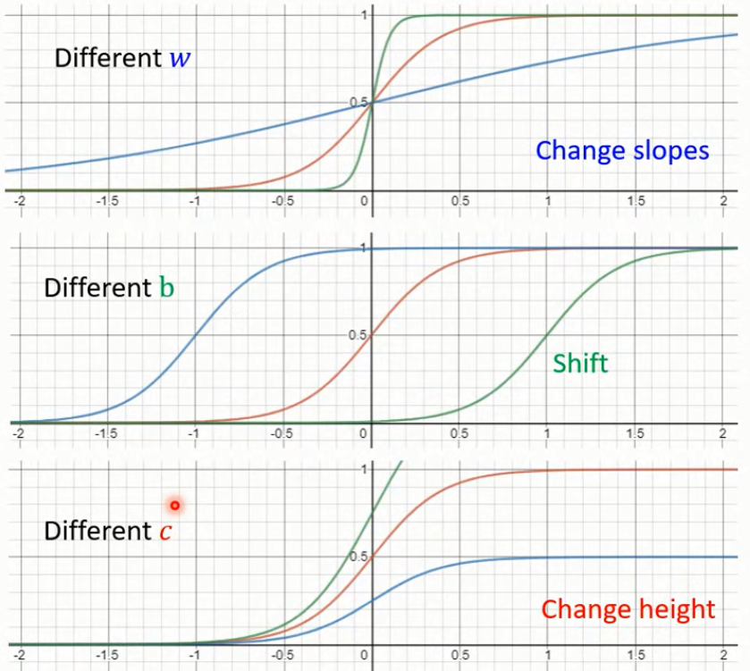

# 介绍

1. 机器学习的分类不止是classification和regression两类。
2. 目标是struction learning。create something with structure。机器学习的未来不只是输出一个数字，还需要产生一个有结构的物件。
3. 一般机器学习的3个步骤
   1. 定义有未知参数的函数
   2. 通过训练数据定义损失的计算形式
      1. 损失函数一般使用L1和L2。
      2. 当是离散值时会使用交叉熵作为损失函数。
   3. 优化
      1. 使用的方法是梯度下降Gradient Descent
      2. 首先随机初始化。
      3. 先固定一个值然后将另外一个值最优化。
4. 梯度下降
   1. **一般的教科书说梯度下降局部最优解（local minima/global minima）的问题。但李老师说梯度下降的真正问题不是局部最优解，而是其他的问题**。
   2. 的确好像在使用梯度下降的时候，好像都找到的了全局最优解。
5. Model Bias模型的偏好，表述的含义是由于模型本身的局限性，无法表示数据的真实状况。举例：线性（一元一次函数）模型，就无法描述一个一元二次函数代表的数据。
6. 为了解决Model Bias的问题，采用极限的思想，使用大量的sigmoid函数（$y= \color{red}{c}\;\color{black}\frac{1}{1+e^{-(b+wx_1)}}=\color{red}{c}\;\color{black}\text{sigmoid}(\color{green}{b}\color{black}+wx_1)\,$，**特别要注意的是e上面的指数是一个线性函数**）的来去逼近一元高次函数。Piecewise Linear(分段线性)。为了去拟合各种不同的曲线，就需要不同种类的sigmoid函数。不同的sigmoid函数通过调整参数c、b、w来实现。。c会调账sigmoid函数两条水平线之间的距离。w会调整sigmoid函数中间倾斜部分的斜率。b可以调整sigmoid函数的水平位移。
7. 定义gradient梯度是函数对每个变量偏导数的组成的向量。一般用$\nabla$表示