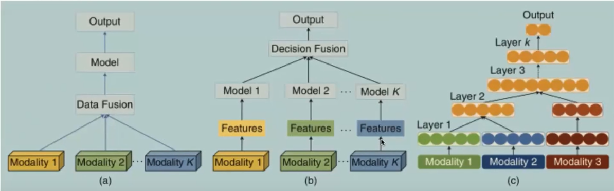

# MultiModal Machine Learning 多模态学习

## outline

参考：[这个视频讲得比较好](https://www.bilibili.com/video/BV1X84y1F7uU?spm_id_from=333.337.search-card.all.click)

5个技术点

1. 多模态表示学习 representation
2. 模态转化 translation
3. 对齐 alignment
4. 多模态融合 fusion
5. 协同学习 co-learning

## 多模态表示学习

需要将多模态数据之间的互补性利用起来，同时需要去掉多模态数据之间的冗余性。

1. 联合表示Joint representations：将多个模态的信息一起映射到一个统一的多模态空间中。
   1. 具体到实例中，将多模态信息映射到统一的偏好空间中。
   2. 具体方法可以将多模态的向量直接拼接在一起，或者将多模态的向量降维或者升维等。
2. 协同表示Coordinated representations：将多模态中的每个模态分别映射到各自的表示空间中，但是映射后的向量之间满足一定的相关性约束（例如线性相关）。
   1. 产生的向量是满足一定运算关系的。
3. 难点
   1. 在于处理不同模态携带来的不同类型的噪声。
   2. 处理不同类型的数据缺失。

## 模态转化

1. 定义：多模态转化也可以称为映射（Mapping），主要是将一个模态的信息转化或映射为另一个模态的信息。
2. 主要应用
   1. 机器翻译Machine Translation 、唇读Lip Reading和语音翻译Speech Translation
   2. 图片描述Image Captioning与视频描述Video Captioning
   3. 语音合成Speech Synthesis
3. 难点
   1. open ending不知道结束位在什么地方。
   2. subjective主观判断性，在很多模态转化的问题时，对于效果并没有一个比较客观的评判标准。也就是目标函数的确定非常主观。

## 模态对齐

1. 定义：从来自同一个实例的两个甚至多个模态中寻找子成分之间的关系和联系。也就是找到两个模态实例某些子成分之间是否存在一些对应关系。
2. 有两个方法
   1. 显示对齐explicit alignment
      1. 主要实现的方式：无监督的方式或者弱监督的方式。包括聚类、深度文本表示特征。the goal is to directly find correspondences between elements of different modalities.
      2. 难点
         1. 这种方式需要很多的数据，不然无法做无监督的学习。
         2. 模态之间的相似度如何进行定义。这个是很难定义的一件事情。
         3. 存在多个可能的对齐方案，并且其中一个方案不可能是的一个模态表示向量中所有的元素能够和另一个模态中的所有元素都可以对应得上。
   2. 隐式对齐implicit alignment。可以使用图神经网络的方式来找寻不同元素之间的对应关系。uses internally latent alignment of modalities in order to better solve a different problem.
3. 相关任务
   1. 给定一张图片和图片的描述，找到图中的某个区域以及这个区域在描述中对应的表述
   2. 图像语义分割image semantic segmentation
   3. 将电影中的帧和字幕进行对应。

## Multimodality Fusion多模态融合

1. 定义：联合多个模态的信息，进行目标预测（分类或者回归），属于MMML最早的研究方向之一，也是目前应用最广的方向，它还存在其他常见的别名，例如多源信息融合multi-source information fusion、多传感器融合multi-sensor fusion。
2. 分类，三个不同的阶段。在视频的21:40中详细说明了这个部分。
   1. pixel level对原始数据进行融合
   2. feature level对特征进行融合
   3. decision level对决策进行融合
3. 按照融合的类型分类
   1. 数据级别的融合。一般情况下效果可能比较差一点。
   2. 判定级别的融合。工业界一般就采用这种融合方式。步骤：
      1. 每个模态提取特征
      2. 每个特征进入各自的模型，每个模型都会产生一个结果
      3. 每个结果进行决策（比如投票决定使用那个结果）。投票结果合理，那么就要对该模态数据的权重进行增加。Decision fusion也可以使用模型来完成。
   3. 组合融合
      1. 举例：一个LSTM的结果需要和一个CNN的结果进行融合。这个时候LSTM的结果需要和CNN模型中的哪一层进行融合。
      2. 这种融合的难度最高，可能效果也是最好的。需要对模型有非常好的理解。
   4. 相关任务
      1. 视觉-音频识别visual audio recognition
      2. 多模态情感分析multimodal sentiment analysis
      3. 手机身份识别mobile identity authentication

4. 参考
   1. 文档参考1，写得不够详细。<https://zhuanlan.zhihu.com/p/133990245>
   2. 视频参考1。<https://www.bilibili.com/video/BV1zh411Z78q?spm_id_from=333.337.search-card.all.click>

### 介绍

1. MFT 主要包括模态表示（Representation）、融合 （Fusion） 、 转换 （Translation） 、 对齐（Alignment）等方法和技术。
2. 一致性、互补性、兼容性。
3. 一致性：最大化相关性，提取共享成分。CCA，Canonical Correlation Analysis典型相关性分析。
4. 子空间自表示。将不同形状的多视图特征统一表示为一个n*n的矩阵，然后将多个矩阵组合成一个加一维的矩阵，然后再经过一个神经网络输出。低秩子空间聚类。低秩约束。样本维度、特征维度、view维度（视图维度）。高维多视图聚类。
5. 一致性策略。使用的模型是：多模态数据高阶张量模型。可以在无监督的情况下将自动分类得特别好。这个地方没有明白目标是什么。
6. 互补性策略。不同角度首先学习一些初始聚类的结果。
   1. 隐式分离和显示分离。显示分离是人为定义哪些是共享信息，哪些是私有信息。私有信息称为模态特有信息。
   2. 通过添加一个多样性和独立性的互斥条件进行约束。
7. 兼容性策略。
8. 似乎可以先把结果提取出来，然后再进行融合。
9. 多模态数据之间是要提取不同数据之间的关联性。而不是取其中相同的部分或者不同的部分。这是因为不知道那部分有用，那部分没有用。
10. 多模态数据中存在各种缺失。如何处理这种缺失是有技术含量的。
11. 用最简洁的形式表示最全面的信息。
12. 缺失的信息可以采用GAN的方式进行补全。也就是：面向缺失模态的生成对抗补全模型。补全的信息需要和类似模型的分布相似。

## 协同学习 co-learning

1. 定义：通过利用资源丰富（比如数据量大）的模态的知识来辅助资源稀缺（比如较小数据）的模态建立模型。
   1. 迁移学习
2. 根据数据形式划分：
   1. parallel: Co-training, Transfer learning
   2. Non-parallel: Transfer learning, concept grounding, zero-shot learning.
   3. hybrid: bridging

## 具体实践步骤

1. concatenation是将多个向量自己拼成了一个向量。然后在通过attention提取每个元素之间的相关性。
2. 不同模态的数据通过不同的模型生成各自对应的向量，然后通过concatenate之后形成一个向量，再通过一个attention或者分类器模型输出最后的结果。通过attention得到的不同的权重分布，然后再通过一个分类器输出结果。
3. 图片的处理可以使用VGG-19模型。文本的处理先使用word-embadding，然后可以使用text-cnn模型。
4. attention
   1. 直接attention
   2. 引导的（这个地方没有听清楚）attention
   3. 直接添加分类器

## 多模态缺失数据的处理也可以从另外一个方面来说是数据对齐的问题。
