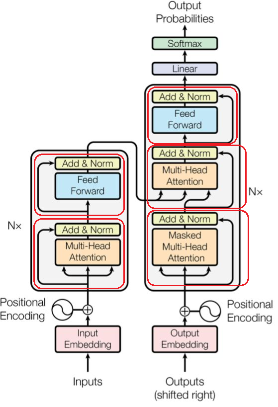
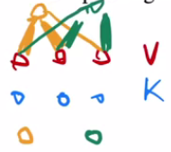

# 读论文笔记

Transformer实现。

## 1. 重要知识点

1. 序列转录模型。也就是给一个序列转换为另外一个序列。翻译就属于序列转录模型。这种模型一般使用包含encode和decode结构的循环或者CNN来实现。在transformer之前的也会运用到attention机制（注意力机制）。
2. Transformer将所有的循环层都换成了multi-head self-attention。作者希望生成的数据不那么序列化。
3. RNN的特点是在一个序列中从左往右一步一步的向前做。假如是一个句子的话，RNN会一个词一个词的向前看。对于第t个词，RNN会计算一个输出叫做$h_t$为这个词的隐藏状态。$h_t$是有前面一个词的隐藏状态$h_{t-1}$和当前第t个词来决定的。这样就可以通过RNN学到的前面词的信息通过$h_{t-1}$来放到当下，然和后当前的词进行交互。这也是RNN能够有效处理时序信息的关键所在。不足之处：
   1. RNN把之前的信息放在隐藏状态里面然后逐个传递下去。这也导致了RNN的不足，由于是逐个处理的，所以导致了RNN比较难以并行。在计算第t个词的时候，必须保证前面的t-1个词已经输入完成了。这导致了在时域上无法并行。
   2. 由于历史信息是一步一步向后传递的，如果序列比较长的话，比如时序序列很长，就会导致早期的时序信息，在后面计算的时候可能会已经被丢掉了。如果不想丢掉的可能得要$h_t$要比较大。如果使用了比较大的$h_t$了，那么在每个时间都需要把$h_t$存下来，导致了非常大的内存消耗。
4. 之前的attention机制主要是用在RNN中的encode-decode上，用途是将encode的信息更好的传递给decode。
5. 卷积神经网络比较难以对较长的时序建模。因为卷积核是一个非常小的模块，如果要将两个间隔比较远的元素联系起来的时候需要上升到比较高的卷积层才能看到。而transformer每次都可以看到所有的元素。
6. encode-decode架构
   1. 编码器的输入是一个$\boldsymbol{x}=(x_i,x_2,\cdots, x_n)$长度为n的序列。这个序列就是n个词的序列。其中的$x_t$表示的就是第t个词。编码器将序列$(x_i,x_2,\cdots, x_n)$编码为$\boldsymbol{z}=(z_i,z_2,\cdots, z_n)$，其中$z_t$表示第t个词的向量表示。（这里也就是说$\boldsymbol{z}$是一个矩阵了。每个$z_t$都是表示一个词的向量。这样就转化为了机器可以理解的数据了。）
   2. 解码器而言，它的输入是$\boldsymbol{y}=(x_i,x_2,\cdots, x_m)$。**注意编码器和解码器的输入长度一般是不一样的，一个是n一个是m。也就是说可以一样也可以不一样。**在翻译中源句子和目标句子很可能是不一样长的。解码器相对于编码器而言最大的不同在于，解码器输出的词是一个一个生成的；而编码器很有可能是一次性看完所有的句子。这个就是叫做auto-regressive（自回归）的模型。在auto-regressive模型中，它的输入又是它的输出。举例说明：解码器在最开始的时候拿到了$\boldsymbol{z}$，那么这个时候就可以生成$y_1$，在得到$y_1$之后就可以去生成$y_2$，而当需要生成$y_t$的时候，可以将$y_1 \text{到} y_{t-1}$全部拿到。也就是说在翻译的时候是一个词一个词的向外输出的。**也就是说过去时刻的输出，也会作为当前时刻的输入，这就叫做自回归**。
7. 嵌入层做的事情就是将一个一个的词表示为一个一个的向量。
8. 如果所示红色方框部分就是编码器和解码器中的残差连接
   
9. feed forward NN，前馈神经网络。整个网络中无反馈，信号从输入层向输出层单向传播，可用一个有向无环图表示 。（每一层的神经元可以接收前一层神经元的信号，并产生信号输出到下一层）前馈神经网络也经常称为多层感知器（Multi-Layer Perceptron，MLP）。**前馈神经网络就是MLP**。
10. 注意不一样的地方在于：
    1. 编码解码器中的每一块的结果不一样了。
    2. 如图所示从encode到decode之间的连接如何实现不一样了。。
11. 残差连接需要输入输出一样。所以在transformer里面将输入输出都设置为了512。
12. layerNorm和BatchNorm之间的区别。为什么在变长的情况下不适用batchnorm。
    1. batchnorm在每一个小批量中将均值变为0，方差变为1。列中将它们的均值减去，然后在除以方差即可。
    2. batchnorm和layernorm处理数据的方向不一样。
    3. 如果在计算均值和方差的时候，如果数据的长度大小变化很大的画，bn导致的均值和方差的抖动非常大。
    4. bn会存一个全局的均值和方差，在碰到新的比较不一样的（比如长度非常长）样本的时候可能会导致之前存在下的均值和方差和新样本不一样。而ln计算均值和方差是对每个样本自己来计算的。相对来说会稳定一些。后面对ln的解读有些和本文中的解释并不一样。后面的解读更多的是从梯度和数学的方向来解读的。
13. 编码器用到的技术点：LayerNorm、残差网络、多头注意力机制。
14. 解码器用到的技术点：LayerNorm、残差网络、多头注意力机制、自回归模型、掩码。
15. **掩码是因为多头注意力机制每次会看到完整的输入，为了避免这个情况的出现就采用了掩码技术。也就是在对t时刻进行预测的时候，不应该看到t时刻之后的那些输入。从而保证训练和预测的时候行为是一致的**。
16. 注意力attention
    1. 注意力函数是将一个query和一些key-value映射成一个output的函数。注意，这里有三个变量：一个quer、一些key-value对、一个output。这里的query、key、value、output四个都是向量。具体而言output是values（复数，表示多个value）的加权和，导致output的维度和value的维度是一样的。加权和的权重是对应于value的key和查询这个query的相识度计算出来的。这个相识度compatibility function不同的注意力机制有不同的算法。
    2. 注意力机制原理，同时简要说明相似函数compatibility function的计算：现在有一组key-value的对。然后假设输入query0（黄色），通过将query0和key两个向量之间做比较（通过计算内积可以比较两个向量之间的相似程度），发现query0和key中的$key_1, key_2$比较相似，而和$key_3$不一样；那么query0就和$key_1, key_2$之间的权重高，和$key_3$之间的权重低。同理假设输入query1（蓝色），发现query1和key中的$key_2, key_3$比较相似，而和$key_1$不一样；那么query1就和$key_2, key_3$之间的权重高，和$key_1$之间的权重低。如图所示：。虽然key-value对并没有改变，但是随着query的变化，权重的分配会不一样，导致输出也会随之改变。
    3. 不同的相似函数会得到不同的注意力机制的版本。Transformer里面用的相似函数是scaled dot-product attention，这个就是最简单的相似函数。Transformer中的query和key是等长的（query和key可以不等长，不等长有其他的计算方法），长度为$d_k$。value的长度是$d_v$，那么输出的长度也是$d_v$。然后对query和每一个key做内积，作为相识度。然后将内积的除以$\sqrt{d_k}$，然后再通过softmax来得到权重值。这里需要说明的是给一个query会对给定的n个key做内积计算，再放入softmax中就会得到n个非负的而且加起来等于1的一个权重。然后将这个权重作用在values上就可以得到输出。实际中计算法的方法$Attention(\boldsymbol{Q},\boldsymbol{V},\boldsymbol{K}) = softmax(\frac{\boldsymbol{Q}_{(n,d_k)}\boldsymbol{K}^T_{(d_k,m)}}{\sqrt{d_k}})\boldsymbol{V}_{(m,d_v)}$其中softmax是对$(\frac{\boldsymbol{Q}_{(n,d_k)}\boldsymbol{K}^T_{(d_k,m)}}{\sqrt{d_k}})_{(n,m)}$的每一行进行softmax。这样如果有n个query的话，可以通过两次矩阵乘法来计算得到最后的结果。这样非常容易并行的计算每个元素。因为矩阵乘法是一个非常好并行的运算。
    4. 和别的注意力机制的区别：
       1. 一种是加型的注意力机制，可以处理query和key不等长的情况。
       2. 另外一种是点积注意力机制。这个点积注意力机制和我们transformer基本上是一样的。除了transformer在计算的过程中除以了一个$\sqrt{d_k}$。这里就是为什么要用scaled这个单词的原因。选择点积的原因是实现比较简单而且可以并行计算。为什么要除以$\sqrt{d_k}$的原因：当$d_k$不是很大的时候其实除不除以$d_k$都是没有关系的。但是当$d_k$比较大的时候，也就是说两个向量长度比较长的时候。在做点积的时候会出现值之间的差距比较大（也就是query和多个key的点积结果有相对比较大的，也有相对比较小的）。这时在进行softmax运算时，导致最大的那个值更加靠近于1，剩下的那些比较小的值更加靠近于0。也就是值会更加向两端靠拢。当出现这种情况是，计算梯度时梯度会比较小。因为softmax的结果是置信的地方尽量靠近于1，不置信的地方尽量靠近于0。这是说明收敛得差不多，这时梯度就会变得比较小，那么模型训练就会跑不动。而在transformer里面的$d_k$比较大，所以除以一个$d_k$是不错的选择。
17. mask主要是为了避免在第t时刻看到t时刻之后的输入。假设query和key的长度都为n，而且在时间上可以可以对应起来。对于t时刻的$q_t$只需要看到$k_1,k_2,\cdots,k_{t-1}$，而不应该看到$k_{t+1},k_{t+2},\cdots,k_{n}$。虽然实际上在注意力机制是可以看到所有的$\boldsymbol{k}$的，而且$q_t$是会和所有$\boldsymbol{k}$进行计算的。这个时候的解决方法是：可以先计算出来，但是在计算权重的时候将$q_t$和$k_t$之后计算出来的值替换为一个非常大的负数（比如说$-10^{10}$），在进入softmax之后做指数运算时就会变成0。直接导致$k_{t+1},k_{t+2},\cdots,k_{n}$对应的计算值都为0，只会有$k_1,k_2,\cdots,k_{t-1}$出效果。对应的在计算output的时候就只会有$v_1,v_2,\cdots,v_{t-1}$进行计算，t及t时刻之后的全部参与计算了。
18. multi-head多头
19. 自注意力机制的核心是：key, value, query实际是输入的复制了3份。
20. 归纳偏置

## 2. 问题

1. BLEU score具体是什么评价标准？

## 3. 其他

1. 四类基础模型：MLP、CNN、RNN和Transformer。
2. 通常代码都会放在摘要的最后一句话。