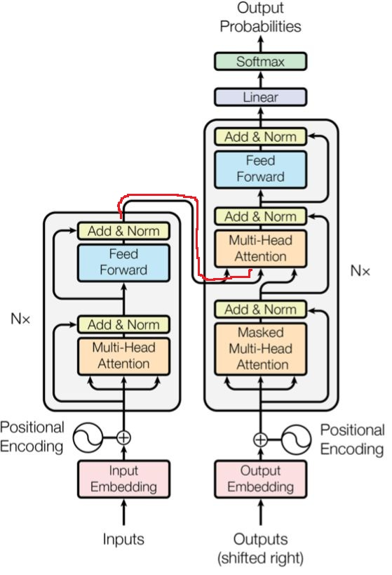
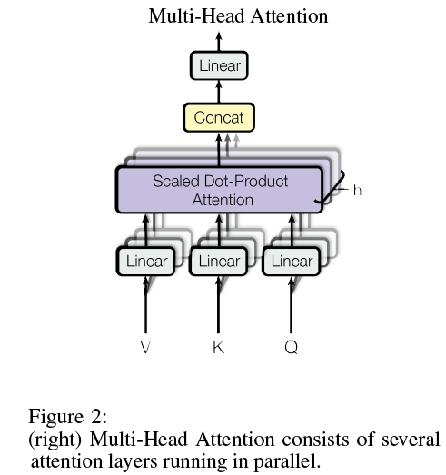
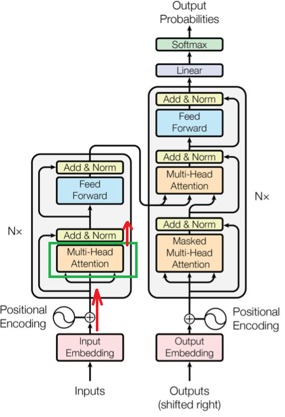
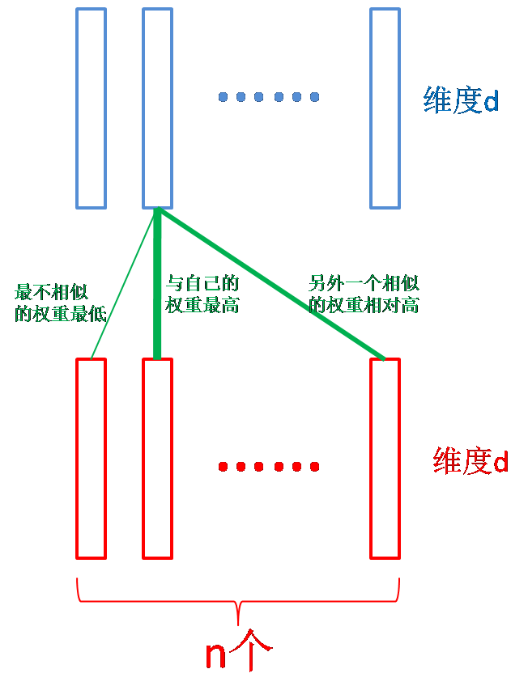
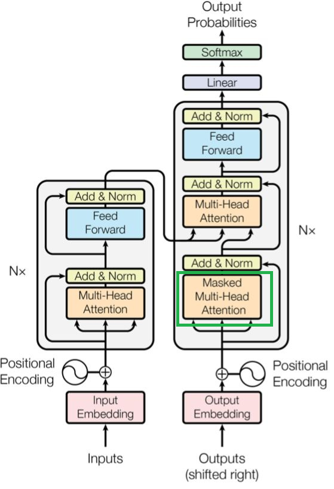
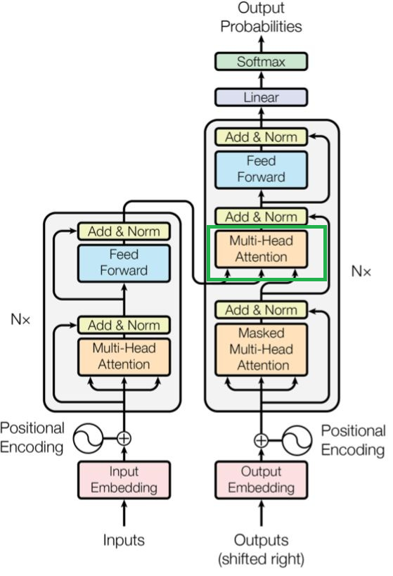
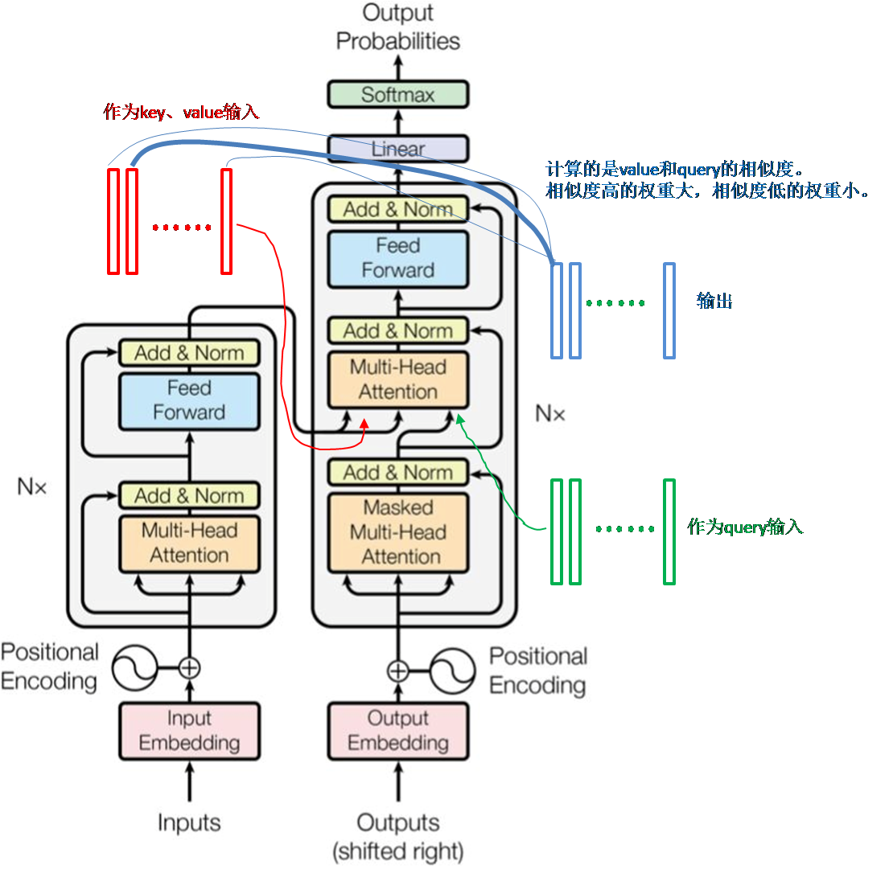

# 读论文笔记

Transformer实现。 Attention is all you need.

## 1. 重要知识点

1. 序列转录模型。也就是给一个序列转换为另外一个序列。翻译就属于序列转录模型。这种模型一般使用包含encode和decode结构的循环或者CNN来实现。在transformer之前的也会运用到attention机制（注意力机制）。
2. Transformer将所有的循环层都换成了multi-head self-attention。作者希望生成的数据不那么序列化。
3. RNN的特点是在一个序列中从左往右一步一步的向前做。假如是一个句子的话，RNN会一个词一个词的向前看。对于第t个词，RNN会计算一个输出叫做$h_t$为这个词的隐藏状态。$h_t$是有前面一个词的隐藏状态$h_{t-1}$和当前第t个词来决定的（也就说，计算当前词的隐藏状态会由前面所有积累的信息和当前的这个词来计算出来）。这样就可以通过RNN学到的前面词的信息通过$h_{t-1}$来放到当下，然和后当前的词进行交互。这也是RNN能够有效处理时序信息的关键所在。不足之处：
   1. RNN把之前的信息放在隐藏状态里面然后逐个传递下去。这也导致了RNN的不足，由于是逐个处理的，所以导致了RNN比较难以并行。在计算第t个词的时候，必须保证前面的t-1个词已经输入完成了。这导致了在时域上无法并行。
   2. 由于历史信息是一步一步向后传递的，如果序列比较长的话，比如时序序列很长，就会导致早期的时序信息，在后面计算的时候可能会已经被丢掉了。如果不想丢掉的可能得要$h_t$要比较大。如果使用了比较大的$h_t$了，那么在每个时间都需要把$h_t$存下来，导致了非常大的内存消耗。
4. 之前的attention机制主要是用在RNN中的encode-decode上，用途是将encode的信息更好的传递给decode。
5. 卷积神经网络比较难以对较长的时序建模。因为卷积核是一个非常小的模块，如果要将两个间隔比较远的元素联系起来的时候需要上升到比较高的卷积层才能看到。而transformer每次都可以看到所有的元素。
   1. 论文尝试了用卷积神经网络来替换掉循环神经网络时的过程。每次只能看到一个比较小的窗口。自注意力机制可以完整的看到整个序列。
   2. 卷积神经网络可以有多个输出通道。论文提出了multi-head attention的机制来完成多通道的输出。
6. encode-decode架构
   1. 编码器的输入是一个$\boldsymbol{x}=(x_i,x_2,\cdots, x_n)$长度为n的序列。这个序列就是n个词的序列。其中的$x_t$表示的就是第t个词。编码器将序列$(x_i,x_2,\cdots, x_n)$编码为$\boldsymbol{z}=(z_i,z_2,\cdots, z_n)$，其中$z_t$表示第t个词的向量表示。（这里也就是说$\boldsymbol{z}$是一个矩阵了。每个$z_t$都是表示一个词的向量。这样就转化为了机器可以理解的数据了。）
   2. 解码器而言，它的输入是$\boldsymbol{y}=(x_i,x_2,\cdots, x_m)$。**注意编码器和解码器的输入长度一般是不一样的，一个是n一个是m。也就是说可以一样也可以不一样**。在翻译中源句子和目标句子很可能是不一样长的。解码器相对于编码器而言最大的不同在于，解码器输出的词是一个一个生成的；而编码器很有可能是一次性看完所有的句子。这个就是叫做auto-regressive（自回归）的模型。在auto-regressive模型中，它的输入又是它的输出。举例说明：解码器在最开始的时候拿到了$\boldsymbol{z}$，那么这个时候就可以生成$y_1$，在得到$y_1$之后就可以去生成$y_2$，而当需要生成$y_t$的时候，可以将$y_1 \text{到} y_{t-1}$全部拿到。也就是说在翻译的时候是一个词一个词的向外输出的。**也就是说过去时刻的输出，也会作为当前时刻的输入，这就叫做自回归**。
7. 嵌入层做的事情就是将一个一个的词表示为一个一个的向量。
8. 如果所示红色方框部分就是编码器和解码器中的残差连接
   
9. feed forward NN，前馈神经网络。整个网络中无反馈，信号从输入层向输出层单向传播，可用一个有向无环图表示 。（每一层的神经元可以接收前一层神经元的信号，并产生信号输出到下一层）前馈神经网络也经常称为多层感知器（Multi-Layer Perceptron，MLP）。**前馈神经网络就是MLP**。
10. 注意不一样的地方在于：
    1. 编码解码器中的每一块的结果不一样了。
    2. 如图所示从encode到decode之间的连接如何实现不一样了。。
11. 残差连接需要输入输出一样。所以在transformer里面将输入输出都设置为了512。
12. layerNorm和BatchNorm之间的区别。为什么在变长的情况下不适用batchnorm。
    1. batchnorm在每一个小批量中将均值变为0，方差变为1。列中将它们的均值减去，然后在除以方差即可。
    2. batchnorm和layernorm处理数据的方向不一样。
    3. 如果在计算均值和方差的时候，如果数据的长度大小变化很大的画，bn导致的均值和方差的抖动非常大。
    4. bn会存一个全局的均值和方差，在碰到新的比较不一样的（比如长度非常长）样本的时候可能会导致之前存在下的均值和方差和新样本不一样。而ln计算均值和方差是对每个样本自己来计算的。相对来说会稳定一些。后面对ln的解读有些和本文中的解释并不一样。后面的解读更多的是从梯度和数学的方向来解读的。
13. 编码器用到的技术点：LayerNorm、残差网络、多头注意力机制。
14. 解码器用到的技术点：LayerNorm、残差网络、多头注意力机制、自回归模型、掩码。
15. **掩码是因为多头注意力机制每次会看到完整的输入，为了避免这个情况的出现就采用了掩码技术。也就是在对t时刻进行预测的时候，不应该看到t时刻之后的那些输入。从而保证训练和预测的时候行为是一致的**。
16. 注意力attention
    1. 注意力函数是将一个query和一些key-value映射成一个output的函数。注意，这里有三个变量：一个query、一些key-value对、一个output。这里的query、key、value、output四个都是向量。具体而言output是values（复数，表示多个value）的加权和，导致output的维度和value的维度是一样的。加权和的权重是对应于value的key和查询这个query的相识度计算出来的。这个相识度compatibility function不同的注意力机制有不同的算法。
    2. 注意力机制原理，同时简要说明相似函数compatibility function的计算：现在有一组key-value的对。然后假设输入query0（黄色），通过将query0和key两个向量之间做比较（通过计算内积可以比较两个向量之间的相似程度），发现query0和key中的$key_1, key_2$比较相似，而和$key_3$不一样；那么query0就和$key_1, key_2$之间的权重高，和$key_3$之间的权重低。同理假设输入query1（蓝色），发现query1和key中的$key_2, key_3$比较相似，而和$key_1$不一样；那么query1就和$key_2, key_3$之间的权重高，和$key_1$之间的权重低。如图所示：。虽然key-value对并没有改变，但是随着query的变化，权重的分配会不一样，导致输出也会随之改变。
    3. 不同的相似函数会得到不同的注意力机制的版本。Transformer里面用的相似函数是scaled dot-product attention，这个就是最简单的相似函数。Transformer中的query和key是等长的（query和key可以不等长，不等长有其他的计算方法），key长度为$d_k$。value的长度是$d_v$，那么输出的长度也是$d_v$。然后对query和每一个key做内积，作为相识度。然后将内积的除以$\sqrt{d_k}$，然后再通过softmax来得到权重值。这里需要说明的是给一个query会对给定的n个key做内积计算，再放入softmax中就会得到n个非负的而且加起来等于1的一个权重。然后将这个权重作用在values上就可以得到输出。实际中计算法的方法$Attention(\boldsymbol{Q},\boldsymbol{V},\boldsymbol{K}) = softmax(\frac{\boldsymbol{Q}_{(n,d_k)}\boldsymbol{K}^T_{(d_k,m)}}{\sqrt{d_k}})\boldsymbol{V}_{(m,d_v)}$其中softmax是对$(\frac{\boldsymbol{Q}_{(n,d_k)}\boldsymbol{K}^T_{(d_k,m)}}{\sqrt{d_k}})_{(n,m)}$的每一行进行softmax。这样如果有n个query的话，可以通过两次矩阵乘法来计算得到最后的结果。这样非常容易并行的计算每个元素。因为矩阵乘法是一个非常好并行的运算。
    4. 和别的注意力机制的区别：
       1. 一种是加型的注意力机制，可以处理query和key不等长的情况。
       2. 另外一种是点积注意力机制。这个点积注意力机制和我们transformer基本上是一样的。除了transformer在计算的过程中除以了一个$\sqrt{d_k}$。这里就是为什么要用scaled这个单词的原因。选择点积的原因是实现比较简单而且可以并行计算。为什么要除以$\sqrt{d_k}$的原因：当$d_k$不是很大的时候其实除不除以$d_k$都是没有关系的。但是当$d_k$比较大的时候，也就是说两个向量长度比较长的时候。在做点积的时候会出现值之间的差距比较大（也就是query和多个key的点积结果有相对比较大的，也有相对比较小的）。这时在进行softmax运算时，导致最大的那个值更加靠近于1，剩下的那些比较小的值更加靠近于0。也就是值会更加向两端靠拢。当出现这种情况是，计算梯度时梯度会比较小。因为softmax的结果是置信的地方尽量靠近于1，不置信的地方尽量靠近于0。这是说明收敛得差不多，这时梯度就会变得比较小，那么模型训练就会跑不动。而在transformer里面的$d_k$比较大，所以除以一个$d_k$是不错的选择。
17. mask主要是为了避免在第t时刻看到t时刻之后的输入。假设query和key的长度都为n，而且在时间上可以可以对应起来。对于t时刻的$q_t$只需要看到$k_1,k_2,\cdots,k_{t-1}$，而不应该看到$k_{t+1},k_{t+2},\cdots,k_{n}$。虽然实际上在注意力机制是可以看到所有的$\boldsymbol{k}$的，而且$q_t$是会和所有$\boldsymbol{k}$进行计算的。这个时候的解决方法是：可以先计算出来，但是在计算权重的时候将$q_t$和$k_t$之后计算出来的值替换为一个非常大的负数（比如说$-10^{10}$）（问题：是否可以赋值为0呢？），在进入softmax之后做指数运算时就会变成0。直接导致$k_{t+1},k_{t+2},\cdots,k_{n}$对应的计算值都为0，只会有$k_1,k_2,\cdots,k_{t-1}$出效果。对应的在计算output的时候就只会有$v_1,v_2,\cdots,v_{t-1}$进行计算，t及t时刻之后的全部参与计算了。

18. multi-head多头：与其做一个单个的注意力函数，不如将整个keys, values, queries（注意都是复数）都投影到一个低维，投影h次。然后再做h次的注意力函数。并且将每一个注意力函数的输出并在一起。再投影回来得到最终的输出。 。QKV都进过了一个线性层。线性层的作用就是将数据投影到一个比较低的维度上。然后再做h次scaled dot-product attention。会得到h个输出。把输出向量全部合并到一起之后最后做一次线性投影。然后回到multi-head attention。为什么要做多头注意力机制？原因可以发现在scaled dot-product attention的过程中没有需要调节的参数。在识别不一样的模式，希望有一些不太一样的计算像素的办法。如果使用的addition attention时，其中还有一个权重需要学习。但是乘积性的attention中没有。所以这里通过一个权重w来将K\V\Q投影到低维。也就是说给予模型h次机会，希望学到不一样的投影方法。使得在被投影的度量空间中能够去匹配不同的模式所需要的一些相似函数。最后再做一次投影回来。有一点类似卷积神经网络中的多个输出通道的意思。
    $$\text{MutliHead}(Q, K, V)=\text{Concat}(head_1, head_2, \cdots ,head_h)\boldsymbol{W}^O \\
    \text{where }head_i=\text{Attention}(\boldsymbol{QW}_i^Q, \boldsymbol{KW}_i^K, \boldsymbol{VW}_i^V)$$
QKV依然还是QKV，但是通过多头机制之后将输出的head连接起来，然后投影到$\boldsymbol{W}^O$空间上。**每个$\text{head}_i$是每个QKV通过3个不同的可以学习的$\boldsymbol{W}_i^{Q/K/V}$投影到低维上面**。在做我们之前提到的注意力函数。最终输出结果。目前h=8。因为有残差的存在，所以输入和输出的维度是一样的。投影的时候就是输出的维度除以h。

19. **自注意力机制的核心是：key, value, query实际是输入的复制了3份**。

20. Transformer如何使用注意力机制，也就是说在一个transformer模型中使用了3个注意力层，下面将详细说明这3个注意力层的输入和输出：
    1. 在编码器中的输入：假设句子的长度为n，那么输入就是n个长度为d的向量。如果批量大小设置为1。可以看到第1个注意力层有3个输入，分别表示的是key、value、query。这里也就是说同一个输入复制为3份，即作为key也作为value同时也是query。**这个的复制成3个的过程就表示了“自注意力”机制中的“自”。key、value、query其实都是一个东西，就是输入本身**。而且输入和value的长度是一样的，也就是输出的维度也是$n\times d$。也就意味着输入和输出的大小其实是一样的。对于每个query都会计算一个输出（注意这里的“输出”的维度是$n \times 1$）。这个输出其实就是value的加权和。这个加权和的权重来资源query和key。如图所示，绿色线代表权重。权重实际上是该向量和其他的向量之间计算相识度。该向量和自己计算肯定相似度是最高的，如果该向量和其他的某个向量的相似程度也有一定程度，那么权重也会变高。在不考虑多头和投影的情况下，输出其实就是你输入的加权和，权重来自于自己与自己本身和自己和其他向量之间的一个相似度。如果有多头和投影的情况下，会学习**h个不一样的距离空间**出来。而且每个权重之间都会有所差别。
    2. 在解码器中第1个注意力层的输入也和编码器中注意力层类似，也是将同一个输入复制了3次，只不过维度从$n \times d$可能变为了$m \times d$。结构上不一样的在于有一个masked的地方。原因在于通过一个query计算输出的时候，它是不应该看到它自己之后的query的。也就是说需要它自己之后的权重要设置为0。如图黄色部分所示。
    3. 在解码器中的第2个注意力层。**特别需要注意的是这里不再是自注意力**。key和value来自于编码器的输出，query来自于前一个解码器注意力层的输出。编码器的输出是维度为$n \times d$的矩阵（也就是n个长为d的向量），需要注意的是这里编码器的输出复制成为了2份。前面一个解码器注意力层的输出维度是$m \times d$。。这个attention做的事情就是有效的把编码器中的输出根据想要的东西把它提炼出来。举个例子：假设从编码器出来的输出是"hello world"，期望的输出是"你好世界"，在计算输出的时候，"你"和"hello"的相关性要高，和其他的相关性要低；同样的在计算输出"世"或者"界"query的时候期望和"world"的value、key的权重要高。这就是说根据解码器输入的不一样，根据当前解码器中前一个注意力层的输出向量的不同，从编码器的输出中挑选感兴趣的东西，也就是你注意到你感兴趣的东西，那些和你没有太多关系的编码器的输出就可以忽略掉它。这个也是attention如何在编码器和解码器之间传递信息的时候起到的作用。

21. Position-wise Feed-Forward Network的作用。3个Feed-Forward Network实际上就是3个MLP，但是它们不一样的地方在于（applied to each position separately and identically）：一个MLP对每一个词（每一个词认为是一个点）作用一次，对于每一个词起作用的是同一个MLP（这也是position-wise的含义）。说白了就是一个MLP，只是作用于最后一个维度。$FFN(x)=max(0, x\boldsymbol{W}_1 + b_1)\boldsymbol{W}_2 + b_2$。其中$x\boldsymbol{W}_1 + b_1$就是一个线性层$max(0, x\boldsymbol{W}_1 + b_1)\boldsymbol{W}_2$当中的max就是relu激活层。最外层再有一层线性层。目前注意力层的对应每个query的输入长度为512。也就是说公式中的$x$是一个长度为512的向量。$\boldsymbol{W}_1$会将$x$长度投影成2048。因为最后有个残差连接需要长度一致，所以$\boldsymbol{W}_2$将长度又投影回了512。说穿了了$FFN(x)$就是一个但隐藏层的MLP。中间的隐藏层把输入长度扩大4倍，在最后输出的时候又缩小4倍。**实际上就是把两个线性层放在一起**。

22. attention做的事情是将序列中感兴趣的东西抓取出来，做一次汇聚aggregation。后面的MLP是将序列映射成更想要的语义空间。通过attention之后的输出的每个向量都含有了感兴趣的语义信息，所以每个MLP都只需要对每个向量独立做映射就可以了。

23. 线性层也就是MLP具体的作用是做语义空间的转换。

24. transformer和RNN的区别
    1. 两者都是用MLP来做语义转换。
    2. 不同的地方在于如何传递序列信息：transformer每次读取了所有的全局序列信息。RNN是利用上一时刻的输出作为下一个时刻的输入。
    3. 关注点都是在如何有效的使用序列信息。

25. Embedding and softmax层。**输入的是一个一个词或者称其为token**，需要将其映射为向量。给定任何一个词embedding就是学习一个长度为$d_{model}$的向量来表示它。编码器和解码器的输入都需要一个embedding。softmax之前的线性也需要一个embedding。论文中说明这3个embedding都使用相同的权重。这样会使得训练起来简单一点。在计算权重的时候将权重乘以了$\sqrt{d_{model}}$。为什么在学习embedding的时候需要乘以了$\sqrt{d_{model}}$呢？在学习embedding的时候会把每个向量的$L2 Norm$（L2范数）学成比较小的值。当维度比较大的时候会导致学的权重值变小。由于之后需要加上Positional Encoding，不会随着长度变成而把L2Norm固定住。所以在乘以了$\sqrt{d_{model}}$之后使得embedding加上Positional Encoding的时候在规模或者比例(scale)上差不多。

26. Positional Encoding层：
    1. 存在的原因是因为**ettention中不包含时序信息**。输出的是value的加权和。权重是query和key之间的距离。**这导致和序列信息无关，也就是说不会关心key、value在序列中的什么位置。直接导致的结果如果给你一句话，把顺序打乱之后通过attention的结果都是一样的；虽然顺序会变但是值不会变**。所以需要将时序信息加入进来。RNN是通过上一个时刻输出作为下一个时刻的输入来传递历史信息，也就是传递了时序信息。RNN本身就包含时序的信息。
    2. transformer的做法是在输入中加入时序信息。比如一个词在整个句子中的位置i加入到输入中。将位置信息成为positional encoding。
    3. 实现的思路：将位置信息通过一个512为的值来表示。具体是使用周期不一样的sin、cos函数来表示的。然后将positional encoding和embedding相加，这样就完成了将时序信息加入到输入数据的方法。特别需要注意的embedding乘以了$\sqrt{d_{model}}$之后会使得embedding的结果在-1到1之间。而positional encoding因为是sin、cos函数所以它的值域也是在-1到1之间。这就完成了在输入之中加入了位置信息。由于ettention不会改变顺序，也就是说输入序列无论如何打乱顺序，输出的值不会变，最多是顺序发生了相应的变化。所以transformer直接将顺序信息的值和embedding相加了。
27. 为什么要用ettention，下表中n是序列的长度，d是向量的长度。
    |层类型|不同层的复杂性（计算复杂度）|时序操作性sequential Operations（顺序的计算，下一步计算需要等待前面多少步完成，也就意味着这个值越低并行度越高）|最大路径长度（一个信息点到另一个信息点的距离）|
    |---|---|---|---|
    |self-attention|$O(n^2 \cdot d)$|$O(1)$|$O(1)$|
    |recurrent循环层|$O(n \cdot n^2)$|$O(n)$|$O(n)$|
    |convolutional卷积层|$O(k \cdot n \cdot d^2)$|$O(1)$|$O(\log_k(n))$|
    |self-attention(restricted)受限的自注意力层|$O(r \cdot n \cdot d)$|$O(1)$|$O(n/r)$|
    1. 自注意力说白了是几个矩阵做运算。query矩阵乘以key矩阵。query矩阵有n行d列。key矩阵也有n行d列。query和key相乘，那么算法复杂度就是$O(n^2 \cdot d)$。矩阵里面的并行度很高，所以顺序复制度可以认为是$O(1)$。在自注意力中是一个query和所有的key、value进行计算；所以距离是非常短的。
    2. 循环层：如果序列长度是n的话，那么循环层是逐个做运算。每个里面就是一个n乘以n的矩阵（这个地方没听明白）。目前来看，模型基本上n和d的量级都可以达到几千的样子，也就是说n和d差不多大小，所以就复杂度而言自注意和循环层基本上相同。可以看到循环层需要等待前面的计算完成，所以顺序复杂度上循环层是比较吃亏的。同时最初点的信息要走n部才能达到最后一个点。所以会批评RNN在对比较长的序列处理时不够好，因为最初点的信息在传递过程中容易丢失。
    3. 卷积层：$O(k \cdot n \cdot d^2)$其中k是卷积核的大小，一般而言都是个位数（比如卷积核的大小为3或者5），在计算时可以认为是常数。可以认为和循环层差不多。但是卷积的并行度很高，计算起来会快一点。如果信息点在卷积核的范围内，那么只需要1次就可以传过去。然后超过了单个卷积核的范围那么就需要一层一层的卷积来传递信息，这个过程是一个log操作。
    4. 受限自注意层：query只和最近的r个邻居做运算。这样就会降低计算复杂度，但是信息传递的距离就需要n/r才能到达。一般而言是需要将特别长的序列的信息糅合得比较好，所以对受限自注意层并没有特别进行关注。
    5. 总结：在实际中，当序列长度和模型的宽度和深度一样的话，上述（除受限自注意模型外）的三种模型的计算复杂度都差不多。并行性而言自注意和卷积会好一些。attention在信息糅合性上更好。**从上表而言，感觉上对长序列的数据处理更好，而且计算复杂度也比较低。实际上，attention对模型做了更少的假设，导致需要更多的数据和更大的模型才能将模型训练出来。导致与RNN和CNN的效果相同。现在基于transformer的模型都特别大特别贵**。
28. 训练相关说明
    1. 使用的是WMT 2014数据集。
    2. 采用的是byte-pair encoding编码方式。采用这种方式的原因是英语和德语中有很多词语的变形，比如动词加ing或者加es等形式，但是模型无法有效的将这些变形的词语区分出来。如果将每一个词都做成一个token的话，会导致字典的长度比较大。所以采用了BPE，BPE将它们的词根提取出来的方式来区分一个词。BPE的好处是可以将整个字典做的比较小。transformer使用了37,000个token（可以理解为词）；而且这个字典是在英语和德语之间共享的。共享字典的好处是：模型的编码器和解码器就可以使用相同的embedding。而且使得模型变得更加简单了。这就是所谓的编码器和解码器是共享权重的。
    3. 使用的是8个NVIDIA P100 GPU。每个step耗费0.4秒。总共有100,000 step，共耗时12个小时。
    4. 学习率是通过公式$lrate=d_{model}^{-0.5} \cdot min(step\_num^{-0.5}, step\_num \cdot warmup\_steps^{-1.5})$来计算的。学习率是根据模型宽度的-0.5次方来计算的。也就是当模型越宽的时候（学习的向量越长的时候）学习率就要低一点。另外一个就是有$warmup\_steps$由一个小的值慢慢爬到一个比较高的值，爬到比较高的值之后在根据步数的-0.5次方衰减。这里设置的$warmup\_steps=4000$。比较有意思的是学习率基本上不用调参，主要原因是在于Adam对学习率并不敏感。
29. 正则化Regularization:
    1. Residual Dropout:对每一个子层（包括多头注意力层和之后的MLP）在每一个层的输出上，在它进入残差连接之前和进入layerNorm之前使用了dropout的率是0.1。也就是说把这些输出的10%的那些元素乘以0.1，剩下的那些值乘以1.1。另外在输入中词嵌入加上position encoding的时候，在它上面也用了一个dropout。也就是把10%的元素值赋值为0（1:17:22这个地方文字翻译是乘以0.1，但是听老师的发音应该是"置为0"）。有意思的是说基本上对每一个带权重的乘在输出上都使用了dropout。用得是比较狠的。虽然dropout率并不是特别高，但是transformer使用了大量的dropout层来对模型进行正则化。
    2. Label Smoothing：这个技术是在inception v3让大家所知道的。意思是说：当使用softmax去学习一个东西的时候，我们的标号是正确的是1，错误的是0。对于正确的那一个label的softmax值去逼近于1。但我们知道softmax是很难逼近于1的。因为softmax中使用的函数是一个指数，只有到输出接近于无限大的时候才会逼近与1。这使得训练比较难。一般的做法是不要做成那么难于逼近的0和1，而是将结果值下降一点，比如降为0.9。当transformer中降得比较狠，直接降低为了0.1。也就是对于正确的那个词，只需要我们的softmax的输出是0.1就可以了。也就是置信度是0.1即可，并不需要做得很高。剩下的那些值就可以是0.9除以字典的大小。因此这里会损失你的perplexity。perplexity是log lost做指数，基本上可以认为是你模型的补缺行动。但是会提升accuracy和BLEU的分数，accuracy和BLEU才是关心的重点。
30. 相对而言能调的参数主要是$N$是有多少层，$d_{model}$模型有多宽，$h$有多少个头，剩下的那些参数基本上都可以按照比例来进行计算。这也是transformer架构的一个好处。虽然模型看上去比较复杂，但实际上并没有太多参数可以调。BERT和GPT都是使用transformer的结构进行了借鉴，然后只用调整少量参数即可。
31. 现在NLP的任务训练不同的架构，出现了transformer之后就不需要做这些工作了。基本上犹如CNN对于CV的贡献一样。而且预训练的模型也让模型变得更加简单。transformer之后可以在所有的事件处理上都可以使用相同的模型了，之前CV一般使用CNN，在语言处理中使用RNN，然后不同的领域使用不同的模型。极大的减少新技术在各个领域被应用的时间。人对事件的感知是多模态的，transformer可以把所有的不同类型的数据进行融合起来。大家都使用相同的架构来抽取特征，那么对多模态的数据都可以抽取到同样一个语义空间中。使得可以使用多模态的数据训练更好更大的模型。这一块也是未来的研究重点。但反过来讲，
    1. 目前对transformer的理解还在比较初级的阶段。虽然论文的名字叫：“attention is all you need”，但attention主要的作用是将整个序列的信息给大家聚合起来，实际上模型中的MLP和残差连接都是缺一不可的。如果去掉这些的话，attention是什么都训练不出来的。
    2. attention是不会对序列的顺序进行建模的。为什么会比RNN的效果更好呢？目前一般性的认为transformer使用了一个更广泛的归纳偏置。使得能够处理更一般化的信息。attention并没有任何空间上的假设。但是可以取得比CNN或者更好的效果。但是它的代价是说因为它的假设更加一般，所以对数据里面的抓取信息能力变得更差了，以致于说你需要取得更多的数据、使用更大的模型才能训练处理想的效果。这样导致现在的transformer模型越来越大，越来越贵。
    3. attention也给予了研究者一些鼓励，在CNN和RNN之外也会有新的模型能够取得比它们更好的效果。

--END--

## 2. 问题

1. BLEU score具体是什么评价标准？
2. 在使用mask的时候是否可以将不计算的部分直接设置为为0，而不是赋值为$-10^{10}$？
   1. 可以设置为0。在20.2中老师说明了可以设置为0。
3. 需要将自注意力机制用代码实现一次，不然对数据没有感性认识。
4. 自注意力的算法复杂度为什么是$O(n^2 \cdot d)$？$n^2$可以理解，为什么还要乘以d？如何计算算法复杂度？
5. 在1:16:30时所说的schedule是什么意思？
6. dropout的作用是什么？
7. 为什么说transformer的假设更少？其他的模型有什么假设？

## 3. 其他

1. 四类基础模型：MLP、CNN、RNN和Transformer。
2. 通常代码都会放在摘要的最后一句话。
3. 这里注意说明了token对应的含义。
4. 写作推荐的方式：讲一个好的故事，为什么要做这个事情，设计的理念是什么样的？对文章的思考是什么样的？

## 4. 代码实现

1. [Google Tensorflow参考](https://tensorflow.google.cn/tutorials/text/transformer?hl=zh_cn)
2. 代码试验实现：codes/2Transformer/pyTransformer.ipynb .
