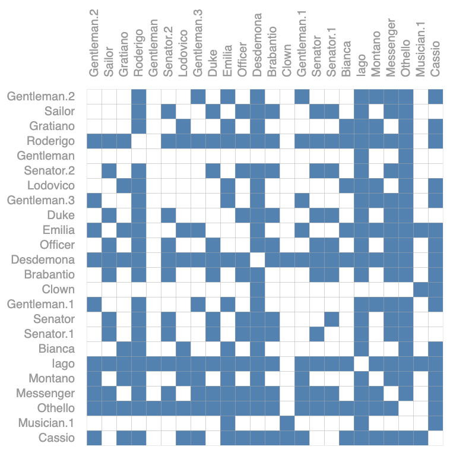
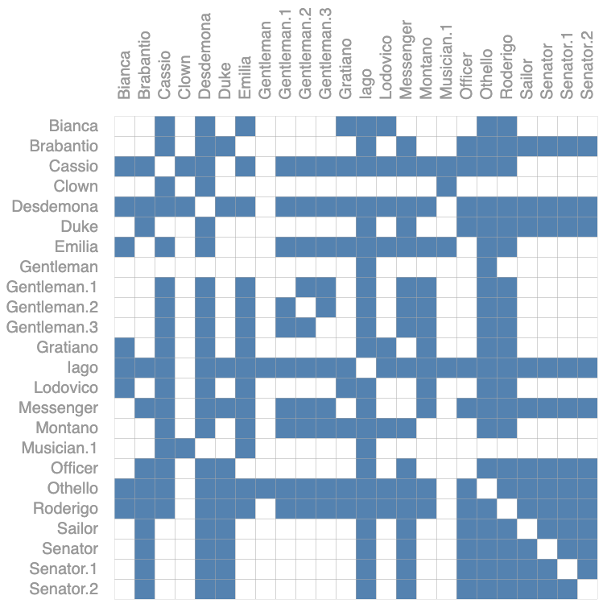

# 读GNN博客

[A Gentle Introdution to Graph Neural Network](https://distill.pub/2021/gnn-intro/)

## 1. 重要知识点

1. 文本是一个序列，图片是一个矩阵。
2. 本篇博客主要说明了将神经网络应用于图数据结构的处理。
3. 目的：
   1. 用NN去处理图数据结构需要那些模块？
   2. 背后的思维逻辑是什么样子的。
4. 图的结构：
   1. 图是分层的。
   2. 上层节点是有下层对应节点及对应节点的直接邻居计算而来的。
   3. 这意味着只要图足够深，它顶部的节点是可以处理一个大范围的结构信息的。这也是图神经网络如何利用图的结构化来处理信息的思维。
5. 本博客的主要研究内容或者提供的结论的四个点：
   1. 什么样的数据能够表示为1张图。
   2. 图与别的数据有什么不同的地方？
   3. 构建一个GNN的模块是什么样子的？
   4. 提供一个playground让大家机会去试验。
6. 什么是图：用于表示实体之间的关系。实体通过顶点（node）表示，关系通过边（edge）表示。另外一个U用于表示整个图的属性。不仅仅关注图的架构，更关注图中包含的信息，这些信息就是图和图元素的attribute。
7. node的attribute可以通过一条向量来表示（embedding）。edge也可以用另外一条向量来表示，边向量的长度可以和顶点的长度不一样。Global的信息也可以用一条向量来表示。核心问题是：
   1. 如何将我们想要的信息表示成这些向量；
   2. 以及这些向量是否能够通过数据来学到。
8. 图分为两种：
   1. 有向图
   2. 无向图
9. 如何将数据表示成为图。
   1. 如何将图片表示成一张图。
       1. 如果像素直接是邻居关系，那么就将这对像素之间连一条边。包含上下左右以及对角线上的邻居。
       2. 邻接矩阵，如果矩阵元素值为1，表示两个元素之间是有边的。也就是说两者相邻。没有边的表示两个元素不相邻。也就是两个像素直接不是邻居。这个矩阵是一个比较大的、稀疏的矩阵。这个边是无向边。
   2. 如何将一个文本表示成图。文本实际上是一条序列。
      1. 可以将其中的每个词表示为1个顶点。
      2. 一个词和下一个词之间可以通过一条有向边来连接。特别来说这个表示为了有向的路。
   3. 分子图如何表示成图。
      1. 每个原子可以表示成一个点。
      2. 每两个原子连接在一起可以表示为一条边。
   4. 社交网络
      1. 每个人作为一个顶点。
      2. 每个的关系作为边。
   5. 引用图。
      1. 每篇文章作为一个顶点。
      2. 每篇文章之间的引用关系作为一条有向边。
10. 可以在图上定义什么样的问题，主要是三大类的问题：
    1. graph-level：给你一张图，然后对图进行分类。比如说将所有图中含有2个环的图选出来。
    2. node-level：比如判断图中所有点的类型，图中点和另外一些点的关系。
    3. edge-level：在已知顶点的情况下，去预测或者判断顶点之间的关系。
11. 将机器学习应用到图上面会碰到的挑战。
    1. 图包含4种信息：nodes, edges, global-context and connectivity。前面三个可以用向量来表示。
    2. 可以用邻接矩阵来表示connectivity。但是会存在一下几种问题：
       1. 邻接矩阵可能非常大。类似于Wikipedia数据集，这个邻接矩阵是非常大的。
       2. 这个邻接矩阵是一个稀疏矩阵，想高效的计算稀疏矩阵是一个非常难的事情。想要将稀疏矩阵应用在GPU上是一个特别难的问题。
       3. **邻接矩阵将任何行或者列的顺序进行交换是不会影响邻接矩阵表达的含义的**。如图所示：这两张邻接矩阵表达的关系实际上是一样的，只是把行和列的顺序进行了交换，虽然在视觉上说这两张图看起来不一样，但实际上它们都代表的是同一张图。也就意味着，在使用NN之后对这两张图处理的结果应该是相同的。
12. 为了同时满足存储高效和排序不影响结果这两个约束（也就是解决11.2.2和11.2.3中提出的问题），可以使用下面这种存储方法：
    1. 每个顶点用一个向量表示。多个向量组合成一个矩阵。
    2. 每条边也用一个向量来表示。通过边组合成为一个矩阵。
    3. 全局信息也可以用一个向量来表示。
    4. Adjacency List邻接列表。列表的长度和边数一致。其中的第i项表示的是第i条边连接的是哪两个节点。
13. 通过这12中的方法可以看到在存储上只把有连接的边和所有的属性存储了下来。通过的可以把边的顺序任意打乱，只需要将Adjacency List的对应顺序修改即可。同样的道理也可以将所有顶点的顺序打乱，只需要将邻接列表的元素进行相应的更新即可。这样就达到了存储高效的，同时也是顺序无关的。
14. 如何用神经网络来处理12中列出的数据形式。
    1. 定义：**GNN是对图上所有的属性（node, edges, global-context）进行了一个可以优化的变换。而且这种变化是可以保持图的对称信息的。所谓对称信息是：把这些顶点或者边重新排序之后处理的结果是不会变的。**
    2. 使用message passing neural network，信息传递的神经网络（也可以用别的方式来描述它）的框架。
    3. GNN的输入是一个图，输出也是一个图。
    4. GNN会对顶点、边、全局的属性attribute向量进行变换，但是GNN不会改变图的连通性信息。
15. 最简单的一个GNN：
    1. 对于顶点向量、边向量、全局向量（当然也可以是矩阵）分别构造一个MLP。
    2. 该MLP的输入大小和输出大小是一样的。
    3. 1中定义的3个MLP就组成了GNN的一个层。然后输出就作为图的更新。输出的结果的属性都是被更新过的，但是图的结构是没有变化的。
    4. 每个MLP是对每一个向量是独立发挥作用，MLP都不会考虑连接信息，所以不论如何变换顺序都不会结构性的结果。
    5. 将满足这些要求的MLP叠加在一起构造一个比较深一点的GNN。
16. 最后一层的输出如何得到我们希望的预测值。最简单的情况：例如对顶点的信息进行2分类预测：通过所有顶点的属性矩阵，通过**一个**全连接层，最后加一个输出维度为2的全连接层，然后再加一个softmax就可以得到我们的输出了。如果是n类就使用n类全连接层，如果是做回归，那么就是单值输出即可。所有的顶点共享一个全连接层。同理，所有的边也共享一个全连接层，全局信息也是使用一个全连接层。
17. 假设如果没有顶点属性的情况下，如何对顶点进行预测。这个时候会使用pooling（在GNN中翻译为汇聚层）的技术来处理这种问题。（这里假设顶点、边、全局向量的维度一样的情况下。如果不一样的情况下做一些投影来解决这个问题）。
    1. 将与顶点相关的边的向量拿出来。
    2. 将全局的向量拿出来。
    3. 将1和2中所有的向量都加起来，得到一个代表该顶点的向量。
    4. 然后在使用全连接层做输出。

## 2. 问题

1. 如何将一张图片表示为一个tensor？实际如何操作？

## 3. 其他