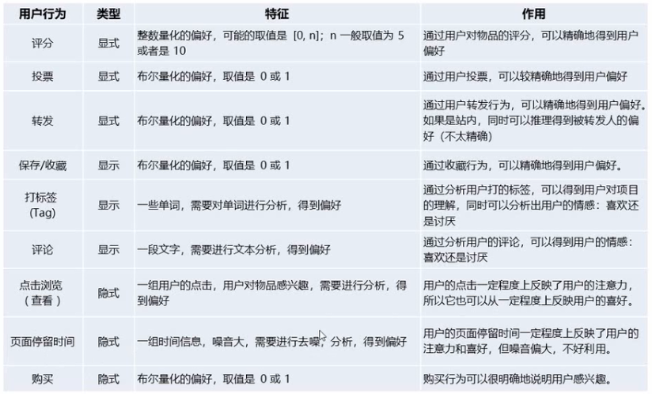

# 推荐系统

通过[视频课程](https://www.bilibili.com/video/BV1R4411N78S?p=2)学习推荐系统基础知识。

## 1. 课程介绍

1. 推荐系统概述
   1. 推荐系统目的：解决信息过载的措施。
      1. 让用户更好的获取到自己需要的内容。
      2. 让内容更好更快的推送到的喜欢的用户手中。
      3. 让网站更有效的保留用户资源。
   2. 推荐系统的应用：最早从亚马逊发源的。网飞的推荐系统比赛。不同的应用场景对推荐系统的要求是不同的。
   3. 推荐系统的基本思想
      1. 最大的问题：不知道用户的喜欢物品的特征。
      2. 解决思路：
         1. 知你所想，精准推荐：把用户的喜欢的物品特征提取出来，然后找相似特征的物品推荐给用户。做好用这种 方式，但是往往做不到。
         2. 物理类聚：通过历史数据来分析用户的物品特征。
         3. 人以群分：通过和你有相同爱好的好友，然后把好友喜欢的物品推荐给你。
      3. 数据分析：物品的特征与用户的偏好对应上的话就可以进行推荐了。主要共3种数据源。
         1. 用户的信息
            1. 个人信息
            2. 喜好标签
            3. 上下文信息：浏览记录，上网的上下文。
         2. 物品信息
            1. 内容信息
            2. 分类标签
            3. 关键词
         3. 用户和物品之间的行为数据：提炼出用户对物品的喜爱。
            1. 显式的用户反馈。评分、收藏等。一般这种数据是存放在数据库中的。
            2. 隐式的用户反馈。点击、浏览等。一般从浏览日志中获取。
   4. 推荐系统分类。通过不同的分类产生不同的算法。
      1. 根据实时性分类
         1. 离线推荐
         2. 实时推荐
      2. 更加推荐原则分类
         1. 基于相似度分类：人以类聚，物以群分。
         2. 基于知识/规则的推荐：把规则定好，什么类型的人推荐就推荐什么物品。通过反馈数据对规则进行调整。
         3. 基于模型的推荐：建立模型去发现规则，然后再根据发现的规则去推荐。
      3. 根据推荐是否个性化分类
         1. 基于统计的推荐：比如热门推荐，所有人都一样。
         2. 个性化推荐
      4. 根据数据源分类，也就是根据上面“数据分析”中的3种数据来源进行分类。
         1. 基于人口统计学的推荐：当数据来源主要是“用户的信息”时。一般几步：人口统计信息，对人员打上标签，然后对人物进行画像。用户本身的数据比较难以获得。
         2. 基于内容的推荐：当数据来源主要是“物品信息”时。
         3. 基于协同过滤的推荐：当数据来源主要是“行为数据”时。
      5. 总结：
         ||
         |:--:|
         | *1.1* |
         1. 统计数据之后直接推荐就可以了。
         2. 其他的都是个性化分类。
2. 推荐算法简介，以下分类主要是将数据源作为分类的。
   1. 基于人口统计学的推荐：基于用户之间的相似性，把某一用户喜欢的物品推荐给与他相似的用户。
   2. 基于内容的推荐：在用户信息获取不详细的情况下，通过物品之间的相似性推荐个有相同选择的用户。
   3. 基于协同过滤的推荐
      1. 基于近邻的协同过滤
         1. 基于用户User-CF
            1. 基于用户喜欢的物品行为来对物品进行推荐。
         2. 基于物品Item-CF
            1. 基于物品被谁喜欢的行为来对物品进行推荐。
      2. 基于模型的协同过滤，基于模型的分类。
         1. 奇异值分解SVD
         2. 潜在语义分析LSA
         3. 支持向量机SVM
   4. 混合推荐。 在实际的商用环境中，更具不同的步骤、不同的阶段和不同的场景会综合使用不同的推荐算法
      1. 分类：其中切换混合和分区混合用得比较多。分层混合比较复杂。
         1. 加权混合：用线性公式(linear formula)将集中不同的推荐按照一定权重组合起来，具体权重的值需要再测试数据集上反复实验，达到最好的推荐效果。
         2. 切换混合：切换的混合方式，就是允许在不同的情况（数据量，系统运行状况，用户和物品的数目等）下，选择最为合适的推荐机制计算推荐。
         3. 分区混合：采用多种推荐机制，并将不同的推荐结果分不同的区显示给用户。
         4. 分层混合：采用多种推荐机制，并将一个推荐机制的结果作为另一个的输入，从而综合各个推荐机制的优缺点，得到更加准确的推荐。
   5. 协同过滤和基于内容过滤的异同：
      1. 基于内容的（Content based, CB）主要利用的是用户评价过的物品的内容特征，而CF方法还可以利用其他用户评分的物品内容。CF利用到的信息更多一点。
      2. CF可以解决CB的一些局限
         1. 物品内容不完全或者难以获得时，依然可以通过其他用户的反馈给出推荐。（也就是说不需要收集物品信息和用户信息，只需要用户和物品之间发生交互就可以了。这样就有了更大的自由度）。
         2. CF基于用户之间对物品的评价质量，避免了CF仅依赖内容可能造成的对物品质量判断的干扰。
         3. CF推荐不受内容限制，只要其他类似用户给出了对不同物品的兴趣，CF就可以给用户推荐出内容差异很大的物品（但有某种内在联系）。
   6. 协同过滤的缺点：
      1. 得到的行为交互信息是一个稀疏矩阵。稀疏矩阵上的计算有些明显的问题，包括可能少部分人的错误偏好会对推荐的准确度有很大的影响等等。
      2. 比较依赖历史数据，推荐的效果依赖于用户历史偏好数据的多少和准确性。
      3. 冷启动问题。新系统刚上线的时候是没有历史数据的。基础的推荐可以使用统计推荐之一的热门物品推荐给用户。或者根据用户特征来提供推荐。
      4. 对于一些有特殊偏好的用户不能给予很好的推荐。
   7. 协同过滤的优点：
      1. **它不需要对物品或者用户进行严格的建模，而且不要求对物品特征的描述是机器可以理解的，所以这种方法也是领域无关的**。对于“而且不要求对物品特征的描述是机器可以理解的”举例，如图2.4所示，对比泰坦尼克号和阿甘正传两部电影实质并不一定是相同的，但是用于其在评分上的相似性，所以可以为Cary这个用户推荐。
      2. **这种方法计算出来的推荐是开放的，可以共用他人的经验，很好的支持用户发现潜在的兴趣偏好**，新颖度非常好。
      3. 不要求一定得到用户的信息或者物品的信息。
3. 推荐系统评测。目的：让用户、平台和物品（内容提供方）三方共赢。
   1. 推荐系统的实验方法。综合以下的优劣势，都会混合使用多种实验方法。比如刚开始的时候使用离线实验，找出表现比较好的算法，然后做用户调查（**用户调查的目标并不是提高性能指标，而是保证不能比之前的指标差**。这也是和用户调查的用户难找和样本数量不大的特点相对应），上线之后使用在线实验做AB测试，并长期跟踪测试。
      1. 离线实验。在整个过程当中都是使用的已经获得的数据。和当前正在运行的系统数据无关。
         1. 步骤：
            1. 通过体制系统获得用户行为数据，并按照一定格式生成一个标准的数据集。
            2. 将数据集按照一定的规则分层训练集和测试集。
            3. 在训练集上训练用户兴趣模型，在测试集上进行预测。
            4. 通过事先定义的离线指标评测算法在测试集上的预测结果。
         2. 好处，非常便于测试，可以离线进行测试。
         3. 缺点：和实际业务有差别。没办法直接获取到业务上直接能观察到的指标的。真实可靠度相对低。
      2. 用户调查。用户调查需要有一些真实用户，让他们在需要测试的推荐系统上完成一些任务，我们需要记录他们的行为，并让他们回答一些问题；最后进行分析。
         1. 优点：数据非常真实，可靠。
         2. 缺点：找到靠谱的用户比较难，用户样本数不会太多。数据需要积累一段时间。
      3. 在线实验
         1. AB测试。具体的效果类似于考试的时候的AB卷。通过用户分流系统将用户分为AB两组，分别导入到不同的推荐系统中，然后收集两个系统中推荐算法的性能指标，来考察不同推荐算法的优劣。
         2. 优点：数据非常真实。对应的“切换混合”常用于AB测试中。
         3. 缺点：需要经历比较长的时间来积累行为数据。
   2. 评测指标
      1. 预测准确度
         1. 评分预测
            1. 给物品的评分数据。根据已经有的数据来预测没有看到过的物品的评分，如果预测的评分高那么就需要推荐。通过将一部分数据作为测试集来评判评分是否准确。
            2. 评分预测的准确度一般用均方根误差（RMSE）或平均绝对误差（MAE）计算。
         2. Top-N推荐
            1. 网站提供服务时，一般是给用户一个个性化的推荐列表，这种推荐叫做Top-N推荐。
            2. Top-N推荐的预测准确率一般用精确率(precision)和召回率(recall)来度量。
      2. 信任度
      3. 用户满意度：用户调查来验证。
      4. 实时性
      5. 覆盖率：发掘长尾item物品（[tail item](https://baike.baidu.com/item/%E9%95%BF%E5%B0%BE/389156?fr=aladdin)）的能力。电商中的大部分item是访问量和购买量非常上的item，如果说把商品的数量和商品的访问量画一个图的话，那么这类item处于访问量很低，但是种类多的产品或服务由于总量巨大，累积起来的总收益超过主流产品的现象。这种现象对于商品和商家而言都不是好事。现在发现推荐越来越个性化，越来越发现利润增长点在小众商品上。对于利润增长的潜力是巨大的。
      6. 健壮性
      7. 多样性：相比于覆盖率而言，它考察的每次推荐的多种物品之间的差异性是否足够大。
      8. 商业目标
      9. 惊喜度：不热门的东西，用户自己都没有想到的物品，推荐出来用户自己非常喜欢。

## 2. 推荐系统算法详细介绍

1. 常用推荐算法分类：详见##1中的内容。
2. 基于人口统计学的推荐与用户画像
   1. 基于人口统计学的推荐机制（Demographic-based Recommendation）是一种最容易实现的推荐方法，它只是简单的根据系统用户的基本信息发现用户的相关程度，然后将相似用户喜爱的其他物品推荐给当前用户。
   2. 对于没有明确含义的用户信息（比如登录时间、地域等上下文信息），可以**通过聚类等手段给用户打上分类标签**。
   3. 对于特定标签的用户，又可以根据预设的规则（知识）或者模型，推荐出对应的物品。
   4. **用户信息标签化的过程一般又称为用户画像（User Profiling）。在商业环境中，这个的处理现在都是以非结构化的形式存放的，而且不是通过向量的形式来表示的。需要大量的人工来处理这种用户画像**。实际上用户信息比较难以收集。**用户画像如果只是简单的做很容易做不准，最终还是依赖于数据和算法**。
      1. 用户画像就是企业通过收集与分析消费者社会属性、生活习惯、消费行为等主要信息的数据之后，完美地抽象出一个用户的商业全貌作为企业应用大数据技术的基本方式。
      2. 用户画像为企业提供了足够的信息基础，能够帮助企业快速找到精准用户群体以及用户需求等更为广泛的反馈信息。
      3. 作为大数据的根基，它完美地抽象出一个用户的信息全貌，为进一步精准、快速地分析用户行为习惯、消费习惯等重要信息，提供了足够的数据基础。
3. 基于内容的推荐与特征工程
   1. Content-based Recommendations, CB根据推荐物品或内容的元数据，发现物品的相关性，再基于用户过去的喜好记录，为用户推荐相似的物品。
   2. 通过抽取物品内在或者外在的特征值，实现相似度计算。
      1. 比如一个电影，有导演、演员、用户标签UGC、用户评论、时长、风格等等，都可以算是特征。
   3. **将user个人信息的特征（基于喜好记录或是预设兴趣标签）和item的特征相匹配，就能得到user对item感兴趣的程度**。
      1. 在一些电影、音乐、图书的社交网站有很成功的应用，有些网站还请专业的人员对物品进行基因编码/打标签（PGC）。
      2. 由于用算法对电影、音乐、图书打的标签并不理想，所以采用了人工打标签的方法来对item进行标注。对应于PGC称为专家生成内容，UGC称为用户生成内容。
   4. 相似度计算
      1. 相似度的评判可以用距离表示，一般常用的“余弦相似度”。
         ||
         |:--:|
         | *2.1* |
      2. 欧式距离：$d(x,y) = \sqrt{\sum\limits_{i}(x_i - y_i)^2}$。
      3. 余弦相似度：$cos\theta = \frac{a \cdot b}{||a||\times ||b||}=\frac{\sum\limits_i x_i y_i}{\sqrt{\sum\limits_i x_i^2}\times \sqrt{\sum\limits_i y_i^2}}$。
      4. 问题：为什么采用余弦相似度来表达特征的距离？余弦相似度相对于欧式距离由什么优势？
         1. **相似度应该和特征的大小无关，余弦相似度可以看成角度的距离。用余弦表示相似度相当于消除了向量模长对相似度的影响，反映到物品上表示相似度与物品的体量大小无关**。
         2. 杰卡德相似度。
   5. 对于item的特征提取-打标签（tag）
      1. 专家标签（PGC）
      2. 用户自定义标签（UGC）
      3. 降维分析数据，提取隐语义标签（LFM）
   6. 对于文本信息的特征提取-关键词
      1. 分词、语义处理和情感分析（NLP）
      2. 潜在语义分析（LSA）
   7. 基于内容的推荐系统高层次结构。
      ||
      |:--:|
      | *2.2* |
   8. 特征工程
      1. 连续值处理：归一化和离散化。
   9. 常见反馈数据
      ||
      |:--:|
      | *2.3* |
4. 基于协同过滤的推荐
   1. 基于近邻的推荐。原则是：相同“口碑”准则。
      ||
      |:--:|
      | *2.4* |。推荐策略的选择其实和具体的应用场景有很大的关系。
      1. 看行的维度，基于相似人员U(User CF)的。找两个用户对item评分的相似性。首先需要分析的是用户喜好的相似性，然后将相同喜好用户有偏好的物品推荐给新的用户。如图所示，问题：是否需要向Cary推荐泰坦尼克号？**首先观察偏好发现Alice和Cary的偏好类似（他们两人都对黑客帝国和虎胆龙威的评分比较低），然后观察Alice对于泰坦尼克号的评分，评分高那么就给予推荐，如果评分低那么就不推荐**。
         1. 一般的应用中采用计算"K-近邻"的算法（类似于KNN），基于这个K个邻居的历史偏好信息，为当前用户进行推荐。
         2. User-CF和基于人口统计学的推荐机制的异同：
            1. 相同点：都是通过计算用户之间的相似度，并基于相似的“邻居”用户群计算推荐。
            2. 不同点：它们之间的不同点在于如何计算用户之间的相似度。基于人口统计学的机制只考虑用户本身的特征，而User-CF是在用户的历史偏好数据上计算用户的相似度，**它的基本假设是：喜欢类似物品的用户可能有相同的活着相似的口味和偏好**。
            3. 在进行用户画像的时候会将两者进行综合使用，既有用户本身的信息，又有用户的行为信息。
      2. 看列的维度，基于相似物品(Item CF)的。泰坦尼克号和那部电源的评分相近。从对比中可以看出泰坦尼克号和阿甘正传的评分类似（这种类似在于不同的人对两部电影的评分相近，比如Alice对泰坦尼克号和阿甘正传的评分都是5分。Bob对泰坦尼克号和阿甘正传的评分分别是1和2，都比较低。Diane对泰坦尼克号和阿甘正传的评分都是3分。而Cary对阿甘正传的评分是5分，那么可以推断Cary对泰坦尼克号的评分也会很高）。Item CF和User CF的基本原理类似。Item CF只是使用所有用户对物品的偏好，发现物品和物品之间的相似度，然后根据用户的历史偏好信息，将类似的物品推荐给用户。
         1. Item CF和基于内容(CB)的推荐之间有什么异同？
            1. 相同点：都是基于物品相似度的预测推荐。
            2. 不同点：计算相似度的方法不一样。Item CF是从用户的历史偏好来推断，而CB是基于物品本身的属性特征信息进行推荐。
      3. 同样是CF，在基于user和基于item两个吃了中应该如何选择？**比较用户和物品在这个应用场景下，那个更稳定**。
         1. 电商、电源、音乐网站，用户数量远远大于物品数量。由于物品相对比较固定，比较稳定，在这种场景下用item CF比较合适。Amazon首先提出来，因为在大部分的电商场景中，物品的个数远远小于用户的数量，而且物品的个数和相似度比价稳定，同时基于物品的机制比基于用户的实时性更好一些，所以item CF成为了目前电商的主流推荐策略。
         2. 新闻网站，物品（新闻文本）数量可能大于用户数量。由于用户相对比较固定，而物品（新闻会实时并大量刷新）更新快，所以在这种场景下用user CF比较合适。User CF是相对更早出现，user CF常用于邮件过滤中。
   1. 基于模型的推荐
5. 基于UGC的推荐
   1. 用户用标签来描述对物品的看法，所以用户生成标签(UGC)是联系用户和物品的纽带，也是反应用户兴趣的重要数据源。
   2. 一个用户的打标签行为数据集一般由一个三元组（用户、物品、标签）的集合表示，其中一条记录为(u, i, b)表示用户u给物品i打上了标签b。
   3. 通过标签来衡量用户对物品的喜好程度
      1. 统计每个用户最常用的标签。
      2. 对于每个标签，统计被打过这个标签次数最多的物品。
      3. 对于一个用户，首先找到他常用的标签，然后找到具有这些标签的最热门的物品，推荐给他。
      4. 所以用户u对物品i的兴趣公式为$p(u, i) = \sum\limits_b (n_{u,b}n_{b,i})$。其中，$n_{u,b}$表示用户u打过标签b的次数（表示用户u特别喜欢打内容为b的标签，也表明用户u对于是标签b的内容感兴趣），$n_{b,i}$是物品i被打过标签b的次数（表示物品i与标签b的关联程度）。$n_{u,b}n_{b,i}$直接表示了对其中一个标签和一个物品的关联程度，由于是乘积的关系，那么越关联，值越大。求和表示的是用户不只使用一个标签，所以需要将多个标签与物品的关联关系的加起来。
   4. 存在的问题：**这种方法倾向于给热门标签、热门物品比较大的权重，如果一个热门物品同时对应着热门标签**，俺么它就会“霸榜”，推荐要求的个性化和惊喜度就会降低。这个时候需要对热门物品进行一个惩罚，降低热门物品的权重。
   5. 这种算法主要用于文本分析中，主要用于语义提取。比如在所有文章中“的，了，是”等词出现的次数非常高，但是它们并不代表实际意义。另外又例如，一般在说梅西的时候就会涉及他是阿根廷人，而在提到阿根廷的时候不一定会提到梅西；所以一篇文章的主题并不是又出现次数最高的词决定的。
6. TF-IDF Term Frequency-Inverse Document Frequency 词频-逆文档频率，是一种用于资讯检索和文本挖掘的常用加权技术。
   1. TF-IDF是一种统计方法，用以评估一个字词对于一个文件及或一个语料库中的其中一份文件的重要程度。**字词的重要性随着它在文件中出现的次数成正比增加，但同时会随着它在语料库中出现的频率成反比下降**。$TFIDF=TF \times IDF$。
   2. TF-IDF的主要思想是：如果某个词或短语在一篇文章中出现的频率TF高，并且在其他文章中很少出现，则认为此词或者短语具有很好的类别区分能力，适合用来分类。
   3. TF-IDF加权的各种形式常被搜索引擎应用，作为文件与用户查询之间相关程度的度量或评级。
   4. TF的计算方法：指的是某一个给定的词语在该文件中出现的频率。这个数字是对次数的归一化，以防止偏向更长的文件。（同一个词语在长文件里可能会比段文件有更高的词数，而不管该词语重要与否）。$TF_{i,j} = \frac{n_{i,j}}{n_{*,j}}$其中$TF_{i,j}$表示词语i在文档j中出现的频率，$n_{i,j}$表示i在文档j中出现的次数，$n_{*,j}$表示文档j的总词数。
   5. 逆向文件频率（Inverse Document Frequency, IDF）。是一个词语普遍重要性的度量，某一特定词语的IDF，可以由总文档数目除以包含该词语之文档的数目，再将得到的商取对数得到：$IDF_i = log(\frac{N+1}{N_i + 1})$。其中$IDF_i$表示词语i在文档集中的逆文档频率，N表示文档集中的文档总数，$N_i$表示文档集中包含了词语i的文档数。注意公式的形式，一般而言是总数是分母，出现的词数做分子，但是这个计算公式是出现该词的文档树在下，所以称其为“逆向”。
   6. 基于TF-IDF思想对UGC进行了改进。为了避免热门标签和热门物品获得更多的权重，我们需要对“热门”进行惩罚。
      1. 借鉴TF-IDF的思想，以一个物品的所有标签作为“文档”，标签作为“词语”，从而计算标签的“词频”（在物品所有标签中的频率）和“逆文档频率”（在其他物品标签中普遍出现的频率）。
      2. 由于物品i的所有标签$n_{*,j}$应该对标签权重没有影响，而“所有标签总数”N对于所有标签是一定的，所以这两项可以略去。在简单算法的基础上，直接加入对热门标签和热门物品的惩罚项：$p(u,i) = \sum\limits_{i}\frac{n_{u,b}}{log(1+n_b^{(u)})}\frac{n_{b,j}}{log(1+n_i^{(u)})}$。其中，$n_b^{(u)}$记录了标签b被多少个不同的用户使用过，$n_i^{(u)}$记录了物品i被多少个不同的用户打过标签。注意相比于TF-IDF，分子没有总数项。
      3. [简单TFIDF示例参考代码](../../codes/5RecommondationSystem/1SimpleTFIDFExample.ipynb)