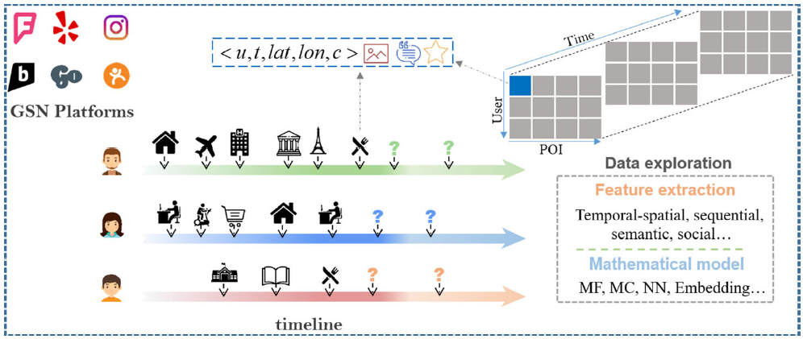

# translate翻译

1. 题目：Survey on user location prediction based on geo-social networking data
基于定理社交网络数据对用户位置预测研究综述
Survey on 表示的是“综述”的意思。

2. 翻译说明：

|number|title of paper|internet source|local source|correlative field|illustration|
|---|---|---|---|---|---|
|1|Survey on user location prediction based on geo-social networking data|<https://doi.org/10.1007/s11280-019-00777-8>|/|location prediction|English translate into chinese|

## abstract 摘要

基于智能移动终端的普及和在无线通信、定位技术的发展，地理社交网络（GSNs）组合位置感知和社交服务功能已经越来越普遍。在GSNs中日益增加的用户和位置信息导致信息过载的现象越来越严重。尽管大量的用户生成数据为用户的社交和旅行活动带来了便利，它也对他们的日常生活带来了一定的麻烦。

## 2 问题分类

|编号|英语|中文|理解|
|---|---|---|---|
|1|perspectives|视角|/|
|2|timeliness|时效性|/|
|3|granularity|粒度|/|
|4|coarse-grained|粗粒度|/|
|5|fine-grained|细粒度|/|
|6|inherent drawback|固有内在缺陷|/|
|7|mobility pattern|移动模式|/|
|8|check-in behavior|||
|||||
|||||
|||||

用户的位置预测问题能按照不同视角被分解到多个类别中。为了让这个问题简单、清晰，我们主要从预测的时效性和预测粒度两个方面来对用户位置预测问题进行说明。首先，从预测的时效性的角度而言，我们将这个问题分为两类：下一个用户位置预测问题和任何时间的用户位置预测问题。第二是从预测的粒度而言，我们同样分为两类：粗粒度用户位置预测问题和细粒度用户位置预测问题。下面将对用户位置预测问题的类别进行详细说明。

### 2.1 预测时效性

从预测时效性的角度，我们将用户位置预测问题分为两类（如图2所示）(1)下一个位置预测问题：它的关注点在于给定用户在GSNs中产生的历史数据预测预测用户下一步的去向。(2)任何时间位置预测问题：目标是预测未来用户在特定时间的位置（准确的说是在给定时间距离现在位置有多远）。在实际应用场景中，下一个位置预测更关注预测结果的实时性。基于在GSNs中用户最近历史轨迹，它侧重于在用户发出请求之前预测他们下一个访问的位置，从而帮助广告商向目标用户发布移动广告。相比之下，任何时间位置预测都侧重于从用户的长期轨迹中挖掘用户的移动模式。他能够根据用户的移动模式预测用户在未来某个时间的位置，从而为当局监控感兴趣的用户提供邮箱的方法。目前，关于用户位置预测的研究大多集中在预测一个用户的下一个访问位置，它认为是短期的位置预测。相比之下，任意时间用户位置预测的研究比较少，它被认为是长期位置预测。

#### 2.1.1 下一个位置预测

最早基于地理社交网络数据的用户下一个位置预测研究可以追溯到[107]，尽管他没有[19]、[70]、[108]等具有代表性。Ye等人[107]使用传统的协同过滤方法计算给定用户对未访问位置的评分，这确实是预测用户未来访问位置的初步尝试。作为对比，Noulas[70]等人人工选择一组特征，这组特征能够捕捉