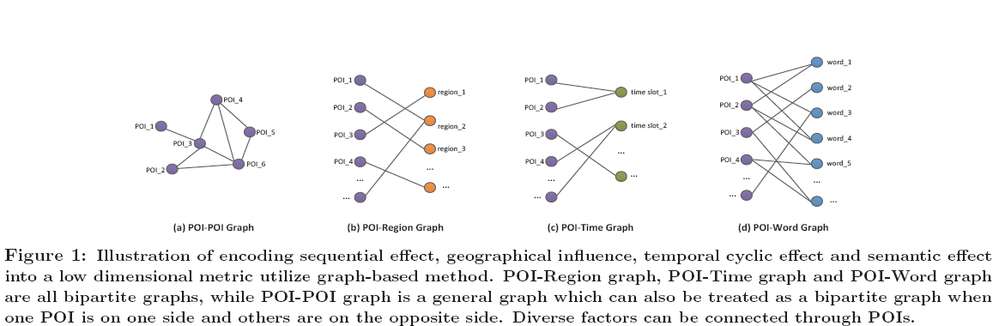

# translate翻译

1. 题目：Learning Graph-based POI Embedding for Location-based Recommendation
将基于学习图POE嵌入应用于基于位置的推荐系统
2. 选择这两篇是因为在Survey on user location prediction based on geo-social networking data中表明这一篇是对于小时级的位置预测的进行了阐述。

|number|title of paper|internet source|local source|correlative field|illustration|
|---|---|---|---|---|---|
|1|Learning Graph-based POI Embedding for Location-based Recommendation|<https://Sci-hub.ee>|/|location prediction|English translate into chinese|

## 需要做的事情

## 重点语句

## 摘要

|编号|英语|中文|理解|
|---|---|---|---|
|1|extreme||/|
|2|sparsity||/|
|3|severe||/|
|4|degrade||/|
|5|spatiotemporal||/|
|6|context awareness|上下文感知，环境感知|/|
|7|address|有设法解决的意思|/|
|8|recent advances|研究进展|/|
|9|jointly|副词，统一地|/|
|10|sequential effect|序列作用|/|
|11|influence|名词，影响|/|
|12|temporal cyclic effect|时间周期性||
|13|semantic effect|语义作用||
|14|novel|形容词，新颖的。做名词是小说的意思||
||experimental|||
||superiority|名词，优势||
|||||
|||||

伴随着移动设备的迅猛增长和基于位置的社交网络的快速发展，基于位置的推荐变得非常重要了，它可以帮助人们发现有吸引力和兴趣的POI。尽管，极度稀疏的user-POI矩阵和冷启动问题导致了非常严峻的挑战。导致基于CF（这应该是协同过滤）的方法的推荐性能被显著的降低了。此外，基于位置的推荐需要在一个实时环境中时空上下文感知和用户最新偏好动态跟踪。

为了解决这些挑战，我们依赖在嵌入学习技术的最新进展，并且提出了一个通用的基于图的嵌入模型，在本文中称其为GE。GE通过将四个对应的关系图（POI-POI、POI-地域、POI-时间和POI-语义）嵌入到一个共同的低维空间中，然后以统一的方式来捕获**顺序作用、地理影响、时间周期性作用和语义作用**。然后，去支持实时推荐，我们开发了一个新颖的时间衰减方法，根据用户在隐性空间中学习的check-in POI嵌入来动态的计算用户的最新偏好。我们在两个真实的大规模数据集上进行了大量的实验来评估我们的模型性能，实验救过表明它由于其他竞争对手，尤其是在POI推荐冷启动方面。除此之外，我们研究了每个特征对于提高基于位置的推荐系统的贡献，**并且发现顺序作用和时间周期性作用比地理影响和语义作用更为重要**。

## 1. 简介

|编号|英语|中文|理解|
|---|---|---|---|
|1|acquisition|名词，采集|/|
|2|promptly|副词，迅速地|/|
|3|utilize|动词，利用，使用|/|
|4|facilitate|动词，促进，方便|/|
|5|concern|名词，担忧，考虑|/|
|6|plague|动词，困扰，折磨|/|
|7|spatiotemporal|形容词，时空的|/|
|8|parenting-related|育儿相关|/|
|9|promptly|副词，及时地|/|
|10|To deal with|处理|/|
|11|exploit|动词，这里是运用的意思。||

随着web 2.0、位置采集和无线通信技术的迅速发展，大量基于位置的社交网络在最近几年涌现了出来，比如Foursquare、Facebook Places、Gowalla和Loopt，在它们上面用户可以在POIs上check in，比如：商店、餐馆、景观。并且可以通过移动设备快速的在分享他们的在物理世界中的生活经历。它是最重要的能够利用用户check-in数据来产生个性化推荐的实时方式，它帮助用户去发现新的POI并且发现新的地域（比如：城市），从而方便广告商向目标用户发布移动广告。

不同于传统的桌面推荐系统推送“数字化的”信息，比如：电源推荐、音乐推荐等，基于位置的推荐系统典型的涉及移动用户和“物理”实体（比如景点），同样的也要经受更多挑战（就是风险与机遇并存）。

1. 数据稀疏。为了了解并且评估一个POI，用户必须通过物理上的方式访问POI，因此，相比于在线电源他们需要花费更多的代价来对评价一部电源。即使如果一个用户尝试访问了一个POI，他也可能基于隐私
和安全的考虑而不去check-in。因此，在LBSN中产生的用户check-in数据相比于对电源和音乐的评价数据而言是非常稀疏的。这个问题困扰着现在绝大多数的协同过滤推荐系统。
2. 上下文感知。基于位置的推荐系统不仅仅需要考虑个人的偏好，还需要考虑时空内容[21]，比如用户一般在不同的时间和地点都会倾向于有不同的选择和需求。
3. 冷启动。在基于位置的推荐中冷启动是一个非常严重的问题，每天都会有非常多的新POI（比如：商业）的更新，特别是在高速发展中的国家。
4. 个性化偏好动态变化。这是最后一个但也是最严峻的挑战。在[22]的分析中，用户的偏好随着时间的变化而变化。举例：在生完孩子之后，用户自然而然的会对育儿相关的POI感兴趣（比如：游乐场和amusement park），并且会忽略他们的其他兴趣。准确的从访问和购买的意图中捕捉这些改变在商业上已经被证明是非常有价值的。因此，基于位置的推荐要求基于用户最新的偏好和他们当前的时空上下文来及时提供令人满意的推荐，这就要求实时的生成推荐结果。

为了应对上述挑战，并且提高基于位置的推荐，我们在一个统一的方法中综合运用的下列特征：

|编号|英语|中文|理解|
|---|---|---|---|
|1|transition probabilities|转移概率|/|
|2|activity|名词，活动，行为|/|
|3|tend to|趋向于|/|
|4|heterogeneous text networks|异构文本网络|/|

1. 顺序作用。通过对人员流动性的研究发现，人员流动呈现出顺序模式[4,29]，这意味着从一个check-in POI到其他POI的转移概率是一个非均匀分布，例如，用户经常在机场和酒店顺序check-in。
2. 地理影响。很多最近的研究表明人民倾向于访问附近的POI或者浏览他们之前已经访问过的位置附近的POI[20]。
3. 时间周期性作用。正如[7,28]所建议的那样，在物理世界中用户的流动性行为表现出非常强的时间周期性模式，并且每天的模式（一天中的小时数）是最基本的模式之一。举例：一个用户可能定期的在早上9:00左右达到办公室，于中午12点在餐厅吃中饭，在晚上10:00左右看一场电影。因此这个用户在餐厅中吃午饭的可能性远大于在bar中。
4. 语义作用。关于Whrrl数据集的分析表明：用户的check-in行为表现出很强的语义规律性[19]。换句话说，同一用户的POI check-in内容趋向于相同的语义。

虽然最近有很多研究利用上述一个或者两个特征来提高基于位置的推荐的有效性，它们缺乏对综合效应的综合分析，无法以统一和通用的方式应对上述四大挑战。具体来说，为了克服数据稀疏性问题，基于位置的推荐的大多数先前工作都集中在利用地理影响[10,3,20]和时间周期性影响[7,28]来提供空间或/和时间上下文感知的推荐。为了进一步解决冷启动问题，最近的一些工作探索了语义作用，并整合了POI的内容信息[25,17]。最近，Yin等人[27]开发了一个概率生成模型，用于联合建模地理影响、时间周期性影响和语义影响。然而，他们的方法不是通用的方法，不能直接扩展到包含其他因素，如顺序影响。

另一方面，几乎所有现有的基于位置的推荐方法基本上都不能支持实时推荐，并且它们将面临以下两个缺点：1）由于重新运行推荐模型的昂贵时间成本而导致模型更新延迟；2）由**于用于更新推荐模型的最新check-in记录经常被过去的大量数据淹没，因此无法跟踪用户偏好的变化。实时准确地捕捉用户偏好的变化对于基于位置的推荐非常有帮助**。由于每次入住都会提供有关用户偏好的有价值信息，因此推荐模型必须立即响应新的入住信息。虽然最近已经开发了几种基于马尔可夫链的推荐模型[4, 29]，根据用户最近的check-in通过挖掘序列模式来预测下一个POI，但是他们没有考虑其他三个重要因素，无法克服数据稀疏性和冷启动的挑战。

近年来，在低维欧氏空间中嵌入项目的方法在自然语言处理、文本挖掘和音乐信息检索等领域得到了广泛的应用。Tang等人[15]预测了基于异构文本网络的文本嵌入，这在文档分类中显示了巨大的潜力。Chen等人[1]提出了一个Logistic Markov嵌入（LME）模型，将每首歌曲映射到潜在欧氏空间中的一个点（或多个点）以生成播放列表，这也验证了嵌入方法的有效性。

**感觉前面两段都是在说明嵌入的重要性，或者嵌入的方法。**

|编号|英语|中文|理解|
|---|---|---|---|
|1|bipartite graph model|二分图|/|
|2|time-decay manner|时间衰减方法|/|
|3|feel free to|可以随时...|/|
|4|discretized|离散化|这里应该表述的是将连续时间变为离散值，也就是分桶。|

**这一段首先说明嵌入方法。**

在本文中，我们基于嵌入学习技术的最新进展，提出了一种基于图的嵌入方法，称为GE，将上述四个因素编码在低维潜在空间中，以统一的方式有效地解决数据稀疏性、冷启动和上下文感知问题。具体来说，我们使用二分图模型分别表示（或捕获）POI和POI（顺序效应）、POI和地理区域（地理影响）、POI和时隙（时间循环效应）、POI和内容词（语义效应）之间的关系。然后，我们将这四个异构信息图嵌入到一个共享的低维空间中，其中每个顶点，即每个POI（包括冷启动的POI）、时隙、地理区域和内容字，被表示为一个低维向量。请注意，**我们提出的GE模型是一个通用的灵活模型，可以很容易地扩展到包含其他因素，而不限于上述四个因素**。

为了跟踪用户偏好的动态，我们采用时间衰减的方式，根据用户的checked-in POI和相关时间戳的嵌入来计算用户的最新偏好，也就是说，**如果用户最近访问了一个POI，它将更重要，并被赋予更高的权重**。因此，与经典的基于item的协同过滤方法[11]一样，我们提出的动态用户偏好建模方法具有**快速响应新签入信息**和扩展到海量数据集而无需重新训练模型的优良特性。为了支持实时和上下文感知的推荐，最终推荐基于用户最新偏好的嵌入和共享潜在空间中的时空上下文。

我们研究的主要贡献总结如下：

1. 据我们所知，我们率先研究了顺序效应、地理影响、时间周期性效应和语义效应的联合效应，以统一的方式应对数据稀疏性、冷启动、上下文感知和动态用户偏好的挑战。
2. 我们开发了一个基于图的嵌入模型，用于在共享的低维空间中学习POI、时隙、地理区域和内容词的表示。然后，为了支持实时推荐，我们提出了一种基于学习到的POI嵌入的动态用户偏好建模方法。
3. 我们进行了大量实验，以评估我们的推荐方法在两个真实大规模数据集上的性能。通过与现有技术的比较，结果表明了我们的方案在基于位置的推荐中的优越性。

## 2. 基于图的嵌入模型

在本节中，我们首先介绍了在本文中使用的关键数据结构和定义，然后给出了我们提出的基于图嵌入模型和优化方法。

|编号|英语|中文|理解|
|---|---|---|---|
|1|for ease of presentation|为了便于展示|/|
|2|in terms of|依据;在…方面;从…角度看;根据…来说|/|
|3|coordinates|名称，坐标|/|
|4|corresponding|形容词，相应的，对应的|/|

### 2.1 问题表述

为了便于展示，我们定义了在本文中所用到的关键数据结构和符号，如表1所示。

|变量|解释|
|---|---|
|$U, V$|一组user和POI|
|$R, T, W$|一组区域，时隙和单词|
|$l_v,W_v$|POI v的位置和内容词集|
|$\tau , t$|check-in的时间戳和check-in离散化时间段|
|$D_u$|用户u的轮廓|
|$\mathbb{R}^d$|d维隐性空间|
|$\vec{u}_r$|时间感知的用户偏好嵌入|
|$\vec{v}, \vec{r}, \vec{t}, \vec{w}$|分别对应于POI v的嵌入，地域r的嵌入，时间段t的嵌入，单词w的嵌入。|
|$\Delta T$|时间间隔|
表1：本文中所用到的符号

*定义1*.（POI）一个POI被定义为一个独特的已经被识别的特定场所（比如一个餐厅或者电影院）。在我们的模型中，一个POI有3个属性：identifier、geographical location和content。我们使用$v$来表示一个POI的标识，并且使用$l_v$来表示POI对应的经纬度坐标表示的geographical attribute。另外，与POI有关的文本的语义信息，比如类别和标签词，我们使用符号$W_v$来表示一组描述POI v的单词。

*定义2*.（check-in activity）一个check-in活动被定义在一个有5个元素的元组中$(u, v, l_v, \tau, W_v)$。这个元组表达的含义是：用户u在$\tau$时刻访问了POI v。

*定义3*.(user profile)对于每个用户u而言，我们创建一个用户轮廓$D_u$，它是该用户u的一组按照时间戳存储的check-in活动。**这个地方非常重要，它说明了如何来描述一个用户。按照这里的表达就是以一组活动来描述一个用户，认为一组活动可以唯一确认一个用户。从另外一个方面来说，每个用户的活动都是不一样的。**在我们的模型中使用的数据集D包含了所有的用户轮廓，比如：$D=\{D_u:u \in U\}$。

*定义4*.(POI-POI graph)POI-POI graph表示为$G_{vv}=\{V \cup V, \xi_{vv}\}$，在一个用户轮廓$D_u$中获取POI的check-in序列。$V$是一组POI，并且$\xi_{vv}$是一组POI之间的多条边（都是复数）。给定一个时间间隔$\Delta T$，在一个用户轮廓$D_u$中对于每个check-in对$\{(v_i,\tau_i),(v_j,\tau_j)\}$而言，如果$0<\tau_j-\tau_i \leqslant \Delta T$，那么存在一条从$v_i$到$v_j$的边$e_{ij}$。边$e_{ij}$的权重$w_{ij}$b被定义为$\Delta T$的数量，详细说明为：对于预先定义好的时间间隔$\Delta T$，在整个数据集D中，在$v_i$之后check in的$v_j$，那么权重就是$\Delta T$的数量。（这里用公式理解的公式表示为$w_{ij}=\frac{\tau_j-\tau_i}{\Delta T}$）

|编号|英语|中文|理解|
|---|---|---|---|
|1|Intuitively|副词，凭直觉地|/|
|2|correlation|名词，相互关联，关系|/|
|3|vertice|名词，顶点|对于图中点的描述。|
|4|discrete|形容词，离散的|/|
|5|administrative divisions|行政区划|/|

POI-POI图获得的check-in POI的顺序模式，就直觉而言，如果$v_i$和$v_j$经常出现在同一个顺序中，它们的相关性是很大的，这样意味着，如果一个用户已经访问了$v_i$，那么他大概率随后会访问$v_j$。**这个感觉核心思想是基于用户的协同过滤。实际上是比较两个用户的特征，如果两个用户的特征是相似的，那么就可以将A用户的选择的item推荐给B用户。但是这里不同的地方在于，是对于同一个用户的的轨迹而言的，如果周期性的在一个用户的全部轨迹中出现类似的轨迹，那么就可以在下一个对应的周期中预测用户的位置。同样的正如前文提到的，需要捕捉用户轨迹的改变，并且对应的说明改变的原因这才是难点。**

||
|:--:|
|*Figure 1*对于顺序作用，地理影响，时间周期性作用和语义作用使用基于图的方法在一个低维矩阵中的编码图。POI地域图、POI时间图和POI单词图都是二分图，POI-POI图是一个普通图，当一个POI在一个边上而其他的POI在另一边时它可以被视为一个二分图。|

为了捕捉地理影响，时间周期性作用和语义作用，二分图POI-区域、POI-时间和POI-单词被定义为如图1所示。图1给说明了我们说有的基于图的模型。由于在图中所有的顶点是离散的，首先我们需要将在check-in记录中的连续值（比如位置坐标和时间戳）离散化。具体而言，我们按照行政区划将所有的地理空间划分为一组区域$R$，比如城市或者郊区。所有的check-in时间戳为了捕捉时间周期性模式被分割为一组时间间隔$\Tau$，比如每天模式将一天分为24小时，每周模式将一周分为7天。在3.4.3节中，我们将研究时间的不同分割方式的影响。

*定义5*.（POI-Region Graph）POI-区域图表示为$G_{vr}=(V\cup R, \xi_{vr})$是一个二分图，其中$R$表示一组地域，$V$是一组POI。$\xi_{vr}$是在多个POI和多个地域之间的一组边。如果POI $v_i$被定位在区域$r_j$中，那么它们之间将存在一条边$e_{ij}$，否则，它们之间就没有边。当边$e_{ij}$存在时，权重$w_{ij}$是一组数字1。

*定义6*.（POI-Time Graph）POI-时间图表示为$G_{vt}=(V\cup \Tau, \xi_{vt})$是一个二分图，其中$\Tau$是一组时间段，$V$是一组POI。$\xi_{vt}$是在多个POI和多个时间段之间的一组边。在POI $v_i$和时间段$t_j$之间一条边的权重$w_{ij}$被定义为在时间段$t_j$和POI $v_i$内check-in的频率（frequency）。

*定义7*.（POI-Word Graph）POI-单词图表示为$G_{vw}=(V\cup W, \xi_{vw})$是一个二分图，其中$W$表示为词汇表，$\xi_{vw}$是在多个POI和多个单词之间的一组边。如果POI $w_i \in D_{v_j}$（这个位置是否可以理解为在对该POI的描述中$D_{v_j}$存在有单词$w_i$），那么就在一个POI $v_j$和一个单词$w_i$之间存在一条边$e_{ij}$，否则，它们之间就没有边。由于$D_{v_j}$是一个词袋，我们使用标准的TF-IDF来计算边的权重$w_{ij}$。

|编号|英语|中文|理解|
|---|---|---|---|
|1|||/|
|2|||/|
|3|||/|
|4|||/|
|5|||/|
|6|||/|
|7|||/|
|8|||/|
|9|||/|
|10|||/|
|||||